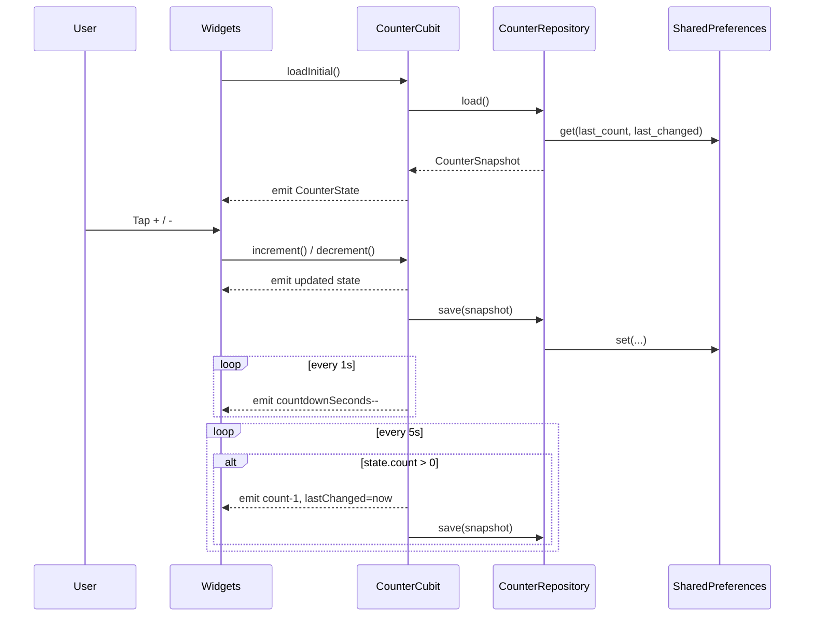
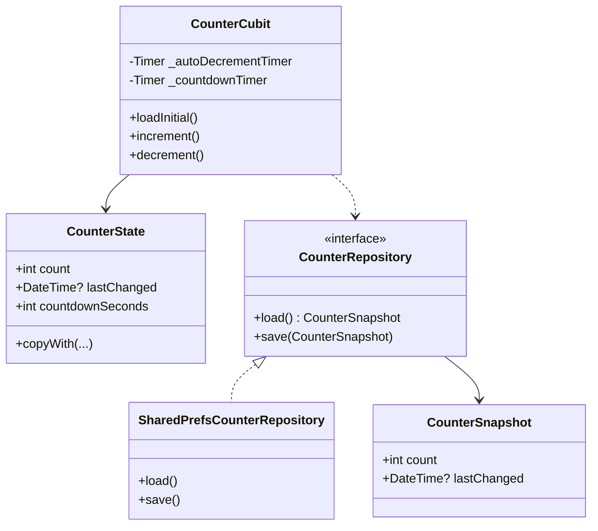

# AGENTS — Flutter BLoC App
<!-- markdownlint-configure-file {"MD029": {"style": "ordered"}} -->

Bu doküman, bu repo üzerinde çalışacak geliştiriciler/ajanlar için mimari rehber, görev akışları ve kalite standartlarını özetler. Proje küçük bir sayaç uygulaması olsa da, yapı MVP + SOLID + Clean Code ilkelerine göre düzenlenmiştir ve kolay genişletilebilirlik hedeflenir.

## Amaç ve Kapsam

- Basit bir sayaç akışını BLoC (Cubit) ile modellemek.
- Kalıcı saklama (SharedPreferences) ile son değer ve zaman bilgisini tutmak.
- 5 saniyede bir otomatik azaltım ve görsel geri sayım göstergesi sunmak.
- Çoklu dil desteği (EN, TR, DE, FR, ES) sağlamak.

## Mimari Genel Bakış

- Desen: MVP (View = Widget’lar, Presenter = Cubit, Model = Repository/Domain)
- SOLID:
  - SRP: Her sınıf tek sorumluluk. (Widget, Cubit, Repository ayrık)
  - OCP/DIP: `CounterRepository` arayüzü ile depolama katmanı soyutlandı.
  - ISP: Minimal, amaç odaklı arayüzler.
  - LSP: Uygulamalar arayüz sözleşmesine uygun.
- Clean Code: Anlamlı isimler, küçük bileşenler, yan etkilerin sınırlandırılması.

### Mimari Diyagramı

```mermaid
flowchart LR
  subgraph Presentation[Presentation]
    V1[Widgets: CounterDisplay]
    V2[Widgets: CountdownBar]
    V3[Widgets: CounterActions]
    CUBIT[CounterCubit (Presenter)]
  end

  subgraph Domain[Domain]
    REPOI[[CounterRepository (Interface)]]
    SNAP[CounterSnapshot]
  end

  subgraph Data[Data]
    REPO[SharedPrefsCounterRepository]
    SP[(SharedPreferences)]
  end

  V1 --> CUBIT
  V2 --> CUBIT
  V3 --> CUBIT

  CUBIT --> REPOI
  REPOI <-.implements .-> REPO
  REPO --> SP
```

## Katmanlar ve Dizin Yapısı

- `lib/presentation/`
  - `counter_state.dart`: UI katmanında kullanılan sunum durumu modeli.
  - `widgets/`: Küçük, tek amaçlı View bileşenleri.
    - `counter_display/counter_display.dart`
    - `countdown_bar.dart`
    - `counter_actions.dart`
- `lib/` (Presenter)
  - `counter_cubit.dart`: Akışın sunucusu/presenter’ı. Zamanlayıcılar, durum üretimi ve repository ile etkileşim.
- `lib/domain/`
  - `counter_repository.dart`: Depolama için soyutlama (DIP).
  - `counter_snapshot.dart`: Kalıcı veri anlık görüntüsü (UI’dan bağımsız).
- `lib/data/`
  - `shared_prefs_counter_repository.dart`: Varsayılan depolama implementasyonu.
- `lib/main.dart`: Uygulama giriş noktası ve widget bileşimi.
- `test/`: Birim ve bloc testleri.

## Ana Akış

1. Uygulama açılır → `CounterCubit` başlar ve zamanlayıcıları kurar.
2. `loadInitial()` → repository’den son değer ve zaman bilgisi yüklenir.
3. Kullanıcı etkileşimi (arttır/azalt) → durum güncellenir, kalıcı olarak yazılır ve 5 sn’lik pencere sıfırlanır.
4. Otomatik azaltım zamanlayıcısı → `count > 0` ise 5 sn’de bir azaltır.
5. Geri sayım zamanlayıcısı → her saniye UI’de kalan süreyi günceller.

### Akış / Zamanlama Şeması



## Geliştirme Kuralları

- Bağımlılık Tersine Çevirme: Yeni veri kaynağı ekleyecekseniz `CounterRepository` implementasyonu yazın, Cubit’e enjekte edin (constructor).
- Sunum Durumu: UI’ya özgü alanları `presentation/*` altında tutun. Domain veri modelleri UI’dan bağımsızdır.
- Küçük Widget’lar: Her widget tek sorumluluk; karmaşık ekranları küçük bileşenlerle oluşturun.
- Zamanlayıcılar: Zaman davranışını genişletmek istiyorsanız ayrı bir servis arayüzü (örn. `Ticker`/`TimerService`) ile soyutlayın.
- İsimlendirme: Açık ve net; sihirli sayılardan kaçının (sabitleri private const ile merkezileştirin).
- Yan etkiler: Repository sınırında; Cubit içinde kontrol edilen, test edilebilir biçimde.

## Yeni Özellik Ekleme Adımları (Önerilen)

1. Domain
   - Gerekirse yeni bir Snapshot/Entity oluşturun.
   - `CounterRepository` benzeri bir arayüz tanımlayın veya mevcut arayüzü genişletin.
2. Data
   - Yeni veri kaynağı implementasyonu (örn. REST, Secure Storage). Arayüz sözleşmesine uyun.
3. Presenter
   - Cubit/Bloc üzerinde yeni olay/komut/metot ekleyin; durumu açıkça güncelleyin.
4. Presentation
   - Yeni widget(lar) ekleyin; iş kurallarını View’a taşımayın.
5. Test
   - Fake/Mock repository ile Cubit’i izole edin.
   - Zamanlayıcı/async davranışlarını deterministic olacak şekilde test edin.

## Test Stratejisi

- Cubit Testleri: `bloc_test` ile sıradaki durumları, kalıcılık ve zamanlayıcı etkilerini doğrulayın.
- Widget Testleri: Bileşenlerin doğru render edildiğini ve etkileşimlerin Cubit’e gittiğini test edin.
- Fake Repository: `SharedPreferences` yerine hafif sahte implementasyon kullanın (hız ve izolasyon).

## Bağımlılık Enjeksiyonu (DI)

- Konteyner: `get_it` kullanılmaktadır. Kayıtlar `lib/core/di/injector.dart` içinde yapılır.
- Kayıtlar:
  - `CounterRepository` → `SharedPreferencesCounterRepository`
  - `ThemeRepository` → `SharedPreferencesThemeRepository`
  - `TimerService` → `DefaultTimerService`
- Uygulama başlatımı: `runAppWithFlavor` içinde `configureDependencies()` çağrılır.
- Testlerde `MyApp` doğrudan pump edilirse `ensureConfigured()` güvenlik ağı sağlar.

### Örnek Kullanım (GetIt)

```dart
// lib/main_bootstrap.dart
Future<void> runAppWithFlavor(Flavor flavor) async {
  WidgetsFlutterBinding.ensureInitialized();
  FlavorManager.set(flavor);
  await PlatformInit.initialize();
  await configureDependencies();
  runApp(const MyApp());
}

// lib/app.dart
return MultiBlocProvider(
  providers: [
    BlocProvider(
      create: (_) => CounterCubit(
        repository: getIt<CounterRepository>(),
        timerService: getIt(),
      )..loadInitial(),
    ),
    BlocProvider(
      create: (_) => ThemeCubit(
        repository: getIt<ThemeRepository>(),
      )..loadInitial(),
    ),
  ],
  child: ...,
);
```

### Veri Kaynağı Değişimi (DIP Pratiği)

Yeni bir veri katmanı eklemek (örn. REST, Hive, Secure Storage) için:

1 Domain sözleşmesini yeniden kullanın:

```dart
// lib/features/counter/domain/counter_repository.dart
abstract class CounterRepository {
  Future<CounterSnapshot> load();
  Future<void> save(CounterSnapshot snapshot);
}
```

2 Yeni implementasyonu yazın:

```dart
// lib/features/counter/data/rest_counter_repository.dart
class RestCounterRepository implements CounterRepository {
  @override
  Future<CounterSnapshot> load() async {
    // TODO: REST çağrısı yapın ve CounterSnapshot döndürün
    return const CounterSnapshot(count: 0);
  }

  @override
  Future<void> save(CounterSnapshot snapshot) async {
    // TODO: REST kaydı yapın
  }
}
```

3 DI kayıtlarını değiştirin (geçici veya kalıcı):

```dart
// Geçici: test veya deneme amaçlı
getIt.unregister<CounterRepository>();
getIt.registerLazySingleton<CounterRepository>(() => RestCounterRepository());

// Kalıcı: injector.dart içinde varsayılanı değiştirin
getIt.registerLazySingleton<CounterRepository>(() => RestCounterRepository());
```

Presenter/Widget tarafında değişiklik gerekmez; `CounterCubit` arayüz üzerinden çalışır.

## Zamanlama Soyutlaması: TimerService

- Arayüz: `lib/core/time/timer_service.dart` içinde `TimerService.periodic(interval, onTick)` ve `TimerDisposable` tanımlıdır.
- Presenter kullanımı: `CounterCubit` doğrudan `Timer.periodic` yerine `TimerService` kullanır; constructor’da opsiyonel `timerService` alır.

### Testlerde Deterministik Zaman

- Basit sahte servis: `test/test_helpers.dart` içinde `FakeTimerService` bulunur.
- Kullanım:
  - Cubit oluştururken enjekte edin: `CounterCubit(repository: mockRepo, timerService: fake)`
  - Zamanı ilerletin: `fake.tick(n)` çağrıları ile n kere periyodik tetikleme yapın.
- Örnekler: `test/counter_cubit_test.dart` içinde sayaç azalışı, sıfırlama ve auto-decrement senaryoları fake servis ile deterministik test edilir.

Kısa örnek:

```dart
final fakeTimer = FakeTimerService();
final cubit = CounterCubit(
  repository: MockCounterRepository(),
  timerService: fakeTimer,
);
await Future<void>.delayed(const Duration(milliseconds: 10));
final initial = cubit.state.countdownSeconds;
fakeTimer.tick(2);
expect(cubit.state.countdownSeconds, initial - 2);
```

## Çalıştırma ve Komutlar

```bash
flutter pub get
dart format .
flutter run
flutter analyze
flutter test
```

## Kod İnceleme Kontrol Listesi

- Tek sorumluluk: Dosya/sınıf birden fazla şeyi yapıyor mu?
- Bağımlılık yönü: Presenter → Abstraction → Implementation hiyerarşisi korunmuş mu?
- Testler: Yeni davranış için birim/bloc testleri var mı ve hızlı çalışıyor mu?
- İsimlendirme ve okunabilirlik: Anlamlı, tutarlı, kısa ama açıklayıcı mı?
- Yan etkiler/persist: Repository üzerinden mi yapılıyor, UI’dan sızmıyor mu?

## Notlar

- Varsayılan otomatik azaltım aralığı 5 saniyedir.
- Otomatik azaltım 0’ın altına inmez.
- Desteklenen yereller `MaterialApp.supportedLocales` içinde listelenir.

### Katmanlı Yapı (Özet)


