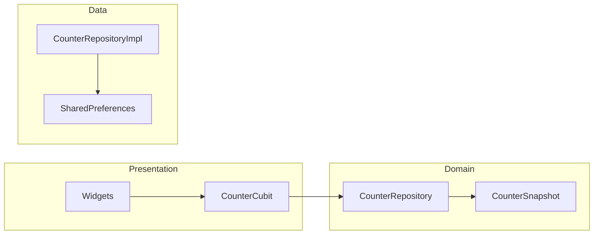

# AGENTS Guide — Flutter BLoC App
<!-- markdownlint-disable MD029 -->

This document is the condensed playbook for all AI agents (and humans) working on the project. The app is intentionally small, but the codebase must stay scalable via Clean Architecture, MVP, and SOLID.

---
## Quick Checklist (run every time)
1. `dart format .`
2. `flutter analyze`
3. `flutter test`
4. If freezed/json_serializable files changed → `dart run build_runner build --delete-conflicting-outputs`
5. Keep dependency flow **Domain → Data → Presentation**
6. Add or update tests for new behaviour

---
## Architecture Rules
- Follow Clean Code principles: expressive naming, small functions/classes, minimal side effects, and consistent formatting.
- **Clean Architecture + MVP**: Widgets (View) ↔︎ Cubits (Presenter) ↔︎ Repository & domain models.
- **SOLID**: Preserve small single‑purpose classes, use abstractions for data sources, keep UI logic out of domain.
- **State placement**: UI-only state lives in `presentation/*`; domain models stay UI-agnostic.
- **Widgets**: Compose small, focused widgets; avoid god widgets.
- **Timing**: Extend timer behaviour via `TimerService`; tests should use `FakeTimerService`.

### Layer snapshot


---
## Directory Layout
- `lib/features/<feature>/{domain,data,presentation}` — feature-based Clean Architecture packages.
- `lib/core/` — DI (`injector.dart`), time utils, shared constants.
- `lib/shared/` — reusable widgets, extensions, logger, platform helpers.
- `test/` — mirrors features; includes bloc, widget, golden, auth, and utility tests.

---
## Development Workflow
1. Model/contract change in **domain**.
2. Add/update repository implementation in **data** and wire it through DI.
3. Extend Cubit/Bloc in **presentation**, inject dependencies via `get_it`.
4. Build UI with small widgets; keep business rules out of the view.
5. Add tests (unit/bloc/widget/golden) and ensure determinism (use fakes where needed).

---
## Testing Strategy
- Bloc/Cubit tests with `bloc_test` for state sequences.
- Widget + golden tests for UI regressions (CountdownBar, CounterDisplay, etc.).
- Use fakes (`FakeTimerService`, mock repositories, `MockFirebaseAuth`) for deterministic behaviour.
- Update or create tests whenever behaviour changes.

---
## TimerService Cheatsheet
- Interface: `lib/core/time/timer_service.dart` (`TimerService.periodic`, `TimerDisposable`).
- `CounterCubit` receives a `TimerService`; tests inject `FakeTimerService` and drive time via `fake.tick(n)`.

---
## Command Reference
```bash
flutter pub get
dart format .
flutter analyze
flutter test
dart run build_runner build --delete-conflicting-outputs
flutter run
```

---
## Dependency Injection Sample
```dart
Future<void> runAppWithFlavor(Flavor flavor) async {
  WidgetsFlutterBinding.ensureInitialized();
  FlavorManager.set(flavor);
  await PlatformInit.initialize();
  await configureDependencies();
  runApp(const MyApp());
}

return MultiBlocProvider(
  providers: [
    BlocProvider(
      create: (_) => CounterCubit(
        repository: getIt<CounterRepository>(),
        timerService: getIt(),
      )..loadInitial(),
    ),
    BlocProvider(
      create: (_) => ThemeCubit(
        repository: getIt<ThemeRepository>(),
      )..loadInitial(),
    ),
  ],
  child: ...,
);
```

---
## Example: Swapping the Data Source (DIP)
```dart
abstract class CounterRepository {
  Future<CounterSnapshot> load();
  Future<void> save(CounterSnapshot snapshot);
}

class RestCounterRepository implements CounterRepository {
  @override
  Future<CounterSnapshot> load() async => const CounterSnapshot(count: 0);

  @override
  Future<void> save(CounterSnapshot snapshot) async {}
}
```
```
getIt.unregister<CounterRepository>();
getIt.registerLazySingleton<CounterRepository>(() => RestCounterRepository());
```

---
## Extra Notes
- Default auto-decrement interval is 5 seconds; counter never drops below 0.
- Supported locales are listed in `MaterialApp.supportedLocales`.
- Native platform info is surfaced via `NativePlatformService` (MethodChannel).

Keep the guide short, follow the checklist, and keep the architecture clean.
