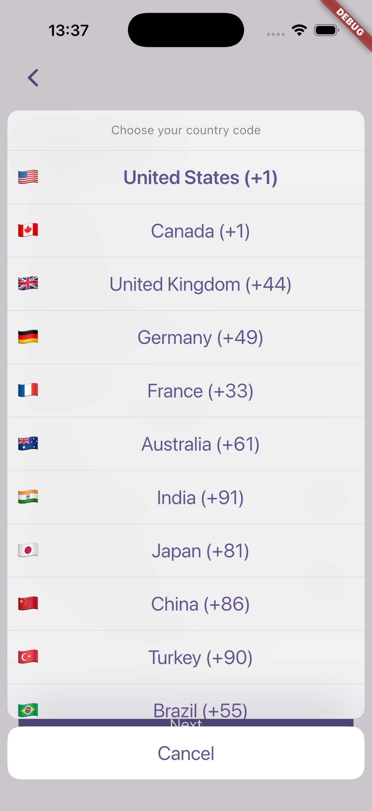
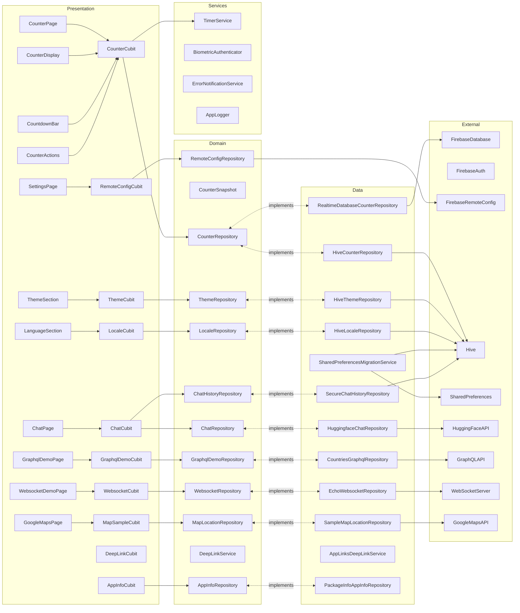
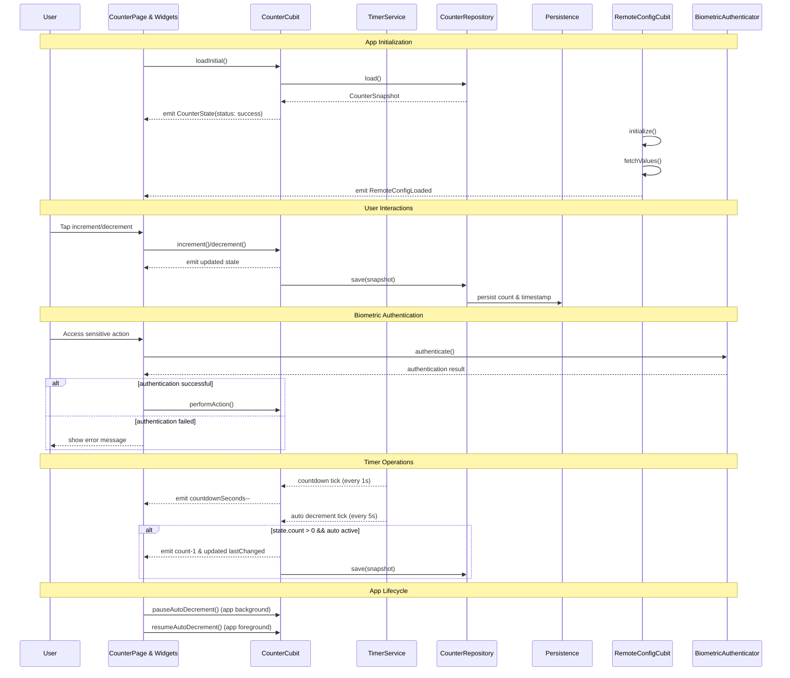

# Flutter BLoC App

Small demo app showcasing BLoC (Cubit) state management, **encrypted local database storage** (Hive), a periodic timer, and basic localization in Flutter. The app displays a counter you can increment/decrement, persists the last value with AES-256 encryption, shows when it last changed, and auto-decrements every 5 seconds with a visible countdown.

## Features

- BLoC/Cubit: Simple `CounterCubit` with immutable `CounterState`.
- Responsive UI: Uses `flutter_screenutil` and width-based helpers (see `presentation/responsive.dart`).
- UI constants: Centralized sizing/spacing in `presentation/ui_constants.dart`.
- Accessibility: Semantics on key widgets, overflow guards on narrow screens.
- Persistence: Stores last count and timestamp with **Hive** (encrypted local database). Migrated from SharedPreferences with automatic data migration on first launch.
- Auto-decrement: Decreases count every 5 seconds if above zero.
- Countdown UI: Live “next auto-decrement in: Ns” indicator.
- Navigation: `go_router` wiring with sample and chart pages demonstrating navigation patterns.
- Charts: `fl_chart` Bitcoin price line chart backed by CoinGecko's public API (pinch-zoomable with graceful fallback).
- GraphQL demo: Countries browser backed by the free `countries.trevorblades.com` GraphQL API, complete with continent filtering and localized labels.
- WebSocket demo: Reusable Cubit + repository stack driving a public echo websocket with reconnect/error handling and localized UI.
- Maps: Google Maps sample page showcasing curated San Francisco locations with traffic toggle, runtime map controls, and guard rails when API keys are missing (Android & iOS, with native Apple Maps rendering on iOS when Google keys are unavailable).
- Payment calculator: iOS-style keypad with running expression history, tax/tip presets, custom percentage dialogs, and dedicated payment summary screen (desktop/mobile responsive, scroll-aware on compact layouts).
- Loading polish: `skeletonizer` placeholders, `fancy_shimmer_image` hero card, and dev-only loading delay to showcase the effects.
- Logging: Centralized `AppLogger` built on top of the `logger` package.
- Localization: `intl` + Flutter localizations (EN, TR, DE, FR, ES) with version/build surfaced on the Settings page.
- Authentication: Firebase Auth with FirebaseUI (email/password, Google) plus anonymous “guest” sessions that can be upgraded in-place.
- AI Chat: Conversational UI backed by Hugging Face Inference API (openai/gpt-oss).
- Search demo: Image search experience that debounces input, pulls results from a mock repository, and presents them in a responsive grid with shimmer loading states.
- Example hub: `ExamplePage` combines a shimmering hero, native platform info dialogs, isolate samples, and shortcut buttons that deep-link into the chat inbox, profile, register, logged-out, search, and websocket demos.
- Register flow: Multi-field form with real-time validation, password confirmation, Cupertino/Material buttons, and a phone field that pairs emoji flags with dial codes via a modal country picker.
- Logged-out hero: Layered, fully responsive logged-out experience that scales the reference 375×812 layout to any viewport while keeping parallax background, CTA buttons, and indicators aligned.
- Chat inbox: Responsive chat list with mock contacts, unread indicators, mark-as-read/delete actions, and navigation into the Hugging Face-powered conversation page.
- Profile showcase: Scroll-driven profile screen powered by `ProfileCubit`, Google Fonts typography, gallery grid, CTA buttons, and adaptive spacing/bottom navigation.
- Native integration: MethodChannel (`com.example.flutter_bloc_app/native`) returning sanitized device metadata with Kotlin/Swift handlers.
- Universal links: Background-safe navigation via `DeepLinkCubit`, now powered by `AppLinksDeepLinkService` (backed by the `app_links` plugin). Supports the hosted `https://links.flutterbloc.app/...` routes (with `apple-app-site-association` in `docs/universal_links/`) and the local `flutter-bloc-app://` custom scheme when running on emulators.
- Secrets: `SecretConfig` reads from secure storage first, then from any
  `--dart-define` values (persisted into secure storage), and only loads the
  optional dev asset when explicitly opted-in via
  `--dart-define=ENABLE_ASSET_SECRETS=true` (never in release builds).
- Remote Config: Firebase Remote Config integration for feature flags and runtime configuration updates, with `RemoteConfigCubit` managing feature toggles like the "awesome feature" demo.
- Biometric Authentication: Secure authentication using device biometrics (fingerprint, face recognition) for sensitive actions via `LocalBiometricAuthenticator`, with graceful fallback when biometrics are unavailable.
- Tests: Comprehensive unit, bloc, widget, and golden coverage (`flutter_test`, `bloc_test`, `golden_toolkit`), including auth flows with Firebase mocks and global log suppression during test execution.
- Custom Linting: Custom file length linting rules to maintain code quality and prevent oversized files.

## WebSocket Demo

- Entry points: from the Example page (`Open WebSocket demo` button) or directly via the `/websocket` GoRouter route.
- Stack: `WebsocketCubit` + `EchoWebsocketRepository` stream messages from the configurable endpoint (`wss://echo.websocket.events` by default) and surface connection banners, errors, and send state.
- Auto-connect occurs on mobile/desktop builds; on web the screen renders an informative unsupported message instead of attempting a socket handshake.
- To target a different echo server (e.g. `wss://ws.postman-echo.com/raw`), register your own `WebsocketRepository` with `getIt` in `configureDependencies()` or inject a custom implementation in tests.

## Google Maps Demo

- Entry points: the counter app bar (`Open Google Maps demo` icon) and the Example page (`Open Google Maps demo` button), or navigate directly via `/google-maps`.
- The page loads curated San Francisco landmarks from `SampleMapLocationRepository`, exposes map type & traffic toggles, and highlights the currently focused marker.
- Android: provide an API key by adding `GOOGLE_MAPS_ANDROID_API_KEY=YOUR_KEY` to `android/local.properties` (or `gradle.properties`). The Gradle build feeds this into `AndroidManifest.xml` via a manifest placeholder; the default placeholder string is intentionally invalid.
- iOS: set the `GMSApiKey` entry in `ios/Runner/Info.plist` (or override it per configuration in Xcode). When the key is missing or still using the placeholder, the page automatically renders via Apple Maps (`apple_maps_flutter`) so MapKit-backed pins and camera controls remain available without Google credentials.
- When keys are absent, the page shows a friendly warning card instead of instantiating the native map view (preventing simulator crashes).
- Keep real API keys out of source control—store them in untracked files or CI secrets and inspect them before shipping.

## Deep Links & Universal Links

- Service stack: `DeepLinkCubit` listens to `AppLinksDeepLinkService`, a wrapper around the [`app_links`](https://pub.dev/packages/app_links) plugin. The service streams incoming URIs, provides the initial link on cold start, and gracefully disables itself when the platform channel is absent (e.g. widget tests).
- Universal link host: `https://links.flutterbloc.app` serves as the canonical domain. We publish the required `apple-app-site-association` JSON and `assetlinks.json` under `docs/universal_links/`. Update both files with your bundle ID, team ID, and SHA-256 fingerprint if you fork the app.
- Supported paths: `/`, `/counter`, `/settings`, `/example`, `/chat`, `/websocket`, `/google-maps`, `/charts`, `/graphql-demo`, `/profile`. Add or remove routes in both DeepLinkParser and the hosted association files when your navigation map changes.
- Android setup: `android/app/src/main/AndroidManifest.xml` contains an `<intent-filter>` with `android:autoVerify="true"` pointing at the host. Regenerate the SHA-256 fingerprint (`./gradlew signingReport`) and mirror it in the hosted `assetlinks.json` when rebranding.
- iOS setup: Associated Domains (`applinks:links.flutterbloc.app`) are enabled in `Runner.entitlements`. Ensure the hosted `apple-app-site-association` file lists every path you need; Xcode will only treat the domain as verified when that content is reachable over HTTPS without redirects.
- Custom scheme fallback: During local development—or when hosting isn’t yet configured—the same deep link cubit accepts the `flutter-bloc-app://` scheme so QA can test routing without the universal link prerequisites.
- Testing: Because `AppLinks` can throw `MissingPluginException` under test, the service caches that state and returns empty streams so widget/unit tests keep running without native plumbing.

### Getting a Google Maps API key

1. Visit the [Google Cloud Console](https://console.cloud.google.com/), create (or select) a project, and enable:
   - *Maps SDK for Android*
   - *Maps SDK for iOS*
2. Generate an API key and apply app restrictions:
   - Android: restrict by package name `com.example.flutter_bloc_app` and the SHA-1 fingerprints you use locally/CI.
   - iOS: restrict by bundle identifier `com.example.flutterBlocApp`.
3. Add the key to your local environment (never commit it):
   - Android: update `android/local.properties` with `GOOGLE_MAPS_ANDROID_API_KEY=your-key` (alternatively, define it inside `~/.gradle/gradle.properties`).
   - iOS: set `GMSApiKey` in `ios/Runner/Info.plist`, or reference an environment-specific `.xcconfig` value (e.g. `GMS_API_KEY`) so it stays out of version control.
   - Optional: keep a private copy in `assets/config/secrets.json` (ignored by git) or your preferred secrets manager.
4. Rebuild the app. The maps sample will render once both platforms have a non-placeholder key.

## Example Hub & Companion Demos

### Example Page

- Files: `lib/features/example/presentation/pages/example_page.dart`, `lib/features/example/presentation/widgets/example_page_body.dart`.
- Doubles as a navigation hub with buttons that open the WebSocket, chat list, search, profile, register, and logged-out demos via `go_router`.
- Demonstrates `NativePlatformService` dialogs plus synchronous context guards (`showExamplePlatformInfoDialog` / `showExamplePlatformInfoErrorDialog`).
- Runs `IsolateSamples.fibonacci` and `IsolateSamples.delayedDoubleAll` in parallel, surfaces the elapsed time, and shows failures inline.
- Adds lightweight delight (Unsplash hero rendered with `FancyShimmerImage`, adaptive buttons, AnimatedSwitcher for isolate states).

### Register Flow & Country Picker

- Files: `lib/features/auth/presentation/widgets/register_form.dart`, `register_phone_field.dart`, and `cubit/register/register_state.dart`.
- Covers full name, email, phone, password, confirmation, and localized validation with dedicated helper widgets.
- `RegisterPhoneField` pairs a dial-code chip, emoji flag, and masked text field; the country picker renders as a Cupertino action sheet on iOS and a Material bottom sheet elsewhere.
- `CountryOption` centralizes supported markets and exposes `flagEmoji`, while the `RegisterTermsDialog` + `RegisterTermsSection` handle opt-in flows before submission.

### Logged-out Experience

- Files: `lib/features/auth/presentation/widgets/logged_out_page_body.dart` and its layered widgets (`logged_out_background_layer.dart`, `logged_out_user_info.dart`, etc.).
- Recreates a Figma handoff by scaling a 375×812 reference frame, centering it inside any viewport, and reusing the same Stack layering on mobile, tablet, and desktop widths.
- Breaks the layout into individually testable widgets: hero photo header, action buttons, and pill-style indicator.

### Chat Inbox

- Files: `lib/features/chat/presentation/widgets/chat_list_view.dart` plus `chat_list_cubit.dart` and `data/mock_chat_list_repository.dart`.
- Shows a material chat roster with loading/error states, responsive padding, and dividers that mimic messaging apps.
- `ChatListCubit` can reload contacts, delete them with confirmation dialogs, and mark them as read before navigating to `ChatPage`.
- The view wires into the Example hub so QA can jump from the counter flow straight into a mock inbox and then into the Hugging Face-powered conversation UI.

### Profile Showcase

- Files: `lib/features/profile/presentation/pages/profile_page.dart` and widgets under `profile/presentation/widgets/`.
- Uses `ProfileCubit` to load demo data, then renders a scrollable layout with `ProfileHeader`, action buttons, gallery grid, and a branded bottom nav.
- Leans on `context.responsive*` extensions to cap widths on large screens, apply proportional spacing, and scale CTA sizes while keeping the Google Fonts typography intact.

## Screenshots

| Counter Home | Auto Countdown | Settings |
| --- | --- | --- |
|  |  |  |

| Charts | GraphQL | AI Chat |
| --- | --- | --- |
|  |  |  |

| Apple Maps Demo | Google Maps Demo | Search |
| --- | --- | --- |
|  |  |  |

| Payment Calculator | Payment Summary |
| --- | --- |
|  |  |

| Register | Country Code Picker |
| --- | --- |
|  |  |

## Test Coverage

- Latest line coverage: **81.33%** (generated files excluded; see `coverage/coverage_summary.md` for the per-file breakdown).
- Test Infrastructure: Global test configuration with automatic log suppression during test execution for cleaner output.
- **Storage Tests**: Comprehensive unit tests for Hive repositories (`HiveCounterRepository`, `HiveLocaleRepository`, `HiveThemeRepository`) and migration service, ensuring data integrity and encryption functionality.

## Tech Stack

- Flutter 3.38.0 (Dart 3.10.0)
- `flutter_bloc` for Cubit/BLoC
- **`hive` & `hive_flutter`** for encrypted local database storage (migrated from `shared_preferences`)
- `flutter_secure_storage` for encryption key management
- `intl` and `flutter_localizations` for i18n
- `flutter_screenutil` for adaptive sizing (with safe fallbacks in tests)
- `responsive_framework` optional; helpers fall back to MediaQuery breakpoints
- `go_router` for declarative navigation
- `flutter_secure_storage` for keychain/keystore persistence
- `get_it` for dependency injection across features
- `bloc_test`, `flutter_test`, `golden_toolkit` for testing
- `custom_lint` for custom linting rules and file length enforcement
- **Dependency refresh (Nov 2025):** `go_router 17.0.0`, `get_it 9.0.5`, `google_maps_flutter 2.14.0`, `firebase_core 4.2.1` (+ `firebase_auth 6.1.2`, `firebase_analytics 12.0.4`), `hive 2.2.0`, `hive_flutter 1.1.0`, `flutter_secure_storage 9.2.4`, `flutter_svg 2.2.2`

## Security & Secrets

- NEVER commit `assets/config/secrets.json`. The repo ships only `assets/config/secrets.sample.json`; copy it locally and provide runtime secrets via environment variables or secure storage.
- When `SecretConfig.load()` executes it persists any `--dart-define` secrets into the OS keychain/keystore via `flutter_secure_storage`. Asset-based secrets are ignored unless you opt-in with `--dart-define=ENABLE_ASSET_SECRETS=true`, and that code path is disabled entirely for release builds.
- Rotate any leaked tokens immediately (e.g. Hugging Face Inference API key) and prefer short-lived or server-issued credentials for production.
- Keep to least-privilege MethodChannel usage. `com.example.flutter_bloc_app/native` currently exposes only `getPlatformInfo` (no arguments). Validate future methods thoroughly and avoid returning sensitive data.
- For production distribution, supply credentials from environment variables (e.g. CI-injected `--dart-define`s) or fetch them securely at runtime (remote config/services protected with TLS and optional certificate pinning) instead of bundling assets.

## Storage & Migration

- **Hive everywhere:** All local persistence now goes through `HiveService`, which wraps `Hive.initFlutter()` and ensures every box is opened with an `AES256Cipher`. The encryption key is generated once by `HiveKeyManager` and stored in `flutter_secure_storage` (fallbacks use an in-memory key for test environments).
- **Repository base class:** `HiveRepositoryBase` provides common functionality for Hive-backed repositories (`getBox()`, `safeDeleteKey()`), reducing code duplication. All Hive repositories (`HiveCounterRepository`, `HiveLocaleRepository`, `HiveThemeRepository`) extend this base class.
- **Migration guard:** `SharedPreferencesMigrationService.migrateIfNeeded()` runs during bootstrap (and in tests) to copy legacy SharedPreferences keys (`last_count`, `last_changed`, locale, theme) into the corresponding Hive boxes (`counter`, `settings`, `migration`). It is idempotent and logs/recovers via `StorageGuard`. Uses `MigrationHelpers` for data validation and normalization during migration.
- **Initialization safety:** `InitializationGuard.executeSafely()` wraps non-critical initialization steps (Hive initialization, migration) to prevent app startup failures. Errors are logged but don't block app launch.
- **Repository surface:** `HiveCounterRepository`, `HiveThemeRepository`, and `HiveLocaleRepository` are registered in `get_it` and expose the same domain contracts as their predecessors, so the rest of the app stays agnostic.
- **Testing tips:** Widget/golden tests must initialize Hive in `setUpAll` before calling `configureDependencies()`. Use `Directory.systemTemp.createTempSync('hive_test_')` and `Hive.init(testDir.path)`. Pure unit tests can instantiate `HiveService` with `InMemorySecretStorage` to avoid touching the real keystore.
- See `docs/migration/isar_vs_hive_comparison.md` for the decision record and `docs/migration/shared_preferences_to_isar.md` for the original evaluation notes (now superseded by the Hive implementation) plus rollout steps.

## Architecture



## Release Automation

- iOS: `fastlane ios deploy` runs the release checklist, automatically bumps the numeric build suffix in `pubspec.yaml`, then builds and submits the `.ipa` to App Store Connect (submission left in draft).
- Android: `fastlane android deploy` mirrors this flow for the Play Store, incrementing the same build number before producing the `.aab`.
- Both lanes run `dart run tool/prepare_release.dart` to scrub secrets prior to packaging. Commit the auto-bumped `pubspec.yaml` if the release goes out. Continuous integration can override `IOS_BUILD_FLAVOR` / `ANDROID_BUILD_FLAVOR` and tracks via environment variables.

## Sequence



## Class Diagram

```mermaid
classDiagram
  class CounterCubit {
    -TimerService _timerService
    -CounterRepository _repository
    +loadInitial()
    +increment()
    +decrement()
    +pauseAutoDecrement()
    +resumeAutoDecrement()
    +clearError()
  }

  class CounterState {
    +int count
    +DateTime? lastChanged
    +int countdownSeconds
    +ViewStatus status
    +CounterError? error
    +bool get isAutoDecrementActive
    +copyWith(...)
  }

  class CounterError {
    +CounterErrorType type
    +String? message
  }

  class CounterRepository {
    <<interface>>
    +Future<CounterSnapshot> load()
    +Future<void> save(CounterSnapshot snapshot)
    +Stream<CounterSnapshot> watch()
  }

  class CounterSnapshot {
    +String userId
    +int count
    +DateTime? lastChanged
  }

  class TimerService {
    <<interface>>
    +TimerDisposable periodic(Duration interval, void Function() onTick)
  }

  class TimerDisposable {
    <<interface>>
    +void dispose()
  }

  class RemoteConfigCubit {
    -RemoteConfigRepository _repository
    +initialize()
    +fetchValues()
  }

  class RemoteConfigState {
    +isAwesomeFeatureEnabled: bool
  }

  class RemoteConfigRepository {
    +initialize()
    +forceFetch()
    +getBool(String key): bool
    +dispose()
  }

  class BiometricAuthenticator {
    <<interface>>
    +authenticate(String? reason): Future<bool>
  }

  class LocalBiometricAuthenticator {
    -LocalAuthentication _localAuth
    +authenticate(String? reason): Future<bool>
  }

  class ChatCubit {
    -ChatRepository _repository
    -ChatHistoryRepository _historyRepository
    +sendMessage(String message)
    +clearHistory()
    +loadHistory()
  }

  class ChatRepository {
    <<interface>>
    +sendMessage(String message): Future<ChatMessage>
  }

  class HuggingfaceChatRepository {
    -HuggingFaceApiClient _apiClient
    -String _model
    +sendMessage(String message): Future<ChatMessage>
  }

  class GraphqlDemoCubit {
    -GraphqlDemoRepository _repository
    +loadCountries()
    +filterByContinent(String continent)
  }

  class WebsocketCubit {
    -WebsocketRepository _repository
    +connect()
    +disconnect()
    +sendMessage(String message)
  }

  class MapSampleCubit {
    -MapLocationRepository _repository
    +loadLocations()
    +selectLocation(MapLocation location)
  }

  class DefaultTimerService
  class HiveCounterRepository
  class RealtimeDatabaseCounterRepository
  class HiveService
  class HiveKeyManager

  CounterCubit --> CounterState
  CounterCubit --> CounterError
  CounterCubit ..> CounterRepository
  CounterCubit ..> TimerService
  TimerService ..> TimerDisposable
  TimerService <|.. DefaultTimerService
  CounterRepository <|.. HiveCounterRepository
  CounterRepository <|.. RealtimeDatabaseCounterRepository
  HiveCounterRepository --> CounterSnapshot
  HiveCounterRepository ..> HiveService
  HiveService ..> HiveKeyManager
  RealtimeDatabaseCounterRepository --> CounterSnapshot

  RemoteConfigCubit --> RemoteConfigState
  RemoteConfigCubit ..> RemoteConfigRepository
  BiometricAuthenticator <|.. LocalBiometricAuthenticator
  ChatCubit ..> ChatRepository
  ChatCubit ..> ChatHistoryRepository
  ChatRepository <|.. HuggingfaceChatRepository
  GraphqlDemoCubit ..> GraphqlDemoRepository
  WebsocketCubit ..> WebsocketRepository
  MapSampleCubit ..> MapLocationRepository
```



## App Structure

- `lib/main.dart`: App bootstrapping via `runAppWithFlavor` (imports the flavor entrypoint).
- `lib/app.dart`: Root widget wiring `go_router`, ScreenUtil init, DI, and global cubits (`CounterCubit`, `LocaleCubit`, `ThemeCubit`).
- `lib/core/`: Cross-layer foundations (constants, flavor manager, dependency injection, router helpers, timer utilities).
- `lib/features/counter/`: Counter feature split into `domain/`, `data/`, and `presentation/` (pages, cubit, and widgets under `presentation/widgets/`).
- `lib/features/chat/`: Conversational AI feature (Hugging Face API client, payload builder, repositories, cubit, presentation widgets).
- `lib/features/auth/`: Register flow, logged-out showcase, Firebase Auth plumbing, and shared input/terms widgets.
- `lib/features/graphql_demo/`: Countries GraphQL browser with repository, cubit, presentation pages, and widgets.
- `lib/features/search/`: Debounced image search with mock repository, cubit, and responsive grid/list UI.
- `lib/features/profile/`: Profile cubit, mock data, Google Fonts-driven header/gallery widgets, and a reusable bottom navigation bar.
- `lib/features/calculator/`: Payment calculator keypad, presets, expression history, and summary presentation.
- `lib/features/settings/`: Theme & locale repositories (Hive-backed), cubits, and UI sections used by the settings page.
- `lib/shared/storage/`: Hive database service (`HiveService`), encryption key management (`HiveKeyManager`), SharedPreferences migration service (`SharedPreferencesMigrationService`), base repository class (`HiveRepositoryBase`), and migration helpers (`MigrationHelpers`).
- `lib/shared/utils/`: Cross-cutting utilities including logging (`AppLogger`), storage guard (`StorageGuard`), and initialization guard (`InitializationGuard`) for safe error handling.
- `lib/features/google_maps/`: Map sample, repositories, cubit, and widgets for traffic/map-type toggles.
- `lib/features/websocket/`: Echo WebSocket repository, cubit, and responsive page widgets surfaced in the Example hub.
- `lib/features/remote_config/`: Remote config repository, cubit, feature-flag models, and sample settings UI.
- `lib/features/deeplink/`: Universal link + custom scheme handling via `AppLinksDeepLinkService` and `DeepLinkCubit`.
- `lib/features/example/`: Example page showcasing native MethodChannel integration plus isolate demos and navigation shortcuts.
- `lib/shared/`: Reusable UI primitives, logging, platform services, localization helpers, shared utilities, and storage services (Hive database, encryption key management, migration).
- `test/`: Unit, bloc, widget, golden, and platform tests (see file names for focused coverage like `counter_*`, `settings_*`, `graphql_demo_*`).
- `test/counter_cubit_test.dart`: Cubit behavior, timers, persistence tests.
- `test/hive_counter_repository_test.dart`: Hive counter repository tests with encryption.
- `test/hive_locale_repository_test.dart`: Hive locale repository tests.
- `test/hive_theme_repository_test.dart`: Hive theme repository tests.
- `test/countdown_bar_test.dart`: Verifies CountdownBar active/paused labels.
- `test/counter_display_chip_test.dart`: Verifies CounterDisplay chip labels.
- `test/error_snackbar_test.dart`: Intentionally throws to exercise SnackBar (skipped by default).
- `test/graphql_demo/data/countries_graphql_repository_test.dart`: Covers GraphQL repository parsing, error handling, and filtering.
- `test/graphql_demo/presentation/graphql_demo_cubit_test.dart`: Validates continent filtering logic and error surfacing in the GraphQL cubit.
- `test/native_platform_service_test.dart`: Validates MethodChannel responses.
- `test/secure_secret_storage_test.dart`: Covers secure storage wrappers.
- `test/sign_in_page_test.dart`: Exercises anonymous sign-in, auth error handling, and error message mapping with `MockFirebaseAuth`.
- `test/widget_test.dart`: Basic boot test for the app.
- `test/flutter_test_config.dart`: Global test configuration with log suppression.
- `test/counter_page_biometric_test.dart`: Golden tests for counter page with biometric authentication.

## How It Works

- On launch, `CounterCubit.loadInitial()` restores the last count and timestamp from **Hive** (encrypted local database).
- **Data Migration**: On first launch after the migration, existing SharedPreferences data is automatically migrated to Hive. The migration runs once and is tracked to prevent re-migration.
- **Encryption**: All data stored in Hive is encrypted at rest using AES-256. Encryption keys are securely managed via `flutter_secure_storage` (platform keychain/keystore).
- Two timers run inside the cubit:
  - A 5s periodic timer that auto-decrements when `count > 0`.
  - A 1s countdown timer that updates the UI's remaining seconds.
- Any manual increment/decrement resets the 5s window and persists the state.
- Tap the compass icon in the app bar to navigate to the Example page rendered via `go_router`.

## Getting Started

```bash
flutter pub get
dart run build_runner build --delete-conflicting-outputs # only when Freezed/JSON models change
./bin/checklist  # runs dart format ., flutter analyze, and tool/test_coverage.sh in order (or use tool/delivery_checklist.sh)
# Optional: Add bin to PATH to use just 'checklist':
#   export PATH="$PATH:$(pwd)/bin"  # temporary
#   export PATH="$PATH:/path/to/flutter_bloc_app/bin"  # permanent (add to ~/.zshrc or ~/.bashrc)
# Or run steps individually:
#   dart format .
#   flutter analyze  # includes native Dart 3.10 analyzer plugin automatically (see analysis_options.yaml)
#   tool/test_coverage.sh  # runs flutter test --coverage and automatically updates coverage reports
flutter run
# optional when platform/build-risk changes: flutter build ios --simulator
```

### Localization

The `AppLocalizations` files (`lib/l10n/app_localizations*.dart`) are **automatically regenerated** when you run `flutter pub get` because `generate: true` is set in `pubspec.yaml`. This means:

- **Automatic regeneration**: After modifying `.arb` files in `lib/l10n/`, simply run `flutter pub get` and the Dart localization files will be regenerated automatically.
- **Manual regeneration**: If you need to regenerate localization files manually (e.g., after editing `.arb` files without running `pub get`), use:

  ```bash
  flutter gen-l10n
  ```

- **Configuration**: Localization settings are configured in `l10n.yaml`:
  - `output-dir: lib/l10n` ensures files are generated in the same directory as `.arb` files, preventing deletion during `flutter run` or build processes
  - Files are generated alongside source `.arb` files for easier tracking and version control
- **Preventing deletion**: The `output-dir` configuration ensures localization files persist in `lib/l10n/` and are not cleaned during build processes. Additionally:
  - Localization files are tracked in git to ensure they persist across builds
  - A pre-build script (`tool/ensure_localizations.dart`) automatically regenerates files if they're missing during iOS builds
  - Files are regenerated automatically via `flutter pub get` when `.arb` files change

Supported locales: English (en), Turkish (tr), German (de), French (fr), Spanish (es). Add new locales by creating corresponding `.arb` files (e.g., `app_pt.arb` for Portuguese) and updating `MaterialApp.supportedLocales` in your app configuration.

### Secrets setup

For local development, copy `assets/config/secrets.sample.json` to
`assets/config/secrets.json` and fill in your Hugging Face credentials. Opt-in
to the asset fallback by passing `--dart-define=ENABLE_ASSET_SECRETS=true`
when launching the app. Release builds ignore this flag entirely.

```bash
cp assets/config/secrets.sample.json assets/config/secrets.json
```

Production (and CI) builds should inject credentials via secure storage or
`--dart-define` values. On first launch with the flags present, the app persists
them into the platform keychain/keystore so future runs can omit the flags.

```bash
flutter run \
  --dart-define=HUGGINGFACE_API_KEY=hf_dev_example123 \
  --dart-define=HUGGINGFACE_MODEL=openai/gpt-oss-20b \
  --dart-define=HUGGINGFACE_USE_CHAT_COMPLETIONS=true
```

You can optionally add `--dart-define=ENABLE_ASSET_SECRETS=true` if you want
the local `assets/config/secrets.json` fallback to kick in during that session.

Before packaging a release, run the helper script to scrub any local
`secrets.json` file so no live credentials end up in the bundle:

```bash
dart run tool/prepare_release.dart
flutter build apk --release
```

For integration tests or custom tooling, inject a storage implementation before
calling `SecretConfig.load()`:

```dart
SecretConfig.storage = InMemorySecretStorage()
  ..write('huggingface_api_key', 'hf_dev_token')
  ..write('huggingface_model', 'openai/gpt-oss-20b')
  ..write('huggingface_use_chat_completions', 'true');
await SecretConfig.load(allowAssetFallback: true);
```

### Firebase

Copy your Firebase config files from the provided `*.sample` files. Placeholder keys are detected and skip Firebase initialization gracefully.

### FlutterFire CLI (Crashlytics dSYM upload)

The Xcode build includes a script phase to upload Crashlytics dSYM symbols via the FlutterFire CLI. If the `flutterfire` executable is not present on your PATH, the script will skip symbol upload without failing the build. To enable symbol upload locally:

```bash
dart pub global activate flutterfire_cli
```

Ensure your shell PATH includes `${HOME}/.pub-cache/bin` so `flutterfire` is discoverable by Xcode build scripts.

## Native Integration

The `ExamplePage` includes a “Fetch native info” button that uses a MethodChannel to retrieve basic device metadata from Kotlin/Swift implementations. The channel is deliberately narrow (no arguments, low risk) but demonstrates the wiring for richer features.

## Testing

- `flutter test` runs unit, widget, and golden tests.
- `flutter test test/fab_alignment_golden_test.dart` runs FAB alignment goldens.
- `flutter test test/counter_page_golden_test.dart` runs counter page goldens.
- `tool/test_coverage.sh` - runs `flutter test --coverage` and automatically updates coverage reports
- `flutter test --coverage` to generate `lcov.info` used by the coverage summary.
- `dart run tool/update_coverage_summary.dart` to regenerate coverage summary from lcov data (runs automatically via `tool/test_coverage.sh`)

Golden baselines live in `test/goldens/`.

## Deployment (Fastlane)

This project includes minimal Fastlane setups for both Android and iOS to help
automate store uploads.

1. Install dependencies:

   ```bash
   bundle install
   ```

2. Export the required credentials as environment variables. At minimum:
   - Android: `ANDROID_JSON_KEY` (path to JSON service-account key) and, if you
     use tracks other than `internal`, set `ANDROID_PLAY_TRACK`.
   - iOS: `APPLE_ID`, `APPLE_TEAM_ID`, `APPLE_ITC_TEAM_ID`, plus the usual
     App-Store Connect API/keychain setup.
3. Scrub secrets and build/upload in one step:

   ```bash
   bundle exec fastlane android deploy track:internal
   bundle exec fastlane ios deploy
   ```

The Android lane wraps `flutter build appbundle` and pushes to Google Play via
`upload_to_play_store`. The iOS lane runs `flutter build ipa` and uses
`deliver`. Adjust flavors/targets with the optional `flavor` parameter or the
environment variables described in `android/fastlane/Fastfile` and
`ios/fastlane/Fastfile`.

## Linting

```bash
flutter analyze
dart run custom_lint
```

The project follows Flutter lints (`analysis_options.yaml`).

## Contributing

Contributions are welcome—open an issue or PR with your proposed change. Make sure to include tests and documentation updates.

## License

This project is available for free use in public, non-commercial repositories under the terms described in [`LICENSE`](LICENSE). Any commercial or closed-source usage requires prior written permission from the copyright holder.

## Dependency Update Monitoring

This project uses automated dependency update monitoring to keep dependencies up to date and secure:

- **Renovate**: Primary tool for automated dependency updates (see `renovate.json`)
- **Dependabot**: Backup security vulnerability monitoring (see `.github/dependabot.yml`)
- **Automated Testing**: Dependency update PRs are automatically tested via GitHub Actions

See [docs/DEPENDENCY_UPDATES.md](docs/DEPENDENCY_UPDATES.md) for detailed information.

## Tooling

- `./bin/checklist` (or `tool/delivery_checklist.sh`) – runs delivery checklist steps in order: `dart format .`, `flutter analyze`, and `tool/test_coverage.sh` (recommended)
  - **Optional:** To use just `checklist` without `./bin/`, add the `bin` directory to your PATH:

    ```bash
    # Temporary (current session only)
    export PATH="$PATH:$(pwd)/bin"

    # Permanent (add to ~/.zshrc or ~/.bashrc)
    export PATH="$PATH:/path/to/flutter_bloc_app/bin"
    ```

- `tool/test_coverage.sh` – runs `flutter test --coverage` and automatically updates `coverage/coverage_summary.md`
- `flutter test --coverage` to regenerate `coverage/lcov.info` file.
- `dart run tool/update_coverage_summary.dart` – regenerate `coverage/coverage_summary.md` from `coverage/lcov.info`, excluding generated and localization files (runs automatically via `tool/test_coverage.sh`).
- `dart run custom_lint` – run custom linting rules including file length enforcement.
- `test/flutter_test_config.dart` – global test configuration that automatically suppresses logging during test execution for cleaner output.
- `flutter gen-l10n` – manually regenerate `AppLocalizations` files from `.arb` files (normally done automatically via `flutter pub get` when `generate: true` is set in `pubspec.yaml`).
- `flutter pub outdated` – check for outdated dependencies.

Optional:

- `flutterfire` – used by the iOS/macOS build scripts to upload Crashlytics dSYMs. Install with `dart pub global activate flutterfire_cli` or leave uninstalled (build will still succeed; upload will be skipped).
