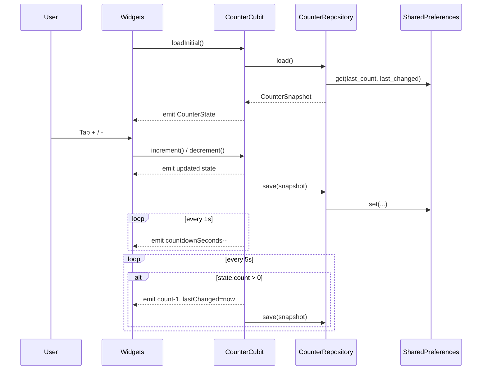
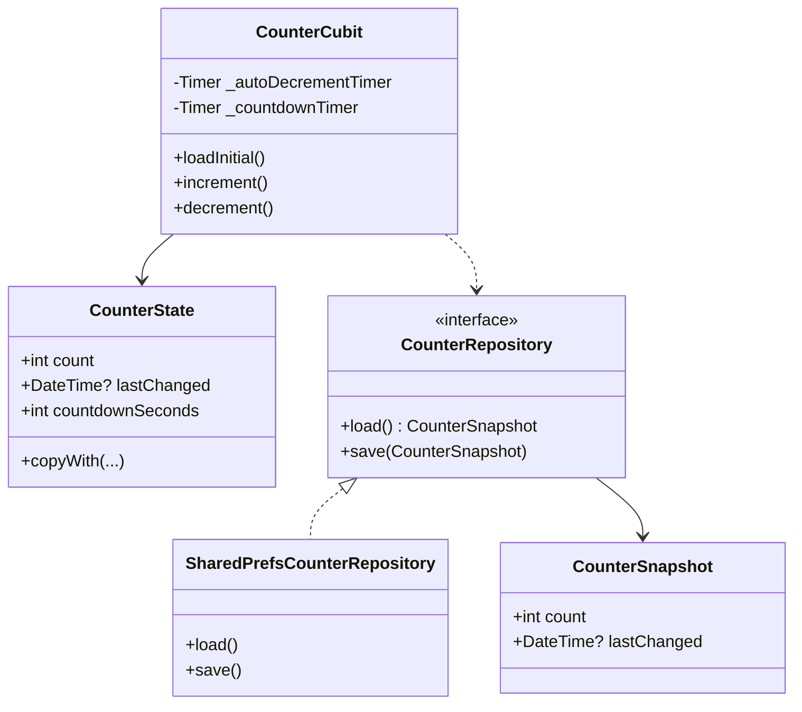

# Flutter BLoC App

Small demo app showcasing BLoC (Cubit) state management, local persistence, a periodic timer, and basic localization in Flutter. The app displays a counter you can increment/decrement, persists the last value, shows when it last changed, and auto-decrements every 5 seconds with a visible countdown.

## Features

- BLoC/Cubit: Simple `CounterCubit` with immutable `CounterState`.
- Persistence: Stores last count and timestamp with `shared_preferences`.
- Auto-decrement: Decreases count every 5 seconds if above zero.
- Countdown UI: Live “next auto-decrement in: Ns” indicator.
- Localization: `intl` + Flutter localizations (EN, TR, DE, FR, ES).
- Tests: Unit and bloc tests with `flutter_test` and `bloc_test`.

## Tech Stack

- Flutter 3 (Dart SDK constraint in `pubspec.yaml`)
- `flutter_bloc` for Cubit/BLoC
- `shared_preferences` for simple storage
- `intl` and `flutter_localizations` for i18n
- `bloc_test`, `flutter_test` for testing

## Architecture

```mermaid
flowchart LR
  subgraph Presentation
    V1[CounterDisplay]\nV2[CountdownBar]\nV3[CounterActions]
    CUBIT[CounterCubit]
  end
  subgraph Domain
    REPOI[[CounterRepository]]
    SNAP[CounterSnapshot]
  end
  subgraph Data
    REPO[SharedPrefsCounterRepository]
    SP[(SharedPreferences)]
  end

  V1 -->|BlocBuilder| CUBIT
  V2 -->|BlocBuilder| CUBIT
  V3 -->|read() actions| CUBIT
  CUBIT -->|load/save| REPOI
  REPOI <-.implements .-> REPO
  REPO --> SP
```

## Sequence



## Class Diagram



## App Structure

- `lib/main.dart`: App bootstrapping, `BlocProvider`, `MaterialApp`, widgets.
- `lib/counter_cubit.dart`: `CounterCubit` and `CounterState`, timers, persistence.
- `test/counter_cubit_test.dart`: Cubit behavior, timers, persistence tests.
- `test/widget_test.dart`: Basic widget test hooking into the app.

## How It Works

- On launch, `CounterCubit.loadInitial()` restores the last count and timestamp.
- Two timers run inside the cubit:
  - A 5s periodic timer that auto-decrements when `count > 0`.
  - A 1s countdown timer that updates the UI’s remaining seconds.
- Any manual increment/decrement resets the 5s window and persists the state.

## Getting Started

Prerequisites:

- Flutter SDK installed (matching the Dart SDK constraint in `pubspec.yaml`).

Install dependencies:

```
flutter pub get
```

Run the app:

```
flutter run
```

Run tests:

```
flutter test
```

Optional useful commands:

```
flutter analyze
flutter format .
```

## Screenshots

You can add screenshots or a short GIF here to showcase the counter and countdown.

## Notes

- Supported locales are declared in `MaterialApp.supportedLocales`.
- Auto-decrement never goes below zero.
- State shape: `count`, `lastChanged` (DateTime?), `countdownSeconds`.

## License

This project is for demonstration purposes. Add an explicit license if you intend to distribute.
