# Flutter BLoC App

A reference Flutter application that demonstrates clean architecture, offline-first data access, and production-minded tooling across multiple feature types. This repository is designed to showcase senior Flutter engineering practices in a realistic, testable codebase.

[](https://flutter.dev)
[](https://dart.dev)
[](https://pub.dev/packages/very_good_analysis)
[](coverage/coverage_summary.md)
[](LICENSE)
[](docs/clean_architecture.md)
[](https://pub.dev/packages/flutter_bloc)
[](https://firebase.google.com/)
[](docs/offline_first/adoption_guide.md)
[](https://m3.material.io/)
[](https://api.flutter.dev/flutter/cupertino/cupertino-library.html)
[](docs/dry_principles.md)
[](docs/solid_principles.md)

---

## 🎯 Overview

This codebase focuses on maintainability, correctness, and performance:

- Clean architecture with strict Domain -> Data -> Presentation boundaries
- Offline-first repositories with background sync queues
- Responsive and platform-adaptive UI (Material 3 + Cupertino)
- Lifecycle safety for async flows and UI state updates
- Automated validation scripts and broad test coverage

## ✨ Product Features

- Authentication and settings flows with secure storage
- Offline-first chat (Hugging Face inference) with local queueing
- GenUI Demo (AI-generated dynamic UI with Google Gemini)
- Maps (Google Maps with Apple Maps fallback)
- GraphQL countries browser
- WebSocket demo with reconnect logic
- Search, profile, and todo list features
- Charts, markdown editor, and whiteboard samples
- WalletConnect Auth demo (Example page): connect wallet, link to Firebase; see [WalletConnect Auth Status](docs/walletconnect_auth_status.md)

For entry points and module details, see [Feature Overview](docs/feature_overview.md).

**New Feature**: [GenUI Demo User Guide](docs/genui_demo_user_guide.md) - AI-generated dynamic UI with Google Gemini.

## ⚙️ Configuration

Some features require API keys or platform setup to fully enable:

- Firebase (Auth, Remote Config, etc.)
- Google Maps (Android/iOS keys)
- Hugging Face Inference API
- Google Gemini API (for GenUI Demo)

See [Security & Secrets](docs/security_and_secrets.md) for setup guidance and sample config files.

## 📱 Screenshots

| Counter Home | Auto Countdown | Settings |
| --- | --- | --- |
|  | 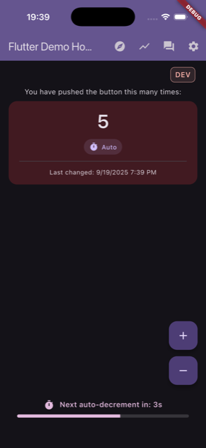 | 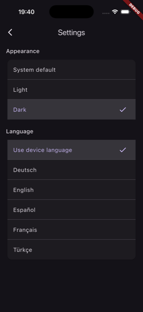 |

| Charts | GraphQL | AI Chat |
| --- | --- | --- |
| 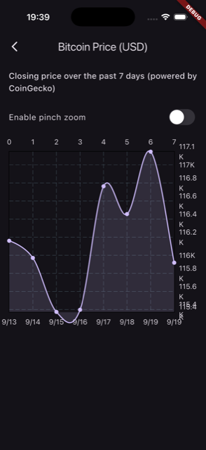 | 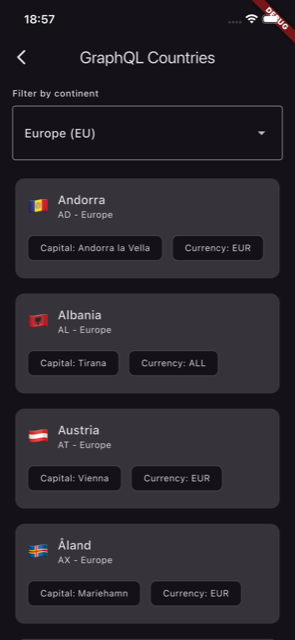 |  |

| GenUI Demo |
| --- |
| 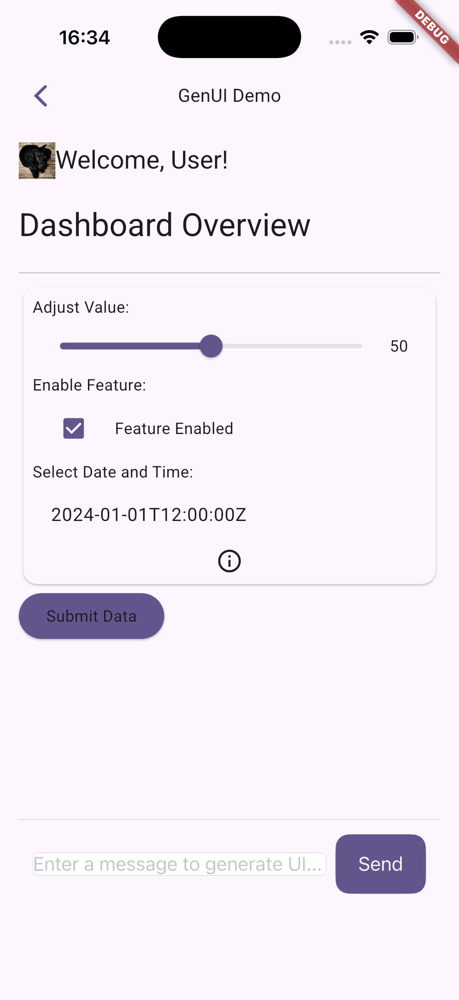 |

| Apple Maps Demo | Google Maps Demo | Search |
| --- | --- | --- |
|  | 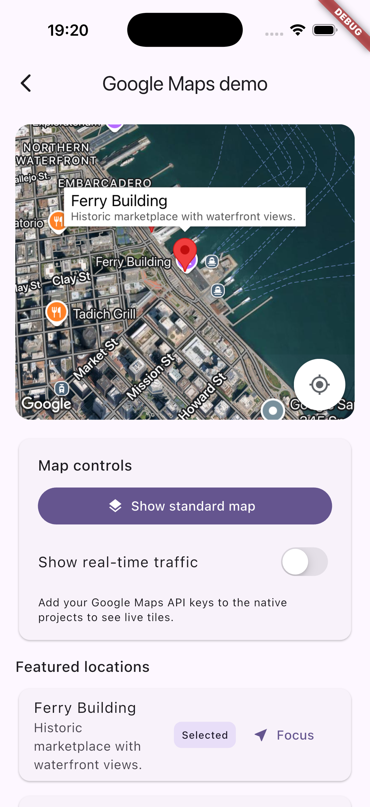 | 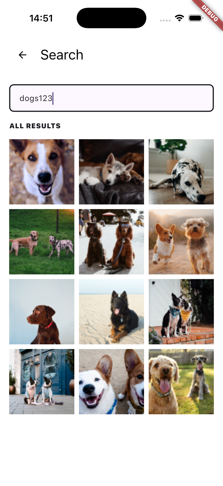 |

| Payment Calculator | Payment Summary | Register |
| --- | --- | --- |
| 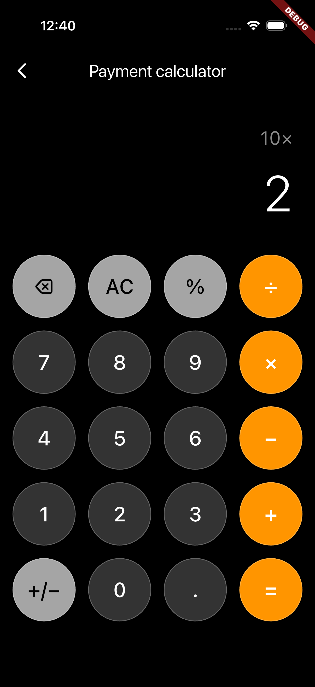 | 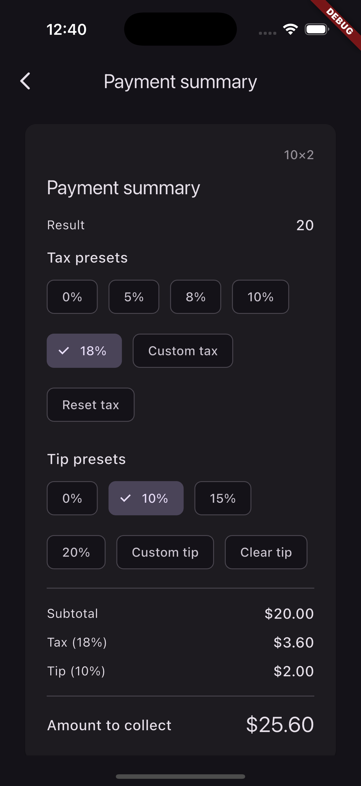 | 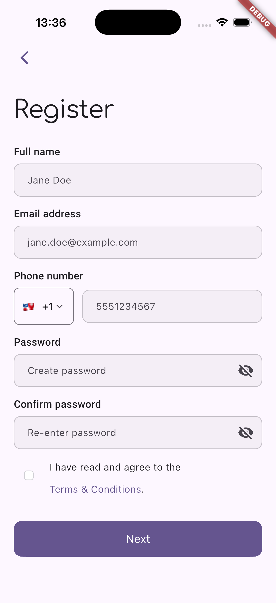 |

| Color Picker | Whiteboard | Markdown Editor |
| --- | --- | --- |
| 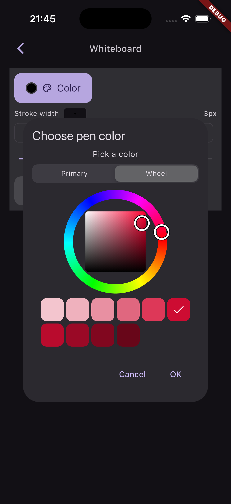 | 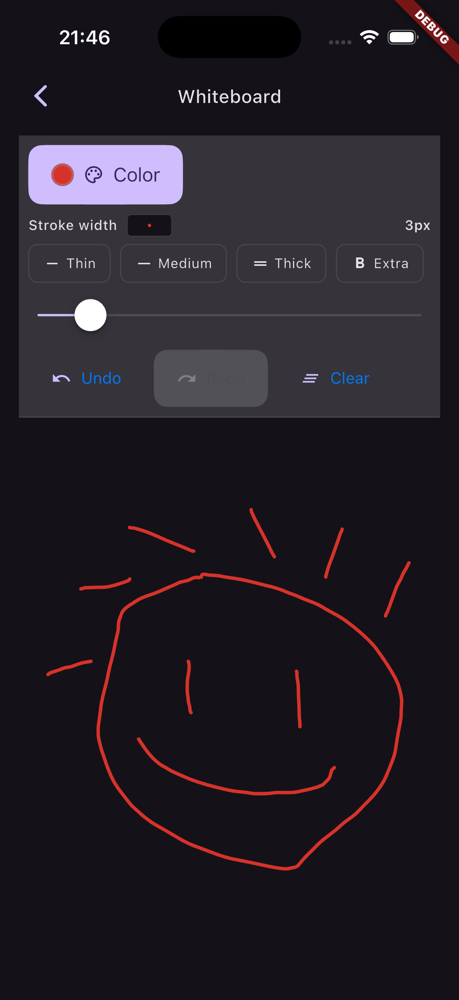 | 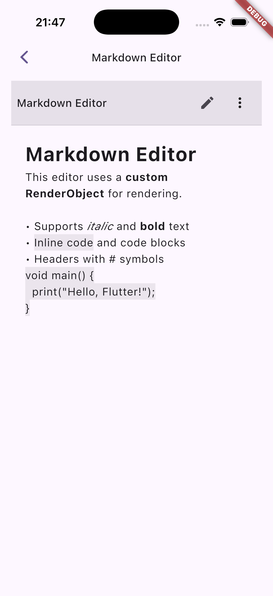 |

| Todo List | Todo List Swipe Action |
| --- | --- |
| 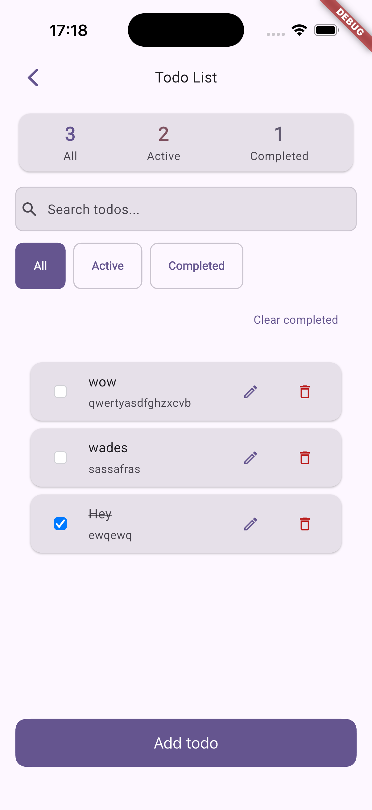 |  |

| Library Demo | Library Demo 2 |
| --- | --- |
| 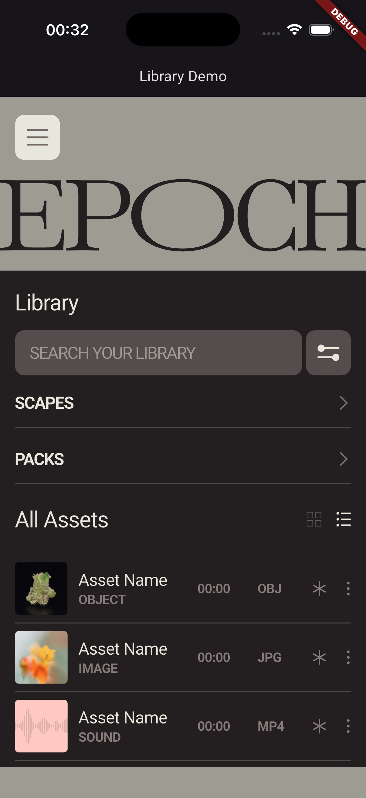 | 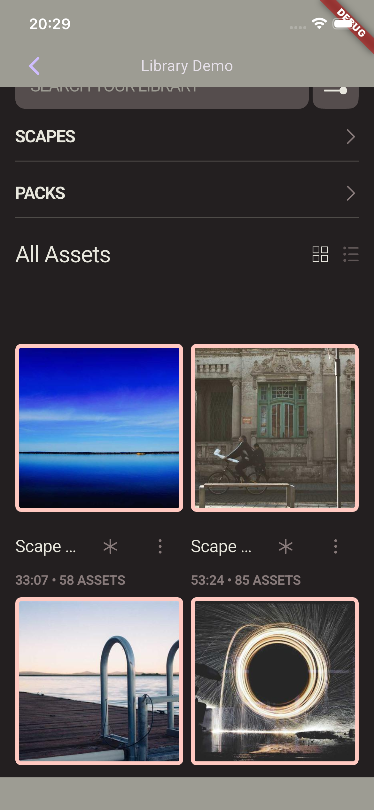 |

## 🚀 Quick Start

### Prerequisites

- Flutter 3.41.2
- Dart 3.11.0
- iOS 12+ / Android API 21+

### Installation

```bash
flutter pub get
flutter run
```

Detailed setup: [Developer Guide](docs/new_developer_guide.md)

## 📚 Documentation

Start here:

- [Developer Guide](docs/new_developer_guide.md)
- [Feature Overview](docs/feature_overview.md)
- [Architecture Details](docs/architecture_details.md)
- [Testing Overview](docs/testing_overview.md)

Engineering references:

- [Clean Architecture](docs/clean_architecture.md)
- [Deployment](docs/deployment.md) – App Store, TestFlight, Google Play, Fastlane (Ad Hoc, TestFlight, App Store)
- [Offline-First Guide](docs/offline_first/adoption_guide.md)
- [Type-Safe BLoC](docs/compile_time_safety.md)
- [Performance](docs/performance_bottlenecks.md)
- [Validation Scripts](docs/validation_scripts.md)
- [Known Workarounds](docs/workarounds.md) – temporary fixes (e.g. iOS simulator); prefer upstream fixes when available

## 🛠️ Tech Stack (Short)

- Flutter 3.41.2 / Dart 3.11.0
- BLoC/Cubit for state management
- Hive + secure storage for persistence
- Firebase (Auth, Remote Config)
- GraphQL + WebSocket networking
- Material 3 + Cupertino for adaptive UI

Full details: [Tech Stack Documentation](docs/tech_stack.md)

## 🧭 Design Decisions

- [ADR 0001 - Architecture and Layering](docs/adr/0001-architecture-and-layering.md)
- [ADR 0002 - Offline-First Data Access](docs/adr/0002-offline-first-data.md)
- [ADR 0003 - Deferred Feature Loading](docs/adr/0003-deferred-feature-loading.md)
- [ADR 0004 - Type-Safe Cubit Access](docs/adr/0004-type-safe-cubit-access.md)

## ✅ Quality Signals

- Validation scripts: `./bin/checklist`
- Coverage tracking: `coverage/coverage_summary.md`
- Custom lint rules and codegen utilities
- Golden and widget tests for UI regressions

## 🙏 Acknowledgments

- Flutter and Dart teams
- BLoC and package maintainers
- Open-source community contributors

## 📄 License

This project is available for free use in public, non-commercial repositories under the terms described in [LICENSE](LICENSE). Any commercial or closed-source usage requires prior written permission from the copyright holder.
