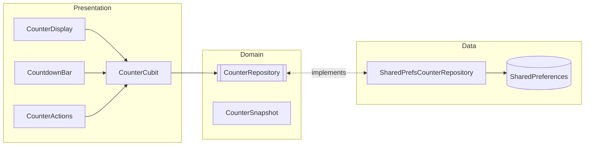
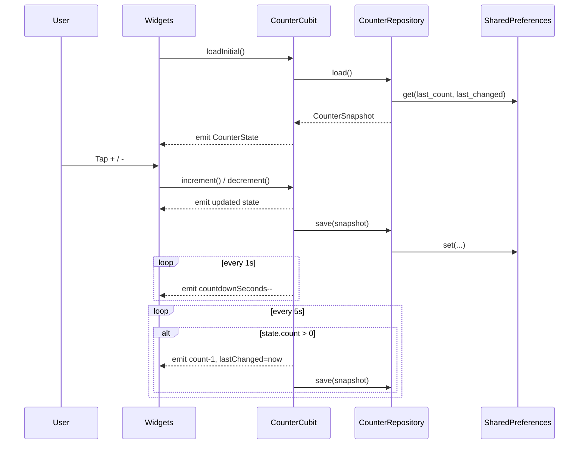
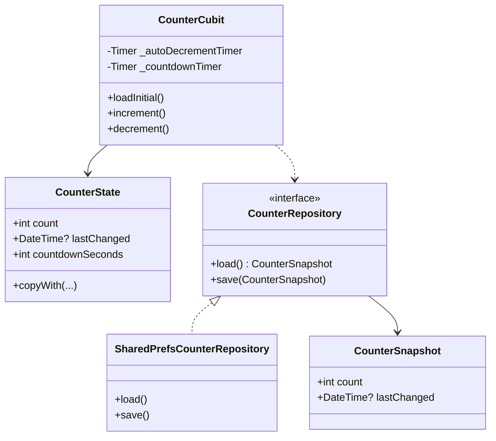

# Flutter BLoC App

Small demo app showcasing BLoC (Cubit) state management, local persistence, a periodic timer, and basic localization in Flutter. The app displays a counter you can increment/decrement, persists the last value, shows when it last changed, and auto-decrements every 5 seconds with a visible countdown.

## Features

- BLoC/Cubit: Simple `CounterCubit` with immutable `CounterState`.
- Responsive UI: Uses `flutter_screenutil` and width-based helpers (see `presentation/responsive.dart`).
- UI constants: Centralized sizing/spacing in `presentation/ui_constants.dart`.
- Accessibility: Semantics on key widgets, overflow guards on narrow screens.
- Persistence: Stores last count and timestamp with `shared_preferences`.
- Auto-decrement: Decreases count every 5 seconds if above zero (never below 0).
- Countdown UI: Live “next auto-decrement in: Ns” indicator.
- Localization: `intl` + Flutter localizations (EN, TR, DE, FR, ES) using device locale.
- Tests: Bloc and widget tests with `flutter_test` and `bloc_test`.

## Tech Stack

- Flutter 3 (Dart SDK constraint in `pubspec.yaml`)
- `flutter_bloc` for Cubit/BLoC
- `shared_preferences` for simple storage
- `intl` and `flutter_localizations` for i18n
- `flutter_screenutil` for adaptive sizing (with safe fallbacks in tests)
- `responsive_framework` optional; helpers fall back to MediaQuery breakpoints
- `bloc_test`, `flutter_test` for testing

## Architecture



## Sequence



## Class Diagram



## App Structure

- `lib/main.dart`: App bootstrapping, `MultiBlocProvider`, `MaterialApp`.
- `lib/counter_cubit.dart`: `CounterCubit` and `CounterState`, timers, persistence.
- `lib/presentation/responsive.dart`: Width-based breakpoints + helpers (ScreenUtil aware).
- `lib/presentation/ui_constants.dart`: Centralized responsive constants (safe fallbacks in tests).
- `lib/presentation/widgets/`: `CounterDisplay`, `CountdownBar`, `CounterActions`.
- `test/counter_cubit_test.dart`: Cubit behavior, timers, persistence tests.
- `test/countdown_bar_test.dart`: Verifies CountdownBar active/paused labels.
- `test/counter_display_chip_test.dart`: Verifies CounterDisplay chip labels.
- `test/error_snackbar_test.dart`: Intentionally throws to exercise SnackBar (skipped by default).
- `test/widget_test.dart`: Basic boot test for the app.

## How It Works

- On launch, `CounterCubit.loadInitial()` restores the last count and timestamp.
- Two timers run inside the cubit:
  - A 5s periodic timer that auto-decrements when `count > 0`.
  - A 1s countdown timer that updates the UI’s remaining seconds.
- Any manual increment/decrement resets the 5s window and persists the state.

## Getting Started

Prerequisites:

- Flutter SDK installed (matching the Dart SDK constraint in `pubspec.yaml`).

Install dependencies:

```
flutter pub get
```

Run the app:

```
flutter run
```

Run tests:

```
flutter test
```

Optional useful commands:

```
flutter analyze
flutter format .
```

## Screenshots

You can add screenshots or a short GIF here to showcase the counter and countdown.

## Notes

- Supported locales are declared in `MaterialApp.supportedLocales`.
- Auto-decrement never goes below zero.
- State shape: `count`, `lastChanged` (DateTime?), `countdownSeconds`.

## Localization (Do Not Edit Generated Files)

- All localizable strings live in ARB files under `lib/l10n/` (for example: `app_en.arb`, `app_tr.arb`, etc.).
- The localization classes (such as `app_localizations.dart` and per-locale files) are auto-generated from these ARB files.
- Do not modify any generated `app_localizations*.dart` files manually — changes will be overwritten.
- To add or change a string:
  - Edit the appropriate `lib/l10n/app_XX.arb` file(s).
  - Keep keys consistent across locales and update placeholder metadata as needed.
  - Run `flutter pub get` and then `flutter run` (or `flutter gen-l10n` if configured) to regenerate the localization Dart code.
  - Use the generated APIs in code, for example: `AppLocalizations.of(context).startAutoHint`.

## License

This project is for demonstration purposes. Add an explicit license if you intend to distribute.


Note on skipped test
- The suite `test/error_snackbar_test.dart` is intentionally annotated with `@Skip(...)` and is excluded from the default `flutter test` run because it throws on purpose to exercise the SnackBar error path.
- To run it explicitly:

```
flutter test test/error_snackbar_test.dart
```
