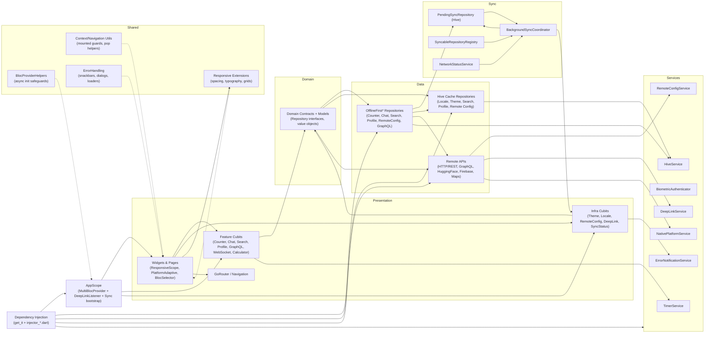
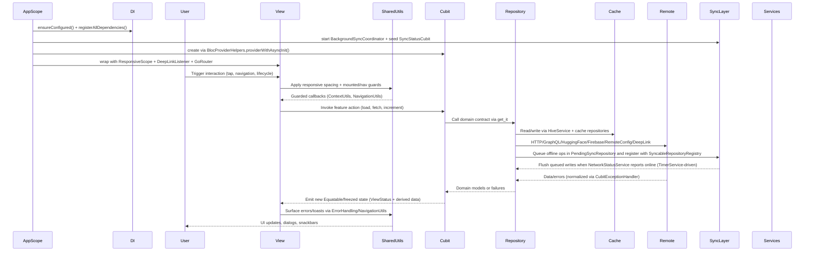

# Flutter BLoC App

A production-ready Flutter application demonstrating enterprise-grade architecture patterns, secure data persistence, and modern mobile development best practices. Integrated AI-powered chat using Hugging Face OSS models.

[](https://flutter.dev)
[](https://dart.dev)
[](coverage/coverage_summary.md)
[](LICENSE)
[](docs)

---

## What This App Demonstrates

- Production-grade Flutter architecture with offline-first data flow, responsive/adaptive UI, and real-time features (websockets, maps, chat).
- Security-minded patterns: encrypted Hive storage, biometric gating for sensitive navigation, auth-aware routing, and localization-backed error handling.
- DevEx focus: high coverage, lint-enforced file-length/spacing rules, single-command delivery checklist, and DI-driven testability.
- Runtime resilience review: see `docs/CODE_QUALITY_ANALYSIS.md` for error handling, retry strategy, empty states, and skeleton coverage.

## Architecture Decisions

- Clean Architecture layering (domain → data → presentation) keeps business logic Flutter-agnostic; repositories wrap Hive/Firebase/REST/GraphQL and expose contracts.
- Dependency injection via `get_it` at the composition root (`injector.dart`, `injector_registrations.dart`, `injector_factories.dart`); widgets/cubits receive dependencies through constructors for testability.
- Offline-first by default: local repos paired with remote repos through sync registries and pending operation queues, so features keep working without connectivity.
- Responsive/adaptive UI baseline with shared spacing/typography utilities and platform-aware components.

## State Management Rationale (Why BLoC)

- Predictable, replayable state transitions (events in, state out) with bloc observers for debugging.
- Cubits/blocs isolate business rules from widgets, enabling fast unit/bloc tests without pumps or platform fakes.
- `BlocSelector`-driven rebuild control keeps large trees performant; immutable states reduce accidental side effects.

## Backend & Authentication Flow

- Firebase Auth + FirebaseUI for email/password, Google, and anonymous sign-in; GoRouter redirect guards authenticated vs unauthenticated flows while allowing deep links.
- Anonymous users can upgrade accounts; Firebase ID tokens managed by the SDK, with Realtime Database keyed by `user.uid` and a 5s auth wait guard.
- Registration page validates client-side only; real account creation lives in the FirebaseUI flow. Biometric prompt protects settings access.

## AI Integration Overview

- Chat feature uses Hugging Face Inference API via an offline-first repository that queues messages locally and syncs replies, with cached history storage and guarded error handling.
- Model selection comes from config (`SecretConfig`) and responses are parsed/validated before surfacing in UI.

## Trade-offs & Future Improvements

- Deep links bypass auth redirect for non-root routes; page-level guards may be needed if features require strict auth.
- No role/claims-based authorization yet; current model is authenticated vs anonymous only.
- Token handling relies on Firebase defaults; non-Firebase HTTP clients don’t attach auth headers automatically.
- Biometric authenticator allows access when sensors are unavailable/not enrolled—tighten policy if stronger gating is required.

---

## Features

### Core Counter Feature

- **Auto-decrement Timer** - Decreases count every 5 seconds (never goes below zero)
- **Live Countdown** - Real-time "next auto-decrement in: Ns" indicator
- **Persistent Storage** - Encrypted Hive database with automatic migration from SharedPreferences
- **Biometric Authentication** - Secure access to sensitive actions using device biometrics

### State Management & Architecture

- **BLoC/Cubit Pattern** - Immutable states with `Equatable`/`freezed`
- **Repository Pattern** - Clean data layer abstraction with multiple implementations
- **Dependency Injection** - Organized `get_it` setup across multiple files
- **Domain-Driven Design** - Flutter-agnostic business logic

### UI/UX Excellence

- **Responsive Design** - Adaptive layouts for mobile, tablet, and desktop
- **Platform-Adaptive Widgets** - Material 3 on Android, Cupertino on iOS
- **Loading States** - Skeleton screens, shimmer effects, and smooth transitions
- **Image Caching** - Automatic remote image caching with `CachedNetworkImageWidget`
- **Accessibility** - Semantic widgets and overflow guards
- **Low-Level Rendering** - Custom `CustomPainter` for canvas drawing and custom `RenderObject` for advanced text layout

### Authentication & Security

- **Firebase Auth** - Email/password, Google Sign-In, and anonymous sessions
- **Biometric Auth** - Fingerprint and face recognition support
- **Secure Storage** - Keychain/Keystore-backed encryption key management
- **Secrets Management** - Environment-based configuration with secure fallbacks
- See `docs/authentication.md` for current auth routing, flows, and gaps.

### Data & Networking

- **Offline-First Architecture** - Complete offline-first implementation with background sync coordinator, pending operations queue, and cache-first strategies
  - **Counter** - Write-first with sync metadata and pending operation queue
  - **Chat** - Offline message queuing with conflict resolution
  - **Search** - Cache-first with background refresh
  - **Profile** - Cache-first with manual sync support
  - **Remote Config** - Cache-first with version tracking
  - **GraphQL Demo** - Cache-first with 24h staleness expiry
- **GraphQL Integration** - Countries browser with continent filtering
- **REST APIs** - Bitcoin price charts via CoinGecko API
- **WebSocket Support** - Real-time echo server with reconnect handling
- **Remote Config** - Firebase Remote Config for feature flags

### Maps & Location

- **Google Maps** - Curated San Francisco locations with traffic toggle
- **Apple Maps Fallback** - Native MapKit rendering on iOS when Google keys unavailable
- **Map Controls** - Runtime map type switching and marker selection

### Chat & Communication

- **AI Chat** - Hugging Face Inference API integration (GPT-OSS)
- **Chat History** - Secure local storage with encryption
- **Chat Inbox** - Responsive list with unread indicators and actions

### Payment Calculator

- **iOS-style Keypad** - Native-feeling calculator interface
- **Expression History** - Running calculation history
- **Tax & Tip Presets** - Quick percentage calculations
- **Payment Summary** - Dedicated summary screen with breakdown

### Advanced UI Features

- **Whiteboard** - Interactive drawing canvas using `CustomPainter` for low-level rendering
  - Touch/pointer drawing with smooth stroke rendering using quadratic bezier curves
  - Multiple colors with color picker dialog (`flex_color_picker`)
  - Adjustable stroke widths (1-20px) with preset buttons (Thin, Medium, Thick, Extra)
  - Visual width preview showing current stroke size and color
  - Undo/redo functionality with immediate visual updates
  - Clear all strokes with confirmation
  - Responsive toolbar with tooltips and Material 3 styling
  - Efficient repainting with `RepaintBoundary` and optimized `shouldRepaint` logic
- **Markdown Editor** - Rich text editor with live preview using custom `RenderObject`
  - Real-time markdown parsing and syntax highlighting
  - Custom `RenderBox` subclass (`MarkdownRenderObject`) for efficient text layout
  - Support for headers (H1-H6), bold, italic, inline code, code blocks, lists, and blockquotes
  - GitHub Flavored Markdown support via `markdown` package
  - Formatting toolbar with quick insert buttons (header, bold, italic, code, code block)
  - Split view: editor (`TextField`) and live preview (`RenderObject`)
  - Proper handling of unbounded constraints in scrollable contexts
  - Responsive design with proper text direction handling

**Access**: Open the Whiteboard and Markdown Editor from the Home page overflow menu/action sheet alongside Charts, GraphQL, Chat, and Google/Apple Maps.

### Deep Links & Navigation

- **Universal Links** - `https://links.flutterbloc.app/...` routes
- **Custom Schemes** - `flutter-bloc-app://` for local development
- **GoRouter Integration** - Declarative navigation with type-safe routes

### Developer Experience

- **Performance Profiling** - Built-in widget rebuild tracking, frame analysis overlays, and `PerformanceProfiler`
- **Custom Linting** - File length + responsive spacing rules enforced by the Dart 3.10.4 analyzer plugin
- **Automated Testing** - Comprehensive unit/bloc/widget/golden suites surfaced through `./bin/checklist`
- **CI/CD Ready** - Fastlane scripts, Firebase app distribution hooks, and per-environment configurations
- **Common Bugs Checklist** - Context lifecycle, cubit disposal, and async guardrails outlined in `docs/new_developer_guide.md`
- **Bug Prevention Tests** - Dedicated regression tests under `test/shared/common_bugs_prevention_test.dart` covering StreamController state checks, cubit lifecycle guards, context mounted checks, completer safety, and more. Automatically included in `./bin/checklist` test runs.

---

## Screenshots

| Counter Home | Auto Countdown | Settings |
| --- | --- | --- |
|  |  |  |

| Charts | GraphQL | AI Chat |
| --- | --- | --- |
|  |  |  |

| Apple Maps Demo | Google Maps Demo | Search |
| --- | --- | --- |
|  |  |  |

| Payment Calculator | Payment Summary | Register |
| --- | --- | --- |
|  |  |  |

| Color Picker | Whiteboard | Markdown Editor |
| --- | --- | --- |
|  |  |  |

---

## Quick Start

### Prerequisites

- Flutter 3.38.5 or higher
- Dart 3.10.4 or higher
- iOS 12+ / Android API 21+
- Xcode 14+ (for iOS development)
- Android Studio / VS Code with Flutter extensions

### Installation

```bash
# Clone the repository
git clone <repository-url>
cd flutter_bloc_app

# Install dependencies
flutter pub get

# Run code generation (if Freezed/JSON models changed)
dart run build_runner build --delete-conflicting-outputs

# Run the app
flutter run
```

### Delivery Checklist

Before committing, run the automated checklist:

```bash
# Option 1: Use the shortcut script (recommended)
./bin/checklist

# Option 2: Use the full path
tool/delivery_checklist.sh

# Option 3: Add to PATH for convenience
export PATH="$PATH:$(pwd)/bin"
checklist  # Now you can use it from anywhere
```

The checklist automatically runs:

1. `dart format .` - Code formatting
2. `flutter analyze` - Static analysis (includes custom file length lint)
3. `tool/test_coverage.sh` - Test coverage generation

---

## Architecture & Tooling

This project enforces **Clean Architecture** guardrails, SOLID principles, and responsive design requirements across all modules. `AppScope` bootstraps DI, ResponsiveScope, DeepLinkListener, and the global cubits (sync status, locale, theme, counter, remote config) using `BlocProviderHelpers` so each cubit can async-initialize safely.

### Architecture Diagram



### Key Principles

- **Clean boundaries** - Domain contracts and value objects sit at the seam; cubits talk to repository interfaces injected via `get_it`, and state is kept immutable with `Equatable`/`freezed` where appropriate.
- **Presentation quality** - Widgets rely on responsive extensions (`responsiveGap*`, `pagePadding`, `responsiveFontSize`) and `PlatformAdaptive` builders instead of raw Material buttons, with `BlocSelector`/`RepaintBoundary` to minimize rebuilds. Advanced UI features demonstrate low-level Flutter rendering: `CustomPainter` for canvas drawing (whiteboard) and custom `RenderObject` for text layout (markdown editor).
- **Dependency injection & bootstrap** - `ensureConfigured()` + `registerAllDependencies()` wire repositories/services through `get_it`. `AppScope` starts the `BackgroundSyncCoordinator`, seeds `SyncStatusCubit`, runs `RemoteConfigCubit.initialize()`, and wraps the tree with `DeepLinkListener` and `ResponsiveScope`.
- **State safety** - Cubits use `CubitExceptionHandler`, `CubitSubscriptionMixin`, and `CubitStateEmissionMixin` to avoid emit-after-close; timers/streams/completers are cancelled in `close()` with explicit `isClosed` guards.
- **Context & navigation safety** - `ContextUtils.logNotMounted()` plus `NavigationUtils.maybePop()/popOrGoHome()` centralize mounted checks and dialog dismissal so async flows cannot navigate after dispose.
- **Responsive + adaptive UX** - Layouts honor `contentMaxWidth`, `pagePadding`, adaptive grids, and platform-aware dialogs; gestures, images, and spacing reference shared responsive extensions for every screen size.
- **Secure persistence** - `HiveService` (never `Hive.openBox` directly) encrypts data via `HiveKeyManager` and `flutter_secure_storage`, migrations run through `SharedPreferencesMigrationService`, and `BiometricAuthenticator`/`NativePlatformService` guard sensitive flows.
- **Offline-first architecture** - Offline-first repositories (counter, chat, search, profile, remote config, GraphQL) register with `SyncableRepositoryRegistry` and queue writes in `PendingSyncRepository`; `BackgroundSyncCoordinator` + `NetworkStatusService` + `TimerService` flush the queue, while `SyncStatusCubit` surfaces status/telemetry in the UI.
- **Testing & quality gates** - `./bin/checklist` (`dart format`, `flutter analyze`, coverage) + `tool/test_coverage.sh` enforce `file_length_lint`, common-bug prevention suites, and coverage thresholds before commits.
- **Localization & platform polish** - `.arb` regeneration happens through `flutter pub get`/`flutter gen-l10n`, `tool/ensure_localizations.dart` feeds iOS builds, and five locales (EN, TR, DE, FR, ES) are always available at runtime.

### State Management Flow



Startup is part of the flow: `AppScope` calls `ensureConfigured()`, starts background sync, initializes Remote Config, wires DeepLinkListener, and wraps the tree with ResponsiveScope so every cubit begins in a consistent, responsive context. Shared utilities (ContextUtils, NavigationUtils, ErrorHandling, responsive extensions) keep navigation, dialogs, and spacing guarded against unmounted contexts and async races.

---

## Testing

### Test Coverage

- **Current Coverage**: 83.60% (9218/11026 lines)
- **Excluded**: Mocks, simple data classes, configs, debug utils, platform widgets, part files
- **Full Report**: See [`coverage/coverage_summary.md`](coverage/coverage_summary.md)

### Running Tests

```bash
# Run all tests
flutter test

# Run with coverage
flutter test --coverage

# Update coverage summary
dart run tool/update_coverage_summary.dart

# Or use the automated script
tool/test_coverage.sh
```

### Test Types

- **Unit Tests** - Isolated function and class testing
- **Bloc Tests** - State flow testing with `bloc_test`
- **Widget Tests** - UI component and interaction testing
- **Golden Tests** - Visual regression testing
- **Common Bugs Prevention Tests** - Regression tests for common pitfalls (context lifecycle, cubit disposal, stream cleanup, etc.) located in `test/shared/common_bugs_prevention_test.dart`

### Golden Test Regeneration

After Flutter version updates, golden tests may fail due to minor rendering changes. Regenerate golden files:

```bash
# Regenerate all golden files
flutter test --update-goldens

# Regenerate specific golden test file
flutter test --update-goldens test/counter_page_golden_test.dart
```

**Note**: Always review the generated golden images to ensure they match expected visual changes before committing.

### Test Utilities

- `MockFirebaseAuth` + `mock_exceptions` for authentication flows
- `FakeTimerService().tick(n)` for time-dependent tests
- `pump()` instead of `pumpAndSettle()` for `CachedNetworkImageWidget` tests
- Hive initialization in `setUpAll` for repository tests
- Common bugs prevention tests automatically run with `./bin/checklist` to catch regressions

---

## Tech Stack

### Core Framework

- **Flutter** 3.38.5 (Dart 3.10.4)
- **Material 3** with `ColorScheme.fromSeed`
- **Cupertino** widgets for iOS-native feel

### State Management

- `flutter_bloc` ^9.1.1 - BLoC/Cubit pattern
- `equatable` ^2.0.5 - Value equality
- `freezed` ^3.2.3 - Immutable data classes

### Storage & Persistence

- `hive` ^2.2.0 - Encrypted local database
- `hive_flutter` ^1.1.0 - Flutter integration
- `flutter_secure_storage` ^10.0.0 - Keychain/Keystore access
- `shared_preferences` ^2.5.3 - Legacy migration support

### Networking & APIs

- `http` ^1.6.0 - REST API client
- `web_socket_channel` ^3.0.3 - WebSocket support
- `cached_network_image` ^3.4.1 - Image caching

### Firebase

- `firebase_core` ^4.2.1
- `firebase_auth` ^6.1.2
- `firebase_analytics` ^12.0.4
- `firebase_crashlytics` ^5.0.5
- `firebase_remote_config` ^6.1.2
- `firebase_database` ^12.1.0
- `firebase_ui_auth` ^3.0.0
- `firebase_ui_localizations` ^2.0.0
- `firebase_ui_oauth_google` ^2.0.0

### UI & Design

- `flutter_screenutil` ^5.9.3 - Responsive sizing
- `responsive_framework` ^1.5.1 - Layout breakpoints
- `fancy_shimmer_image` ^2.0.3 - Loading effects
- `skeletonizer` ^2.1.0+1 - Skeleton screens
- `google_fonts` ^6.2.1 - Typography
- `flutter_svg` ^2.2.2 - SVG rendering
- `fl_chart` ^1.1.1 - Charts and graphs
- `flex_color_picker` ^3.3.0 - Color picker for whiteboard
- `markdown` ^7.3.0 - Markdown parsing for editor

### Navigation & Routing

- `go_router` ^17.0.0 - Declarative routing
- `app_links` ^6.4.1 - Deep linking

### Maps

- `google_maps_flutter` ^2.14.0 - Google Maps
- `apple_maps_flutter` ^1.4.0 - Apple Maps (iOS)

### Authentication

- `local_auth` ^3.0.0 - Biometric authentication

### Dependency Injection

- `get_it` ^9.0.5 - Service locator

### Internationalization

- `intl` ^0.20.2 - Internationalization
- `flutter_localizations` - Flutter i18n support

### Development Tools

- `build_runner` ^2.10.4 - Code generation
- `bloc_test` ^10.0.0 - BLoC testing
- `golden_toolkit` ^0.15.0 - Golden tests
- `mocktail` ^1.0.4 - Mocking framework
- `file_length_lint` - Custom analyzer plugin

---

## Security & Secrets

### Secrets Management

The app uses a secure, layered approach to secrets:

1. **Secure Storage** (Primary) - Keychain/Keystore via `flutter_secure_storage`
2. **Environment Variables** - `--dart-define` flags (persisted to secure storage)
3. **Asset Fallback** (Dev Only) - `assets/config/secrets.json` (opt-in, never in release)

### Setup for Development

```bash
# Copy sample secrets file
cp assets/config/secrets.sample.json assets/config/secrets.json

# Fill in your credentials, then run with asset fallback enabled
flutter run --dart-define=ENABLE_ASSET_SECRETS=true
```

### Production Setup

```bash
# Use environment variables (recommended)
flutter run \
  --dart-define=HUGGINGFACE_API_KEY=your_key \
  --dart-define=HUGGINGFACE_MODEL=openai/gpt-oss-20b

# Or inject via CI/CD secrets
```

**Important**: Never commit `assets/config/secrets.json`. The repo includes only `secrets.sample.json`.

### Encryption

- **Storage**: AES-256 encryption for all Hive boxes
- **Key Management**: Keys stored in platform keychain/keystore
- **Migration**: Automatic migration from SharedPreferences with data validation

---

## Localization

### Supported Locales

- English (en)
- Turkish (tr)
- German (de)
- French (fr)
- Spanish (es)

### Automatic Generation

Localization files are **automatically regenerated** when you run `flutter pub get`:

```bash
# Automatic (recommended)
flutter pub get  # Regenerates AppLocalizations if .arb files changed

# Manual regeneration
flutter gen-l10n
```

### Configuration

- **Output Directory**: `lib/l10n` (prevents deletion during builds)
- **Pre-build Script**: `tool/ensure_localizations.dart` (iOS Xcode integration)
- **After `flutter clean`**: Always run `flutter pub get` before `flutter run`

---

## Documentation

- **[FAQ.md](FAQ.md)** - Frequently asked questions
- **[docs/CODE_QUALITY_ANALYSIS.md](docs/CODE_QUALITY_ANALYSIS.md)** - Code quality analysis, performance profiling, and optimization guide
- **[docs/SHARED_UTILITIES.md](docs/SHARED_UTILITIES.md)** - Shared utilities documentation
- **[docs/REPOSITORY_LIFECYCLE.md](docs/REPOSITORY_LIFECYCLE.md)** - Repository lifecycle guide
- **[coverage/coverage_summary.md](coverage/coverage_summary.md)** - Test coverage report

---

## Deployment

### Fastlane Automation

This project includes Fastlane configurations for automated deployments:

```bash
# Install dependencies
bundle install

# Deploy to iOS App Store
bundle exec fastlane ios deploy

# Deploy to Google Play Store
bundle exec fastlane android deploy track:internal
```

### Release Preparation

```bash
# Scrub secrets before packaging
dart run tool/prepare_release.dart

# Build release
flutter build ios --release
flutter build appbundle --release
```

---

## Contributing

Contributions are welcome! Please follow these guidelines:

1. **Run the checklist** before submitting PRs: `./bin/checklist`
2. **Write tests** for new features
3. **Update documentation** as needed
4. **Follow Clean Architecture** principles
5. **Use responsive extensions** for UI components
6. **Keep files under 250 lines** (enforced by linter)

---

## License

This project is available for free use in public, non-commercial repositories under the terms described in [`LICENSE`](LICENSE). Any commercial or closed-source usage requires prior written permission from the copyright holder.

---

## Acknowledgments

- Flutter team for the amazing framework
- BLoC library maintainers
- All package contributors
- The open-source community

---

Built with ❤️ using Flutter

[Report Bug](https://github.com/your-repo/issues) · [Request Feature](https://github.com/your-repo/issues) · [Documentation](docs)
