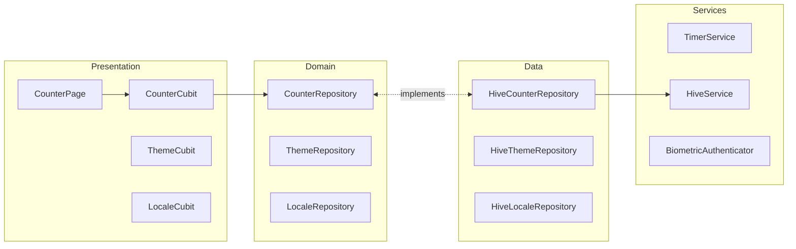
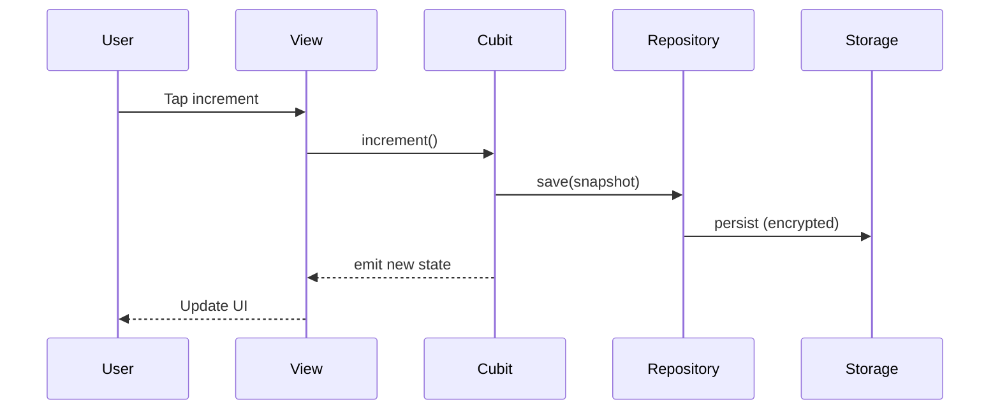

# Flutter BLoC App

A production-ready Flutter application demonstrating enterprise-grade architecture patterns, secure data persistence, and modern mobile development best practices.

[](https://flutter.dev)
[](https://dart.dev)
[](coverage/coverage_summary.md)
[](LICENSE)
[](docs)

---

## Overview

This comprehensive Flutter demo application showcases **Clean Architecture** principles, **BLoC/Cubit state management**, encrypted local storage, real-time features, authentication flows, and modern UI/UX patterns. Built with production-ready practices, the app serves as both a learning resource and a reference implementation for Flutter developers.

### Key Highlights

- **Clean Architecture** - Domain → Data → Presentation layers with clear separation of concerns
- **AES-256 Encrypted Storage** - Secure local database using Hive with keychain-backed encryption
- **Responsive & Adaptive UI** - Material 3 design with platform-adaptive widgets
- **85.23% Test Coverage** - Comprehensive unit, bloc, widget, and golden tests
- **Performance Optimized** - Built-in profiling, RepaintBoundary, and BlocSelector optimizations
- **Multi-language Support** - 5 locales (EN, TR, DE, FR, ES) with automatic localization
- **Firebase Integration** - Authentication, Remote Config, Analytics, and Crashlytics
- **Maps & Location** - Google Maps with Apple Maps fallback on iOS
- **Real-time Features** - WebSocket support, AI chat, and live updates
- **Modern UI Patterns** - Shimmer loading, skeleton screens, and smooth animations

---

## Features

### Core Counter Feature

- **Auto-decrement Timer** - Decreases count every 5 seconds (never goes below zero)
- **Live Countdown** - Real-time "next auto-decrement in: Ns" indicator
- **Persistent Storage** - Encrypted Hive database with automatic migration from SharedPreferences
- **Biometric Authentication** - Secure access to sensitive actions using device biometrics

### State Management & Architecture

- **BLoC/Cubit Pattern** - Immutable states with `Equatable`/`freezed`
- **Repository Pattern** - Clean data layer abstraction with multiple implementations
- **Dependency Injection** - Organized `get_it` setup across multiple files
- **Domain-Driven Design** - Flutter-agnostic business logic

### UI/UX Excellence

- **Responsive Design** - Adaptive layouts for mobile, tablet, and desktop
- **Platform-Adaptive Widgets** - Material 3 on Android, Cupertino on iOS
- **Loading States** - Skeleton screens, shimmer effects, and smooth transitions
- **Image Caching** - Automatic remote image caching with `CachedNetworkImageWidget`
- **Accessibility** - Semantic widgets and overflow guards

### Authentication & Security

- **Firebase Auth** - Email/password, Google Sign-In, and anonymous sessions
- **Biometric Auth** - Fingerprint and face recognition support
- **Secure Storage** - Keychain/Keystore-backed encryption key management
- **Secrets Management** - Environment-based configuration with secure fallbacks

### Data & Networking

- **GraphQL Integration** - Countries browser with continent filtering
- **REST APIs** - Bitcoin price charts via CoinGecko API
- **WebSocket Support** - Real-time echo server with reconnect handling
- **Remote Config** - Firebase Remote Config for feature flags

### Maps & Location

- **Google Maps** - Curated San Francisco locations with traffic toggle
- **Apple Maps Fallback** - Native MapKit rendering on iOS when Google keys unavailable
- **Map Controls** - Runtime map type switching and marker selection

### Chat & Communication

- **AI Chat** - Hugging Face Inference API integration (GPT-OSS)
- **Chat History** - Secure local storage with encryption
- **Chat Inbox** - Responsive list with unread indicators and actions

### Payment Calculator

- **iOS-style Keypad** - Native-feeling calculator interface
- **Expression History** - Running calculation history
- **Tax & Tip Presets** - Quick percentage calculations
- **Payment Summary** - Dedicated summary screen with breakdown

### Deep Links & Navigation

- **Universal Links** - `https://links.flutterbloc.app/...` routes
- **Custom Schemes** - `flutter-bloc-app://` for local development
- **GoRouter Integration** - Declarative navigation with type-safe routes

### Developer Experience

- **Performance Profiling** - Built-in widget rebuild tracking and frame analysis
- **Custom Linting** - File length enforcement via native Dart 3.10 analyzer plugin
- **Automated Testing** - Comprehensive test suite with golden tests
- **CI/CD Ready** - Fastlane automation for iOS and Android deployments

---

## Screenshots

| Counter Home | Auto Countdown | Settings |
| --- | --- | --- |
|  |  |  |

| Charts | GraphQL | AI Chat |
| --- | --- | --- |
|  |  |  |

| Apple Maps Demo | Google Maps Demo | Search |
| --- | --- | --- |
|  |  |  |

| Payment Calculator | Payment Summary | Register |
| --- | --- | --- |
|  |  |  |

---

## Quick Start

### Prerequisites

- Flutter 3.38.1 or higher
- Dart 3.10.0 or higher
- iOS 12+ / Android API 21+
- Xcode 14+ (for iOS development)
- Android Studio / VS Code with Flutter extensions

### Installation

```bash
# Clone the repository
git clone <repository-url>
cd flutter_bloc_app

# Install dependencies
flutter pub get

# Run code generation (if Freezed/JSON models changed)
dart run build_runner build --delete-conflicting-outputs

# Run the app
flutter run
```

### Delivery Checklist

Before committing, run the automated checklist:

```bash
# Option 1: Use the shortcut script (recommended)
./bin/checklist

# Option 2: Use the full path
tool/delivery_checklist.sh

# Option 3: Add to PATH for convenience
export PATH="$PATH:$(pwd)/bin"
checklist  # Now you can use it from anywhere
```

The checklist automatically runs:

1. `dart format .` - Code formatting
2. `flutter analyze` - Static analysis (includes custom file length lint)
3. `tool/test_coverage.sh` - Test coverage generation

---

## Architecture

This project follows **Clean Architecture** principles with clear separation between Domain, Data, and Presentation layers.

### Architecture Diagram



### Key Principles

- **Domain Layer** - Flutter-agnostic business logic and contracts
- **Data Layer** - Repository implementations with Hive/Firebase backends
- **Presentation Layer** - BLoC/Cubit state management with responsive widgets
- **Dependency Injection** - Organized `get_it` setup across multiple files:
  - `injector.dart` - Main entry point (61 lines)
  - `injector_registrations.dart` - All registrations by category
  - `injector_factories.dart` - Factory functions for repositories
  - `injector_helpers.dart` - Helper utilities

### State Management Flow



---

## Testing

### Test Coverage

- **Current Coverage**: 85.23% (6153/7219 lines)
- **Excluded**: Mocks, simple data classes, configs, debug utils, platform widgets, part files
- **Full Report**: See [`coverage/coverage_summary.md`](coverage/coverage_summary.md)

### Running Tests

```bash
# Run all tests
flutter test

# Run with coverage
flutter test --coverage

# Update coverage summary
dart run tool/update_coverage_summary.dart

# Or use the automated script
tool/test_coverage.sh
```

### Test Types

- **Unit Tests** - Isolated function and class testing
- **Bloc Tests** - State flow testing with `bloc_test`
- **Widget Tests** - UI component and interaction testing
- **Golden Tests** - Visual regression testing

### Golden Test Regeneration

After Flutter version updates, golden tests may fail due to minor rendering changes. Regenerate golden files:

```bash
# Regenerate all golden files
flutter test --update-goldens

# Regenerate specific golden test file
flutter test --update-goldens test/counter_page_golden_test.dart
```

**Note**: Always review the generated golden images to ensure they match expected visual changes before committing.

### Test Utilities

- `MockFirebaseAuth` + `mock_exceptions` for authentication flows
- `FakeTimerService().tick(n)` for time-dependent tests
- `pump()` instead of `pumpAndSettle()` for `CachedNetworkImageWidget` tests
- Hive initialization in `setUpAll` for repository tests

---

## Tech Stack

### Core Framework

- **Flutter** 3.38.1 (Dart 3.10.0)
- **Material 3** with `ColorScheme.fromSeed`
- **Cupertino** widgets for iOS-native feel

### State Management

- `flutter_bloc` ^9.1.1 - BLoC/Cubit pattern
- `equatable` ^2.0.5 - Value equality
- `freezed` ^3.2.3 - Immutable data classes

### Storage & Persistence

- `hive` ^2.2.0 - Encrypted local database
- `hive_flutter` ^1.1.0 - Flutter integration
- `flutter_secure_storage` ^9.2.4 - Keychain/Keystore access
- `shared_preferences` ^2.5.3 - Legacy migration support

### Networking & APIs

- `http` ^1.6.0 - REST API client
- `web_socket_channel` ^3.0.3 - WebSocket support
- `cached_network_image` ^3.4.1 - Image caching

### Firebase

- `firebase_core` ^4.2.1
- `firebase_auth` ^6.1.2
- `firebase_analytics` ^12.0.4
- `firebase_crashlytics` ^5.0.4
- `firebase_remote_config` ^6.1.0
- `firebase_database` ^12.0.4
- `firebase_ui_auth` ^3.0.0

### UI & Design

- `flutter_screenutil` ^5.9.3 - Responsive sizing
- `responsive_framework` ^1.5.1 - Layout breakpoints
- `fancy_shimmer_image` ^2.0.3 - Loading effects
- `skeletonizer` ^2.1.0+1 - Skeleton screens
- `google_fonts` ^6.2.1 - Typography
- `fl_chart` ^1.1.1 - Charts and graphs

### Navigation & Routing

- `go_router` ^17.0.0 - Declarative routing
- `app_links` ^6.4.1 - Deep linking

### Maps

- `google_maps_flutter` ^2.14.0 - Google Maps
- `apple_maps_flutter` ^1.4.0 - Apple Maps (iOS)

### Authentication

- `local_auth` ^3.0.0 - Biometric authentication

### Dependency Injection

- `get_it` ^9.0.5 - Service locator

### Internationalization

- `intl` ^0.20.2 - Internationalization
- `flutter_localizations` - Flutter i18n support

### Development Tools

- `build_runner` ^2.10.2 - Code generation
- `bloc_test` ^10.0.0 - BLoC testing
- `golden_toolkit` ^0.15.0 - Golden tests
- `mocktail` ^1.0.4 - Mocking framework
- `file_length_lint` - Custom analyzer plugin

---

## Security & Secrets

### Secrets Management

The app uses a secure, layered approach to secrets:

1. **Secure Storage** (Primary) - Keychain/Keystore via `flutter_secure_storage`
2. **Environment Variables** - `--dart-define` flags (persisted to secure storage)
3. **Asset Fallback** (Dev Only) - `assets/config/secrets.json` (opt-in, never in release)

### Setup for Development

```bash
# Copy sample secrets file
cp assets/config/secrets.sample.json assets/config/secrets.json

# Fill in your credentials, then run with asset fallback enabled
flutter run --dart-define=ENABLE_ASSET_SECRETS=true
```

### Production Setup

```bash
# Use environment variables (recommended)
flutter run \
  --dart-define=HUGGINGFACE_API_KEY=your_key \
  --dart-define=HUGGINGFACE_MODEL=openai/gpt-oss-20b

# Or inject via CI/CD secrets
```

**Important**: Never commit `assets/config/secrets.json`. The repo includes only `secrets.sample.json`.

### Encryption

- **Storage**: AES-256 encryption for all Hive boxes
- **Key Management**: Keys stored in platform keychain/keystore
- **Migration**: Automatic migration from SharedPreferences with data validation

---

## Localization

### Supported Locales

- English (en)
- Turkish (tr)
- German (de)
- French (fr)
- Spanish (es)

### Automatic Generation

Localization files are **automatically regenerated** when you run `flutter pub get`:

```bash
# Automatic (recommended)
flutter pub get  # Regenerates AppLocalizations if .arb files changed

# Manual regeneration
flutter gen-l10n
```

### Configuration

- **Output Directory**: `lib/l10n` (prevents deletion during builds)
- **Pre-build Script**: `tool/ensure_localizations.dart` (iOS Xcode integration)
- **After `flutter clean`**: Always run `flutter pub get` before `flutter run`

---

## Documentation

- **[FAQ.md](FAQ.md)** - Frequently asked questions
- **[docs/PERFORMANCE_PROFILING.md](docs/PERFORMANCE_PROFILING.md)** - Performance optimization guide
- **[docs/SHARED_UTILITIES.md](docs/SHARED_UTILITIES.md)** - Shared utilities documentation
- **[docs/REPOSITORY_LIFECYCLE.md](docs/REPOSITORY_LIFECYCLE.md)** - Repository lifecycle guide
- **[coverage/coverage_summary.md](coverage/coverage_summary.md)** - Test coverage report

---

## Deployment

### Fastlane Automation

This project includes Fastlane configurations for automated deployments:

```bash
# Install dependencies
bundle install

# Deploy to iOS App Store
bundle exec fastlane ios deploy

# Deploy to Google Play Store
bundle exec fastlane android deploy track:internal
```

### Release Preparation

```bash
# Scrub secrets before packaging
dart run tool/prepare_release.dart

# Build release
flutter build ios --release
flutter build appbundle --release
```

---

## Contributing

Contributions are welcome! Please follow these guidelines:

1. **Run the checklist** before submitting PRs: `./bin/checklist`
2. **Write tests** for new features
3. **Update documentation** as needed
4. **Follow Clean Architecture** principles
5. **Use responsive extensions** for UI components
6. **Keep files under 250 lines** (enforced by linter)

---

## License

This project is available for free use in public, non-commercial repositories under the terms described in [`LICENSE`](LICENSE). Any commercial or closed-source usage requires prior written permission from the copyright holder.

---

## Acknowledgments

- Flutter team for the amazing framework
- BLoC library maintainers
- All package contributors
- The open-source community

---

Built with ❤️ using Flutter

[Report Bug](https://github.com/your-repo/issues) · [Request Feature](https://github.com/your-repo/issues) · [Documentation](docs)
