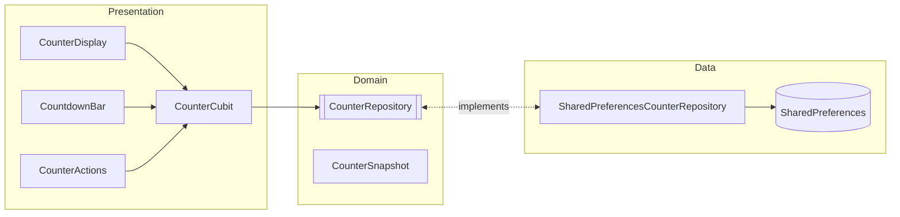
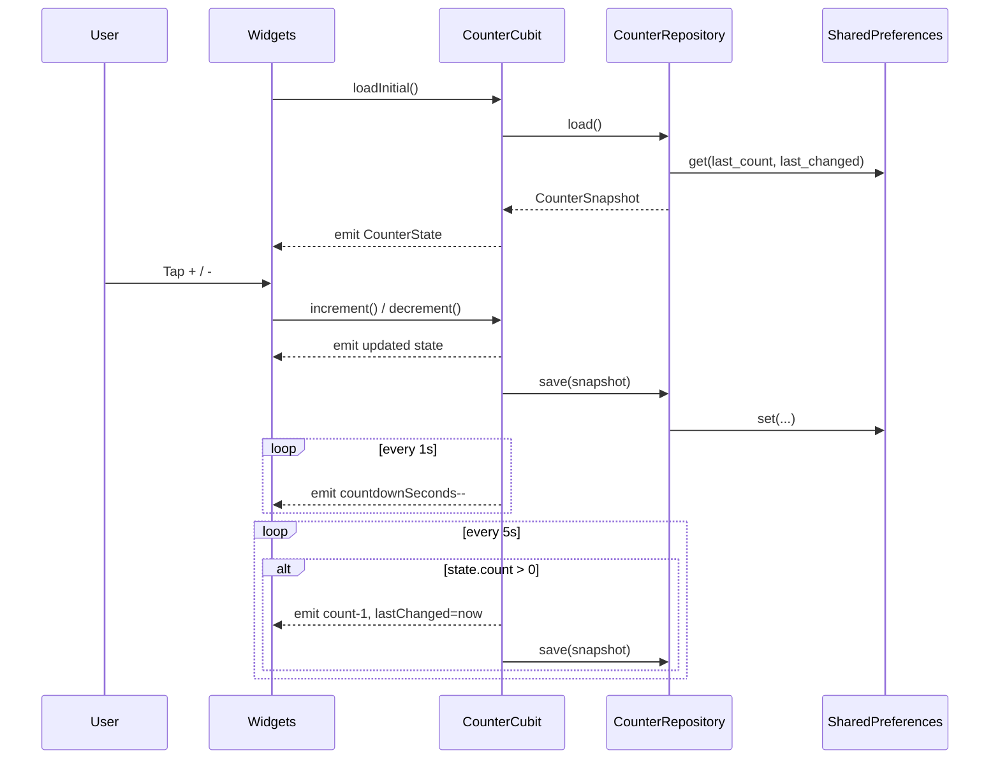
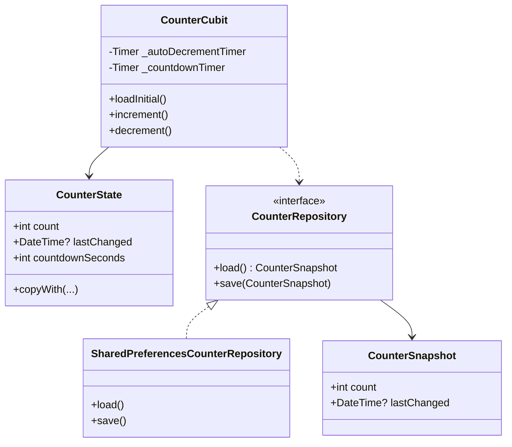
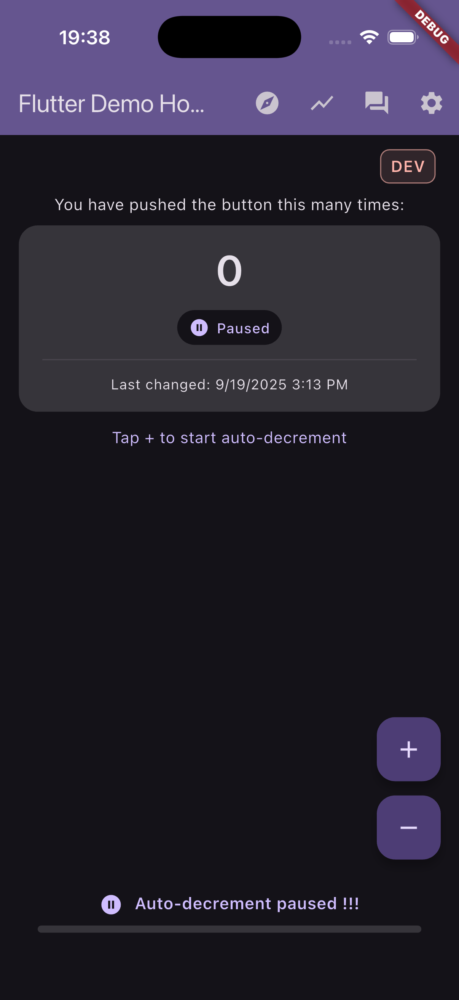
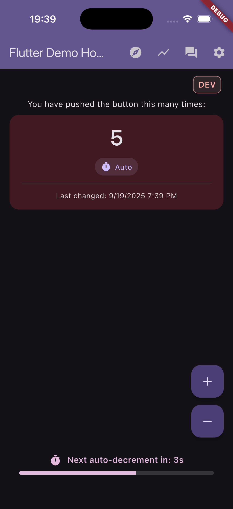
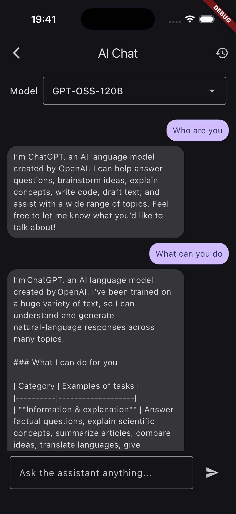
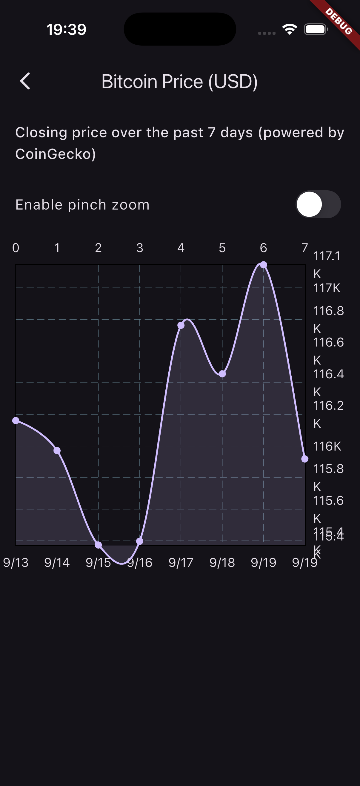
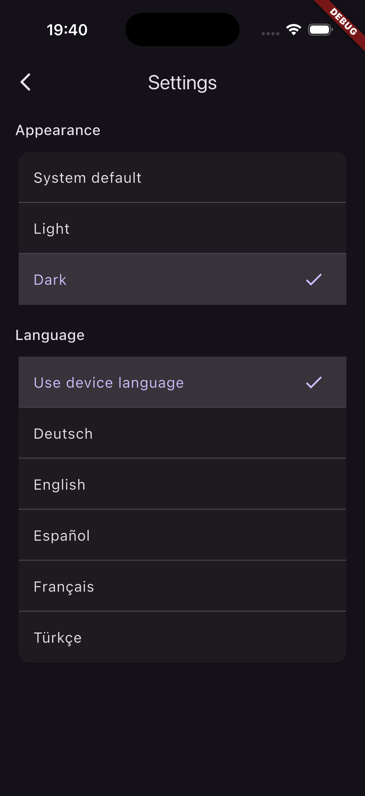

# Flutter BLoC App

Small demo app showcasing BLoC (Cubit) state management, local persistence, a periodic timer, and basic localization in Flutter. The app displays a counter you can increment/decrement, persists the last value, shows when it last changed, and auto-decrements every 5 seconds with a visible countdown.

## Features

- BLoC/Cubit: Simple `CounterCubit` with immutable `CounterState`.
- Responsive UI: Uses `flutter_screenutil` and width-based helpers (see `presentation/responsive.dart`).
- UI constants: Centralized sizing/spacing in `presentation/ui_constants.dart`.
- Accessibility: Semantics on key widgets, overflow guards on narrow screens.
- Persistence: Stores last count and timestamp with `shared_preferences`.
- Auto-decrement: Decreases count every 5 seconds if above zero.
- Countdown UI: Live “next auto-decrement in: Ns” indicator.
- Navigation: `go_router` wiring with sample and chart pages demonstrating navigation patterns.
- Charts: `fl_chart` Bitcoin price line chart backed by CoinGecko's public API (pinch-zoomable with graceful fallback).
- Loading polish: `skeletonizer` placeholders, `fancy_shimmer_image` hero card, and dev-only loading delay to showcase the effects.
- Logging: Centralized `AppLogger` built on top of the `logger` package.
- Localization: `intl` + Flutter localizations (EN, TR, DE, FR, ES).
- AI Chat: Conversational UI backed by Hugging Face Inference API (openai/gpt-oss).
- Tests: Unit and bloc tests with `flutter_test` and `bloc_test`.

## Tech Stack

- Flutter 3 (Dart SDK constraint in `pubspec.yaml`)
- `flutter_bloc` for Cubit/BLoC
- `shared_preferences` for simple storage
- `intl` and `flutter_localizations` for i18n
- `flutter_screenutil` for adaptive sizing (with safe fallbacks in tests)
- `responsive_framework` optional; helpers fall back to MediaQuery breakpoints
- `bloc_test`, `flutter_test` for testing

## Architecture



## Sequence



## Class Diagram



## App Structure

- `lib/main.dart`: App bootstrapping via `runAppWithFlavor` (imports the flavor entrypoint).
- `lib/app.dart`: Root widget wiring `go_router`, theme, DI, and cubits.
- `lib/core/`: Constants, flavor manager, dependency injection configuration, time utilities.
- `lib/features/counter/`: Domain, data, and presentation layers for the counter feature.
- `lib/features/chat/data/huggingface_api_client.dart`: HTTP wrapper that enforces headers, status handling, and JSON parsing for Hugging Face requests.
- `lib/features/chat/data/huggingface_payload_builder.dart`: Central place for building inference vs chat completion payloads.
- `lib/features/chat/data/huggingface_response_parser.dart`: Safely maps Hugging Face responses to `ChatResult` with null-safe chunk handling.
- `lib/features/example/`: Simple routed example page rendered through `go_router`.
- `lib/shared/`: Cross-cutting UI, theme, logging, and utility components.
- `test/counter_cubit_test.dart`: Cubit behavior, timers, persistence tests.
- `test/countdown_bar_test.dart`: Verifies CountdownBar active/paused labels.
- `test/counter_display_chip_test.dart`: Verifies CounterDisplay chip labels.
- `test/error_snackbar_test.dart`: Intentionally throws to exercise SnackBar (skipped by default).
- `test/widget_test.dart`: Basic boot test for the app.

## How It Works

- On launch, `CounterCubit.loadInitial()` restores the last count and timestamp.
- Two timers run inside the cubit:
  - A 5s periodic timer that auto-decrements when `count > 0`.
  - A 1s countdown timer that updates the UI’s remaining seconds.
- Any manual increment/decrement resets the 5s window and persists the state.
- Tap the compass icon in the app bar to navigate to the Example page rendered via `go_router`.

## Getting Started

Prerequisites:

- Flutter SDK installed (matching the Dart SDK constraint in `pubspec.yaml`).

Install dependencies:

```bash
flutter pub get
```

Run the app:

```bash
flutter run
```

Run tests:

```bash
flutter test
```

Regenerate Freezed formatting after large refactors (optional helper):

```bash
dart run fix_freezed_formatting.dart
```

### Secrets & configuration

This repository is public, so runtime secrets are never committed. Before
running the app locally make sure you create the private configuration files
listed below. All of them are git-ignored; keep the generated files out of
version control.

1. **Firebase (required for Crashlytics/Analytics):**
   - Copy `lib/firebase_options.dart.sample` to `lib/firebase_options.dart` and
     keep it untracked (the path is listed in `.gitignore`).
   - Run `flutterfire configure` to populate the copied file with your actual
     Firebase project settings. The sample uses placeholder values; if they
     remain unchanged the app skips Firebase initialization at runtime.
   - Copy the generated platform files next to the provided samples:
     - `android/app/google-services.json.sample`
     - `ios/Runner/GoogleService-Info.plist.sample`
     - `macos/Runner/GoogleService-Info.plist.sample`
   - Do **not** commit the generated files. They stay local only.

2. **Hugging Face token (AI chat):**
   - Copy `assets/config/secrets.sample.json` to `assets/config/secrets.json`
     (already ignored by git) and fill in your token / model details. See below
     for the structure and options.

### Hugging Face token (AI chat)

The chat screen calls a hosted Hugging Face model that requires an access token. Create a free token at [huggingface.co/settings/tokens](https://huggingface.co/settings/tokens) **with the Inference API scope enabled**, then edit your local `assets/config/secrets.json` (created in the previous section) with content similar to:

   ```json
   {
     "HUGGINGFACE_API_KEY": "hf_xxx_your_token",
     "HUGGINGFACE_MODEL": "HuggingFaceH4/zephyr-7b-beta",
     "HUGGINGFACE_USE_CHAT_COMPLETIONS": false
   }
   ```

The app will read the value at startup. Unit tests rely on fakes and do not need the token.

If the model you want to use is only exposed through the Hugging Face router (OpenAI-compatible `/v1/chat/completions` endpoint), set `HUGGINGFACE_USE_CHAT_COMPLETIONS` to `true` and provide the routed model id (for example `openai/gpt-oss-20b`). In the app you can switch between `openai/gpt-oss-20b` and `openai/gpt-oss-120b` using the chat model selector; changing the model resets the conversation to avoid mixing prompts between providers.

Optional useful commands:

```bash
flutter analyze
dart format .
dart run fix_freezed_formatting.dart
```

### Test helpers

- `runWithHuggingFaceHttpClientOverride` scopes a mocked `http.Client`, API key, and model in a temporary GetIt scope so integration tests can stub Hugging Face responses without affecting global DI:

  ```dart
  await runWithHuggingFaceHttpClientOverride(
    client: MockClient(...),
    apiKey: 'test-token',
    model: 'test-model',
    useChatCompletions: false,
    action: () async => getIt<ChatRepository>().sendMessage(...),
  );
  ```

- `dart run fix_freezed_formatting.dart` restores line breaks and mixins in generated Freezed files when the formatter collapses them.

### Flavors

Common flavors are available: dev, staging, and prod.

- Entrypoints:
  - `lib/main_dev.dart`
  - `lib/main_staging.dart`
  - `lib/main_prod.dart`

- Run examples:
  - Dev: `flutter run -t dev`
  - Staging: `flutter run -t staging`
  - Prod: `flutter run -t prod`

- Build examples:
  - Android (prod): `flutter build apk -t prod`
  - iOS (staging): `flutter build ios -t staging`

Programmatic access:

## Dependency Injection (GetIt)

This app uses GetIt for DI. Registrations live in `lib/core/di/injector.dart` and are called from `lib/main_bootstrap.dart`.

Registered services:

- `CounterRepository` → `SharedPreferencesCounterRepository`
- `ThemeRepository` → `SharedPreferencesThemeRepository`
- `TimerService` → `DefaultTimerService`

Initialize in bootstrap:

```dart
// lib/main_bootstrap.dart
await configureDependencies();
runApp(const MyApp());
```

Resolve in composition:

```dart
// lib/app.dart
BlocProvider(
  create: (_) => CounterCubit(
    repository: getIt<CounterRepository>(),
    timerService: getIt(),
    loadDelay:
        FlavorManager.I.isDev ? AppConstants.devSkeletonDelay : Duration.zero,
  )..loadInitial(),
),
```

If tests pump `MyApp` directly, `ensureConfigured()` inside `MyApp.build` makes sure DI is ready.

## Deterministic Time in Tests (TimerService)

Time is abstracted via `TimerService` (`lib/core/time/timer_service.dart`). For tests, use `FakeTimerService` from `test/test_helpers.dart`:

```dart
final fakeTimer = FakeTimerService();
final cubit = CounterCubit(
  repository: MockCounterRepository(),
  timerService: fakeTimer,
);

// Let first microtask emission happen
await Future<void>.delayed(const Duration(milliseconds: 10));

final initial = cubit.state.countdownSeconds;
fakeTimer.tick(2); // advance two ticks deterministically
expect(cubit.state.countdownSeconds, initial - 2);
```

- Use `FlavorManager.I` from `lib/core/flavor.dart` to check the current flavor.
- Default is `dev`. You can override with `--dart-define=FLAVOR=staging|prod`.

UI indicator:

- The current flavor is shown in the app bar as a small badge (DEV/STG). Nothing is shown for PROD.

## Screenshots







## Notes

- Supported locales are declared in `MaterialApp.supportedLocales`.
- Auto-decrement never goes below zero.
- State shape: `count`, `lastChanged` (DateTime?), `countdownSeconds`.

## Localization (Do Not Edit Generated Files)

- All localizable strings live in ARB files under `lib/l10n/` (for example: `app_en.arb`, `app_tr.arb`, etc.).
- The localization classes (such as `app_localizations.dart` and per-locale files) are auto-generated from these ARB files.
- Do not modify any generated `app_localizations*.dart` files manually — changes will be overwritten.
- To add or change a string:
  - Edit the appropriate `lib/l10n/app_XX.arb` file(s).
  - Keep keys consistent across locales and update placeholder metadata as needed.
  - Run `flutter pub get` and then `flutter run` (or `flutter gen-l10n` if configured) to regenerate the localization Dart code.
  - Use the generated APIs in code, for example: `AppLocalizations.of(context).startAutoHint`.

## License

This project is for demonstration purposes. Add an explicit license if you intend to distribute.

Note on skipped test

- The suite `test/error_snackbar_test.dart` is intentionally annotated with `@Skip(...)` and is excluded from the default `flutter test` run because it throws on purpose to exercise the SnackBar error path.
- To run it explicitly:

```bash
flutter test test/error_snackbar_test.dart
```
