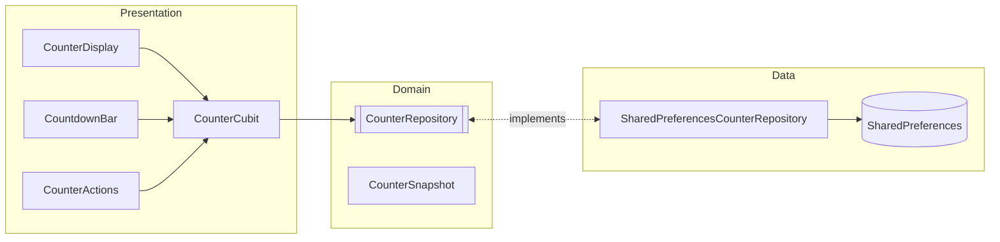
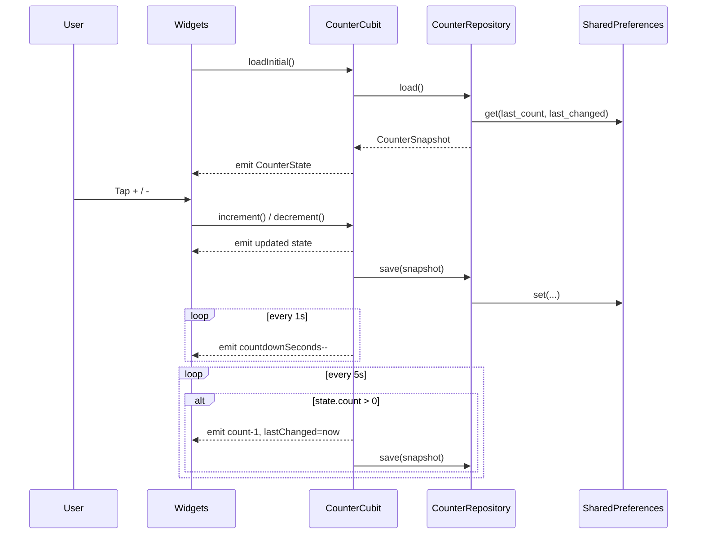
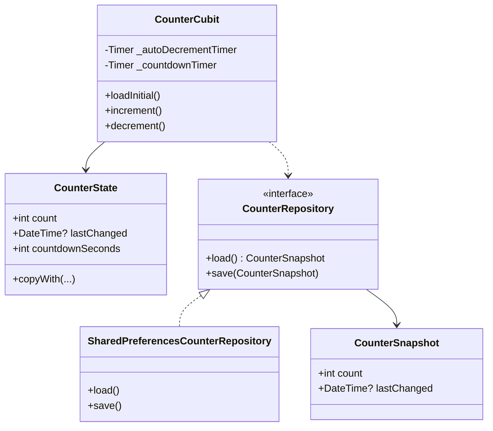

# Flutter BLoC App

Small demo app showcasing BLoC (Cubit) state management, local persistence, a periodic timer, and basic localization in Flutter. The app displays a counter you can increment/decrement, persists the last value, shows when it last changed, and auto-decrements every 5 seconds with a visible countdown.

## Features

- BLoC/Cubit: Simple `CounterCubit` with immutable `CounterState`.
- Responsive UI: Uses `flutter_screenutil` and width-based helpers (see `presentation/responsive.dart`).
- UI constants: Centralized sizing/spacing in `presentation/ui_constants.dart`.
- Accessibility: Semantics on key widgets, overflow guards on narrow screens.
- Persistence: Stores last count and timestamp with `shared_preferences`.
- Auto-decrement: Decreases count every 5 seconds if above zero.
- Countdown UI: Live “next auto-decrement in: Ns” indicator.
- Navigation: `go_router` wiring with sample and chart pages demonstrating navigation patterns.
- Charts: `fl_chart` Bitcoin price line chart backed by CoinGecko's public API (pinch-zoomable with graceful fallback).
- Loading polish: `skeletonizer` placeholders, `fancy_shimmer_image` hero card, and dev-only loading delay to showcase the effects.
- Logging: Centralized `AppLogger` built on top of the `logger` package.
- Localization: `intl` + Flutter localizations (EN, TR, DE, FR, ES).
- AI Chat: Conversational UI backed by Hugging Face Inference API (openai/gpt-oss).
- Native integration: MethodChannel (`com.example.flutter_bloc_app/native`) returning sanitized device metadata with Kotlin/Swift handlers.
- Secrets: `SecretConfig` bootstraps Hugging Face credentials; in release builds values are persisted in platform secure storage (`flutter_secure_storage`).
- Tests: Unit, bloc, widget, and golden coverage (`flutter_test`, `bloc_test`, `golden_toolkit`).

## Tech Stack

- Flutter 3 (Dart SDK constraint in `pubspec.yaml`)
- `flutter_bloc` for Cubit/BLoC
- `shared_preferences` for simple storage
- `intl` and `flutter_localizations` for i18n
- `flutter_screenutil` for adaptive sizing (with safe fallbacks in tests)
- `responsive_framework` optional; helpers fall back to MediaQuery breakpoints
- `go_router` for declarative navigation
- `flutter_secure_storage` for keychain/keystore persistence
- `bloc_test`, `flutter_test`, `golden_toolkit` for testing

## Security & Secrets

- NEVER commit `assets/config/secrets.json`. The repo ships only `assets/config/secrets.sample.json`; copy it locally and provide runtime secrets via environment variables or secure storage.
- When `SecretConfig.load()` executes in release mode, Hugging Face credentials are cached into the OS keychain/keystore via `flutter_secure_storage` to avoid leaving secrets in asset bundles. Debug/tests continue to rely on the asset for convenience.
- Rotate any leaked tokens immediately (e.g. Hugging Face Inference API key) and prefer short-lived or server-issued credentials for production.
- Keep to least-privilege MethodChannel usage. `com.example.flutter_bloc_app/native` currently exposes only `getPlatformInfo` (no arguments). Validate future methods thoroughly and avoid returning sensitive data.
- For production distribution, supply credentials from environment variables (e.g. CI-injected `--dart-define`s) or fetch them securely at runtime (remote config/services protected with TLS and optional certificate pinning) instead of bundling assets.

## Architecture



## Sequence



## Class Diagram



## App Structure

- `lib/main.dart`: App bootstrapping via `runAppWithFlavor` (imports the flavor entrypoint).
- `lib/app.dart`: Root widget wiring `go_router`, theme, DI, and cubits.
- `lib/core/`: Constants, flavor manager, dependency injection configuration, time utilities.
- `lib/features/counter/`: Domain, data, and presentation layers for the counter feature.
- `lib/features/chat/data/huggingface_api_client.dart`: HTTP wrapper that enforces headers, status handling, and JSON parsing for Hugging Face requests.
- `lib/features/chat/data/huggingface_payload_builder.dart`: Central place for building inference vs chat completion payloads.
- `lib/features/chat/data/huggingface_response_parser.dart`: Safely maps Hugging Face responses to `ChatResult` with null-safe chunk handling.
- `lib/features/example/`: Simple routed example page rendered through `go_router` and showcasing native MethodChannel integration.
- `lib/shared/`: Cross-cutting UI, theme, logging, secure storage, and utility components.
- `test/counter_cubit_test.dart`: Cubit behavior, timers, persistence tests.
- `test/countdown_bar_test.dart`: Verifies CountdownBar active/paused labels.
- `test/counter_display_chip_test.dart`: Verifies CounterDisplay chip labels.
- `test/error_snackbar_test.dart`: Intentionally throws to exercise SnackBar (skipped by default).
- `test/native_platform_service_test.dart`: Validates MethodChannel responses.
- `test/secure_secret_storage_test.dart`: Covers secure storage wrappers.
- `test/widget_test.dart`: Basic boot test for the app.

## How It Works

- On launch, `CounterCubit.loadInitial()` restores the last count and timestamp.
- Two timers run inside the cubit:
  - A 5s periodic timer that auto-decrements when `count > 0`.
  - A 1s countdown timer that updates the UI’s remaining seconds.
- Any manual increment/decrement resets the 5s window and persists the state.
- Tap the compass icon in the app bar to navigate to the Example page rendered via `go_router`.

## Getting Started

```bash
flutter pub get
flutter pub run build_runner build --delete-conflicting-outputs
flutter test
flutter run
```

### Secrets setup

```bash
cp assets/config/secrets.sample.json assets/config/secrets.json
```

Edit the JSON with your Hugging Face token/model. The file is ignored by git. In release builds the app persists the values into secure storage, so you can ship builds without embedding long-lived secrets.

### Firebase

Copy your Firebase config files from the provided `*.sample` files. Placeholder keys are detected and skip Firebase initialization gracefully.

## Native Integration

The `ExamplePage` includes a “Fetch native info” button that uses a MethodChannel to retrieve basic device metadata from Kotlin/Swift implementations. The channel is deliberately narrow (no arguments, low risk) but demonstrates the wiring for richer features.

## Testing

- `flutter test` runs unit, widget, and golden tests.
- `flutter test test/fab_alignment_golden_test.dart` runs FAB alignment goldens.
- `flutter test test/counter_page_golden_test.dart` runs counter page goldens.

Golden baselines live in `test/goldens/`.

## Linting

```bash
flutter analyze
```

The project follows Flutter lints (`analysis_options.yaml`).

## Contributing

Contributions are welcome—open an issue or PR with your proposed change. Make sure to include tests and documentation updates.
