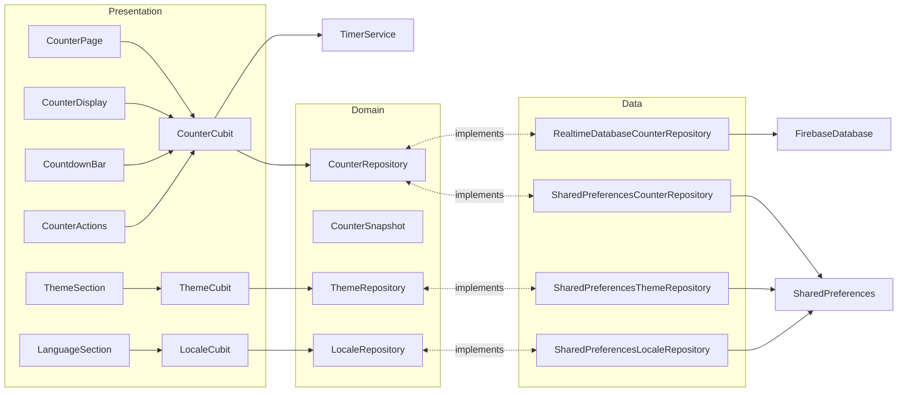
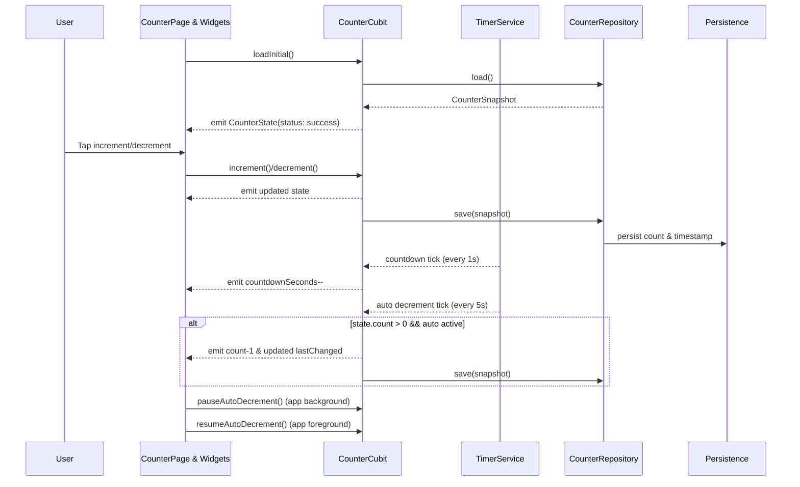
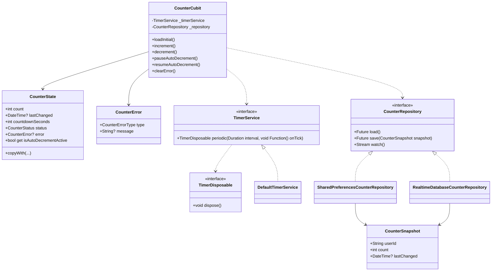

# Flutter BLoC App

Small demo app showcasing BLoC (Cubit) state management, local persistence, a periodic timer, and basic localization in Flutter. The app displays a counter you can increment/decrement, persists the last value, shows when it last changed, and auto-decrements every 5 seconds with a visible countdown.

## Features

- BLoC/Cubit: Simple `CounterCubit` with immutable `CounterState`.
- Responsive UI: Uses `flutter_screenutil` and width-based helpers (see `presentation/responsive.dart`).
- UI constants: Centralized sizing/spacing in `presentation/ui_constants.dart`.
- Accessibility: Semantics on key widgets, overflow guards on narrow screens.
- Persistence: Stores last count and timestamp with `shared_preferences`.
- Auto-decrement: Decreases count every 5 seconds if above zero.
- Countdown UI: Live “next auto-decrement in: Ns” indicator.
- Navigation: `go_router` wiring with sample and chart pages demonstrating navigation patterns.
- Charts: `fl_chart` Bitcoin price line chart backed by CoinGecko's public API (pinch-zoomable with graceful fallback).
- GraphQL demo: Countries browser backed by the free `countries.trevorblades.com` GraphQL API, complete with continent filtering and localized labels.
- Loading polish: `skeletonizer` placeholders, `fancy_shimmer_image` hero card, and dev-only loading delay to showcase the effects.
- Logging: Centralized `AppLogger` built on top of the `logger` package.
- Localization: `intl` + Flutter localizations (EN, TR, DE, FR, ES).
- Authentication: Firebase Auth with FirebaseUI (email/password, Google) plus anonymous “guest” sessions that can be upgraded in-place.
- AI Chat: Conversational UI backed by Hugging Face Inference API (openai/gpt-oss).
- Native integration: MethodChannel (`com.example.flutter_bloc_app/native`) returning sanitized device metadata with Kotlin/Swift handlers.
- Secrets: `SecretConfig` reads from secure storage first, falls back to the dev-only
  `assets/config/secrets.json`, and finally to `--dart-define` values. Release
  builds skip the asset and persist any provided values into platform secure
  storage (`flutter_secure_storage`).
- Tests: Unit, bloc, widget, and golden coverage (`flutter_test`, `bloc_test`, `golden_toolkit`), including auth flows with Firebase mocks.
- Agent-friendly guide: See `AGENTS.md` for the quick checklist (format → analyze → test → build_runner) and architecture guardrails.

## Screenshots

| Counter Home | Auto Countdown | Settings |
| --- | --- | --- |
|  |  |  |

| Charts | GraphQL | AI Chat |
| --- | --- | --- |
|  |  |  |

## Test Coverage

- Latest line coverage: **88.19%** (generated files excluded; see `coverage/coverage_summary.md` for the per-file breakdown).

## Tech Stack

- Flutter 3.35.5 (Dart 3.9.2)
- `flutter_bloc` for Cubit/BLoC
- `shared_preferences` for simple storage
- `intl` and `flutter_localizations` for i18n
- `flutter_screenutil` for adaptive sizing (with safe fallbacks in tests)
- `responsive_framework` optional; helpers fall back to MediaQuery breakpoints
- `go_router` for declarative navigation
- `flutter_secure_storage` for keychain/keystore persistence
- `bloc_test`, `flutter_test`, `golden_toolkit` for testing

## Security & Secrets

- NEVER commit `assets/config/secrets.json`. The repo ships only `assets/config/secrets.sample.json`; copy it locally and provide runtime secrets via environment variables or secure storage.
- When `SecretConfig.load()` executes in release mode, Hugging Face credentials are cached into the OS keychain/keystore via `flutter_secure_storage` to avoid leaving secrets in asset bundles. Debug/tests continue to rely on the asset for convenience.
- Rotate any leaked tokens immediately (e.g. Hugging Face Inference API key) and prefer short-lived or server-issued credentials for production.
- Keep to least-privilege MethodChannel usage. `com.example.flutter_bloc_app/native` currently exposes only `getPlatformInfo` (no arguments). Validate future methods thoroughly and avoid returning sensitive data.
- For production distribution, supply credentials from environment variables (e.g. CI-injected `--dart-define`s) or fetch them securely at runtime (remote config/services protected with TLS and optional certificate pinning) instead of bundling assets.

## Architecture



## Sequence



## Class Diagram



## App Structure

- `lib/main.dart`: App bootstrapping via `runAppWithFlavor` (imports the flavor entrypoint).
- `lib/app.dart`: Root widget wiring `go_router`, ScreenUtil init, DI, and global cubits (`CounterCubit`, `LocaleCubit`, `ThemeCubit`).
- `lib/core/`: Cross-layer foundations (constants, flavor manager, dependency injection, router helpers, timer utilities).
- `lib/features/counter/`: Counter feature split into `domain/`, `data/`, and `presentation/` (pages, cubit, and widgets under `presentation/widgets/`).
- `lib/features/chat/`: Conversational AI feature (Hugging Face API client, payload builder, repositories, cubit, presentation widgets).
- `lib/features/graphql_demo/`: Countries GraphQL browser with repository, cubit, presentation pages, and widgets.
- `lib/features/settings/`: Theme & locale repositories, cubits, and UI sections used by the settings page.
- `lib/features/example/`: Example page showcasing native MethodChannel integration.
- `lib/shared/`: Reusable UI primitives, logging, platform services, localization helpers, and shared utilities.
- `test/`: Unit, bloc, widget, golden, and platform tests (see file names for focused coverage like `counter_*`, `settings_*`, `graphql_demo_*`).
- `test/counter_cubit_test.dart`: Cubit behavior, timers, persistence tests.
- `test/countdown_bar_test.dart`: Verifies CountdownBar active/paused labels.
- `test/counter_display_chip_test.dart`: Verifies CounterDisplay chip labels.
- `test/error_snackbar_test.dart`: Intentionally throws to exercise SnackBar (skipped by default).
- `test/graphql_demo/data/countries_graphql_repository_test.dart`: Covers GraphQL repository parsing, error handling, and filtering.
- `test/graphql_demo/presentation/graphql_demo_cubit_test.dart`: Validates continent filtering logic and error surfacing in the GraphQL cubit.
- `test/native_platform_service_test.dart`: Validates MethodChannel responses.
- `test/secure_secret_storage_test.dart`: Covers secure storage wrappers.
- `test/sign_in_page_test.dart`: Exercises anonymous sign-in, auth error handling, and error message mapping with `MockFirebaseAuth`.
- `test/widget_test.dart`: Basic boot test for the app.

## How It Works

- On launch, `CounterCubit.loadInitial()` restores the last count and timestamp.
- Two timers run inside the cubit:
  - A 5s periodic timer that auto-decrements when `count > 0`.
  - A 1s countdown timer that updates the UI’s remaining seconds.
- Any manual increment/decrement resets the 5s window and persists the state.
- Tap the compass icon in the app bar to navigate to the Example page rendered via `go_router`.

## Getting Started

```bash
flutter pub get
dart run build_runner build --delete-conflicting-outputs
flutter test
flutter run
```

### Secrets setup

For local development, copy `assets/config/secrets.sample.json` to
`assets/config/secrets.json` and fill in your Hugging Face credentials. The file
is git-ignored and only loaded on non-release builds.

```bash
cp assets/config/secrets.sample.json assets/config/secrets.json
```

Production (and CI) builds should inject credentials via secure storage or
`--dart-define` values. On first launch with the flags present, the app persists
them into the platform keychain/keystore so future runs can omit the flags.

```bash
flutter run \
  --dart-define=HUGGINGFACE_API_KEY=hf_xxx \
  --dart-define=HUGGINGFACE_MODEL=openai/gpt-oss-20b \
  --dart-define=HUGGINGFACE_USE_CHAT_COMPLETIONS=true
```

Before packaging a release, run the helper script to scrub any local
`secrets.json` file so no live credentials end up in the bundle:

```bash
dart run tool/prepare_release.dart
flutter build apk --release
```

For integration tests or custom tooling, inject a storage implementation before
calling `SecretConfig.load()`:

```dart
SecretConfig.configureStorage(
  InMemorySecretStorage()
    ..write('huggingface_api_key', 'hf_dev_token')
    ..write('huggingface_model', 'openai/gpt-oss-20b')
    ..write('huggingface_use_chat_completions', 'true'),
);
await SecretConfig.load();
```

### Firebase

Copy your Firebase config files from the provided `*.sample` files. Placeholder keys are detected and skip Firebase initialization gracefully.

## Native Integration

The `ExamplePage` includes a “Fetch native info” button that uses a MethodChannel to retrieve basic device metadata from Kotlin/Swift implementations. The channel is deliberately narrow (no arguments, low risk) but demonstrates the wiring for richer features.

## Testing

- `flutter test` runs unit, widget, and golden tests.
- `flutter test test/fab_alignment_golden_test.dart` runs FAB alignment goldens.
- `flutter test test/counter_page_golden_test.dart` runs counter page goldens.
- `flutter test coverage` to generate `lcov.info` file used to generate `coverage_summary.md` file

Golden baselines live in `test/goldens/`.

## Deployment (Fastlane)

This project includes minimal Fastlane setups for both Android and iOS to help
automate store uploads.

1. Install dependencies:

   ```bash
   bundle install
   ```

2. Export the required credentials as environment variables. At minimum:
   - Android: `ANDROID_JSON_KEY` (path to JSON service-account key) and, if you
     use tracks other than `internal`, set `ANDROID_PLAY_TRACK`.
   - iOS: `APPLE_ID`, `APPLE_TEAM_ID`, `APPLE_ITC_TEAM_ID`, plus the usual
     App-Store Connect API/keychain setup.
3. Scrub secrets and build/upload in one step:

   ```bash
   bundle exec fastlane android deploy track:internal
   bundle exec fastlane ios deploy
   ```

The Android lane wraps `flutter build appbundle` and pushes to Google Play via
`upload_to_play_store`. The iOS lane runs `flutter build ipa` and uses
`deliver`. Adjust flavors/targets with the optional `flavor` parameter or the
environment variables described in `android/fastlane/Fastfile` and
`ios/fastlane/Fastfile`.

## Linting

```bash
flutter analyze
```

The project follows Flutter lints (`analysis_options.yaml`).

## Contributing

Contributions are welcome—open an issue or PR with your proposed change. Make sure to include tests and documentation updates.

## Tooling

- `flutter test coverage` to regenerate `coverage/lcov.info` file used to generate `coverage_summary.md` file
- `dart run tool/update_coverage_summary.dart` – regenerate `coverage/coverage_summary.md` from `coverage/lcov.info`, excluding generated and localization files.
