# Flutter BLoC App

Production-style Flutter reference app for a mobile engineering portfolio:
feature-based Clean Architecture, offline-first sync, Cubit/BLoC, GoRouter,
CI-backed validation, and a broad set of integration demos. The repo is
intentionally proof-oriented: claims in the README link to source, docs, or
commands instead of relying on generic architecture statements.

## Platform and toolchain

[](https://flutter.dev)
[](https://dart.dev)
[](docs/deployment.md)
[](https://pub.dev/packages/very_good_analysis)
[](docs/CODE_QUALITY.md)
[](LICENSE)
[](https://github.com/invertase/melos)
[](https://play.google.com/store/apps/details?id=com.ilkersevim.blocflutter)
[](https://redjadet.github.io/flutter_bloc_app/)

## CI, quality, and supply chain

[](https://github.com/redjadet/flutter_bloc_app/actions/workflows/ci.yml)
[](https://github.com/redjadet/flutter_bloc_app/actions/workflows/deploy_web.yml)
[](https://github.com/redjadet/flutter_bloc_app/actions/workflows/dependency-review.yml)
[](https://github.com/redjadet/flutter_bloc_app/actions/workflows/dependency-updates.yml)
[](https://github.com/redjadet/flutter_bloc_app/actions/workflows/drift.yml)
[](https://github.com/redjadet/flutter_bloc_app/actions/workflows/osv-scanner-pr.yml)
[](https://github.com/redjadet/flutter_bloc_app/actions/workflows/codeql.yml)
[](docs/CODE_QUALITY.md)
[](docs/validation_scripts.md)
[](docs/modularity.md)
[](docs/CODE_QUALITY.md)

## Architecture and app stack

[](docs/clean_architecture.md)
[](docs/adr/README.md)
[](docs/offline_first/adoption_guide.md)
[](https://pub.dev/packages/flutter_bloc)
[](https://pub.dev/packages/go_router)
[](https://pub.dev/packages/get_it)
[](docs/offline_first/hive_schema_migrations.md)
[](docs/plans/dio_retrofit_integration_plan.md)
[](docs/architecture/freezed_usage_analysis.md)
[](docs/design_system.md)
[](docs/testing_overview.md)
[](docs/engineering/localization.md)
[](docs/engineering/localization.md)

## Integrations and platform services

[](docs/integrations/firebase_setup.md)
[](supabase/README.md)
[](docs/integrations/render_fastapi_chat_demo.md)
[](docs/offline_first/graphql_demo.md)
[](docs/integrations/ai_integration.md)
[](docs/universal_links/README.md)
[](docs/observability.md)
[](docs/security_and_secrets.md)

## Engineering practices

[](AGENTS.md)
[](docs/engineering/engineering_quality_scorecard.md)
[](docs/ai/harness_scorecard.md)
[](docs/reliability_error_handling_performance.md)
[](docs/engineering/REPOSITORY_LIFECYCLE.md)

Harness = agent tooling wiring. Engineering = app/portfolio proof. Do not conflate.

## Live app

- [Google Play Store](https://play.google.com/store/apps/details?id=com.ilkersevim.blocflutter)
- [Latest web build](https://redjadet.github.io/flutter_bloc_app/)

## Native Android and iOS engineering

The native showcase is a runnable feature, not a platform-API claim. It keeps
Flutter-facing contracts behind Clean Architecture ports while exercising
Android and iOS implementation details directly.

| Area | Android evidence | iOS evidence | Flutter boundary |
| --- | --- | --- | --- |
| Host-language calls | [Kotlin `MethodChannel`](apps/mobile/android/app/src/main/kotlin/com/ilkersevim/blocflutter/MainActivity.kt) | [Swift `MethodChannel`](apps/mobile/ios/Runner/AppDelegate.swift) | [host-language service](apps/mobile/lib/features/native_platform_showcase/data/method_channel_native_showcase_host_language_service.dart) |
| High-rate native telemetry | [HandlerThread aggregation and cancellation](apps/mobile/android/app/src/main/kotlin/com/ilkersevim/blocflutter/NativeShowcaseTelemetryStreamHandler.kt) | [DispatchQueue timers and cancellation](apps/mobile/ios/Runner/NativeShowcaseTelemetryStreamHandler.swift) | [bounded `EventChannel` adapter](apps/mobile/lib/features/native_platform_showcase/data/event_channel_native_showcase_telemetry_service.dart) |
| C/C++ interop | [CMake native library wiring](apps/mobile/android/app/src/main/cpp/CMakeLists.txt) | [exported Swift FFI symbols](apps/mobile/ios/Runner/NativeShowcaseBridge.swift) | [FFI adapter](apps/mobile/lib/features/native_platform_showcase/data/ffi_native_showcase_native_code_service.dart) |
| Native UI and system actions | [Android platform-view factory](apps/mobile/android/app/src/main/kotlin/com/ilkersevim/blocflutter/NativeShowcaseBannerPlatformView.kt) | [UIKit platform view, haptic, and share sheet](apps/mobile/ios/Runner/NativeShowcaseBannerPlatformView.swift) | [showcase feature](apps/mobile/lib/features/native_platform_showcase/) |

The telemetry example samples at 60 Hz, aggregates off the UI thread, emits at
4 Hz, and tears down native work when Flutter cancels the stream. Focused
contract, Cubit, and widget coverage lives in
[`apps/mobile/test/features/native_platform_showcase/`](apps/mobile/test/features/native_platform_showcase/).

```bash
cd apps/mobile
flutter test test/features/native_platform_showcase
flutter build apk --debug --no-pub
flutter build ios --simulator --debug --no-pub
```

## Why this repo differs

Most Flutter repositories document the app. This one also documents how an AI
agent should safely change it. Agents can locate feature ownership, architecture
boundaries, conventions, and proof commands with minimal task-specific guidance.
The workflow stays model-agnostic: Codex, Cursor, Claude Code, Gemini, other AI models (including self-hostable open-weight models), and human contributors can use the same repository-owned files, commands, tools, and scripts.

| Need | Repository mechanism |
| --- | --- |
| Fast, canonical orientation | [`AGENTS.md`](AGENTS.md), [context ladder](docs/ai/context_loading.md), [`CODEMAP.md`](CODEMAP.md), and [feature catalog](docs/feature_overview.md) |
| Right tool and validation lane | `./bin/agent-maintain preflight`, `./bin/agent-maintain tools --intent "<goal>" --paths <files>`, and [`docs/agents_quick_reference.md`](docs/agents_quick_reference.md) |
| Compact repository context | [Repomix profiles](docs/ai/repomix_profiles.md) via `bash tool/repomix_pack.sh onboarding` or `feature <name>` |
| Current AI discovery maps | `bash tool/refresh_ai_reports.sh` plus `bash tool/check_ai_snapshot_freshness.sh` |
| Safe incremental delivery | task trackers, `bash tool/check_ai_change_contract.sh`, focused checks, then `./bin/agent-maintain closeout` |

Start an agent task with [`AGENTS.md`](AGENTS.md). Use Dart MCP when available
for live analysis and runtime inspection; repository scripts remain the
deterministic fallback and CI contract.

## Quick start

```bash
bash tool/workspace_pub_get.sh
dart run melos bootstrap
cd apps/mobile && flutter run -t lib/main_dev.dart
```

With `.envrc` / `tool/direnv/bin` first in `PATH`, `flutter run` also works
from the repo root and is routed to `apps/mobile`.

Agent-oriented bootstrap and validation: [docs/quick_start.md](docs/quick_start.md). Full setup, flavors, and credentials: [docs/new_developer_guide.md](docs/new_developer_guide.md).

## Portfolio reading path

For a fast technical review, read these first:

1. [Interview showcase](docs/interview_showcase.md) — 30-minute walkthrough with
   honest shipped-vs-planned boundaries.
2. [System design showcase](docs/features/system_design_showcase.md) — architecture,
   operations, security, and proof paths.
3. [Architecture](docs/architecture.md) and [Modularity](docs/modularity.md) —
   boundary rules and enforcement scripts.
4. [Testing overview](docs/testing_overview.md) and
   [Validation scripts](docs/validation_scripts.md) — how changes are verified.

## Documentation

| Topic | Doc |
| --- | --- |
| Index | [docs/README.md](docs/README.md) |
| Entry hubs | [docs/architecture.md](docs/architecture.md), [docs/testing.md](docs/testing.md), [docs/engineering-decisions.md](docs/engineering-decisions.md), [docs/ai-workflow.md](docs/ai-workflow.md) |
| Quick start (agents) | [docs/quick_start.md](docs/quick_start.md) |
| Features | [docs/feature_overview.md](docs/feature_overview.md) |
| Architecture | [docs/architecture.md](docs/architecture.md) → [docs/clean_architecture.md](docs/clean_architecture.md), [docs/architecture_details.md](docs/architecture_details.md) |
| Plugin failures & storage | [docs/engineering/plugin_failure_mode_strategy.md](docs/engineering/plugin_failure_mode_strategy.md), [docs/security/storage_rules.md](docs/security/storage_rules.md) |
| ADRs | [docs/adr/README.md](docs/adr/README.md) |
| Design | [DESIGN.md](DESIGN.md), [docs/design_system.md](docs/design_system.md) |
| Validation | [docs/validation_scripts.md](docs/validation_scripts.md), [docs/testing_overview.md](docs/testing_overview.md) |
| Offline-first | [docs/offline_first/adoption_guide.md](docs/offline_first/adoption_guide.md) |
| Security | [docs/SECURITY.md](docs/SECURITY.md), [docs/security_and_secrets.md](docs/security_and_secrets.md) |
| Deploy / lifecycle | [docs/deployment.md](docs/deployment.md), [docs/engineering/REPOSITORY_LIFECYCLE.md](docs/engineering/REPOSITORY_LIFECYCLE.md) |
| Interview walk (~30 min) | [docs/interview_showcase.md](docs/interview_showcase.md) |
| AI agents | [AGENTS.md](AGENTS.md) → [docs/agent_knowledge_base.md](docs/agent_knowledge_base.md) |

## Scope

This file is the repo entrypoint only. Behavior, commands, and deep dives live in [docs/README.md](docs/README.md).

## Screenshots

<!-- markdownlint-disable MD033 -->

### Core app

| Counter | Countdown | Settings |
| --- | --- | --- |
|  | 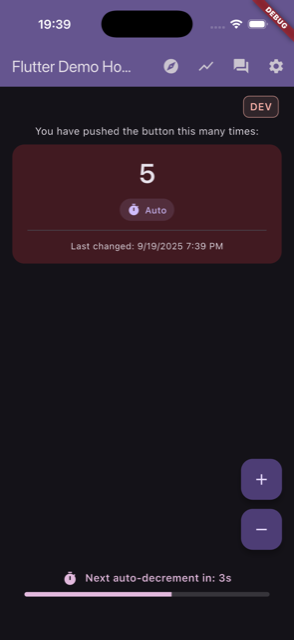 |  |

### Data, sync, and feature flows

| Profile | Profile 2 | IoT demo |
| --- | --- | --- |
|  | 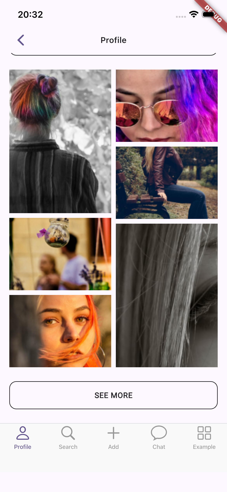 | 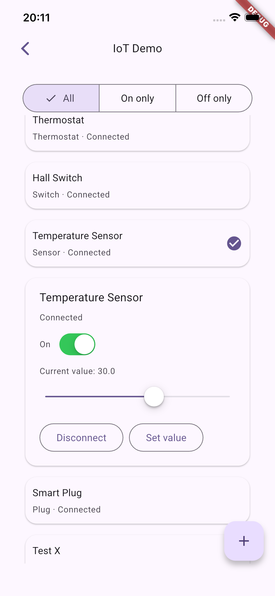 |

| IoT demo 2 | Todo list | Swipe actions |
| --- | --- | --- |
|  | 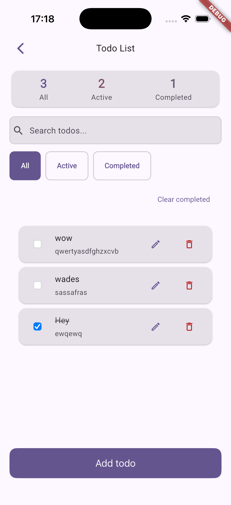 |  |

| Search | Charts | GraphQL |
| --- | --- | --- |
| 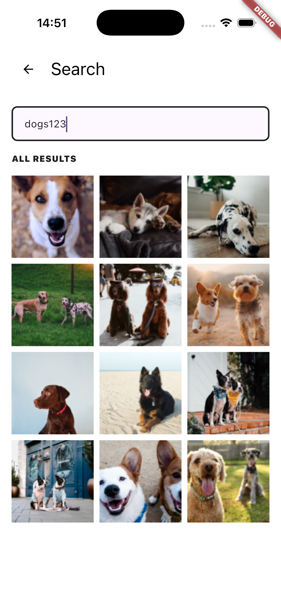 |  | 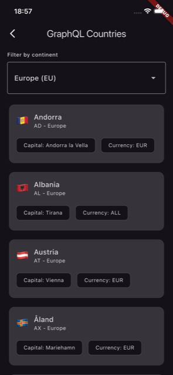 |

### Integrations and demos

| AI chat | Apple Maps | Google Maps |
| --- | --- | --- |
| 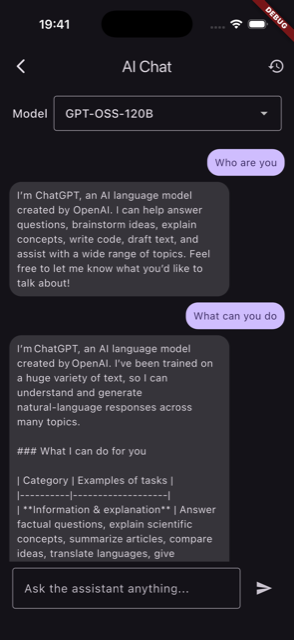 |  | 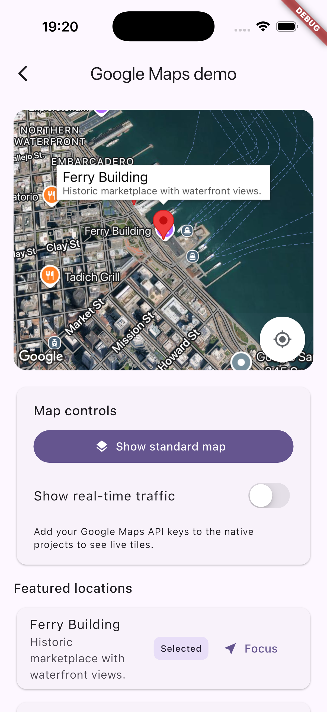 |

| GenUI | Calculator | Summary |
| --- | --- | --- |
| 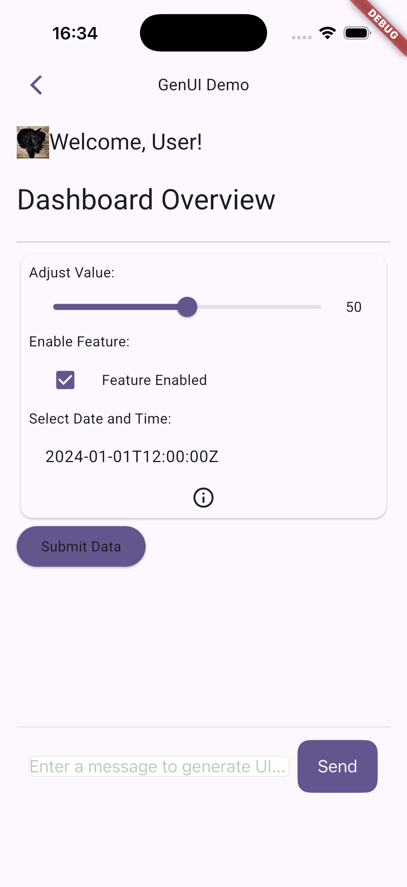 |  |  |

| Register | In-app purchase | Whiteboard colors |
| --- | --- | --- |
|  |  | 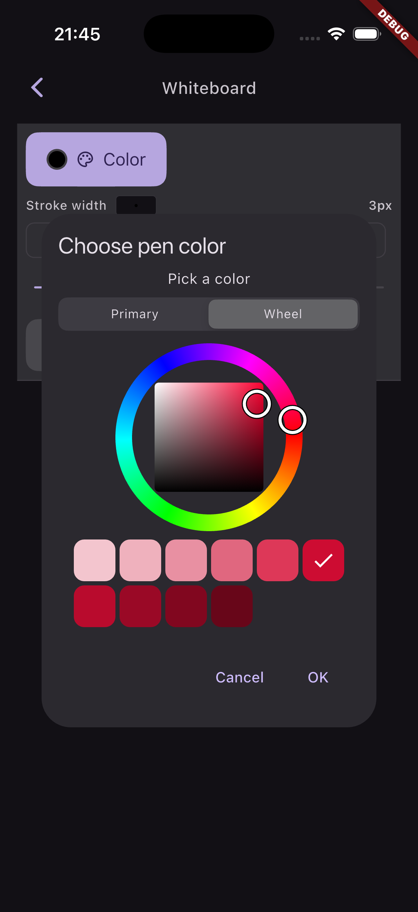 |

| Whiteboard | Markdown | Camera and gallery |
| --- | --- | --- |
|  |  | 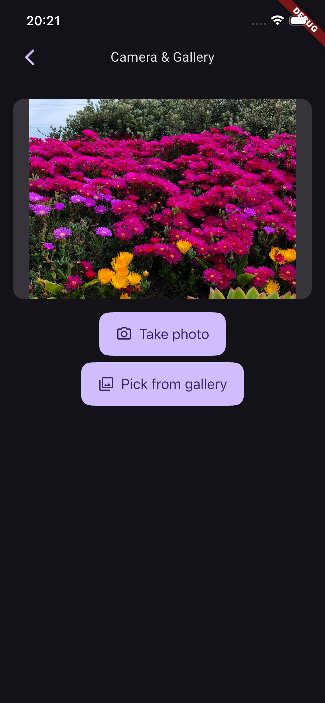 |

| Example | Library demo | Library demo 2 |
| --- | --- | --- |
|  | 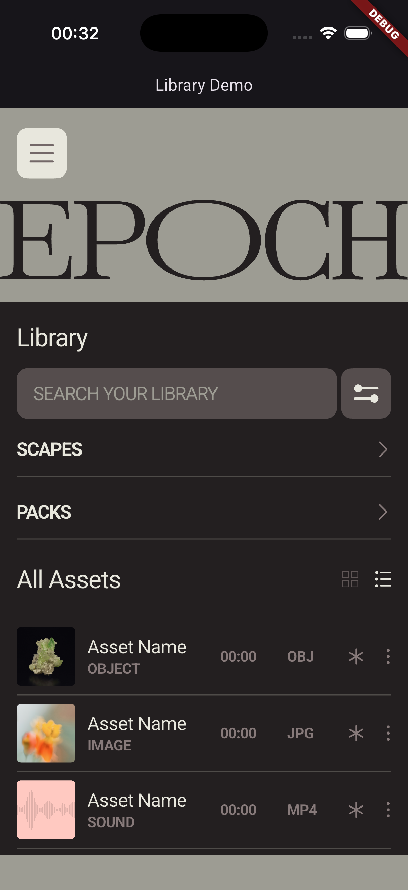 | 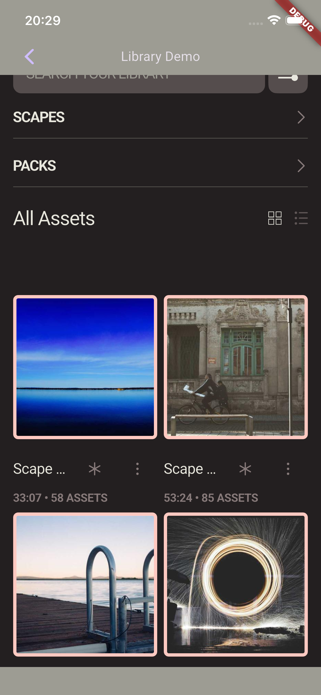 |

| Learn | Chat list | iGaming |
| --- | --- | --- |
|  |  |  |

| Scapes |
| --- |
| 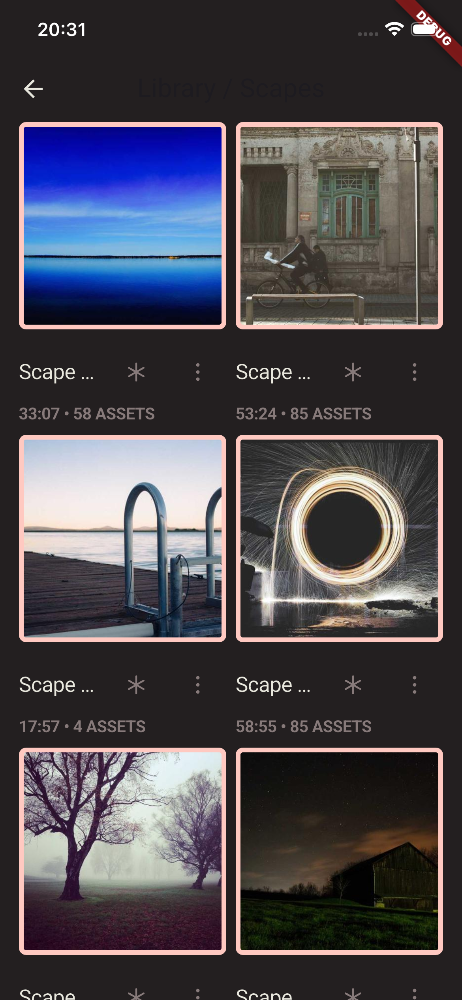 |

<!-- markdownlint-enable MD033 -->
