# Flutter BLoC App

A feature-rich Flutter reference application that demonstrates clean
architecture, disciplined BLoC/Cubit state management, offline-first patterns,
and production-minded delivery workflows in a single codebase.

[](https://flutter.dev)
[](https://dart.dev)
[](https://pub.dev/packages/very_good_analysis)
[](coverage/coverage_summary.md)
[](LICENSE)
[](docs/clean_architecture.md)
[](https://pub.dev/packages/flutter_bloc)
[](https://pub.dev/packages/go_router)
[](https://pub.dev/packages/get_it)
[](docs/testing_overview.md)
[](https://firebase.google.com/)
[](https://supabase.com/)
[](docs/offline_first/adoption_guide.md)
[](https://m3.material.io/)
[](https://api.flutter.dev/flutter/cupertino/cupertino-library.html)
[](docs/compile_time_safety.md)
[](docs/dry_principles.md)
[](docs/separation_of_concerns.md)
[](docs/solid_principles.md)

## Overview

This repository is designed as an engineering reference app, not a narrow demo.
It combines multiple product surfaces and integrations so architecture,
validation, and developer workflow can be evaluated under realistic scope.

The README stays intentionally high level. Setup detail, architecture rationale,
feature-level behavior, and operational guidance live in `docs/` and are linked
throughout this page.

## What This Codebase Covers

- Clean Architecture with a `Presentation -> Domain <- Data` feature structure
- BLoC/Cubit state management with `flutter_bloc`
- Dependency injection via `get_it`
- `GoRouter`-based navigation and multiple app entrypoints
- Firebase-backed core integrations with optional Supabase-backed features
- Offline-first repositories, pending sync, and background reconciliation
- Automated validation, coverage tracking, and CI-backed delivery checks

## Quick Start

### Android (Google Play)

You can install the published Android build from the Google Play Store:

[flutter_bloc_app on Google Play](https://play.google.com/store/apps/details?id=com.ilkersevim.blocflutter)

### Prerequisites

- Flutter `3.41.6`
- Dart `3.11.4`
- Platform tooling for the target you intend to run

Before local setup, review the environment and secrets guides:

- [New Developer Guide](docs/new_developer_guide.md)
- [Firebase Setup](docs/firebase_setup.md)
- [Security Policy](docs/SECURITY.md)
- [Security and Secrets](docs/security_and_secrets.md)

### Run Locally

```bash
flutter pub get
flutter run -t lib/main_dev.dart
```

Secrets for optional backends (Supabase, Hugging Face, Gemini, etc.) are supplied via `--dart-define` or persisted secure storage; see [Security and Secrets](docs/security_and_secrets.md). For day-to-day terminal use, **`direnv`** plus a repo-local `.envrc` (see [`docs/envrc.example`](docs/envrc.example)) can inject those defines automatically so you do not have to paste flags on every `flutter run`.

Available app entrypoints:

- `lib/main_dev.dart`
- `lib/main_staging.dart`
- `lib/main_prod.dart`

Run code generation when touching Freezed, JSON serialization, Retrofit, or
other generated sources:

```bash
dart run build_runner build --delete-conflicting-outputs
```

## Validation Workflow

Use the repo commands instead of ad-hoc validation:

| Command | Purpose |
| --- | --- |
| `./bin/checklist` | Primary local quality gate: formatting, analysis, validation scripts, tests, and coverage workflow. |
| `./bin/integration_tests` | Runs the integration suite for flow-level verification. |
| `./bin/upgrade_validate_all` | Full maintenance workflow for upgrades, validation, integration tests, and coverage/doc refresh. |

Validation behavior, CI coverage, and script-level guards are documented here:

- [Validation Scripts](docs/validation_scripts.md)
- [Testing Overview](docs/testing_overview.md)
- [Contributing](docs/contributing.md)

## Documentation Map

The canonical docs index lives in [`docs/README.md`](docs/README.md). The links
below are the most common entry points.

- **Onboarding**: [New developer guide](docs/new_developer_guide.md)
- **Architecture**: [Feature overview](docs/feature_overview.md),
  [Clean architecture](docs/clean_architecture.md),
  [Architecture details](docs/architecture_details.md)
- **Quality gates**: [Validation scripts](docs/validation_scripts.md),
  [Testing overview](docs/testing_overview.md)
- **Security**: [Security policy](docs/SECURITY.md),
  [Security and secrets](docs/security_and_secrets.md)
- **Deployment**: [Deployment and release](docs/deployment.md)

## Representative Feature Areas

This app spans several kinds of product and platform work. Use the linked docs
for implementation detail and setup notes.

- Core app foundation: counter, settings, localization, adaptive theming, and diagnostics
- Data and sync: todo list, profile, search, chat, charts, and IoT flows with offline-first behavior
- Integrations: Firebase Auth, Remote Config, Realtime Database, FCM, Supabase-backed demos, maps, GraphQL, and WebSocket flows
- AI demos: Hugging Face chat and GenUI-generated UI experiences
- UI/system demos: whiteboard, markdown editor, calculator, library demo, in-app purchase, and platform-adaptive examples
- **Case studies:** product briefs under [`docs/case_studies/`](docs/case_studies/README.md) with matching in-app demos (see below)

For module entry points and capability notes, see [Feature Overview](docs/feature_overview.md).

## Case studies

The repo includes **product-style case study briefs** and a **Case Study Demo**
feature that implements them for architecture and integration reference.

| Brief | Description | Docs |
| --- | --- | --- |
| **Dentists** | Dentists record separate video answers to **ten** predefined questions, with case metadata (doctor name, case type, notes) and history. | [Brief](docs/case_studies/dentists.md) · [Demo plan](docs/changes/2026-04-01_dentist_case_study_demo_plan.md) · [Supabase storage plan](docs/changes/2026-04-02_case_study_supabase_private_storage_plan.md) |

- **In-app:** open the **Example** hub (`/example`), then launch **Case Study Demo** — routes are under `/case-study-demo` (requires primary app auth per route policy).
- **Code:** `lib/features/case_study_demo/` (Clean Architecture: domain, data, presentation).
- **Storage:** local-first with Hive; optional **Supabase** private bucket and signed URLs when `SUPABASE_URL` / `SUPABASE_ANON_KEY` are configured (see [Security and secrets](docs/security_and_secrets.md)).

Full index: [`docs/case_studies/README.md`](docs/case_studies/README.md).

## Quality Signals

- CI: [GitHub Actions workflow](https://github.com/redjadet/flutter_bloc_app/actions/workflows/ci.yml)
- Coverage: [coverage/coverage_summary.md](coverage/coverage_summary.md)
- Developer workflow: [docs/new_developer_guide.md](docs/new_developer_guide.md)
- Validation guards: [docs/validation_scripts.md](docs/validation_scripts.md)

## Screenshots

<!-- markdownlint-disable MD033 -->

### Core app

| Counter | Countdown | Settings |
| --- | --- | --- |
| 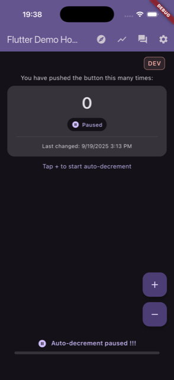 |  | 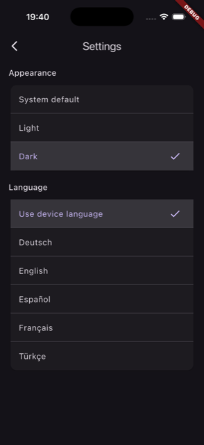 |

### Data, sync, and feature flows

| Profile | Profile 2 | IoT demo |
| --- | --- | --- |
| 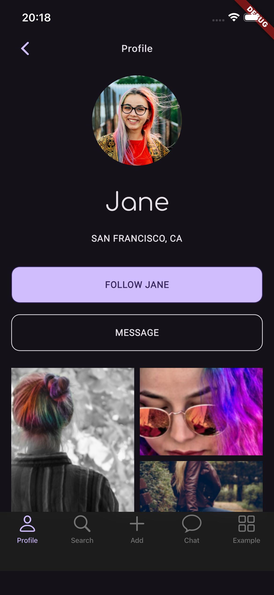 |  |  |

| IoT demo 2 | Todo list | Swipe actions |
| --- | --- | --- |
| 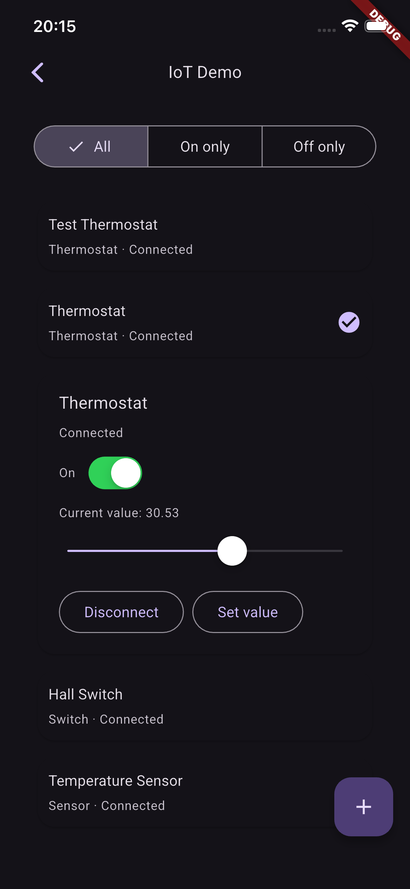 |  | 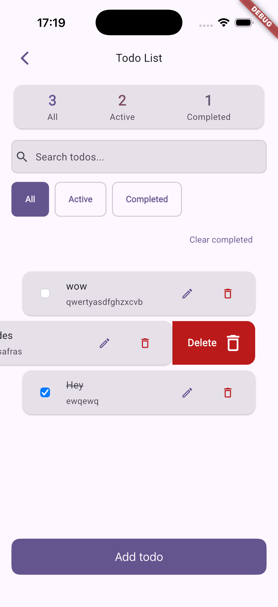 |

| Search | Charts | GraphQL |
| --- | --- | --- |
|  | 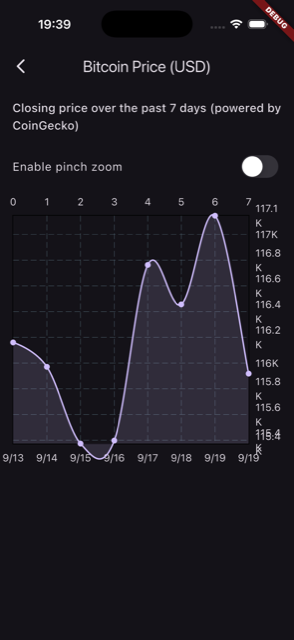 |  |

### Integrations and demos

| AI chat | Apple Maps | Google Maps |
| --- | --- | --- |
|  | 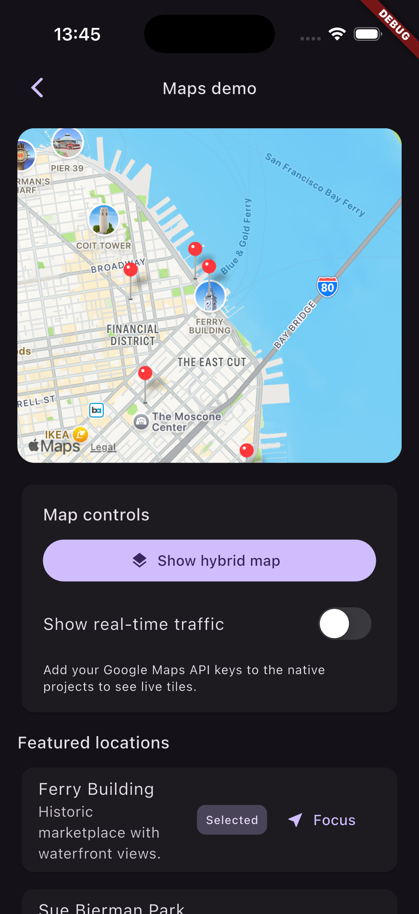 |  |

| GenUI | Calculator | Summary |
| --- | --- | --- |
|  | 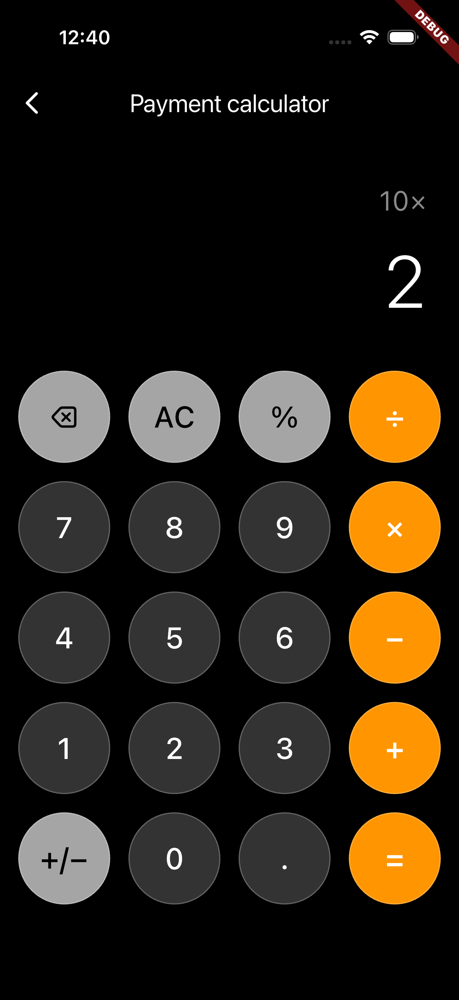 | 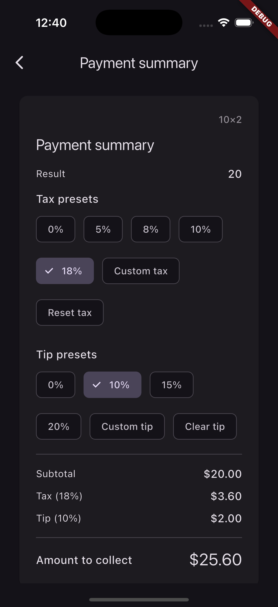 |

| Register | In-app purchase | Whiteboard colors |
| --- | --- | --- |
| 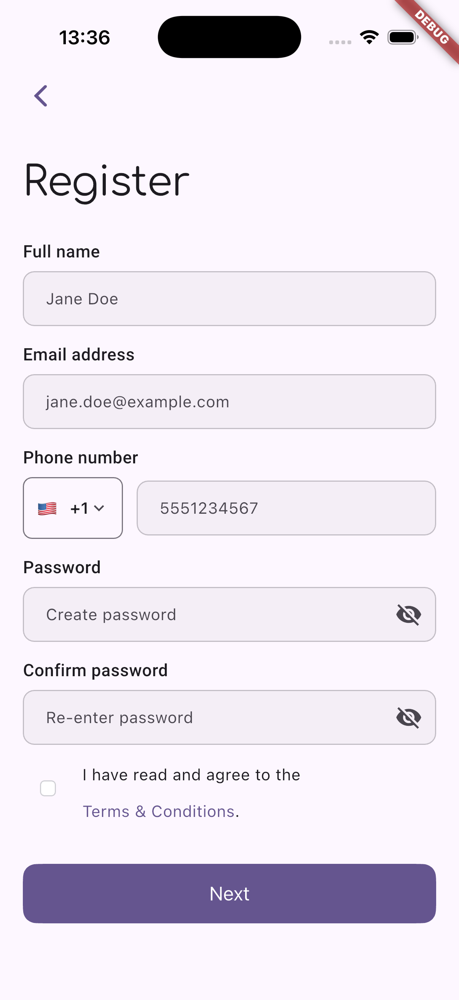 | 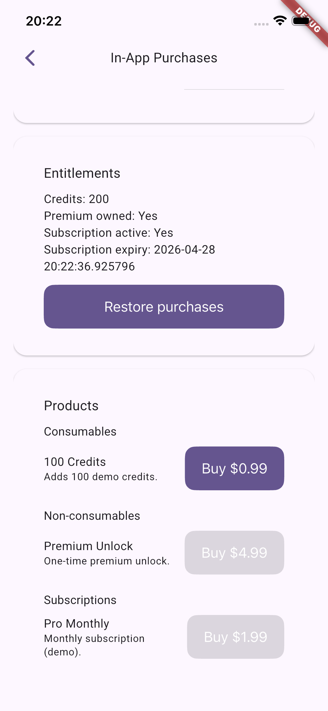 |  |

| Whiteboard | Markdown | Camera & gallery |
| --- | --- | --- |
| 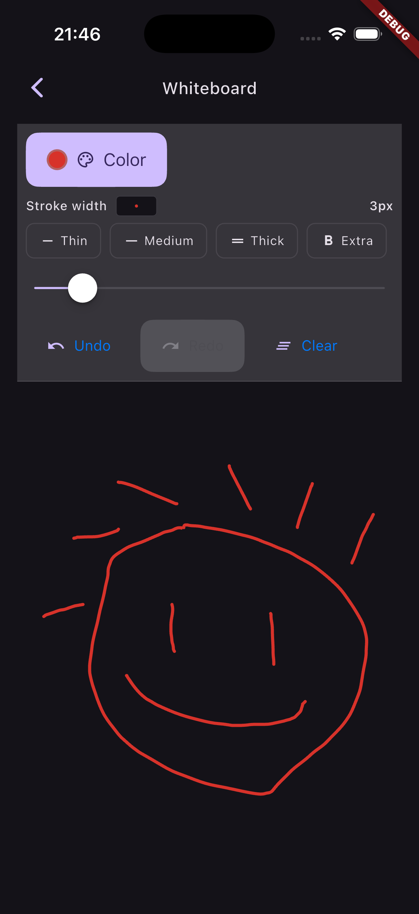 | 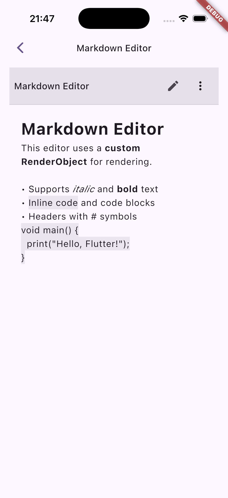 |  |

| Example | Library demo | Library demo 2 |
| --- | --- | --- |
| 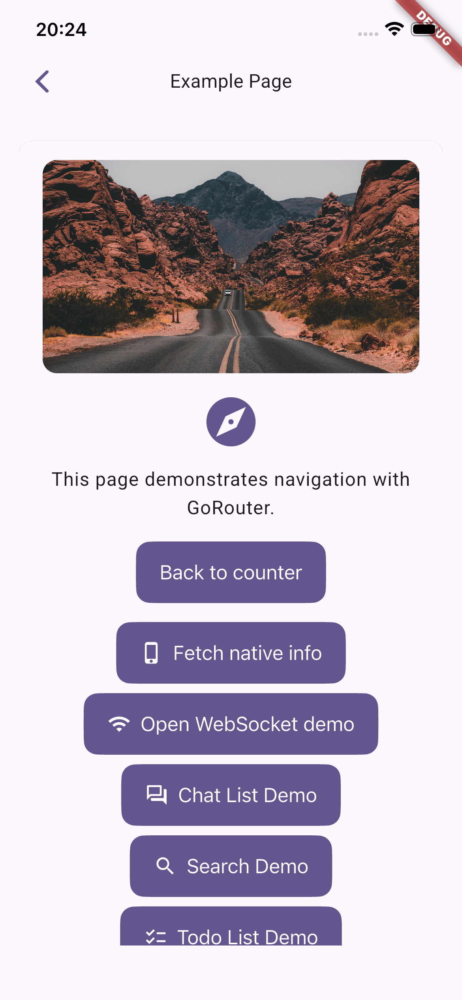 |  |  |

| Learn | Chat list | iGaming |
| --- | --- | --- |
| 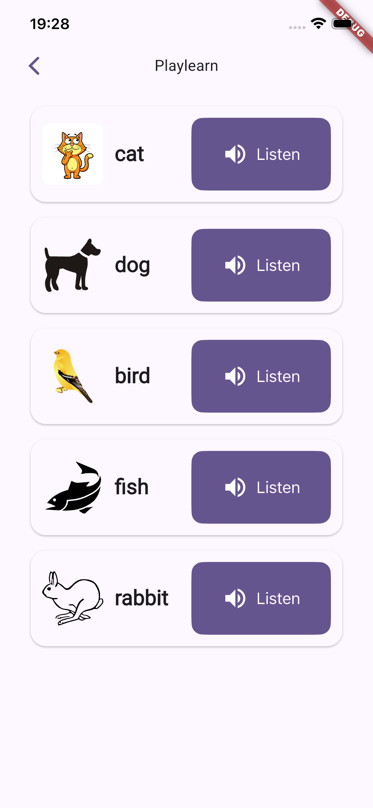 | 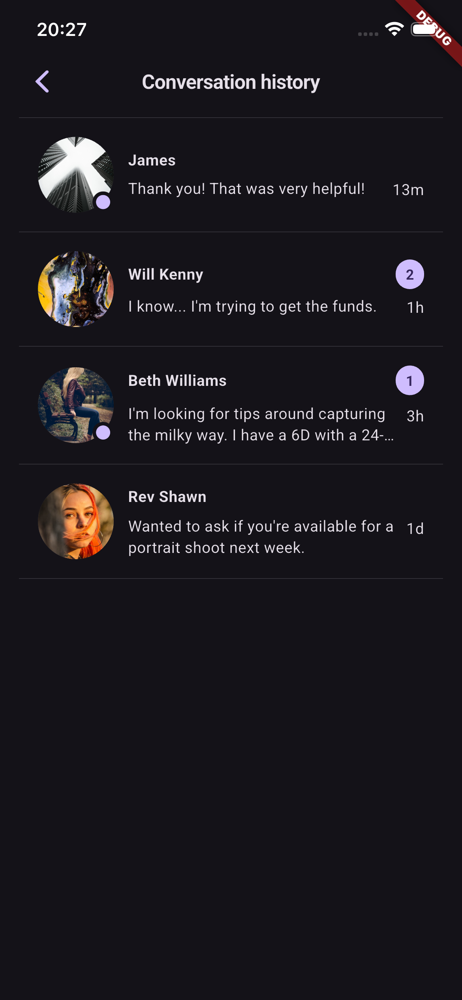 | 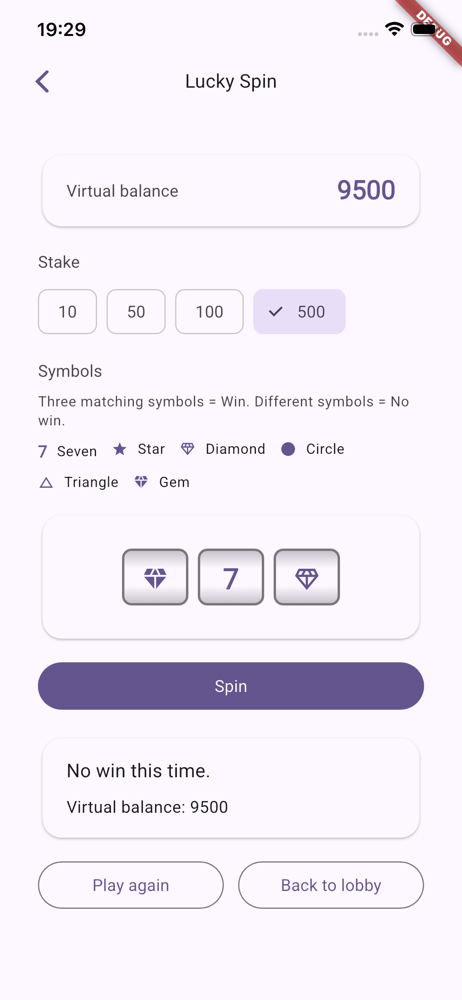 |

| Scapes |
| --- |
|  |

<!-- markdownlint-enable MD033 -->

## License

This project is available for free use in public, non-commercial repositories
under the terms described in [LICENSE](LICENSE). Commercial or closed-source
use requires prior written permission from the copyright holder.
