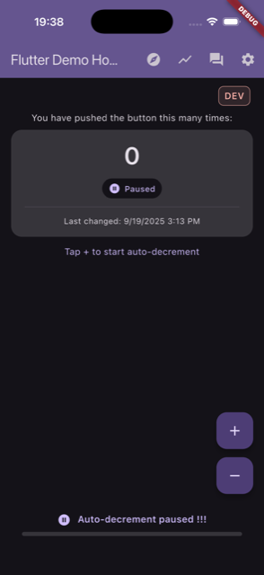
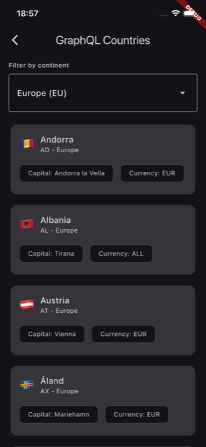

[](https://redjadet.github.io/flutter_bloc_app/) [](https://play.google.com/store/apps/details?id=com.ilkersevim.blocflutter) [](https://flutter.dev) [](https://dart.dev) [](docs/deployment.md) [](LICENSE) [](https://pub.dev/packages/very_good_analysis) [](docs/CODE_QUALITY.md) [](https://github.com/invertase/melos)

[](https://github.com/redjadet/flutter_bloc_app/actions/workflows/ci.yml) [](https://github.com/redjadet/flutter_bloc_app/actions/workflows/deploy_web.yml) [](https://github.com/redjadet/flutter_bloc_app/actions/workflows/dependency-review.yml) [](https://github.com/redjadet/flutter_bloc_app/actions/workflows/drift.yml) [](https://github.com/redjadet/flutter_bloc_app/actions/workflows/osv-scanner-pr.yml) [](https://github.com/redjadet/flutter_bloc_app/actions/workflows/codeql.yml)

[](docs/CODE_QUALITY.md) [](docs/validation_scripts.md) [](docs/modularity.md) [](docs/CODE_QUALITY.md) [](docs/clean_architecture.md) [](docs/adr/README.md) [](docs/offline_first/adoption_guide.md) [](https://pub.dev/packages/flutter_bloc) [](https://pub.dev/packages/go_router) [](https://pub.dev/packages/get_it) [](docs/offline_first/hive_schema_migrations.md) [](docs/reliability_error_handling_performance.md) [](docs/architecture/freezed_usage_analysis.md) [](docs/design_system.md) [](docs/testing_overview.md) [](docs/engineering/localization.md) [](docs/engineering/localization.md)

[](docs/integrations/firebase_setup.md) [](supabase/README.md) [](docs/integrations/render_fastapi_chat_demo.md) [](docs/offline_first/graphql_demo.md) [](docs/integrations/ai_integration.md) [](docs/universal_links/README.md) [](docs/observability.md) [](docs/security_and_secrets.md)

[](AGENTS.md)
[](docs/ai/harness_scorecard.md)
[](docs/reliability_error_handling_performance.md) [](docs/engineering/REPOSITORY_LIFECYCLE.md)

# Flutter BLoC App

Flutter / Dart engineering portfolio for **iOS, Android, web and macOS**. The
reference app demonstrates BLoC/Cubit, Clean Architecture, offline-first
synchronization, native Swift/Kotlin integration, and human-reviewed AI workflows.

Start with [verifiable evidence](docs/EVIDENCE.md) for design decisions, named
regressions, recorded test runs, and proof limits.

## Quick start

```bash
bash tool/workspace_pub_get.sh
dart run melos bootstrap
cd apps/mobile && flutter run -t lib/main_dev.dart
```

See the [new developer guide](docs/new_developer_guide.md) for toolchain setup
and backend configuration. This is a **portfolio reference app**; supported
flows and prerequisites are listed in the [feature catalog](docs/feature_overview.md).

## Reviewer path

| Review | Start here |
| --- | --- |
| Flutter state and boundaries | [Counter feature](apps/mobile/lib/features/counter/) · [Clean Architecture](docs/clean_architecture.md) · [Cubit tests](apps/mobile/test/counter_cubit_test.dart) |
| Offline-first reliability | [Adoption guide](docs/offline_first/adoption_guide.md) · [Counter evidence](docs/EVIDENCE.md#1-offline-first-counter-local-persistence-and-queue-replay) |
| Native iOS and Android | [Showcase guide](apps/mobile/lib/features/native_platform_showcase/README.md) · [Platform tests](apps/mobile/test/features/native_platform_showcase/) |
| Human-reviewed AI workflow | [Human decisions and agent contributions](docs/engineering/critical_human_skills.md#human-focus-triad-architecture-intent-edge-cases) · [Collaboration workflow](docs/ai/human_ai_collaboration.md) |

## Detailed guides

- [Technology stack](docs/tech_stack.md) · [Integrations](docs/integrations/README.md) · [Deployment](docs/deployment.md)
- [Testing strategy](docs/testing_overview.md)
- [30-minute showcase](docs/interview_showcase.md) · [Documentation index](docs/README.md)

[Engineering scorecard](docs/engineering/engineering_quality_scorecard.md)

Do not conflate app proof with agent tooling.

## My role and AI-assisted workflow

I am **İlker Sevim**. I set architecture and intent, review edge cases, and own
acceptance; Cursor and Codex assist with implementation and verification.
[Contribution and AI assistance](docs/EVIDENCE.md#contribution-and-ai-assistance)
explains the responsibilities and review gates.

## Screenshots

Captured mobile demo screens. [Full gallery: all 33 screenshots](docs/features/screenshots.md).

<!-- markdownlint-disable MD033 -->

| Offline-capable counter | GraphQL countries browser |
| --- | --- |
|  |  |

<!-- markdownlint-enable MD033 -->
