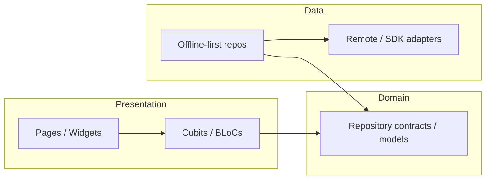

# Architecture overview (agent snapshot)

**Canon:** [`docs/architecture_details.md`](../../docs/architecture_details.md), [`docs/clean_architecture.md`](../../docs/clean_architecture.md).

## Layer flow

## Layer responsibilities

| Layer | Location | Rules |
| --- | --- | --- |
| Presentation | `apps/mobile/lib/features/*/presentation/` | UI + Cubit; no direct HTTP |
| Domain | `apps/mobile/lib/features/*/domain/` | Pure Dart; no `flutter`, router, or DI imports |
| Data | `apps/mobile/lib/features/*/domain/data/` | Implements contracts; offline-first where adopted |
| App shell | `apps/mobile/lib/app/`, `apps/mobile/lib/core/` | Bootstrap, DI, router, theme |
| Shared | `apps/mobile/lib/shared/` | Cross-cutting utilities, sync, HTTP, widgets |

## Boot and navigation

1. Entry: `main_dev` / `main_staging` / `main_prod` → `BootstrapCoordinator`.
2. DI: `registerAllDependencies()` + Hive init.
3. UI: `MyApp` → `AppScope` → `GoRouter` (route groups under `apps/mobile/lib/app/router/`).
4. Routes: constants in `apps/mobile/lib/core/router/app_routes.dart`.

## Modular metrics baseline (2026-05-21)

- **31** feature modules under `apps/mobile/lib/features/` (excluding `features.dart` barrel).
- **Largest LOC:** `chat` (6384), `todo_list` (5166), `online_therapy_demo` (4578), `staff_app_demo` (4558).
- **Shared fan-in:** ~497 files import `package:flutter_bloc_app/shared/`.
- **Domain purity:** no domain imports of `app/router` or `core/di` (metrics clean).

## Missing barrels (feature entrypoints)

Per `tool/modular_metrics.sh`: `case_study_demo`, `igaming_demo`, `library_demo`, `staff_app_demo` lack top-level `<feature>.dart` barrels—prefer adding when touching those modules.

## Next reads

- Modularity rules: [`docs/modularity.md`](../../docs/modularity.md)
- Feature catalog: [`docs/feature_overview.md`](../../docs/feature_overview.md)
- Dependency evidence: [dependency_map.md](dependency_map.md)
