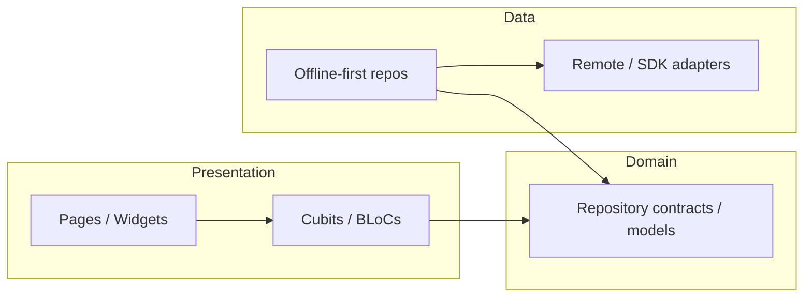

---
ai_snapshot:
  generated_at: "2026-07-17T17:15:10Z"
  git_head: "9e1bfd3536dc381b6a5ed71cfd3a71b814f91693"
  app_root: "apps/mobile"
  canon_links:
    - docs/architecture_details.md
    - CODEMAP.md
    - docs/feature_overview.md
---

# Architecture overview (agent snapshot)

**Canon:** [`docs/architecture_details.md`](../../docs/architecture_details.md), [`docs/clean_architecture.md`](../../docs/clean_architecture.md).

## Layer flow

## Layer responsibilities

| Layer | Location | Rules |
| --- | --- | --- |
| Presentation | `apps/mobile/lib/features/*/presentation/` | UI + Cubit; no direct HTTP |
| Domain | `apps/mobile/lib/features/*/domain/` | Pure Dart; no `flutter`, router, or DI imports |
| Data | `apps/mobile/lib/features/*/data/` | Implements contracts; offline-first where adopted |
| App shell | `apps/mobile/lib/app/` | Bootstrap, DI, router, theme, HTTP, sync wiring |
| Shared packages | `packages/*` | Cross-cutting utilities owned outside features |

## Boot and navigation

1. Entry: `main_dev` / `main_staging` / `main_prod` → `BootstrapCoordinator`.
2. DI: `registerAllDependencies()` + Hive init under `apps/mobile/lib/app/composition/`.
3. UI: `MyApp` → `AppScope` → `GoRouter` (route groups under `apps/mobile/lib/app/router/`).
4. Routes: constants in `apps/mobile/lib/app/router/app_routes.dart`.

## Modular metrics baseline

Regenerate with `bash tool/refresh_ai_reports.sh` or `bash tool/modular_metrics.sh`.
Latest capture lives in `ai/reports/.modular_metrics_latest.txt` (local evidence).

- **35** feature modules under `apps/mobile/lib/features/` (excluding `features.dart` barrel).
- **Largest LOC:** `chat`, `staff_app_demo`, `online_therapy_demo`, `todo_list` (see dependency map).
- **Shared fan-in:** legacy `package:flutter_bloc_app/shared/` imports are **0** post-Melos.
- **App fan-in:** ~346 files import `package:flutter_bloc_app/app/`.
- **Domain purity:** no domain imports of `app/router` or composition paths (metrics clean).

## Missing barrels

All listed features report barrels via `tool/modular_metrics.sh` as of the latest refresh.
Re-run metrics after adding new modules.

## Next reads

- Modularity rules: [`docs/modularity.md`](../../docs/modularity.md)
- Feature catalog: [`docs/feature_overview.md`](../../docs/feature_overview.md)
- Dependency evidence: [dependency_map.md](dependency_map.md)
