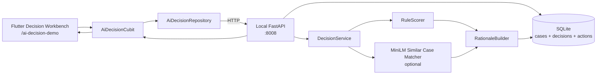

# AI Decision MVP Plan (UI-first)

Status: implementation-oriented historical plan. The current builder and demo
runbook is [`ai_decision_workbench.md`](ai_decision_workbench.md). Keep this
file for rationale, scope decisions, and Cursor-agent task breakdowns; use the
workbench doc when running or validating the implemented MVP.

Build a **local, app-visible MVP** of a decision system that produces a **risk
score + recommended action + rationale**, and shows a **proof trail** in the UI.

Hard rule: the feature must be demonstrable directly in Flutter at
`/ai-decision-demo`. Backend logs alone are not acceptable.

## Main MVP Purpose

Prove that this system can really decide **with proof**.

For this MVP, "decide with proof" means every decision response includes:

- final risk score and risk band
- recommended action
- plain-English rationale
- input snapshot used for scoring
- rule trace showing each evaluated rule, threshold, observed value, and score
  contribution
- evidence list linking the decision to case objects and risk signals
- optional similar-case evidence from MiniLM
- confidence label based on evidence completeness, not model certainty
- persisted decision record so the proof can be reopened later

If the UI cannot show the proof trail, the MVP has failed even if the backend
returns a score.

## MVP User Flow (must be visible in UI)

1. Show a **case queue** (seeded, not empty).
2. Select a case to see **context** (applicant, business, loan, risk signals).
3. Tap **Run decision support**.
4. Show **risk score + band + recommended action + rationale**.
5. Show **proof**: input snapshot, rule-by-rule trace, score breakdown, evidence.
6. Let the user **record an action** (approve/manual review/request docs/decline).
7. Show **action history** for the case.

## Section 1: What To Remove

Remove or postpone these from the original production-shaped plan:

- **Generic multi-domain platform.** Start with one workflow:
  small-business loan triage.
- **Backend-only scorer.** The MVP must have visible Flutter UI: queue,
  object context, decision result, and action history.
- **Platform clone.** No graph database, permission model, workflow designer,
  lineage UI, or app builder.
- **OpenAPI-generated Flutter DTOs.** Hand-write the small number of Dart models
  until the API stabilizes.
- **OTel, Prometheus, `/metrics`, trace spans, structured logging framework.**
  Basic request logs and a visible audit/action history are enough.
- **Idempotency middleware.** Disable duplicate buttons while loading.
- **SQLAlchemy, Alembic, Postgres-ready repository layer.** Use tiny SQLite
  persistence with Python standard library.
- **Calibration, isotonic regression, logistic weights, AUC gates, precision by
  band, and golden-set-first workflow.** With no real labels, these create fake
  rigor. Use explicit scoring rules and tests.
- **Vector database or `hnswlib`.** For 10-50 local reference cases, brute-force
  cosine similarity is enough.
- **LLM narrator.** Deterministic rationale is safer and easier to validate.
- **Production auth, role-based security, deployment, canaries, drift
  monitoring, and shadow models.** Post-MVP.
- **Offline-first sync integration.** This demo runs locally. Do not touch the
  chat/offline sync stack.

Hard rule: if it does not help a user operate the workbench from Flutter, it is
not MVP.

Second hard rule: if a decision cannot explain exactly which inputs and rules
produced the result, it is not a valid MVP decision.

## Section 2: MVP Architecture

Minimal architecture:



### Ontology-Lite Objects

Keep the domain model simple: typed JSON/SQLite records, not a platform.
The MVP only needs enough structure to render the **case context panel** and
compute the **risk score**.

```text
Applicant
  id, name, personal_credit_score, prior_defaults

Business
  id, applicant_id, name, industry, monthly_revenue, age_months

LoanApplication
  id, applicant_id, business_id, amount, purpose, status, created_at

RiskSignal
  id, case_id, key, label, value, severity

Decision
  id, case_id, risk_score, risk_band, recommended_action, rationale, signals,
  proof

Action
  id, case_id, action_type, note, created_at
```

The MVP should seed 5-8 local cases so the app opens like an operational queue,
not an empty form.

### Local Demo Database Contract

The MVP database is mandatory. Do not fake the queue only in Flutter.

- Use local SQLite.
- Default DB path: `demos/ai_decision_api/.data/ai_decision_demo.sqlite3`.
- Create the `.data/` directory on backend startup if missing.
- On first startup, create tables and insert seed data.
- If the database already exists, do not overwrite user-created actions by
  default.
- Provide a reset command to rebuild the demo database from seed data:

  ```bash
  cd demos/ai_decision_api
  python -m seed_data --reset
  ```

Minimum tables (names only; exact columns are an implementation detail):

```text
applicants
businesses
loan_applications
risk_signals
decisions
actions
```

Minimum seed cases:

| Case | Applicant / business | Inputs | Expected band | Demo purpose |
| --- | --- | --- | --- | --- |
| `case_low_001` | Stable bakery | Revenue 18000, age 72mo, credit 735, defaults 0, loan 12000 | low | Shows approval path. |
| `case_med_001` | Growing repair shop | Revenue 9000, age 30mo, credit 665, defaults 0, loan 22000 | medium | Shows manual review path. |
| `case_high_001` | New retail shop | Revenue 4000, age 18mo, credit 610, defaults 1, loan 15000 | high | Shows request-docs/decline path. |
| `case_high_002` | Contractor with defaults | Revenue 6500, age 14mo, credit 580, defaults 2, loan 25000 | high | Shows multiple severe signals. |
| `case_med_002` | Seasonal cafe | Revenue 7000, age 26mo, credit 690, defaults 0, loan 18000 | medium | Shows rationale from ratio/seasonality notes. |
| `case_low_002` | Established clinic supplier | Revenue 30000, age 96mo, credit 760, defaults 0, loan 20000 | low | Shows clean low-risk comparison. |

Seed each case with at least two `risk_signals`, even low-risk cases. This keeps
the object context panel useful before scoring.

The Flutter demo must load its queue from this database through `GET /cases`.
An empty queue is a backend bug unless the user explicitly reset the DB to an
empty state during development.

### Flutter UX

Build one route: `/ai-decision-demo`.

The page should behave like a small operational workbench:

```text
AI Decision Workbench
┌─────────────────┬──────────────────────────────┬──────────────────────┐
│ Case Queue       │ Case Context                 │ Decision Support     │
│ - Case A         │ Applicant card               │ Risk score           │
│ - Case B         │ Business card                │ Risk band chip       │
│ - Case C         │ Loan request card            │ Rationale            │
│                 │ Existing risk signals        │ Proof trail          │
│                 │ Action history               │ Action buttons       │
└─────────────────┴──────────────────────────────┴──────────────────────┘
```

On mobile, stack these sections vertically:

1. case selector
2. object context
3. decision support
4. proof trail
5. action history

Required UI states:

- loading case queue
- empty case queue
- selected case loaded
- scoring in progress
- score success
- scoring error
- proof loaded
- action save success
- action save error

The decision support panel must include a **Proof** section. It should show:

- input snapshot used for scoring
- rule trace rows with pass/fail status and score contribution
- risk band threshold comparison
- evidence links back to applicant/business/loan/risk signal fields
- similar-case evidence when MiniLM is available
- confidence label: `complete`, `partial`, or `rules_only`

This proof section is the main product surface. Do not hide it in debug logs,
developer console output, or raw JSON.

### Hugging Face Choice

Use Hugging Face only where it improves the MVP without making it fragile:

- Model: `sentence-transformers/all-MiniLM-L6-v2`.
- Runtime: local FastAPI loads it through `sentence-transformers`.
- Use: find nearest reference case by description/purpose/risk notes.
- Matching: brute-force cosine similarity.
- Decision effect: capped adjustment, for example `-0.05` to `+0.10`.
- Failure behavior: if model download/load/inference fails, return rules-only.

Do **not** call Hugging Face directly from Flutter for this MVP. The existing AI
chat feature supports Hugging Face transports, but this workbench should keep
model ownership server-side so the Flutter contract stays stable and no client
HF token is needed.

### Scoring Approach

Rules are the source of truth. MiniLM only adds a small supporting signal.

```text
score = 0.20
score += amount_income_ratio > 3.0 ? 0.25 : 0
score += applicant.prior_defaults > 0 ? 0.25 : 0
score += business.age_months < 24 ? 0.10 : 0
score += business.monthly_revenue < 3000 ? 0.10 : 0
score += personal_credit_score < 620 ? 0.10 : 0
score += optional_nearest_case_adjustment
score = clamp(score, 0.0, 1.0)
```

Risk bands:

```text
low:    score < 0.35
medium: score < 0.65
high:   score >= 0.65
```

Recommended action:

```text
low    -> approve
medium -> manual_review
high   -> request_docs or decline, depending on top signal
```

Do not claim statistical calibration. The MVP score is a transparent heuristic
risk score.

### Decision Proof Contract

Every scoring step must emit proof data. A proof object is not optional.

```json
{
  "confidence": "complete",
  "input_snapshot": {
    "amount": 15000,
    "monthly_revenue": 4000,
    "business_age_months": 18,
    "personal_credit_score": 610,
    "prior_defaults": 1
  },
  "rule_trace": [
    {
      "id": "amount_revenue_ratio",
      "label": "Amount / revenue ratio",
      "observed": 3.75,
      "threshold": "> 3.0",
      "passed": true,
      "contribution": 0.25,
      "evidence": "Loan amount 15000 / monthly revenue 4000 = 3.75"
    },
    {
      "id": "prior_defaults",
      "label": "Prior defaults",
      "observed": 1,
      "threshold": "> 0",
      "passed": true,
      "contribution": 0.25,
      "evidence": "Applicant has 1 prior default"
    }
  ],
  "band_thresholds": {
    "low": "< 0.35",
    "medium": "0.35 - 0.64",
    "high": ">= 0.65",
    "selected": "high"
  },
  "evidence": [
    {
      "source": "applicant.prior_defaults",
      "label": "Prior defaults",
      "value": "1",
      "supports": "higher_risk"
    },
    {
      "source": "business.monthly_revenue",
      "label": "Monthly revenue",
      "value": "4000",
      "supports": "amount_revenue_ratio"
    }
  ],
  "similar_case": {
    "used": true,
    "case_id": "case_ref_003",
    "label": "risky",
    "similarity": 0.81,
    "contribution": 0.07
  }
}
```

Decision proof rules:

- The sum of positive `rule_trace.contribution` values plus base score and
  similar-case adjustment must explain the final score.
- The proof payload must carry the score breakdown explicitly so the UI and
  tests can verify the math without re-implementing scoring logic:
  - `base_score`
  - `similar_case.contribution` (or `0`)
  - `final_score`
- Any non-zero score contribution must have evidence text.
- `confidence = complete` only when rules and similar-case matcher both ran.
- `confidence = rules_only` when MiniLM is unavailable but rules ran.
- `confidence = partial` when any non-critical evidence is missing but a
  decision can still be made.
- The backend must persist `proof_json` with the decision.
- Flutter must render proof in human-readable UI, not raw JSON.

## Section 3: Simplified Folder Structure

### Backend

Follow the flat layout already used by `demos/render_chat_api`. Do **not** wrap
modules in an `app/` subpackage and do **not** use `pyproject.toml`.

```text
demos/ai_decision_api/
├── main.py                  # FastAPI app, CORS, routes
├── schemas.py               # Pydantic request/response models
├── settings.py              # pydantic-settings config (port, DB path, model flag)
├── seed_data.py             # create/reset local demo DB (CLI: python -m seed_data --reset)
├── ontology.py              # typed dataclasses for MVP objects
├── decision_service.py      # scorer + matcher + rationale + persistence
├── scoring.py               # rule score, bands, recommended action
├── proof.py                 # rule trace, evidence, confidence construction
├── rationale.py             # deterministic explanation templates from proof
├── similar_cases.py         # SimilarCaseMatcher protocol + MiniLM + Fake impls
├── store.py                 # SQLite persistence
├── reference_cases.json     # nearest-case examples
├── .data/                   # gitignored local SQLite DB, created at runtime
├── .gitignore               # ignores .data/ and __pycache__
├── tests/
│   ├── __init__.py
│   ├── conftest.py          # injects FakeSimilarCaseMatcher, temp DB
│   ├── test_api.py
│   ├── test_scoring.py
│   ├── test_store.py
│   └── test_similar_cases.py
├── requirements.txt
├── requirements-dev.txt
├── requirements-ml.txt      # optional MiniLM extras (sentence-transformers, torch CPU)
└── README.md
```

### Backend Dependency Pins

Keep core deps small so the API runs without ML. Install
`requirements-ml.txt` only when MiniLM is wanted.

`requirements.txt`:

```text
fastapi[standard]>=0.115.0,<1
uvicorn[standard]>=0.32.0,<1
pydantic>=2.9.0,<3
pydantic-settings>=2.6.0,<3
```

`requirements-dev.txt`:

```text
pytest>=9.0.3,<10
httpx>=0.27.0,<1
```

`requirements-ml.txt` (optional, heavy — pulls PyTorch ~500MB):

```text
sentence-transformers>=3.0.0,<4
numpy>=1.26.0,<3
```

Install order for full MVP:

```bash
cd demos/ai_decision_api
python -m venv .venv && source .venv/bin/activate
pip install -r requirements.txt -r requirements-dev.txt
pip install -r requirements-ml.txt   # optional; skip for rules-only demo
```

### CORS + Local Port Contract

The backend must enable CORS so the Flutter Web debug build can call it:

```python
from fastapi.middleware.cors import CORSMiddleware

app.add_middleware(
    CORSMiddleware,
    allow_origins=["*"],         # dev-only; MVP is local
    allow_methods=["*"],
    allow_headers=["*"],
)
```

Port is **8008** (avoids collision with `demos/render_chat_api` on 8000).

### Flutter

```text
lib/features/ai_decision_demo/
├── ai_decision_demo.dart
├── data/
│   ├── ai_decision_api_client.dart
│   ├── ai_decision_models.dart
│   └── ai_decision_repository.dart
└── presentation/
    ├── cubit/
    │   ├── ai_decision_cubit.dart
    │   └── ai_decision_state.dart
    ├── pages/
    │   └── ai_decision_demo_page.dart
    └── widgets/
        ├── case_queue_panel.dart
        ├── case_context_panel.dart
        ├── decision_support_panel.dart
        ├── decision_proof_panel.dart
        ├── action_history_panel.dart
        ├── risk_band_chip.dart
        └── signal_breakdown_list.dart
```

### Repo Integration Files To Touch

Cursor/Codex agents should expect this write set:

- `lib/core/router/app_routes.dart`
  - Add `aiDecisionDemo` and `aiDecisionDemoPath = '/ai-decision-demo'`.
- `lib/app/router/routes_demos.dart`
  - Register `GoRoute` for `AiDecisionDemoPage`.
- `lib/core/di/injector_registrations.dart`
  - Register the repository/client directly or call a new
    `registerAiDecisionDemoServices()`.
- `lib/features/features.dart`
  - Export the new feature barrel if the local pattern needs it.
- `lib/features/example/presentation/pages/example_page.dart`
  - Add navigation callback to open the demo.
- `lib/features/example/presentation/widgets/example_page_body.dart`
  - Add a visible tile/button for the AI Decision Workbench.
- `tool/flutter_dart_defines_from_env.sh`
  - Add `AI_DECISION_API_BASE_URL` so the repo wrapper forwards it from
    `.envrc` as `--dart-define=AI_DECISION_API_BASE_URL=...`.
- `docs/envrc.example`
  - Document `export AI_DECISION_API_BASE_URL=http://127.0.0.1:8008`.

### Flutter Env Wiring Contract

The API client must read the base URL via `String.fromEnvironment` with a dev
fallback so the app still runs without `.envrc`:

```dart
const _baseUrl = String.fromEnvironment(
  'AI_DECISION_API_BASE_URL',
  defaultValue: 'http://127.0.0.1:8008',
);
```

Dart-define key: `AI_DECISION_API_BASE_URL`. No other configuration knob is
required for this MVP.

Do not touch chat offline sync, Supabase proxy, Firebase auth, Render
orchestration, or production deployment for this MVP.

## Section 4: Minimal API Design

Local backend:

```text
http://127.0.0.1:8008
```

Essential endpoints:

```text
GET  /health
GET  /cases
GET  /cases/{case_id}
POST /cases/{case_id}/decision
POST /cases/{case_id}/actions
```

### `GET /health`

Response:

```json
{
  "status": "ok",
  "similar_cases_enabled": true,
  "model": "sentence-transformers/all-MiniLM-L6-v2"
}
```

If MiniLM is unavailable:

```json
{
  "status": "ok",
  "similar_cases_enabled": false,
  "model": null
}
```

### `GET /cases`

Returns the operational queue.

```json
{
  "cases": [
    {
      "id": "case_high_001",
      "applicant_name": "Aylin Yilmaz",
      "business_name": "Aylin Market",
      "amount": 15000,
      "status": "new",
      "last_decision_band": null
    }
  ]
}
```

### `GET /cases/{case_id}`

Returns the object-aware case view.

```json
{
  "case": {
    "id": "case_high_001",
    "status": "new",
    "created_at": "2026-04-20T12:00:00Z"
  },
  "applicant": {
    "id": "app_001",
    "name": "Aylin Yilmaz",
    "personal_credit_score": 610,
    "prior_defaults": 1
  },
  "business": {
    "id": "biz_001",
    "name": "Aylin Market",
    "industry": "retail",
    "monthly_revenue": 4000,
    "age_months": 18
  },
  "loan": {
    "amount": 15000,
    "purpose": "Inventory expansion"
  },
  "risk_signals": [
    {
      "key": "prior_default",
      "label": "Prior default",
      "value": "1",
      "severity": "high"
    }
  ],
  "latest_decision": null,
  "actions": []
}
```

### `POST /cases/{case_id}/decision`

Runs decision support for the selected case.

Request:

```json
{
  "operator_note": "Revenue is seasonal; check inventory plan."
}
```

Response:

```json
{
  "id": "dec_1729",
  "case_id": "case_high_001",
  "risk_score": 0.72,
  "risk_band": "high",
  "recommended_action": "request_docs",
  "rationale": "Prior default and amount/revenue ratio of 3.75 are the main risk drivers. Similar historical case case_ref_003 was labeled risky.",
  "signals": {
    "amount_income_ratio": 3.75,
    "prior_defaults": 1,
    "business_age_months": 18,
    "monthly_revenue": 4000,
    "personal_credit_score": 610,
    "nearest_case_id": "case_ref_003",
    "nearest_case_label": "risky",
    "nearest_case_similarity": 0.81,
    "similar_case_adjustment": 0.07
  },
  "proof": {
    "confidence": "complete",
    "input_snapshot": {
      "amount": 15000,
      "monthly_revenue": 4000,
      "business_age_months": 18,
      "personal_credit_score": 610,
      "prior_defaults": 1
    },
    "rule_trace": [
      {
        "id": "amount_revenue_ratio",
        "label": "Amount / revenue ratio",
        "observed": 3.75,
        "threshold": "> 3.0",
        "passed": true,
        "contribution": 0.25,
        "evidence": "Loan amount 15000 / monthly revenue 4000 = 3.75"
      },
      {
        "id": "prior_defaults",
        "label": "Prior defaults",
        "observed": 1,
        "threshold": "> 0",
        "passed": true,
        "contribution": 0.25,
        "evidence": "Applicant has 1 prior default"
      }
    ],
    "band_thresholds": {
      "low": "< 0.35",
      "medium": "0.35 - 0.64",
      "high": ">= 0.65",
      "selected": "high"
    },
    "evidence": [
      {
        "source": "applicant.prior_defaults",
        "label": "Prior defaults",
        "value": "1",
        "supports": "higher_risk"
      }
    ],
    "similar_case": {
      "used": true,
      "case_id": "case_ref_003",
      "label": "risky",
      "similarity": 0.81,
      "contribution": 0.07
    }
  },
  "meta": {
    "scoring_version": "mvp-rules-0.1",
    "similar_cases_used": true,
    "created_at": "2026-04-20T12:03:00Z"
  }
}
```

### `POST /cases/{case_id}/actions`

Captures the human decision/action.

Request:

```json
{
  "action_type": "request_docs",
  "note": "Ask for last 6 months of bank statements before approval."
}
```

Allowed `action_type` values:

- `approve`
- `manual_review`
- `request_docs`
- `decline`

Response:

```json
{
  "id": "act_001",
  "case_id": "case_high_001",
  "action_type": "request_docs",
  "note": "Ask for last 6 months of bank statements before approval.",
  "created_at": "2026-04-20T12:05:00Z"
}
```

### Error Behavior

- FastAPI validation errors can use default `422` responses.
- Missing case returns `404` with `{"detail": "case_not_found"}`.
- MiniLM failure does not fail decision scoring; return rules-only with
  `similar_cases_used = false`.
- SQLite write failure returns `500` because the API promises persisted
  decisions/actions.
- Flutter must show user-visible errors in the workbench, not only logs.

## Section 5: Step-By-Step Build Plan

### Day 1: Backend Workbench API

Goal: local API serves a seeded operational queue and deterministic decisions.

Build:

1. Create `demos/ai_decision_api`.
2. Add FastAPI app with `/health`, `/cases`, `/cases/{case_id}`,
   `/cases/{case_id}/decision`, and `/cases/{case_id}/actions`.
3. Add Pydantic schemas.
4. Implement SQLite `store.py` with schema creation on startup.
5. Implement `seed_data.py` with 5-8 local cases and `--reset`.
6. Implement `scoring.py` with fixed rules and band mapping.
7. Implement `proof.py` so every decision includes input snapshot, rule trace,
   evidence rows, band threshold comparison, similar-case evidence, and
   confidence label.
8. Implement `rationale.py` from proof data using top two risk drivers.
9. Add pytest coverage for DB initialization, seed data count, queue, case
   detail, scoring low/medium/high, proof trace math, action capture,
   validation errors, and not-found errors.

Local command:

```bash
cd demos/ai_decision_api
source .venv/bin/activate
python -m seed_data --reset
uvicorn main:app --reload --port 8008
```

Manual proof:

```bash
curl -s http://127.0.0.1:8008/health
curl -s http://127.0.0.1:8008/cases
curl -s http://127.0.0.1:8008/cases | python -m json.tool
curl -s http://127.0.0.1:8008/cases/case_high_001
curl -s -X POST http://127.0.0.1:8008/cases/case_high_001/decision \
  -H 'content-type: application/json' \
  -d '{"operator_note":"Check seasonality"}'
```

Stop condition:

- API exposes an operational case queue.
- Fresh local DB contains at least six seeded cases spanning low/medium/high.
- Decision response has score, band, action, rationale, signals, proof, and id.
- Proof trace explains the final score contribution math.
- Backend tests pass.

### Day 2: Flutter Workbench UI

Goal: the end-to-end workflow is visible and usable in Flutter.

Build:

1. Add `lib/features/ai_decision_demo`.
2. Add hand-written Dart models for case summary, case detail, decision result,
   action, and API errors.
3. Add API client and repository.
4. Add Cubit states that can represent:
   - queue loading
   - queue loaded
   - case selected/loading/loaded
   - decision running/success/error
   - action saving/success/error
5. Build `AiDecisionDemoPage` with:
   - page title: "AI Decision Workbench"
   - case queue panel
   - selected case context panel
   - decision support panel
   - decision proof panel
   - action history panel
6. Add decision support controls:
   - "Run decision support"
   - optional operator note field
7. Add action controls:
   - approve
   - manual review
   - request docs
   - decline
   - action note field
8. Add route `/ai-decision-demo`.
9. Add visible Example page entry so the user can open the workbench from the
   app.
10. Read backend URL from:

    ```text
    export AI_DECISION_API_BASE_URL=http://127.0.0.1:8008
    ```

11. Default to `http://127.0.0.1:8008` in dev if the define is missing.
12. Disable buttons while requests are in flight.
13. Show errors in the page.

Stop condition:

- User can open the feature from the app.
- User can select a seeded case.
- User can run decision support.
- User can see risk score, band, recommended action, rationale, signals, and
  proof trace.
- User can save an action and see it in action history.

### Day 3: Hugging Face MiniLM Similar Case Signal

Goal: add one useful AI signal without building ML infrastructure.

Build:

1. Add `reference_cases.json` with 10-50 examples:

   ```json
   {
     "id": "case_ref_003",
     "text": "Young retail business requesting inventory loan with prior default.",
     "label": "risky"
   }
   ```

2. Implement `similar_cases.py` with a `SimilarCaseMatcher` protocol plus two
   concrete impls so tests never need the model:

   ```python
   class SimilarCaseMatcher(Protocol):
       @property
       def enabled(self) -> bool: ...
       @property
       def model_name(self) -> str | None: ...
       def nearest(self, text: str) -> NearestCase | None: ...

   class MiniLMMatcher(SimilarCaseMatcher):      # lazy-loads the model
   class FakeSimilarCaseMatcher(SimilarCaseMatcher):  # returns fixture data
   ```

3. Wire it through FastAPI dependency injection so `tests/conftest.py` can
   override with `app.dependency_overrides[get_matcher] = lambda: FakeSimilarCaseMatcher(...)`.
4. Load `sentence-transformers/all-MiniLM-L6-v2` lazily inside `MiniLMMatcher`.
5. Compute reference embeddings once per process.
6. Use brute-force cosine similarity (numpy dot-product on normalized vectors).
7. Map nearest label/similarity to a capped adjustment in `[-0.05, +0.10]`.
8. Include nearest-case fields in the decision response.
9. When `sentence-transformers` is not installed or the model cannot load,
   the API must still return a valid rules-only decision — no 500s.
10. Add README note that first model run may download from Hugging Face.

FastAPI Cloud note:

- Hosted inference is routed through Hugging Face Inference Providers (HF
  Inference) and may not support the legacy `api-inference.huggingface.co`
  endpoints.
- The deployed demo should expose a clear on-wire proof of usage:
  `meta.similar_cases_used = true` and `proof.similar_case.used = true`.

Stop condition:

- Decision response includes nearest-case fields when MiniLM is available.
- Rules-only fallback still works when MiniLM is unavailable.
- Flutter panel clearly shows whether similar-case support was used.

### Day 4: Polish, Tests, And Handoff

Goal: Cursor agents can finish and verify without guessing.

Build:

1. Improve UI layout for desktop/tablet/mobile.
2. Improve rationale copy and signal labels.
3. Improve proof panel copy so a non-engineer can understand why the system
   decided.
4. Add backend README with setup and curl examples.
5. Add focused Flutter tests:
   - Cubit loads queue
   - Cubit loads selected case
   - Cubit decision success/error
   - Cubit action save success/error
   - decision panel displays band/rationale/signals
   - proof panel displays rule trace/evidence/confidence
6. Add backend tests:
   - DB initialization and reset seed count
   - queue and detail endpoints
   - rules low/medium/high
   - proof math explains final score
   - action persistence
   - fake similar-case matcher adjusts score within cap
7. Update docs only if implementation details diverge from this plan.

Validation:

```bash
# Backend
cd demos/ai_decision_api
python -m pytest

# Flutter targeted tests from repo root
flutter test test/features/ai_decision_demo

# Router touched, so run router validation
./bin/router_feature_validate
```

Use `./bin/checklist` only for broad pre-ship validation or if the final change
touches shared validation guidance.

### If Scope Slips

Cut in this order:

1. Cut MiniLM.
2. Cut action persistence note text, keeping action type.
3. Cut persisted decision history, but keep local SQLite seeded cases and action
   capture.
4. Keep case queue, case detail, decision scoring, proof trace, and visible
   Flutter result.

Do not cut the Flutter workbench. A backend-only scorer is not the requested
feature.

## Section 6: Future Upgrades

Add only after the local app-visible MVP proves users understand and care about
the workbench.

### Product Upgrades

- Decision history page across all cases.
- Feedback/outcome capture.
- Proof comparison between multiple candidate actions.
- Counterfactual "what would change this decision?" panel.
- Multiple operational domains.
- Review workflow for medium/high risk cases.
- Export/share decision report.
- Real object graph relationships and filters.

### AI And Scoring Upgrades

- Real labeled evaluation set.
- Logistic regression or calibrated scoring after baseline rule mistakes are
  understood.
- OpenAPI-generated Flutter client once the API stops changing.
- Larger reference case library.
- `hnswlib`, pgvector, or Qdrant when brute-force matching becomes slow.
- Versioned rules/model/weights when multiple versions are deployed.
- LLM narrator only if deterministic rationale is not good enough for users.
- Optional hosted Hugging Face Inference API path if local model loading is too
  heavy for target developer machines.

### Workflow + Explainability Upgrades

- Configurable rule editor.
- Real ontology graph view.
- Object-level permissions.
- Workflow lineage screen.
- Human approval queues.
- Scenario planning/simulation.
- Agent tool calls that propose actions but require human approval.

### Backend Upgrades

- SQLAlchemy + Alembic.
- Postgres.
- Auth.
- Idempotency keys.
- Rate limiting.
- Docker/deploy flow.
- Structured logs, Prometheus, OTel.
- Drift monitoring and shadow scoring.

### Flutter Upgrades

- Generated DTOs.
- Offline queue.
- Background retry.
- Decision history.
- Golden tests for the workbench UI.
- Reusable object-view widgets if another domain is added.

## Cursor Agent Build Contract

Cursor agents should implement in this order:

1. Backend queue/detail/decision/action API and tests.
2. Flutter route, repository, Cubit, and visible workbench UI.
3. Example-page navigation entry.
4. MiniLM nearest-case signal.
5. Polish and validation.

Primary success criteria:

- The feature can be opened from the Flutter app.
- The UI shows a case queue and object context.
- The user can run decision support on a selected case.
- The UI displays risk score, band, recommended action, rationale, signals, and
  proof trace.
- The proof trace explains which inputs/rules produced the decision.
- The user can record an action and see action history update.
- Hugging Face MiniLM is optional nearest-case support only.
- Rules-only fallback remains fully functional.

Do not expand scope into auth, offline sync, chat transport changes, deployment,
or production observability.

Agents must also follow the repo's standing rules while implementing:

- [`AGENTS.md`](../AGENTS.md) root guidance.
- `.cursor/rules/flutter-isolate-presentation.mdc` for any heavy Flutter work.
- `.cursor/rules/router-feature-validation.mdc` — run `./bin/router_feature_validate`
  after touching router files.
- `.cursor/rules/dependency-review.mdc` before adding new pubspec or Python deps.

## MVP Definition Of Done

The MVP is done when:

- Local FastAPI starts on port `8008`.
- Local SQLite database is created under `demos/ai_decision_api/.data/`.
- Reset command creates at least six demo cases covering low, medium, and high
  risk.
- Flutter app has a visible route and demo entry.
- User can select a seeded case from Flutter.
- User can run decision support from Flutter.
- Backend returns risk score, band, action, rationale, signals, and proof.
- Flutter displays the returned decision report and proof trail in the app.
- User can see which rules passed, which values triggered them, and how much
  each rule contributed to the score.
- User can save at least one action and see it in action history.
- At least one low-risk and one high-risk case are manually verified in UI.
- Backend tests pass.
- Flutter targeted tests pass.
- Router validation passes after route changes.

Do not add production hardening until this app-visible operational loop works
end-to-end.
