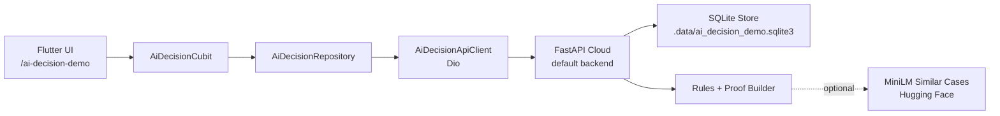

# AI Decision Workbench

Local, app-visible MVP for proving that the app can make a decision with
evidence. The demo is intentionally small: Flutter UI, one FastAPI backend,
local SQLite seed data, deterministic scoring, and optional MiniLM similar-case
support.

## MVP Purpose

The point of this feature is not "AI says something." The point is:

> Given a seeded business-loan case, the system returns a risk score,
> recommended action, rationale, and visible proof trail that explains exactly
> which inputs and rules produced the decision.

The MVP fails if the backend only logs a decision or if the Flutter UI cannot
show the proof trail.

## Where It Lives

| Concern | Path |
| --- | --- |
| Flutter route | `/ai-decision-demo` |
| Example hub entry | `lib/features/example/presentation/widgets/example_page_body.dart` |
| Flutter feature | `lib/features/ai_decision_demo/` |
| DI registration | `lib/core/di/register_ai_decision_demo_services.dart` |
| Route constants | `lib/core/router/app_routes.dart` |
| Route composition | `lib/app/router/routes_demos.dart` |
| Backend API | `demos/ai_decision_api/` |
| Local DB | `demos/ai_decision_api/.data/ai_decision_demo.sqlite3` |

## Architecture



Keep this as a local monolith demo. Do not add microservices, remote databases,
auth, queues, observability stacks, or generated client code for the MVP.

## Local Demo Data

The backend seeds six small-business loan cases:

| Case ID | Expected risk | Why it is useful |
| --- | --- | --- |
| `case_low_001` | Low | Stable revenue and long business history. |
| `case_low_002` | Low | Strong credit and strong revenue. |
| `case_med_001` | Medium | Moderate credit and growth-stage business. |
| `case_med_002` | Medium | Seasonal income and moderate revenue. |
| `case_high_001` | High | Prior default and low revenue. |
| `case_high_002` | High | Multiple prior defaults and young business. |

Seed or reset the DB from the backend folder:

```bash
cd demos/ai_decision_api
python -m seed_data --reset
```

The `.data/` folder is local runtime state and should not be committed.

## Run Locally

Start the backend:

```bash
cd demos/ai_decision_api
python3 -m venv .venv
source .venv/bin/activate
pip install -r requirements.txt -r requirements-dev.txt
python -m seed_data --reset
uvicorn main:app --reload --host 127.0.0.1 --port 8008
```

Start Flutter from the repo root. All platforms default to the hosted FastAPI
Cloud API.

```bash
flutter run -d chrome
```

To use a local backend or another deployment, set `AI_DECISION_API_BASE_URL`
explicitly. With `direnv`, copy [`envrc.example`](envrc.example), run
`direnv allow`, and use the repo Flutter wrapper normally.

## User Flow

1. Open the Example hub.
2. Tap **AI Decision Workbench**.
3. Select one seeded case from the queue.
4. Confirm the UI shows applicant, business, loan, and risk signals.
   The case selector and decision actions stay disabled until the case detail
   has finished loading.
5. Tap **Run decision support**.
6. Confirm the UI shows risk score, risk band, recommended action, rationale,
   confidence, input snapshot, band thresholds, similar-case status, rule trace,
   and evidence text.
7. Record an action: `approve`, `manual_review`, `request_docs`, or `decline`.
8. Confirm the action appears in action history.
9. Reopen the case and confirm the latest decision proof is still visible.

## API Contract

Only these endpoints are required for MVP:

| Method | Endpoint | Purpose |
| --- | --- | --- |
| `GET` | `/health` | Verify backend and similar-case setting. |
| `GET` | `/cases` | Return seeded case queue summaries. |
| `GET` | `/cases/{case_id}` | Return case context, signals, actions, and latest decision. |
| `POST` | `/cases/{case_id}/decision` | Create and persist a score, action, rationale, and proof. |
| `POST` | `/cases/{case_id}/actions` | Record the operator action for the case. |

Manual checks:

```bash
curl -s http://127.0.0.1:8008/health
curl -s http://127.0.0.1:8008/cases | python -m json.tool
curl -s http://127.0.0.1:8008/cases/case_high_001 | python -m json.tool
curl -s -X POST http://127.0.0.1:8008/cases/case_high_001/decision \
  -H 'content-type: application/json' \
  -d '{"operator_note":"Check seasonality"}' | python -m json.tool
curl -s -X POST http://127.0.0.1:8008/cases/case_high_001/actions \
  -H 'content-type: application/json' \
  -d '{"action_type":"request_docs","note":"Need bank statements"}' | python -m json.tool
```

## Proof Contract

Each decision response must include:

- `risk_score`: final normalized score from `0.0` to `1.0`
- `risk_band`: `low`, `medium`, or `high`
- `recommended_action`: `approve`, `manual_review`, `request_docs`, or
  `decline`
- `rationale`: deterministic plain-English explanation
- `signals`: machine-readable scoring signals
- `proof.input_snapshot`: exact values used for scoring
- `proof.base_score`: score before optional similar-case adjustment
- `proof.final_score`: final score, matching `risk_score`
- `proof.rule_trace`: evaluated rules, thresholds, observed values, pass/fail,
  contributions, and evidence strings
- `proof.band_thresholds`: low, medium, high, and selected band thresholds
- `proof.evidence`: object-level evidence from applicant, business, loan, and
  risk signals
- `proof.similar_case`: optional nearest reference case and contribution
- `proof.confidence`: `rules_only`, `complete`, or `partial`

The Flutter proof panel must render the important proof fields. Persisted
decisions must round-trip through `GET /cases/{case_id}` so a case can be
reopened after a decision is made.

## Optional MiniLM Similar Cases

The MVP works without ML. By default, similar-case support is disabled and
`proof.confidence` is `rules_only`. MiniLM packages are still listed in
`demos/ai_decision_api/requirements.txt` so FastAPI Cloud can enable the
feature using environment variables.

To try local MiniLM support:

```bash
cd demos/ai_decision_api
source .venv/bin/activate
ENABLE_SIMILAR_CASES=true uvicorn main:app --reload --host 127.0.0.1 --port 8008
```

The model name defaults to
`sentence-transformers/all-MiniLM-L6-v2`. The first run may download files from
Hugging Face. If the model cannot load, the backend falls back to rules-only
mode instead of breaking the demo.

Do not call Hugging Face directly from Flutter for this feature.

To enable MiniLM on FastAPI Cloud:

```bash
cd demos/ai_decision_api
fastapi cloud env set ENABLE_SIMILAR_CASES true .
fastapi cloud env set --secret HUGGINGFACE_API_KEY "hf_..." .
fastapi deploy
```

Then verify the deployed backend before pointing Flutter at it:

```bash
curl -s https://YOUR_APP.fastapicloud.dev/health | python -m json.tool
```

Expected:

```json
{
  "status": "ok",
  "similar_cases_enabled": true,
  "model": "sentence-transformers/all-MiniLM-L6-v2"
}
```

To confirm similar-cases are actively used (not just enabled), run one decision
and check the proof:

```bash
curl -s -X POST "https://ai-decision-api.fastapicloud.dev/cases/case_high_001/decision" \
  -H "content-type: application/json" \
  -d '{"operator_note":"Check seasonality"}' | python -m json.tool
```

Look for:

- `meta.similar_cases_used = true`
- `proof.confidence = "complete"`
- `proof.similar_case.used = true`
- `proof.similar_case.contribution` is non-zero

## Validation

Backend:

```bash
cd demos/ai_decision_api
source .venv/bin/activate
python -m seed_data --reset
python -m pytest
```

Flutter:

```bash
flutter test test/features/ai_decision_demo
flutter test test/features/example/presentation/widgets/example_page_body_test.dart
flutter analyze \
  lib/features/ai_decision_demo \
  lib/core/di/register_ai_decision_demo_services.dart \
  lib/app/router/routes_demos.dart \
  lib/core/router/app_routes.dart \
  lib/features/example/presentation/widgets/example_page_body.dart \
  test/features/ai_decision_demo \
  test/features/example/presentation/widgets/example_page_body_test.dart
./bin/router_feature_validate
```

Docs:

```bash
npx markdownlint-cli2 \
  docs/ai_decision_workbench.md \
  docs/ai_decision_system_plan.md \
  demos/ai_decision_api/README.md \
  docs/README.md \
  docs/feature_overview.md \
  README.md
```

## MVP Non-Goals

- No production auth or RBAC.
- No remote production database.
- No OpenTelemetry, metrics stack, or tracing dashboard.
- No model calibration or evaluation harness without real labels.
- No generated Flutter API client.
- No offline-first sync integration.
- No direct Flutter-to-Hugging-Face calls.
- No deployment required for MVP usage. The app defaults to a hosted FastAPI
  Cloud backend for convenience, but local runs remain the canonical MVP path
  and can be used by setting `AI_DECISION_API_BASE_URL`.

## Future Upgrades

Add these only after the local proof demo is convincing:

- Better visual layout for queue, object context, and proof panels.
- More realistic seed data and labeled reference cases.
- Optional FastAPI Cloud deployment with a stable preview URL.
- Auth and role-aware action permissions.
- Structured audit export for decisions and actions.
- Evaluation set with real expected outcomes and regression thresholds.
- Observability after the endpoint is used beyond local demo.
