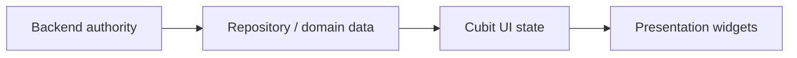

# Mobile / Backend Failure Boundaries

Six recurring failure modes when Flutter clients integrate backends. Each row
pairs a mobile rule, a backend rule, and review/test evidence from this repo.

## State ownership flow

Backend owns durable truth. Repositories translate wire → domain. Cubits own
ephemeral UI state. Widgets render Cubit state only — they do not re-parse JSON
or invent server truth.

---

## 1. Blind response trust

| | |
| --- | --- |
| **Problem** | Assume every 200 body matches the happy-path shape. |
| **Cause** | Brittle `as` casts / `.cast<Map>()`; tests that expect `TypeError`. |
| **Repo example** | Pre-hardening AI Decision / GraphQL DTOs (`ai_decision_dto.dart`, `graphql_country_dto.dart`). |
| **Mobile rule** | Required fields via defensive readers → `FormatException` / feature data failure. |
| **Backend rule** | Stable required fields; additive optionals; document breaking changes. |
| **Evidence** | DTO tests expect `FormatException`; GraphQL maps to `GraphqlDemoErrorType.data`. |

## 2. Broken pagination

| | |
| --- | --- |
| **Problem** | Offset/cursor drift, duplicate rows, infinite empty pages. |
| **Cause** | No shared page contract; UI concatenates without dedupe. |
| **Repo example** | No production pagination yet — contract only in [`backend/API_CONTRACT_GUIDE.md`](../backend/API_CONTRACT_GUIDE.md). |
| **Mobile rule** | Refresh replaces; load-more appends with id dedupe; stop on empty/`has_more=false`. |
| **Backend rule** | Stable opaque cursors or documented offsets; never reorder mid-page without new cursor. |
| **Evidence** | When first list lands: page/empty/dedupe/malformed tests (guide checklist). |

## 3. Duplicate requests

| | |
| --- | --- |
| **Problem** | Double submit / refresh storms create duplicate mutations or races. |
| **Cause** | Missing idempotency keys; Cubit fires without in-flight guards. |
| **Repo example** | Auth refresh single-flight + retry interceptors on shared Dio; offline sync request ids. |
| **Mobile rule** | Single-flight refresh; disable/debounce mutating CTAs; idempotency for sync. |
| **Backend rule** | Honor idempotency keys; make mutations safe to retry. |
| **Evidence** | `test/shared/http/auth_token_interceptor_*`; offline sync tests. |

## 4. Backend presentation work

| | |
| --- | --- |
| **Problem** | API returns localized copy, layout hints, or widget trees. |
| **Cause** | Coupling UI to one client; blocks multi-platform. |
| **Repo example** | Domain models stay semantic (`AiDecisionCaseSummary.status` as string), not Material widgets. |
| **Mobile rule** | Map domain → localized strings in presentation; no backend HTML/widget payloads. |
| **Backend rule** | Return codes/fields; leave copy to clients (or i18n keys only by explicit contract). |
| **Evidence** | Clean Architecture import guards; DTO policy. |

## 5. Analytics overload

| | |
| --- | --- |
| **Problem** | Emit every tap/network event; PII in crash/analytics. |
| **Cause** | Product analytics treated as free logging. |
| **Repo example** | Firebase Analytics dependency without product event taxonomy; ADR-0005 doc-only posture. |
| **Mobile rule** | Structured `AppErrorCode`; no tokens/PII in Crashlytics; analytics events only when product asks. |
| **Backend rule** | Server-side audit logs for security-sensitive actions; don't require chatty clients. |
| **Evidence** | [`observability.md`](../observability.md), [`plans/future_observability.md`](../plans/future_observability.md). |

## 6. Backend truth in UI state

| | |
| --- | --- |
| **Problem** | Cubit/state holds DTOs or raw maps as “source of truth”. |
| **Cause** | Skipping domain mapping; widgets read wire keys. |
| **Repo example** | Forbidden by DTO policy — DTO in Cubit state is an anti-pattern. |
| **Mobile rule** | Cubit stores domain/UI models; repositories own wire. |
| **Backend rule** | N/A beyond stable contracts. |
| **Evidence** | `tool/check_domain_wire_leaks.sh` (warn); architecture review checklists. |

## Related

- Contract guide: [`backend/API_CONTRACT_GUIDE.md`](../backend/API_CONTRACT_GUIDE.md)
- PR checklist: [`contributing/PR_REVIEW_CHECKLIST.md`](../contributing/PR_REVIEW_CHECKLIST.md)
- Reduce surprise: [`architecture/reduce_surprise_patterns.md`](reduce_surprise_patterns.md)
