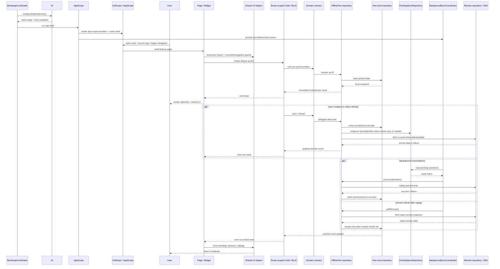

# Architecture — lazy loading and state flow

Continued from [`architecture_details.md`](../architecture_details.md).

## Lazy Loading Patterns

This codebase implements comprehensive lazy loading strategies to optimize startup time and bundle size. See also [New Developer Guide §3 Application flow](../new_developer_guide.md#3-application-flow) for deferred feature loading from an onboarding perspective.

### Deferred Routes

Heavy features are loaded via `DeferredPage` + `deferred as` imports in the
split route files under `apps/mobile/lib/app/router/` (`routes_core.dart`,
`routes_demos.dart`, and `route_groups.dart`). These features ship outside the
initial bundle and load on-demand when the user navigates to them:

- **Google Maps** - Heavy native SDK dependencies
- **Markdown Editor** - Custom RenderObject implementation
- **Charts** - Data visualization libraries
- **WebSocket** - Real-time communication libraries

```dart
GoRoute(
  path: AppRoutes.googleMapsPath,
  name: AppRoutes.googleMaps,
  builder: (context, state) => DeferredPage(
    loadLibrary: google_maps_page.loadLibrary,
    builder: (context) => google_maps_page.buildGoogleMapsPage(),
  ),
),
```

**Impact:** Significant reduction in initial app bundle size (estimated 9-17 MB saved) and faster startup time.

### On-Demand Services

- **BackgroundSyncCoordinator**: Starts via `SyncStatusCubit.ensureStarted()` when first sync-dependent feature is accessed
- **RemoteConfigCubit**: Initializes via `RemoteConfigCubit.ensureInitialized()` only when a feature requests config values
- **Dependency Injection**: All services use lazy singletons (`registerLazySingletonIfAbsent`) - instances created only on first access

### Route-Level Cubit Initialization

Most feature-specific cubits (Chat, Maps, GraphQL, Profile, WebSocket) are created at route level rather than app scope, reducing memory footprint for unused features.

> **See also:** [Lazy Loading Review](../performance/lazy_loading_review.md) for comprehensive analysis, implementation details, and best practices.

## State Management Flow

This sequence uses the same mental model as the architecture diagram above:
bootstrap and app-shell setup happen first, then feature execution flows through
presentation into domain contracts and data-layer composition, with background
sync running as a separate reconciliation path.


