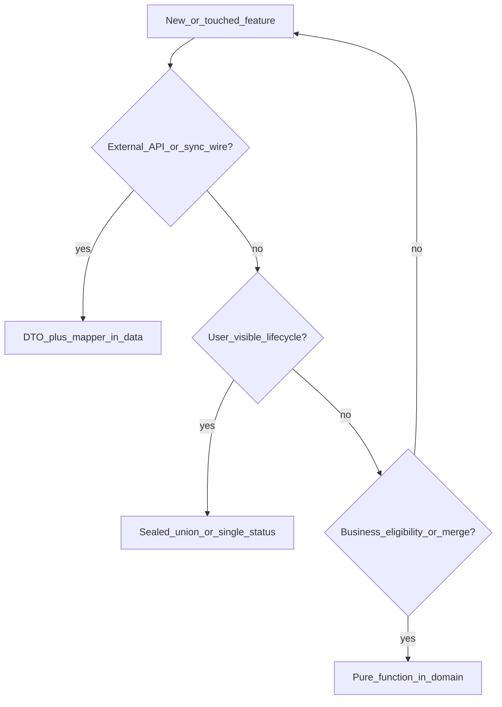

# Reduce-Surprise Patterns (Agent Guide)

Canonical semantic-quality guide for this repo. Folder/import gates live in
[`feature_structure_contract.md`](feature_structure_contract.md) and
[`check_clean_architecture_imports.sh`](../../tool/check_clean_architecture_imports.sh);
this doc closes **semantic** gaps (DTO boundaries, invalid states, decisions,
errors).

Scorecard evidence: [`../audits/senior_patterns_review_2026-06.md`](../audits/senior_patterns_review_2026-06.md).
Program index: [`../plans/senior_patterns_optimization_2026-06.md`](../plans/senior_patterns_optimization_2026-06.md).

## When to read

Read this guide before:

- Adding or changing an **external API**, sync payload, or persistence wire shape
- Designing **Cubit/BLoC state** (loading, ready, error, offline)
- Implementing **offline-first sync** or merge policy
- Mapping **failures** to user-visible errors

Also load [`use_case_dto_policy.md`](use_case_dto_policy.md),
[`reference_features.md`](reference_features.md) (semantic grades), and
[`bloc_standards.md`](../bloc_standards.md).

## Pattern → repo mapping

| Pattern | Meaning | Repo canon |
| --- | --- | --- |
| P1 Guard clauses | Early returns; happy path last | [`bloc_standards.md`](../bloc_standards.md) |
| P2 Domain naming | Types name business concepts | [`clean_architecture.md`](../clean_architecture.md) |
| P3 Boundaries | DTOs/adapters at system edges | [`use_case_dto_policy.md`](use_case_dto_policy.md), AP-11 |
| P4 Invalid states | Sealed unions; one status channel | [`bloc/cubit_file_template.md`](../bloc/cubit_file_template.md), AP-13/14 |
| P5 Decisions | Pure domain rules, no I/O | [`calculator`](../features/calculator.md) domain, AP-16 |
| P6 Errors | Typed failures → l10n | [`reliability_error_handling_performance.md`](../reliability_error_handling_performance.md), AP-15 |
| P7 Reviewable diffs | One pattern, one feature, ≤400 LOC | [`../testing/matrix_required_by_change.md`](../testing/matrix_required_by_change.md) |

## Copy-from decision tree



Numbered flow:

1. **HTTP/GraphQL/Firestore/sync payload?** → DTO in `data/`, mapper tests; domain stays pure.
2. **Loading / ready / error visible?** → `@freezed sealed class` state (see `remote_config`, `deeplink`).
3. **Merge, eligibility, validation rule?** → `domain/` pure function + unit tests (no repository mocks).
4. **Failure surfaces in UI?** → Feature enum, `AppError`, or sealed failure — never `e.toString()` in state.

## Gold exemplars by pattern

| Pattern | Copy from |
| --- | --- |
| P3 Boundaries | `remote_config`, `todo_list/data/todo_item_dto.dart`, `native_platform_showcase` |
| P4 Sealed state | `remote_config/presentation/cubit/remote_config_state.dart`, `deeplink/presentation/cubit/deep_link_state.dart`, `profile/presentation/cubit/profile_state.dart` (post PR-2A) |
| P5 Pure decisions | `calculator/domain/payment_calculator.dart`, `deeplink/domain/deep_link_parser.dart`, `todo_list/domain/todo_merge_policy.dart` |
| P6 Error chain | `counter/domain/counter_error.dart`, `iot/domain/iot_ble_failure_mapper.dart`, `profile/domain/profile_failure.dart` |

## Do-not-copy (semantic)

| Anti-pattern | Until fixed | Prefer |
| --- | --- | --- |
| Domain wire `fromJson` | legacy demos | DTO + mapper in `data/` |
| SDK transport in domain | — (fixed PR-1C) | `ChatRemotePath` + data adapters |
| `ViewStatus.success` + nullable payload | legacy todo/chat | Sealed `ready(data)` |
| Parallel `isLoading` + `ViewStatus` | legacy chat | Single status channel |
| `e.toString()` / `Object? error` in cubit state | — (fixed scapes PR-3B) | Typed failure |
| Merge policy in `data/` | — (fixed PR-3) | `domain/todo_merge_policy.dart` |
| Copy legacy demo layout/semantics | `playlearn`, root-level cubits | [`reference_features.md`](reference_features.md) gold rows |

See [`../flutter-anti-patterns.md`](../flutter-anti-patterns.md) AP-11…AP-17.

## Pre-ship checklist (agents)

Run from repo root on touched feature paths:

```bash
# Domain wire leaks
rg -n "fromJson|toJson" apps/mobile/lib/features/<feature>/domain -g '*.dart'

# Raw errors in cubit state
rg -n "e\\.toString\\(|Object\\? error" apps/mobile/lib/features/<feature>/presentation -g '*.dart'

# Invalid state combos
rg -n "ViewStatus" apps/mobile/lib/features/<feature>/presentation/cubit -g '*.dart'

# Architecture gates
bash tool/check_clean_architecture_imports.sh
bash tool/check_feature_modularity_leaks.sh   # boundary/import PRs
```

Optional warn-only: `bash tool/check_domain_wire_leaks.sh`

## PR discipline (P7)

- One primary pattern + one primary feature per PR (paired PRs: 1B, 3B only).
- ≤ ~400 LOC net; split cubit vs widgets if larger.
- Update scorecard row in [`senior_patterns_review_2026-06.md`](../audits/senior_patterns_review_2026-06.md).
- Mark AP-11…17 **Fixed** in [`flutter-anti-patterns.md`](../flutter-anti-patterns.md) when remediated.
- Do not add learned prose to [`AGENTS.md`](../../AGENTS.md) — link here.

## Related

- [`reference_features.md`](reference_features.md) — folder + semantic grades
- [`../review/bloc_checklist.md`](../review/bloc_checklist.md)
- [`../ai/skill_routing.md`](../ai/skill_routing.md) — repo-first row for this guide
