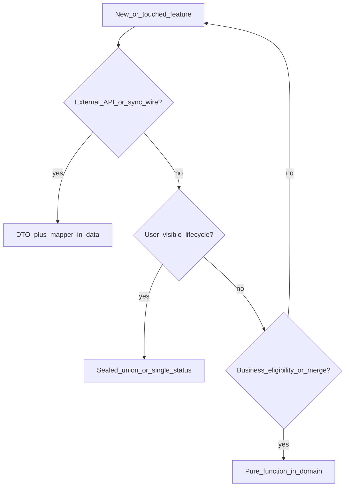

# Reduce-Surprise Patterns (Agent Guide)

Canonical semantic-quality guide for this repo. Reduce uncertainty at the
earliest stable boundary, before an ambiguous rule, owner, failure state, or
assumption spreads through layers. Folder/import gates live in
[`feature_structure_contract.md`](feature_structure_contract.md) and
[`check_clean_architecture_imports.sh`](../../tool/check_clean_architecture_imports.sh);
this doc closes **semantic** gaps (DTO boundaries, invalid states, decisions,
errors).

Scorecard evidence: [`../audits/senior_patterns_review_2026-06.md`](../audits/senior_patterns_review_2026-06.md).
Program index: this guide (senior-patterns reduce-surprise program, June 2026).

## When to read

Read this guide before:

- Adding or changing an **external API**, sync payload, or persistence wire shape
- Designing **Cubit/BLoC state** (loading, ready, error, offline)
- Implementing **offline-first sync** or merge policy
- Mapping **failures** to user-visible errors

Also load [`use_case_dto_policy.md`](use_case_dto_policy.md),
[`reference_features.md`](reference_features.md) (semantic grades), and
[`bloc_standards.md`](../bloc_standards.md).

## Decision-first feature frame

Answer before selecting a pattern or copying an exemplar:

| Question | Decision required | Proof shape |
| --- | --- | --- |
| Which rule is protected? | Name the user/business invariant in domain terms and one violating example. | Pure rule test or behavior-level acceptance test. |
| Where does responsibility belong? | Place pure reusable decisions in domain; I/O, ordering, retry, persistence, and sync orchestration in data; visible flow in Cubit/BLoC; composition in app shell. | Reviewer can trace one owner and dependency direction. |
| What can fail halfway? | List effects before each `await` or persistence boundary; define state after failure, retry/idempotency, cleanup/compensation, and recovery signal. | Failure-injection test at each material boundary. |
| Which paths must enforce the assumption? | Find every entry point, replay path, callback, migration, and adapter that can violate the invariant. Enforce at the narrowest shared boundary, not only one caller. | Bypass/adversarial tests plus type, parser, policy, state-machine, schema, or script guard. |

Readable code makes owner, invariant, data flow, and failure state discoverable.
Testable code exposes stable seams that can disprove the invariant. Reliable
code defines partial completion and recovery before the happy path. Cleverness
that weakens any of those properties is a regression.

## Pattern → repo mapping

| Pattern | Meaning | Repo canon |
| --- | --- | --- |
| P1 Guard clauses | Early returns; happy path last | [`bloc_standards.md`](../bloc_standards.md) |
| P2 Domain naming | Types name business concepts | [`clean_architecture.md`](../clean_architecture.md) |
| P3 Boundaries | DTOs/adapters at system edges | [`use_case_dto_policy.md`](use_case_dto_policy.md), AP-11 |
| P4 Invalid states | Sealed unions; one status channel | [`bloc/cubit_file_template.md`](../bloc/cubit_file_template.md), AP-13/14 |
| P5 Decisions | Pure domain rules, no I/O; data orchestrates and applies them at every relevant boundary | [`calculator`](reference_features.md) domain, AP-16 |
| P6 Errors | Typed failures → l10n | [`reliability_error_handling_performance.md`](../reliability_error_handling_performance.md), AP-15 |
| P7 Reviewable diffs | One pattern, one feature, ≤400 LOC | [`../testing/matrix_required_by_change.md`](../testing/matrix_required_by_change.md) |

## Copy-from decision tree


```mermaid
flowchart TD
  start[New_or_touched_feature]
  api{External_API_or_sync_wire?}
  lifecycle{User_visible_lifecycle?}
  rule{Business_eligibility_or_merge?}
  dto[DTO_plus_mapper_in_data]
  sealed[Sealed_union_or_single_status]
  domainFn[Pure_function_in_domain]
  start --> api
  api -->|yes| dto
  api -->|no| lifecycle
  lifecycle -->|yes| sealed
  lifecycle -->|no| rule
  rule -->|yes| domainFn
  rule -->|no| start
```

Numbered flow:

1. **HTTP/GraphQL/Firestore/sync payload?** → DTO + mapper in `data/` per
   [`use_case_dto_policy.md`](use_case_dto_policy.md) § DTOs And Mappers
   (Dart 3.13 primary constructors; leave `@freezed` Cubit state alone).
2. **Loading / ready / error visible?** → `@freezed sealed class` state (see `remote_config`, `deeplink`).
3. **Merge, eligibility, validation rule?** → `domain/` pure function + unit
   tests (no repository mocks). Data repositories still own I/O, ordering,
   retry, persistence, and invoking that policy on pull, replay, and concurrent
   write paths.
4. **Failure surfaces in UI?** → Feature enum, `AppError`, or sealed failure — never `e.toString()` in state.

## Gold exemplars by pattern

| Pattern | Copy from |
| --- | --- |
| P3 Boundaries | `remote_config`, `todo_list/data/todo_item_dto.dart`, `native_platform_showcase` |
| P4 Sealed state | `remote_config/presentation/cubit/remote_config_state.dart`, `deeplink/presentation/cubit/deep_link_state.dart`, `profile/presentation/cubit/profile_state.dart` (post PR-2A) |
| P5 Pure decisions | `calculator/domain/payment_calculator.dart`, `deeplink/domain/deep_link_parser.dart`, `todo_list/domain/todo_merge_policy.dart` |
| P6 Error chain | `counter/domain/counter_error.dart`, `iot/domain/iot_ble_failure_mapper.dart`, `profile/domain/profile_failure.dart` |

## Do-not-copy (semantic)

| Anti-pattern | Until fixed | Prefer |
| --- | --- | --- |
| Domain wire `fromJson` | legacy demos | DTO + mapper in `data/` |
| SDK transport in domain | — (fixed PR-1C) | `ChatRemotePath` + data adapters |
| `ViewStatus.success` + nullable payload | legacy todo/chat | Sealed `ready(data)` |
| Parallel `isLoading` + `ViewStatus` | legacy chat | Single status channel |
| `e.toString()` / `Object? error` in cubit state | — (fixed scapes PR-3B) | Typed failure |
| Merge policy in `data/` | — (fixed PR-3) | `domain/todo_merge_policy.dart` |
| Copy legacy demo layout/semantics | `playlearn`, root-level cubits | [`reference_features.md`](reference_features.md) gold rows |

See [`../flutter-anti-patterns.md`](../engineering/flutter-anti-patterns.md) AP-11…AP-17.

## Pre-ship checklist (agents)

- Protected rule and violating example are explicit.
- One stable owner exists for each decision; orchestration does not duplicate it.
- Every material partial-failure state has retry, cleanup/compensation, and a
  detection signal.
- Cross-boundary assumptions are enforced on all entry, replay, callback, and
  migration paths; one caller guard is not treated as system-wide proof.

Run from repo root on touched feature paths:

```bash
# Domain wire leaks
rg -n "fromJson|toJson" apps/mobile/lib/features/<feature>/domain -g '*.dart'

# Raw errors in cubit state
rg -n "e\\.toString\\(|Object\\? error" apps/mobile/lib/features/<feature>/presentation -g '*.dart'

# Invalid state combos
rg -n "ViewStatus" apps/mobile/lib/features/<feature>/presentation/cubit -g '*.dart'

# Architecture gates
bash tool/check_clean_architecture_imports.sh
bash tool/check_feature_modularity_leaks.sh   # boundary/import PRs
```

Optional warn-only: `bash tool/check_domain_wire_leaks.sh`

## PR discipline (P7)

- One primary pattern + one primary feature per PR (paired PRs: 1B, 3B only).
- ≤ ~400 LOC net; split cubit vs widgets if larger.
- Update scorecard row in [`senior_patterns_review_2026-06.md`](../audits/senior_patterns_review_2026-06.md).
- Mark AP-11…17 **Fixed** in [`flutter-anti-patterns.md`](../engineering/flutter-anti-patterns.md) when remediated.
- Do not add learned prose to [`AGENTS.md`](../../AGENTS.md) — link here.

## Related

- [`reference_features.md`](reference_features.md) — folder + semantic grades
- [`../review/bloc_checklist.md`](../review/bloc_checklist.md)
- [`../ai/skill_routing.md`](../ai/skill_routing.md) — repo-first row for this guide
