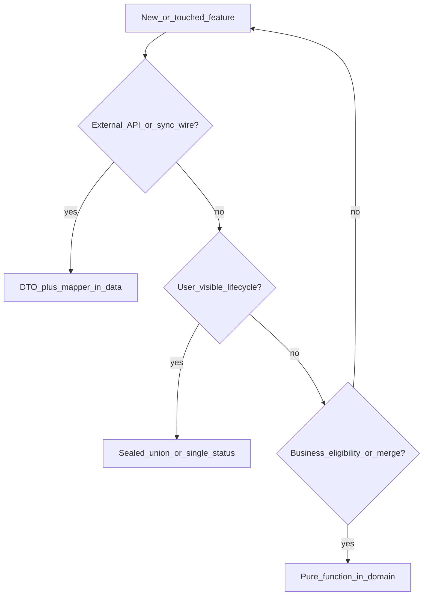

# Reduce-Surprise Patterns (Agent Guide)

Canonical semantic-quality guide for this repo. Reduce uncertainty at the
earliest stable boundary, before an ambiguous rule, owner, failure state, or
assumption spreads through layers. Folder/import gates live in
[`feature_structure_contract.md`](feature_structure_contract.md) and
[`check_clean_architecture_imports.sh`](../../tool/check_clean_architecture_imports.sh);
this doc closes **semantic** gaps (DTO boundaries, invalid states, decisions,
errors).

Scorecard evidence (historical): [`../audits/senior_patterns_review_2026-06.md`](../audits/senior_patterns_review_2026-06.md).
Judgment guidance disposition: [`../audits/senior_engineering_judgment_guidance_review_2026-09.md`](../audits/senior_engineering_judgment_guidance_review_2026-09.md).
Program index: this guide (senior-patterns reduce-surprise program).

Heuristic input (not repository authority): paraphrased senior control-flow,
naming, boundary, state, policy, error, and reviewable-diff patterns.

## When to read

Read this guide before:

- Adding or changing an **external API**, sync payload, or persistence wire shape
- Designing **Cubit/BLoC state** (loading, ready, error, offline)
- Implementing **offline-first sync** or merge policy
- Mapping **failures** to user-visible errors
- Choosing guard-clause vs nested structure, or splitting a mixed PR

Also load [`use_case_dto_policy.md`](use_case_dto_policy.md),
[`reference_features.md`](reference_features.md) (semantic grades), and
[`bloc_standards.md`](../bloc_standards.md).

## Decision-first feature frame

Answer before selecting a pattern or copying an exemplar:

| Question | Decision required | Proof shape |
| --- | --- | --- |
| Which rule is protected? | Name the user/business invariant in domain terms and one violating example. | Pure rule test or behavior-level acceptance test. |
| Where does responsibility belong? | Place pure reusable decisions in domain; I/O, ordering, retry, persistence, and sync orchestration in data; visible flow in Cubit/BLoC; composition in app shell. | Reviewer can trace one owner and dependency direction. |
| What can fail halfway? | List effects before each `await` or persistence boundary; define state after failure, retry/idempotency, cleanup/compensation, and recovery signal. | Failure-injection test at each material boundary. |
| Which paths must enforce the assumption? | Find every entry point, replay path, callback, migration, and adapter that can violate the invariant. Enforce at the narrowest shared boundary, not only one caller. | Bypass/adversarial tests plus type, parser, policy, state-machine, schema, or script guard. |

Readable code makes owner, invariant, data flow, and failure state discoverable.
Testable code exposes stable seams that can disprove the invariant. Reliable
code defines partial completion and recovery before the happy path. Cleverness
that weakens any of those properties is a regression.

## Pattern decision table

| Pattern | Use when | Avoid when | Owner | Proof |
| --- | --- | --- | --- | --- |
| P1 Guard clauses | Invalid/precondition exits before work; happy path should read top-to-bottom | Exhaustive `switch`, grammar/tree parsers, nesting that **is** the structure | [`bloc_standards.md`](../bloc_standards.md) § Control Flow | Cubit/unit tests for each early exit + one normal path |
| P2 Domain naming | Risky public types, predicates, commands, failures at boundaries | Short locals where meaning is obvious in scope | [`clean_architecture.md`](../clean_architecture.md); review via [`architecture_checklist.md`](../review/architecture_checklist.md) | Reviewer can state domain role without reading implementation |
| P3 Boundaries | External/storage shape can drift from domain | Tiny internal-only maps where a mapper adds churn without safety | [`use_case_dto_policy.md`](use_case_dto_policy.md) | Mapper/repository tests + import fail gates; AP-11 warn scan is **not** a fail gate |
| P4 Invalid states | Reachable combinations or required fields differ by status | Single status record cannot express invalid combos; forcing unions for taste | [`bloc_standards.md`](../bloc_standards.md) § State Shape | Impossible combinations unrepresentable; widget/cubit tests cover visible variants |
| P5 Decisions | Reusable eligibility/merge/validation decisions | I/O/orchestration in domain; policy tests that mock repositories | [`use_case_dto_policy.md`](use_case_dto_policy.md); exemplars below | Pure unit tests without repository mocks; every write/replay path invokes the policy |
| P6 Errors | User-visible or logged failures | Parallel error taxonomy; `e.toString()` in state; PII in logs | [`reliability_error_handling_performance.md`](../reliability_error_handling_performance.md), [`observability.md`](../observability.md), [`logging.md`](../engineering/logging.md) | Typed failure → localized UI + safe `error_code`/`request_id` context |
| P7 Reviewable diffs | Every PR | Mixing unrelated behavior + rename + generated + cleanup without justification | [`code_review_playbook.md`](../review/code_review_playbook.md), [`git_and_branching_strategy.md`](../git_and_branching_strategy.md) | Coherent diff story, rollback impact, behavior/refactor separation |

## Pattern → repo mapping

| Pattern | Meaning | Repo canon |
| --- | --- | --- |
| P1 Guard clauses | Early returns; happy path last | [`bloc_standards.md`](../bloc_standards.md) § Control Flow |
| P2 Domain naming | Types name business concepts | [`clean_architecture.md`](../clean_architecture.md) |
| P3 Boundaries | DTOs/adapters at system edges | [`use_case_dto_policy.md`](use_case_dto_policy.md); AP-11 historical/review (warn scan not fail) |
| P4 Invalid states | Reachable states only; sealed when fields differ | [`bloc_standards.md`](../bloc_standards.md) § State Shape; AP-13/14 |
| P5 Decisions | Pure domain rules, no I/O; data orchestrates at every relevant boundary | [`use_case_dto_policy.md`](use_case_dto_policy.md), AP-16 |
| P6 Errors | Typed failures → l10n + safe logs | [`reliability_error_handling_performance.md`](../reliability_error_handling_performance.md), AP-15 |
| P7 Reviewable diffs | Coherent, reversible, reviewable change | [`code_review_playbook.md`](../review/code_review_playbook.md), [`git_and_branching_strategy.md`](../git_and_branching_strategy.md) |

## Copy-from decision tree


```mermaid
flowchart TD
  start[New_or_touched_feature]
  api{External_API_or_sync_wire?}
  lifecycle{User_visible_lifecycle?}
  rule{Business_eligibility_or_merge?}
  dto[DTO_plus_mapper_in_data]
  sealed[Sealed_union_or_single_status]
  domainFn[Pure_function_in_domain]
  start --> api
  api -->|yes| dto
  api -->|no| lifecycle
  lifecycle -->|yes| sealed
  lifecycle -->|no| rule
  rule -->|yes| domainFn
  rule -->|no| start
```

Numbered flow:

1. **HTTP/GraphQL/Firestore/sync payload?** → DTO + mapper in `data/` per
   [`use_case_dto_policy.md`](use_case_dto_policy.md) § DTOs And Mappers
   (Dart 3.13 primary constructors; leave `@freezed` Cubit state alone).
2. **Loading / ready / error visible?** → Choose simple status record vs
   `@freezed sealed class` using [`bloc_standards.md`](../bloc_standards.md)
   § State Shape (see `remote_config`, `deeplink`).
3. **Merge, eligibility, validation rule?** → `domain/` pure function + unit
   tests (no repository mocks). Data repositories still own I/O, ordering,
   retry, persistence, and invoking that policy on pull, replay, and concurrent
   write paths.
4. **Failure surfaces in UI?** → Feature enum, `AppError`, or sealed failure — never `e.toString()` in state.

## Gold exemplars by pattern

| Pattern | Copy from |
| --- | --- |
| P3 Boundaries | `remote_config/data/firebase_remote_config_data_source.dart` → `domain/remote_config_remote_data_source.dart`; `todo_list/data/todo_item_dto.dart`; `native_platform_showcase/data/method_channel_native_showcase_host_language_service.dart` → `domain/native_showcase_host_language_service.dart` |
| P4 Sealed state | `remote_config/presentation/cubit/remote_config_state.dart`, `deeplink/presentation/cubit/deep_link_state.dart`, `profile/presentation/cubit/profile_state.dart` |
| P5 Pure decisions | `todo_list/domain/todo_merge_policy.dart`; `deeplink/domain/deep_link_parser.dart`; `staff_app_demo/domain/staff_demo_proof_submit_eligibility.dart` (`validateDraft` only — do **not** copy `messageFor`) |
| P6 Error chain | `auth/presentation/widgets/auth_error_message.dart` (stable Firebase codes → l10n); `chat/presentation/widgets/chat_terminal_sync_failure_text.dart` (typed sync codes → l10n); `counter/domain/counter_error.dart` + `presentation/cubit/counter_error_localizer.dart` for **known** `CounterErrorType` cases only (not `unknown`/`error.message`) |

## Do-not-copy (semantic)

| Anti-pattern | Until fixed | Prefer |
| --- | --- | --- |
| Domain wire `fromJson` | legacy demos | DTO + mapper in `data/` |
| SDK transport in domain | — (fixed PR-1C) | `ChatRemotePath` + data adapters |
| `ViewStatus.success` + nullable payload | legacy todo/chat | Sealed `ready(data)` |
| Parallel `isLoading` + `ViewStatus` | legacy chat | Single status channel |
| `e.toString()` / `Object? error` in cubit state | — (fixed scapes PR-3B) | Typed failure |
| Merge policy in `data/` | — (fixed PR-3) | `domain/todo_merge_policy.dart` |
| Copy legacy demo layout/semantics | `playlearn`, root-level cubits | [`reference_features.md`](reference_features.md) gold rows |
| Hardcoded English `displayMessage` / domain `messageFor` as the l10n chain | — | Typed failure/code + presentation localizer |
| IoT `cause.toString()` detail in state / Counter `unknown` raw message | — | Stable error code + l10n fallback; keep raw text out of gold paths |

See [`../flutter-anti-patterns.md`](../engineering/flutter-anti-patterns.md) AP-11…AP-17.
AP-11 domain-wire greps are **warn-only / historically Fixed**; do not treat
`tool/check_domain_wire_leaks.sh` as a current fail gate over live
`apps/mobile` sources.

## Pre-ship checklist (agents)

- Protected rule and violating example are explicit.
- One stable owner exists for each decision; orchestration does not duplicate it.
- Every material partial-failure state has retry, cleanup/compensation, and a
  detection signal.
- Cross-boundary assumptions are enforced on all entry, replay, callback, and
  migration paths; one caller guard is not treated as system-wide proof.

Run from repo root on touched feature paths:

```bash
# Domain wire leaks (warn-only; not a fail gate)
rg -n "fromJson|toJson" apps/mobile/lib/features/<feature>/domain -g '*.dart'

# Raw errors in cubit state
rg -n "e\\.toString\\(|Object\\? error" apps/mobile/lib/features/<feature>/presentation -g '*.dart'

# Invalid state combos
rg -n "ViewStatus" apps/mobile/lib/features/<feature>/presentation/cubit -g '*.dart'

# Architecture gates
bash tool/check_clean_architecture_imports.sh
bash tool/check_feature_modularity_leaks.sh   # boundary/import PRs
```

Optional warn-only: `bash tool/check_domain_wire_leaks.sh` (stale root today;
repair is a separate tool follow-up).

## PR discipline (P7)

- Prefer one primary user/risk outcome per PR; split unrelated rename/cleanup.
- Keep generated output with the source change that requires it.
- Coherence, reversibility, and review burden decide split — not a universal
  LOC gate. Net size ≈400 LOC may be a **non-blocking review prompt**; justify
  larger coherent changes or inseparable refactoring in the PR body.
- Mark AP-11…17 **Fixed** in [`flutter-anti-patterns.md`](../engineering/flutter-anti-patterns.md)
  only when remediated in the living codebase.
- Do not rewrite the June scorecard for routine PRs; historical audits stay
  immutable. New disposition belongs in change notes or a dated audit.
- Do not add learned prose to [`AGENTS.md`](../../AGENTS.md) — link here.

Deep review/Git policy:
[`../review/code_review_playbook.md`](../review/code_review_playbook.md),
[`../git_and_branching_strategy.md`](../git_and_branching_strategy.md).

## Related

- [`reference_features.md`](reference_features.md) — folder + semantic grades
- [`../bloc_standards.md`](../bloc_standards.md) — P1 control flow + P4 state shape
- [`../review/bloc_checklist.md`](../review/bloc_checklist.md)
- [`../ai/skill_routing.md`](../ai/skill_routing.md) — repo-first row for this guide
