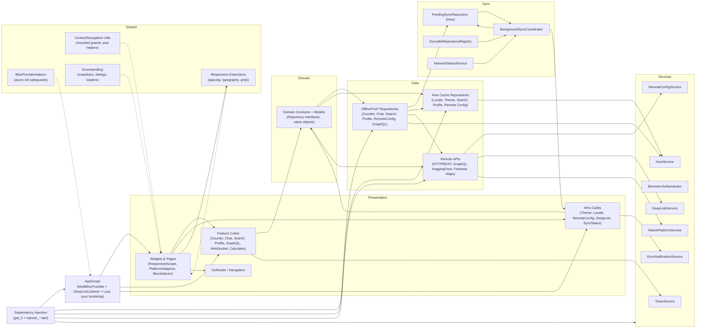
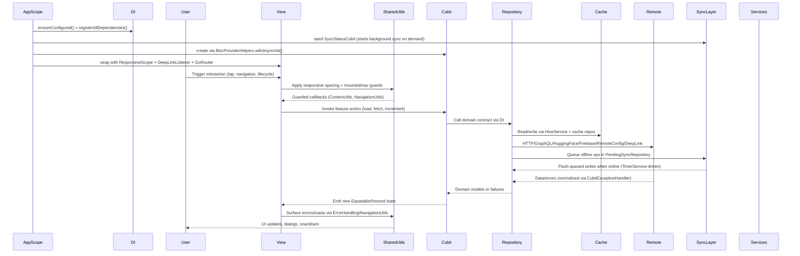

# Architecture Details

This document captures the architecture diagram, key principles, state management rationale, and dependency flow patterns used throughout the app.

> **Related:** [Clean Architecture](clean_architecture.md) | [SOLID Principles](solid_principles.md) | [DRY Principles](dry_principles.md)

## Architecture Diagram



## Key Principles

- Clean boundaries: widgets depend on cubits, cubits depend on domain contracts
- Feature cubits (including Counter) are created at route scope to minimize startup work
- Presentation uses responsive helpers and `PlatformAdaptive.*` components
- DI and bootstrap centralized in `injector*.dart` and `AppScope`
- Offline-first repositories coordinate cache, remote, and sync queues
- Deferred route loading keeps heavy features out of the initial bundle
- Lazy startup: background sync and remote config initialize on first use
- Lifecycle safety via `CubitExceptionHandler`, `CubitSubscriptionMixin`,
  `CubitStateEmissionMixin`, and mounted checks

## State Management Rationale (Why BLoC)

- Predictable, replayable state transitions (events in, state out)
- Business rules isolated from widgets for unit/bloc testing
- `BlocSelector` limits rebuild scope for performance
- Immutable states reduce accidental side effects
- **Compile-time safety** via type-safe extensions and widgets (see [Compile-Time Safety Usage Guide](compile_time_safety_usage.md))

> **For detailed comparison with Riverpod and comprehensive rationale, see [State Management Choice](state_management_choice.md)**

## Lazy Loading Patterns

This codebase implements comprehensive lazy loading strategies to optimize startup time and bundle size:

### Deferred Routes

Heavy features are loaded via `DeferredPage` + `deferred as` imports in `lib/app/router/routes.dart`. These features ship outside the initial bundle and load on-demand when the user navigates to them:

- **Google Maps** - Heavy native SDK dependencies
- **Markdown Editor** - Custom RenderObject implementation
- **Charts** - Data visualization libraries
- **WebSocket** - Real-time communication libraries

```dart
GoRoute(
  path: AppRoutes.googleMapsPath,
  name: AppRoutes.googleMaps,
  builder: (context, state) => DeferredPage(
    loadLibrary: google_maps_page.loadLibrary,
    builder: (context) => google_maps_page.buildGoogleMapsPage(),
  ),
),
```

**Impact:** Significant reduction in initial app bundle size (estimated 9-17 MB saved) and faster startup time.

### On-Demand Services

- **BackgroundSyncCoordinator**: Starts via `SyncStatusCubit.ensureStarted()` when first sync-dependent feature is accessed
- **RemoteConfigCubit**: Initializes via `RemoteConfigCubit.ensureInitialized()` only when a feature requests config values
- **Dependency Injection**: All services use lazy singletons (`registerLazySingletonIfAbsent`) - instances created only on first access

### Route-Level Cubit Initialization

Most feature-specific cubits (Chat, Maps, GraphQL, Profile, WebSocket) are created at route level rather than app scope, reducing memory footprint for unused features.

> **See also:** [Lazy Loading Review](../analysis/lazy_loading_late_review.md) for comprehensive analysis, implementation details, and best practices.

## State Management Flow


