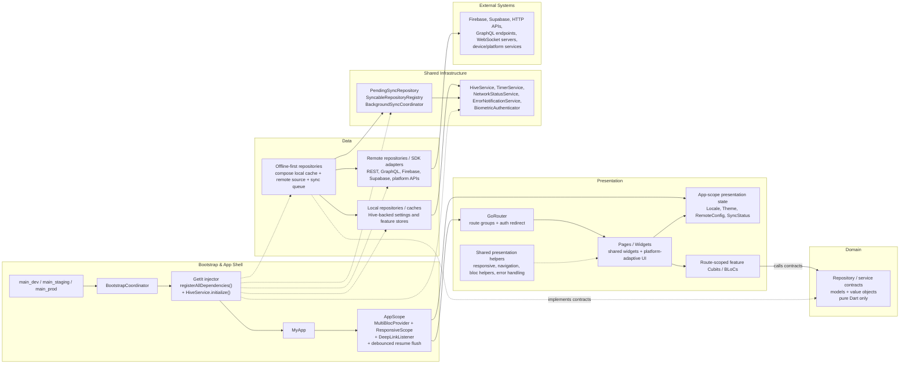
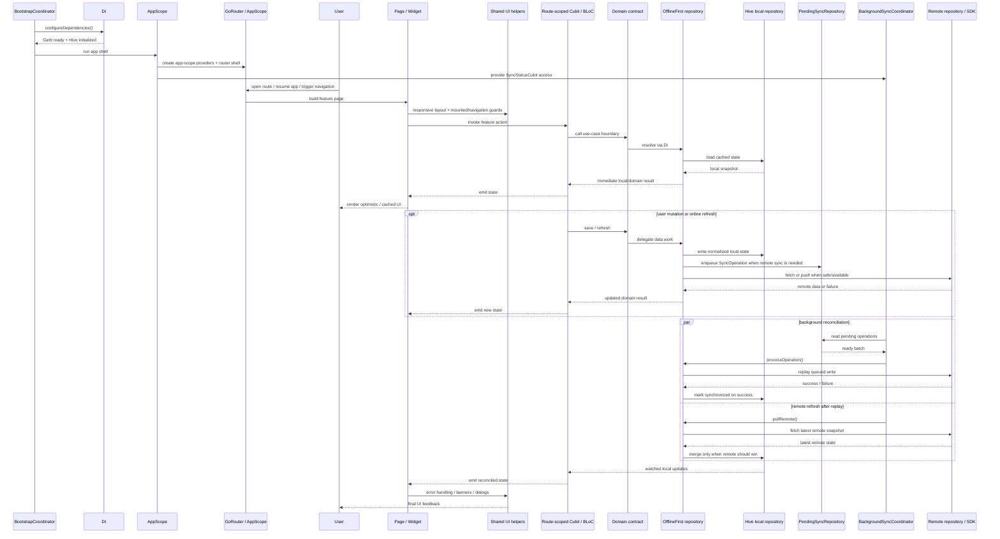

# Architecture Details

High-level architecture diagram, key principles, state management rationale,
and dependency flow patterns for this Flutter BLoC app.

## Document Map

Start here for the big picture; drill into the linked docs for specifics.

| Question | Document |
| -------- | -------- |
| How are layers structured? | [Clean Architecture](clean_architecture.md) |
| How do I add a new feature? | [Feature Delivery Guide](feature_implementation_guide.md) |
| How is SOLID applied? | [SOLID Principles](solid_principles.md) |
| Where is duplication eliminated? | [DRY Principles](dry_principles.md) |
| How are responsibilities split? | [Separation of Concerns](separation_of_concerns.md) |
| How is modularity enforced? | [Modularity](modularity.md) |
| How does offline-first fit the architecture? | [Offline-First Architecture Case Study](engineering/offline_first_flutter_architecture_with_conflict_resolution.md) |
| Why BLoC over Riverpod? | [State Management Choice](state_management_choice.md) |
| What trade-offs exist? | [Trade-offs & Future](tradeoffs_and_future.md) |
| What are the architecture decisions? | [ADRs](adr/) |
| Code quality gates? | [Code Quality](CODE_QUALITY.md) |
| Best practices checklist? | [Flutter Best Practices Review](flutter_best_practices_review.md) |

## Architecture Diagram

This diagram separates the **app shell** from **feature-layer flow** so the
boot path, route creation, and offline-first composition are easier to read at
a glance.


```mermaid
flowchart LR
  subgraph Boot["Bootstrap & App Shell"]
    Entry["main_dev / main_staging / main_prod"]
    Bootstrap["BootstrapCoordinator"]
    DI["GetIt injector<br/>registerAllDependencies()<br/>+ HiveService.initialize()"]
    MyApp["MyApp"]
    AppScope["AppScope<br/>MultiBlocProvider + ResponsiveScope<br/>+ DeepLinkListener<br/>+ debounced resume flush"]
    Entry --> Bootstrap --> DI --> MyApp --> AppScope
  end

  subgraph Presentation["Presentation"]
    Router["GoRouter<br/>route groups + auth redirect"]
    AppState["App-scope presentation state<br/>Locale, Theme, RemoteConfig, SyncStatus"]
    FeatureUI["Pages / Widgets<br/>shared widgets + platform-adaptive UI"]
    FeatureLogic["Route-scoped feature Cubits / BLoCs"]
    SharedUI["Shared presentation helpers<br/>responsive, navigation, bloc helpers, error handling"]
  end

  subgraph Domain["Domain"]
    Contracts["Repository / service contracts<br/>models + value objects<br/>pure Dart only"]
  end

  subgraph Data["Data"]
    OfflineRepos["Offline-first repositories<br/>compose local cache + remote source + sync queue"]
    LocalData["Local repositories / caches<br/>Hive-backed settings and feature stores"]
    RemoteData["Remote repositories / SDK adapters<br/>REST, GraphQL, Firebase, Supabase, platform APIs"]
  end

  subgraph Infra["Shared Infrastructure"]
    Sync["PendingSyncRepository<br/>SyncableRepositoryRegistry<br/>BackgroundSyncCoordinator"]
    Services["HiveService, TimerService,<br/>NetworkStatusService, ErrorNotificationService,<br/>BiometricAuthenticator"]
  end

  subgraph External["External Systems"]
    APIs["Firebase, Supabase, HTTP APIs,<br/>GraphQL endpoints, WebSocket servers,<br/>device/platform services"]
  end

  AppScope --> Router
  AppScope --> AppState
  Router --> FeatureUI
  FeatureUI --> FeatureLogic
  FeatureUI --> AppState
  SharedUI -.-> FeatureUI
  FeatureLogic -->|calls contracts| Contracts
  OfflineRepos -.->|implements contracts| Contracts
  OfflineRepos --> LocalData
  OfflineRepos --> RemoteData
  OfflineRepos --> Sync
  LocalData --> Services
  Sync --> Services
  RemoteData --> APIs
  DI -.-> OfflineRepos
  DI -.-> LocalData
  DI -.-> RemoteData
  DI -.-> Sync
  DI -.-> Services
```

How to read the diagram:

- Solid arrows show the main runtime path from app shell to feature execution.
- Dashed arrows show registration or implementation relationships rather than
  direct widget-time calls.
- Offline-first is a **data-layer composition pattern** here, not a separate
  layer between presentation and domain.
- Route-scoped cubits/blocs keep feature work lazy; app-scope state is limited
  to cross-cutting concerns such as theme, locale, remote config, and sync
  status.

## Key Principles

- Clean boundaries: widgets depend on cubits/blocs, and cubits/blocs call
  domain contracts rather than concrete repositories
- App shell concerns (`BootstrapCoordinator`, `MyApp`, `AppScope`, routing) are
  separated from feature modules to keep startup and feature flow distinct
- Feature cubits (Counter, Chat, Search, Profile, Supabase Auth, etc.) are
  created at route scope to minimize startup work
- Presentation uses responsive helpers and `PlatformAdaptive.*` components
- DI and bootstrap are centralized in `injector*.dart`,
  `BootstrapCoordinator`, and `AppScope`
- Offline-first repositories coordinate local cache, remote adapters, and sync
  queues entirely inside the data layer
- Deferred route loading keeps heavy features out of the initial bundle
- Lazy startup: background sync and remote config initialize on first use
- Lifecycle safety via `CubitExceptionHandler`,
  `DisposableBag`-backed lifecycle helpers (`CubitSubscriptionMixin`,
  `SubscriptionManager`, `TimerHandleManager`),
  `CubitStateEmissionMixin`, and mounted checks

## Design System

Theme, constants, and shared UI are organized as follows:

- **`lib/core/theme/`** – ThemeData, light/dark ColorScheme, and TextTheme (e.g. `AppTheme.lightTheme()`). Used by `AppConfig` when building `MaterialApp`.
- **`lib/core/constants/`** – App-wide constants (colors, breakpoints, window sizes, durations). Use `AppConstants` from the barrel.
- **`lib/core/extensions/`** – Core-level extensions (e.g. BuildContext helpers for theme/router/config). Responsive, bloc, and l10n extensions remain in `lib/shared/extensions/`.
- **`lib/core/supabase/edge_then_tables.dart`** – Shared “try Edge function then fall back to tables” helper: `runSupabaseEdgeThenTables()` and `ensureSupabaseConfigured()`. Repositories pass `genericFailureMessage` so UI/tests see repository-specific error text (e.g. “Failed to load chart data from Supabase”).
- **`lib/shared/components/`** – Design system primitives (buttons, form fields, chips, icons). Add new reusable design building blocks here.
- **`lib/shared/widgets/`** – App-level composite widgets (e.g. `CommonPageLayout`, `CommonStatusView`, `CommonLoadingWidget`, skeletons). Use for composed screens and status UI.

Typography helpers live in `lib/shared/ui/typography.dart`; layout/spacing tokens in `lib/shared/ui/ui_constants.dart`. See [Design System](design_system.md) for a quick reference.

## State Management Rationale (Why BLoC)

- Predictable, replayable state transitions (events in, state out)
- Business rules isolated from widgets for unit/bloc testing
- `BlocSelector` limits rebuild scope for performance
- Immutable states reduce accidental side effects
- **Compile-time safety** via type-safe extensions and widgets (see [Compile-Time Safety Guide](compile_time_safety.md))

> **For detailed comparison with Riverpod and comprehensive rationale, see [State Management Choice](state_management_choice.md)**

## Lazy Loading Patterns

This codebase implements comprehensive lazy loading strategies to optimize startup time and bundle size. See also [New Developer Guide §3 Application flow](new_developer_guide.md#3-application-flow) for deferred feature loading from an onboarding perspective.

### Deferred Routes

Heavy features are loaded via `DeferredPage` + `deferred as` imports in `lib/app/router/routes.dart`. These features ship outside the initial bundle and load on-demand when the user navigates to them:

- **Google Maps** - Heavy native SDK dependencies
- **Markdown Editor** - Custom RenderObject implementation
- **Charts** - Data visualization libraries
- **WebSocket** - Real-time communication libraries

```dart
GoRoute(
  path: AppRoutes.googleMapsPath,
  name: AppRoutes.googleMaps,
  builder: (context, state) => DeferredPage(
    loadLibrary: google_maps_page.loadLibrary,
    builder: (context) => google_maps_page.buildGoogleMapsPage(),
  ),
),
```

**Impact:** Significant reduction in initial app bundle size (estimated 9-17 MB saved) and faster startup time.

### On-Demand Services

- **BackgroundSyncCoordinator**: Starts via `SyncStatusCubit.ensureStarted()` when first sync-dependent feature is accessed
- **RemoteConfigCubit**: Initializes via `RemoteConfigCubit.ensureInitialized()` only when a feature requests config values
- **Dependency Injection**: All services use lazy singletons (`registerLazySingletonIfAbsent`) - instances created only on first access

### Route-Level Cubit Initialization

Most feature-specific cubits (Chat, Maps, GraphQL, Profile, WebSocket) are created at route level rather than app scope, reducing memory footprint for unused features.

> **See also:** [Lazy Loading Review](lazy_loading_review.md) for comprehensive analysis, implementation details, and best practices.

## State Management Flow

This sequence uses the same mental model as the architecture diagram above:
bootstrap and app-shell setup happen first, then feature execution flows through
presentation into domain contracts and data-layer composition, with background
sync running as a separate reconciliation path.


```mermaid
sequenceDiagram
  participant Bootstrap as BootstrapCoordinator
  participant DI
  participant AppScope
  participant Router as GoRouter / AppScope
  participant User
  participant View as Page / Widget
  participant Helpers as Shared UI helpers
  participant Logic as Route-scoped Cubit / BLoC
  participant Contract as Domain contract
  participant OfflineRepo as OfflineFirst repository
  participant Local as Hive local repository
  participant Queue as PendingSyncRepository
  participant Coordinator as BackgroundSyncCoordinator
  participant Remote as Remote repository / SDK

  Bootstrap->>DI: configureDependencies()
  DI-->>Bootstrap: GetIt ready + Hive initialized
  Bootstrap->>AppScope: run app shell
  AppScope->>Router: create app-scope providers + router shell
  AppScope->>Coordinator: provide SyncStatusCubit access

  User->>Router: open route / resume app / trigger navigation
  Router->>View: build feature page
  View->>Helpers: responsive layout + mounted/navigation guards
  View->>Logic: invoke feature action
  Logic->>Contract: call use-case boundary
  Contract->>OfflineRepo: resolve via DI

  OfflineRepo->>Local: load cached state
  Local-->>OfflineRepo: local snapshot
  OfflineRepo-->>Logic: immediate local/domain result
  Logic-->>View: emit state
  View-->>User: render optimistic / cached UI

  opt user mutation or online refresh
    Logic->>Contract: save / refresh
    Contract->>OfflineRepo: delegate data work
    OfflineRepo->>Local: write normalized local state
    OfflineRepo->>Queue: enqueue SyncOperation when remote sync is needed
    OfflineRepo->>Remote: fetch or push when safe/available
    Remote-->>OfflineRepo: remote data or failure
    OfflineRepo-->>Logic: updated domain result
    Logic-->>View: emit new state
  end

  par background reconciliation
    Coordinator->>Queue: read pending operations
    Queue-->>Coordinator: ready batch
    Coordinator->>OfflineRepo: processOperation()
    OfflineRepo->>Remote: replay queued write
    Remote-->>OfflineRepo: success / failure
    OfflineRepo->>Local: mark synchronized on success
  and remote refresh after replay
    Coordinator->>OfflineRepo: pullRemote()
    OfflineRepo->>Remote: fetch latest remote snapshot
    Remote-->>OfflineRepo: latest remote state
    OfflineRepo->>Local: merge only when remote should win
  end

  Local-->>Logic: watched local updates
  Logic-->>View: emit reconciled state
  View->>Helpers: error handling / banners / dialogs
  Helpers-->>User: final UI feedback
```
