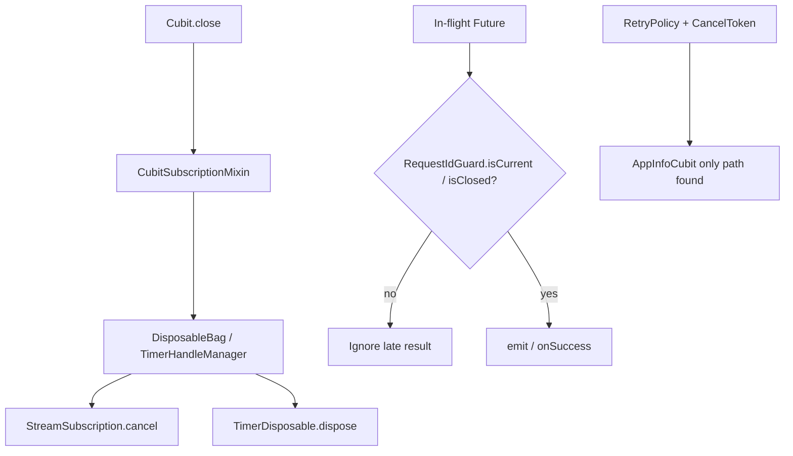

# Cancellation and cache — reviewer guide

**Audience:** Hiring reviewers and senior engineers assessing async lifecycle
and caching.  
**Package ownership:** [`SHARED_UTILITIES.md`](SHARED_UTILITIES.md).  
**Timers / delayed work:** [`delayed_work_guide.md`](delayed_work_guide.md).  
**Cubit lifecycle canon:** [`../bloc_standards.md`](../bloc_standards.md).

## Cancellation of in-flight work

| Mechanism | Class / package | Behavior |
| --- | --- | --- |
| Subscription + timer bag on close | `CubitSubscriptionMixin` — `apps/mobile/lib/app/utils/bloc/cubit_subscription_mixin.dart` + `ilkersevim_disposables` | `close()` disposes timers then cancels tracked subscriptions; late `registerSubscription` / `registerTimer` after `isClosed` cancel/dispose immediately |
| Request staleness (soft cancel) | `RequestIdGuard` — `ilkersevim_async_utils` | `next()` then `isCurrent(id)` before emit; **does not abort** the underlying `Future` |
| In-flight coalescing | `InFlightCoalescer`, `KeyedInFlightCoalescer` — same package | Concurrent callers share one Future (profile / remote config / search offline repos). There is **no** type named `SingleFlight` in this workspace |
| Hard cancel for retries | `CancelToken` — `ilkersevim_retry` | App usage found: `AppInfoCubit` (`apps/mobile/lib/features/settings/presentation/cubit/app_info_cubit.dart`) — new load cancels prior token; `close()` cancels |
| Delayed work | `TimerService` / `DefaultTimerService` — `packages/core` | Returns `TimerDisposable`; dispose cancels |

HTTP stack (`createAppDio` in `apps/mobile/lib/app/http/app_dio.dart`) wires
network check, auth, `RetryInterceptor`, telemetry — **not** Dio
`CancelToken` abort for general requests.

### Late results after dispose / cancel

Canon: cancelling a subscription/token does **not** make a bare `Future` safe
to emit. Patterns in code:

| Pattern | Where |
| --- | --- |
| `if (isClosed) return` before `emit` | Most cubits |
| `CubitExceptionHandler.executeAsync` + `isAlive` | `apps/mobile/lib/app/utils/cubit_async_operations.dart` — skips success/failure if not alive |
| `RequestIdGuard` + `isClosed` | Weather, Chart, Search, Maps, therapy, … |
| Mutation supersession | Chat / therapy — successful write still reported if reload guard superseded (`tool/check_mutation_success_after_guard.sh`) |

## Cache behavior

### HTTP response cache

**Absent.** `packages/networking` has no Dio HTTP cache interceptor, no
Cache-Control/ETag module, no `dio_cache_*` dependency. Freshness for remote
reads is feature-owned (Hive offline-first / TTL), not transport-layer caching.

### Feature / Hive caches (app data)

Examples (see [`../offline_first/`](../offline_first/README.md)):

| Feature | Cache owner |
| --- | --- |
| Search | `HiveSearchCacheRepository` + `OfflineFirstSearchRepository` (`KeyedInFlightCoalescer`) |
| Profile | `HiveProfileCacheRepository` + `OfflineFirstProfileRepository` (`InFlightCoalescer`) |
| GraphQL / Chart demos | Cache repos with stale → empty behavior |
| Remote config | Hive RC cache + coalesced fetch |

### Image cache

| Piece | Path |
| --- | --- |
| Widget | `CachedNetworkImageWidget` — `packages/design_system/lib/src/widgets/images/cached_network_image_widget.dart` |
| Disk manager | `AppImageCacheManager` — `apps/mobile/lib/app/services/app_image_cache_manager.dart` (`flutter_cache_manager`; key `app_cached_network_images`; stale **14 days**; max **100** objects; sets `CachedNetworkImageProvider.defaultCacheManager` outside tests) |
| Memory pressure | `AppMemoryService` → `AppImageCacheManager.onTrim` → `emptyCache()` on `AppMemoryTrimLevel.pressure` |
| Static gate | `tool/check_remote_image_cache_hints.sh` — sized presentation widgets must pass `memCacheWidth` / `memCacheHeight` |

Deps: `cached_network_image`, `flutter_cache_manager` in `apps/mobile/pubspec.yaml`.

## Decisions and trade-offs

| Chosen | Alternatives | Why |
| --- | --- | --- |
| Soft cancel via `RequestIdGuard` + `isClosed` for most loads | Abort every HTTP call with Dio `CancelToken` | Simpler DI; overlapping searches/fetches just ignore stale completions; proven in weather/chart/maps tests |
| `CancelToken` only where retry loops need abort (`AppInfoCubit`) | CancelToken on every repository | Narrow surface; retry package used for HTTP interceptor + selected use cases |
| `ilkersevim_disposables` bag in mixin | Manual `List<StreamSubscription>` in every cubit | One close path; late-registration cancel; shared with auth gates / sync |
| No Dio HTTP cache; Hive feature caches | Global response cache middleware | Offline-first already owns TTL/merge; avoids dual-cache coherence bugs |
| Bounded image `CacheManager` + trim-on-pressure | Unlimited `cached_network_image` defaults | Explicit stale/max + `AppMemoryService` hook |

## How it's tested

### Cancellation / late results

| File | Representative tests |
| --- | --- |
| `apps/mobile/test/features/weather_demo/presentation/weather_cubit_test.dart` | `overlapping search: slower older city cannot overwrite newer success`; ABA / stale typed failure |
| `apps/mobile/test/chart_cubit_test.dart` | `ignores stale completion when a newer fetch finishes first` |
| `apps/mobile/test/features/google_maps/presentation/cubit/map_sample_cubit_test.dart` | Stale success / stale error ignored |
| `apps/mobile/test/features/search/presentation/search_cubit_test.dart` | `clearSearch cancels pending searches and resets state` |
| `apps/mobile/test/features/deeplink/presentation/deep_link_cubit_test.dart` | `close cancels the active deep link subscription` |
| `apps/mobile/test/features/native_platform_showcase/presentation/cubit/native_platform_showcase_cubit_test.dart` | `close cancels telemetry subscription` |
| `apps/mobile/test/features/fcm_demo/presentation/cubit/fcm_demo_cubit_test.dart` | `ignores stream events after close` |
| `apps/mobile/test/core/time/timer_service_test.dart` | `dispose cancels the timer`; `runOnce can be cancelled` |
| `apps/mobile/test/shared/common_bugs_prevention_test.dart` | `properly cancels subscription in close method` |

### Cache

| File | Focus |
| --- | --- |
| `…/search/data/offline_first_search_repository_test.dart` | Cache hit/offline; `concurrent cached searches… run only one background refresh` |
| `…/profile/data/offline_first_profile_repository_test.dart` | Cached immediate + coalesced refresh |
| `…/graphql_demo/data/graphql_demo_cache_repository_test.dart` | `returns empty when cache is stale` |
| `…/chart/data/chart_demo_cache_repository_test.dart` | Same stale-empty pattern |
| `apps/mobile/test/shared/services/app_image_cache_manager_test.dart` | Manager defaults |
| `apps/mobile/test/shared/widgets/cached_network_image_widget_test.dart` | Widget |

### CI / static gates

| Surface | Role |
| --- | --- |
| `.github/workflows/ci.yml` `build` | `./bin/checklist` |
| Inside checklist | `tool/check_cubit_subscription_cancel.sh`, `tool/check_remote_image_cache_hints.sh`, `tool/check_mutation_success_after_guard.sh` |
| Fixtures | `tool/fixtures/cubit_subscription_cancel/`, `remote_image_cache_hints/`, `mutation_success_after_guard/` |

## Gaps (honest)

1. **No Dio/HTTP response cache** — do not review for Cache-Control interceptors;
   they are not in `packages/networking`.
2. **`CancelToken` usage is narrow** (`AppInfoCubit`); most cancellation is
   ignore-on-stale, not abort-in-flight.
3. No type named `SingleFlight` — use `InFlightCoalescer` /
   `KeyedInFlightCoalescer`.
4. Hosted `ilkersevim_*` package **sources are not vendored** here; review call
   sites + pub versions in `pubspec.yaml`.
5. Dedicated test that a cancelled `AppInfoCubit` retry’s late completion is
   ignored was not found as a named case — relies on `isClosed` / `isAlive`.

## Related

- Offline-first reviewer guide: [`../offline_first/reviewer_guide.md`](../offline_first/reviewer_guide.md)
- Reliability overview: [`../reliability_error_handling_performance.md`](../reliability_error_handling_performance.md)
- Repository lifecycle / memory trim: [`REPOSITORY_LIFECYCLE.md`](REPOSITORY_LIFECYCLE.md)
