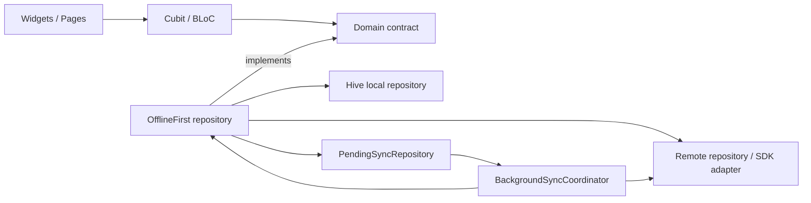

# Offline-First Flutter Architecture with Conflict Resolution

This case study describes how this Flutter app implements an offline-first
architecture without collapsing into stale overwrites, duplicate writes, or
opaque background sync behavior.

The implementation is not a generic sync framework layered on top of the app.
It is a repository-level pattern integrated into the existing
`Domain -> Data -> Presentation` architecture, BLoC/Cubit state management, and
`get_it` dependency injection.

## Problem

The app needed to support feature flows that still feel correct when the
network is unavailable or unstable:

- Users should see data immediately from local storage.
- User mutations should succeed locally even when remote backends are offline.
- Queued writes must replay safely when connectivity returns.
- Remote refreshes must not overwrite newer unsynced local state.
- The implementation must remain testable, feature-scoped, and compatible with
  the app’s existing clean architecture.

The core difficulty was not "how to cache data." It was how to preserve
correctness when local optimistic state, remote state, retries, and background
reconciliation are all active at once.

## Context

This repository uses:

- Flutter + Dart
- Clean Architecture with `Domain -> Data -> Presentation`
- BLoC/Cubit for presentation state
- `get_it` for DI
- Hive for encrypted local persistence
- Shared sync infrastructure in `lib/shared/sync/`

The offline-first pattern is used across multiple features with different
shapes:

- Single-entity state such as Counter
- Append-heavy data such as Chat
- List entities with per-item merge logic such as Todo
- Cache-first read models such as Search, Profile, and Remote Config

## Architecture Summary

The app treats offline-first behavior as a **data-layer composition pattern**.
Presentation code talks to domain contracts. The data layer decides whether a
request is served from Hive, remote APIs, or both.

At a high level:

1. The user action updates local state first.
2. The repository marks the data unsynchronized and enqueues a sync operation.
3. UI reads from local state immediately, so the user sees the optimistic
   result without waiting for the network.
4. The shared coordinator replays pending operations when the device is online.
5. Remote refreshes merge back into local storage using feature-specific
   conflict rules.

## Core Building Blocks

### 1. Local-first repositories

Each adopting feature has a Hive-backed local repository or cache under
`lib/features/<feature>/data/`. Local repositories are the source of immediate
read performance and the persistence layer for optimistic state.

Examples:

- `lib/features/counter/data/hive_counter_repository.dart`
- `lib/features/todo_list/data/hive_todo_repository.dart`
- `lib/features/search/data/hive_search_cache_repository.dart`
- `lib/features/profile/data/profile_cache_repository.dart`

### 2. Offline-first wrappers

The main integration point is an `OfflineFirst*Repository` that composes local
and remote implementations while still exposing the domain contract used by
presentation.

Examples:

- `lib/features/counter/data/offline_first_counter_repository.dart`
- `lib/features/chat/data/offline_first_chat_repository.dart`
- `lib/features/todo_list/data/offline_first_todo_repository.dart`
- `lib/features/remote_config/data/offline_first_remote_config_repository.dart`

These repositories are responsible for:

- writing to local storage first
- generating sync metadata such as `changeId`
- marking items as synchronized or unsynchronized
- enqueueing sync work
- merging remote snapshots back into local storage

### 3. Persistent pending-operation queue

Queued work is stored in
`lib/shared/sync/pending_sync_repository.dart` using Hive-backed
`SyncOperation` records from `lib/shared/sync/sync_operation.dart`.

Each operation contains:

- `entityType`
- serialized payload
- `idempotencyKey`
- creation timestamp
- retry metadata

This design makes queued operations:

- durable across app restarts
- replayable
- inspectable in tests and diagnostics
- deduplicable before replay

### 4. Shared background coordinator

`lib/shared/sync/background_sync_coordinator.dart` orchestrates replay.

It listens to:

- connectivity state
- explicit flush requests
- newly enqueued operations
- lifecycle-driven resume events from `AppScope`

Its execution model matters:

- pending operations are processed before pulling remote snapshots
- retry metadata is updated on failure
- old or exhausted operations are pruned
- summary telemetry is emitted for diagnostics

That ordering prevents a common offline-first failure mode: pulling stale remote
state before local pending changes have been pushed.

## Write Path

The write path is intentionally simple:

1. Normalize the user mutation into a feature model with sync metadata.
2. Save it locally.
3. If a remote backend exists, enqueue a `SyncOperation`.
4. Return control to the caller immediately.

Counter is the clearest example. In
`lib/features/counter/data/offline_first_counter_repository.dart`,
`save()` writes the normalized snapshot to Hive, generates a `changeId`, and
stores a queued operation keyed by that change identifier.

This means the UI can update immediately even when the network is gone.

For chat, the repository goes further: if a send must be queued, it throws a
domain-specific queued signal (`ChatOfflineEnqueuedException`) so the cubit can
treat the action as a pending success instead of as an error.

That is an important product decision. Offline-first systems feel broken when
every offline send becomes a visible failure state.

## Read Path

Reads follow one of two shapes:

- **local-first read-through** for mutable features
- **cache-first refresh** for read-heavy features

Examples:

- Counter and Todo load from local storage immediately, then reconcile later.
- Search, Profile, GraphQL, and Remote Config can serve cached data first and
  refresh in the background when online.

Because cubits consume domain contracts rather than data sources directly, UI
code does not need to know whether the current value came from Hive, a remote
API, or a reconciliation pass.

## Conflict Resolution Strategy

Conflict resolution is the heart of the design.

This app does not use one global merge algorithm for every feature. Instead, it
uses a small set of shared invariants plus feature-specific policies.

### Invariant 1: older remote data must not overwrite newer unsynced local data

This is the most important rule in the system.

If local state contains unsynced changes, remote snapshots are applied only when
the remote version is clearly newer. This protects against stale watch events,
eventual-consistency lag, and slow retries.

The rule is documented in
`docs/offline_first/dont_overwrite_guide.md` and implemented concretely in:

- `lib/features/counter/data/offline_first_counter_repository.dart`
- `lib/features/todo_list/data/offline_first_todo_repository_helpers.dart`
- `lib/features/todo_list/data/todo_merge_policy.dart`

This avoids the classic flicker bug where the UI shows:

1. local optimistic update
2. stale remote value
3. eventual corrected remote value

Instead, unsynced local state wins until the system can prove the remote state
is newer or represents the same accepted change.

### Invariant 2: queued writes need stable idempotency

Every queued mutation carries an `idempotencyKey`.

`PendingSyncRepository.enqueue()` removes older queued operations that match the
same:

- `entityType`
- `idempotencyKey`
- best-effort user scope when present

That reduces duplicate replay and keeps the queue from accumulating logically
identical work during retries or repeated local saves.

This is especially important for:

- repeated counter updates
- queued IoT commands
- any feature where the same intent may be enqueued more than once

### Invariant 3: push pending operations before pulling remote snapshots

The coordinator processes pending operations first and only then calls
`pullRemote()`.

That ordering is visible in `runSyncCycle()` in
`lib/shared/sync/background_sync_runner.dart`.

Without this, the app could fetch stale server state and overwrite local
optimistic data before the queued mutation had a chance to land remotely.

### Feature-specific policy: Counter

Counter uses a compact last-write-wins approach with additional safeguards:

- each local mutation gets a `changeId`
- `lastChanged` is used as the primary ordering signal
- if local is unsynced, remote applies only when `remote.lastChanged` is newer
- if local is already synced, count changes from remote can still be accepted

This keeps the merge rule simple while still protecting the local optimistic
path.

### Feature-specific policy: Todo

Todo uses per-item merge rules rather than whole-list replacement.

`TodoMergePolicy.shouldApplyRemote()` and
`_mergeRemoteIntoLocal()` in the todo repository helpers do three important
things:

- skip remote items when local `updatedAt` is newer
- preserve local unsynced items unless the remote version carries the same
  `changeId` or is strictly newer
- remove local synchronized items that no longer exist remotely

This is a stronger fit for list entities where each item may be in a different
sync state.

### Feature-specific policy: Chat

Chat is append-heavy and user-facing, so the main conflict problem is not just
merging snapshots. It is preserving user intent while the assistant response may
arrive later.

The repository persists the user’s local message first, then enqueues sync work
when needed. The UI represents queued state as pending rather than failed.

That design prevents data loss and produces a much more believable offline UX.

## Failure Handling and Recovery

The architecture assumes failure is normal, not exceptional.

Recovery mechanisms include:

- durable queue storage in Hive
- retry scheduling with `nextRetryAt` and `retryCount`
- queue pruning for stale or exhausted operations
- background replay on reconnect
- explicit manual flush paths through the coordinator
- lifecycle-triggered resume flush from `AppScope`

This means the system can survive:

- app restarts
- temporary backend outages
- connectivity flapping
- partial replay failures

without requiring presentation code to manually orchestrate recovery.

## Why This Fits Clean Architecture

The important architectural choice was to keep sync behavior inside the data
layer.

That preserves clean boundaries:

- Presentation owns UI and transient user interaction state.
- Domain owns contracts and pure models.
- Data owns caching, queueing, replay, remote access, and merge policies.

As a result:

- cubits stay testable and relatively small
- features can adopt offline-first incrementally
- conflict resolution remains close to the data shape it governs
- app-wide sync infrastructure is shared without leaking backend details into UI

## Verification Strategy

The repo backs the design with targeted regression coverage rather than relying
only on manual QA.

Important checks include:

- repository tests for queueing and replay
- merge tests that prove stale remote state does not overwrite newer local state
- cubit tests for queued-success UX paths
- diagnostics support through `SyncCycleSummary` and Settings sync views

Relevant references:

- `test/features/counter/data/offline_first_counter_repository_test.dart`
- `test/shared/sync/background_sync_coordinator_test.dart`
- `test/shared/services/network_status_service_test.dart`
- `tool/check_offline_first_remote_merge.sh`
- `./bin/checklist`

The design specifically treats "older remote must not overwrite newer unsynced
local" as a regression class worth a dedicated validation path.

## Trade-offs

This architecture is intentionally pragmatic, not academically pure.

What it does well:

- fast local reads
- predictable optimistic writes
- reusable sync plumbing across features
- feature-specific conflict handling where needed
- strong testability

What it does not try to solve universally:

- CRDT-style multi-master convergence for all data types
- generic merge UI for every feature
- backend-agnostic semantic conflict resolution

Those would add substantial complexity. This codebase instead uses a smaller
toolbox:

- timestamps
- change IDs
- idempotent replay
- queue dedupe
- per-feature merge policy

For this app, that is the right trade.

## Lessons

1. Offline-first correctness depends more on merge rules than on storage choice.
2. Queue durability is necessary, but not sufficient; replay order also matters.
3. Conflict resolution should live with the feature’s data model, not in a
   giant shared abstraction.
4. "Pending success" is often the right product response for offline writes.
5. A dedicated stale-remote regression test is worth more than a long sync
   design document if you have to choose one.

## References

- `docs/offline_first/adoption_guide.md`
- `docs/offline_first/dont_overwrite_guide.md`
- `docs/offline_first/counter.md`
- `lib/shared/sync/pending_sync_repository.dart`
- `lib/shared/sync/background_sync_coordinator.dart`
- `lib/shared/sync/background_sync_runner.dart`
- `lib/features/counter/data/offline_first_counter_repository.dart`
- `lib/features/todo_list/data/todo_merge_policy.dart`
- `lib/features/todo_list/data/offline_first_todo_repository_helpers.dart`
- `lib/features/chat/data/offline_first_chat_repository.dart`
