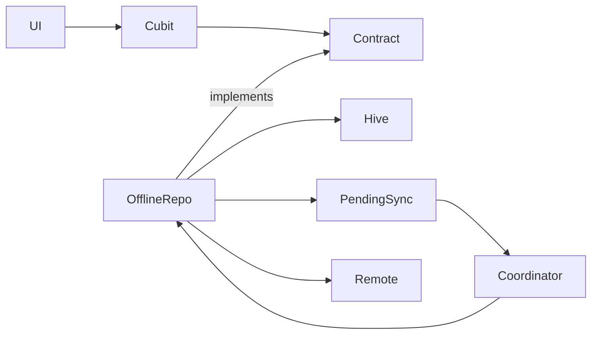

# Offline-first architecture — current contract

Data-layer composition pattern: local Hive first, enqueue sync, merge remote
without overwriting newer local state.

## Invariants

1. Mutations write local first; mark unsynchronized; enqueue `SyncOperation`.
2. UI reads local immediately (optimistic).
3. `BackgroundSyncCoordinator` replays when online.
4. Remote apply gated by don’t-overwrite rules
   ([`offline_first/dont_overwrite_guide.md`](../offline_first/dont_overwrite_guide.md)).
5. Remote **read** failures must not become empty snapshots.

## Owners

| Concern | Doc |
| --- | --- |
| Adopt a feature | [`offline_first/adoption_guide.md`](../offline_first/adoption_guide.md) |
| Per-feature contracts | [`../offline_first/`](../offline_first/) (`counter`, `chat`, …) |
| Hive schema | [`offline_first/hive_schema_migrations.md`](../offline_first/hive_schema_migrations.md) |
| Merge guard script | `tool/check_offline_first_remote_merge.sh` |

Shared sync code: `packages/storage/lib/src/sync/`.
