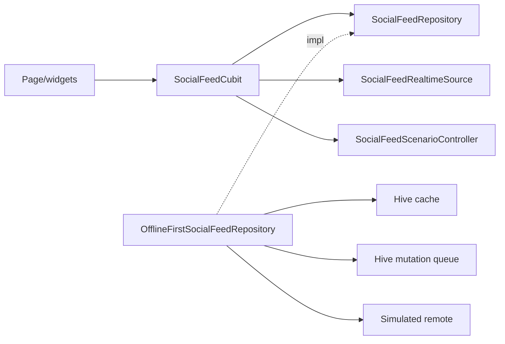
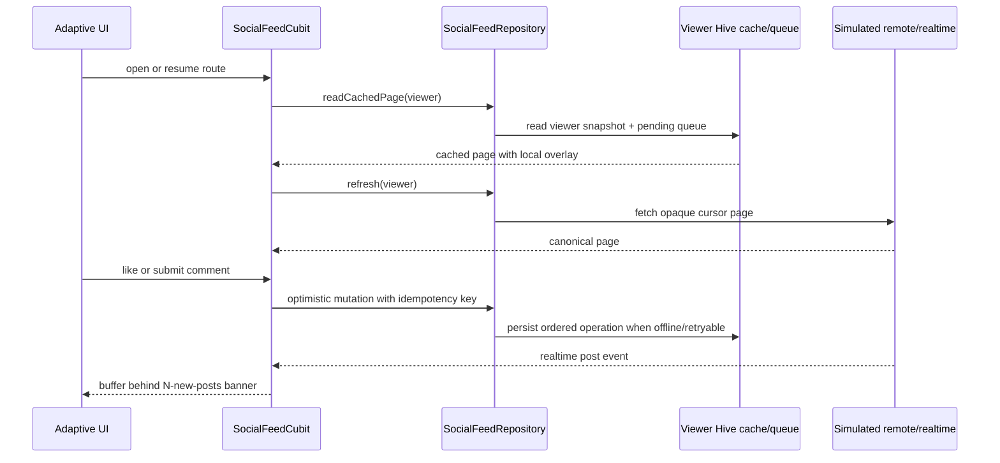

# Social Feed Demo — deep feature guide

Canonical design/change guide for `social_feed_demo`. Plan source:
[Flutter judgment guidance plan](../plans/2026-08-20_social_feed_senior_signal_demo.md).

## Purpose

Credential-free `/social-feed-demo` proving Flutter judgment guidance through
feed engineering with observable behavior and executable proof. Simulator only — no live backend,
auth, secrets, or network images.

Cold start: co-located
[`apps/mobile/lib/features/social_feed_demo/README.md`](../../apps/mobile/lib/features/social_feed_demo/README.md)
→ this guide → tests under `apps/mobile/test/features/social_feed_demo/`.

## Runtime components

Entry: Example hub `example-social-feed-demo-button` → route
`AppRoutes.socialFeedDemo` (`/social-feed-demo`) → DI
`registerSocialFeedDemoServices`.

## Runtime sequence

The Cubit owns route lifecycle, request generations, and both leases. A stale
generation may finish work, but it cannot mutate the active viewer state.

## Decision register (`SF-*`)

| ID | Locked choice | Reason | Consequence | Proof | Rejected / revisit |
| --- | --- | --- | --- | --- | --- |
| `SF-ARCH-01` | Feature-first CA; one Cubit | Matches repo seams | No widget-owned queue/rules | folder contract + import gates | Rejected multi-Cubit; revisit if feed splits products |
| `SF-SCALE-01` | Cursor paging + cache invalidation | Stable pages under top inserts | Opaque cursor = last id | remote cursor test | Rejected offset paging; revisit for server cursors |
| `SF-TEST-01` | Inject time/storage/remote/realtime; pure merge | Deterministic CI | Integration is one smoke journey | domain/data/cubit tests | Rejected live network in unit tests |
| `SF-SEC-01` | No secrets; comment text never logged | Demo is fictional | Production auth deferred | denial + log policy | Rejected client-only auth claims |
| `SF-DEP-01` | No new dependency | Stack already sufficient | Package add needs plan change | pubspec unchanged | Revisit only with plan amendment |
| `SF-BG-01` | Visible/resumed route only | OS background limits | No terminated-app delivery claim | lifecycle test | Rejected WorkManager claims |
| `SF-PERF-01` | Lazy list, stable keys, selectors | Avoid sibling rebuilds | Profile before micro-opts | widget keys + selectors | Perf profile blocked on disk this lane |

### Step 1–5 (locked product answers)

| Step | Locked decision | Why / accepted tradeoff | Proof / revisit trigger |
| --- | --- | --- | --- |
| 1. Clarify | iOS, Android, web, macOS; 60 seeded posts; two fictional viewers; simulator only; offline read + queued likes/comments in scope | One adaptive tree and deterministic faults keep every supported target reviewable. No auth, backend, history, replies, or closed-app work is implied. | Route/DI/widget tests. Re-plan before adding identity, live data, or a target-specific fork. |
| 2. Model | Post carries `isLikedByMe`, bounded counts, revision, and opaque cursor; comment uses mutation/idempotency ID; expand-on-tap thread merges deterministic seed bodies with pending/submitted comments | Avoids unbounded arrays and offset drift. Viewer projection duplicates a small amount of personal state. | Mapper/cursor/merge + visible-comment tests. Re-plan before remote comment pagination or replies. |
| 3. Offline | Viewer-scoped Hive first-page cache + ordered mutation queue; pending local intent overlays remote until ack/reject | Cache-first reading and durable intent survive offline/recreation. Storage/reconciliation complexity is accepted. | Hive/queue/repository tests. Re-plan before shared-account cache or production retention rules. |
| 4. Realtime | Cubit owns viewer-scoped sync/realtime leases only while route is visible/resumed; new posts buffer behind a banner | No scroll jump, global owner, polling, push, or terminated-app promise. Reconnect uses bounded simulated backoff. | Lease/lifecycle/realtime tests. Re-plan before background delivery. |
| 5. Failure ownership | Typed failures retain usable content; page errors stay local; permanent rejection restores canonical post and retains rejected comment draft | A background failure cannot become an outage or a false durability claim. | Cubit/widget/repository tests. Re-plan before server error taxonomy changes. |

## State and failure contract

`SocialFeedState` is sealed: `initial`, `loading`, `failure`, or `ready`.
`ready` carries independent sealed refresh/page status, never parallel error
booleans. All user-facing messages come from ARB localization; exception text
and comment bodies are never displayed or logged.

| Condition | UI result | Durable result | Primary proof |
| --- | --- | --- | --- |
| Offline without cache | Blocking localized offline/retry state | No false cache claim | Cubit/widget test |
| Cached page then refresh failure | Cached list stays visible; refresh status fails | Snapshot retained | repository/Cubit test |
| Cursor/page failure | Loaded rows stay; inline tail retry | Cursor retained | remote/Cubit test |
| Retryable mutation failure | Optimistic intent remains pending | Viewer queue survives recreation | queue/repository test |
| Fifth retryable dispatch failure | Needs-attention action becomes visible | Dead-letter record persists; later operations continue | queue/replay test |
| Permanent like/comment rejection | Canonical post restores; localized announcement | Rejected operation removed | Cubit/widget test |
| Cache/schema/record corruption | Fetch remote; ignore only invalid viewer data | Shared Hive untouched | local-source test |

## Scenario ownership

`SocialFeedScenarioController` is feature-owned, deterministic fault
injection: online/offline, three new posts, initial/refresh or load-more
failure, reconnect failure, five replay failures, permanent like/comment
rejection, malformed payload, and viewer-local reset. Compact UI controls
expose the walkthrough actions (connectivity, new posts, reset); the full fault
surface is exercised through the scenario-controller and repository/Cubit
tests, so no production-like control leaks outside this feature.

## Accessibility and platform contract

- Feed uses `ListView.builder`, 400 px prefetch, stable post keys, and a
  selector per row.
- Like has toggled semantic state; new-post and needs-attention surfaces are
  live regions; controls remain keyboard-operable.
- One widget tree supports phone, tablet, narrow desktop, wide desktop, and
  Arabic RTL. iOS, Android, web, and macOS builds remain required Wave 6 proof;
  they are not inferred from width tests.

## Privacy and security boundary

Fictional seed data only (natural demo copy, sparse threads). No network,
credentials, auth, telemetry, or client trust claim. Entered comments remain
in viewer-scoped demo storage and must never be logged. A production adapter
needs server authorization/validation, secure tokens, logout deletion, abuse
controls, and PII-redaction policy.

## Ownership

- Domain: models, ports, merge/comment policy, failures
- Data: DTOs, simulators, Hive cache/queue, repository impl
- Presentation: Cubit/state, page, adaptive widgets
- App: DI, route, Example, l10n

## Limits

**Shipped:** like + comment submit, offline queue, realtime banner, two
viewers, responsive phone/tablet/wide layouts, six locales, expand-on-tap
inline comment thread (shared stored bodies + pending overlay; survives
viewer switch and process restart via Hive-backed shared threads), and
deterministic fault contracts.

**Deferred:** remote comment pagination/replies/edit/delete, real
backend/auth, push, terminated-app work, network images, and gold registration
until architecture gates and full checklist/platform builds pass.

**Performance proof:** blocked — 2026-08-21 verification left ~3.7 GiB free;
four-platform builds, profile capture, integration device lane, and full
checklist were not run. No smoothness or isolate claim. Re-run Wave 6 when disk
is at least ~15 GiB and a compatible simulator/device is available.

## Change recipes

1. **New mutation:** `domain/` result → queue DTO → repository dispatch →
   Cubit optimistic path → data/Cubit tests. Run `flutter test
   test/features/social_feed_demo`; stop if a widget gains business rules.
2. **Real API/WebSocket:** add data adapters implementing repository/realtime
   ports; keep domain/presentation unchanged. Run architecture/import tests;
   stop for a domain contract change or credential requirement.
3. **Cache schema:** bump `HiveSocialFeedLocalDataSource.schemaVersion`; touch
   only feature/viewer keys; add corruption/migration tests. Stop before any
   shared Hive clear.
4. **Auth/private content:** add server authorization, secure tokens, ownership
   denial and logout-deletion tests. Stop if trust exists only in the client.
5. **New package:** verify pinned source and `SF-DEP-01`, update this plan, then
   run resolver/analysis proof. Stop until the plan change is accepted.
6. **Background work:** write a platform-aware lifecycle plan and prove short,
   idempotent jobs per target. Stop for terminated-app delivery assumptions.
7. **Hot-path optimize:** capture the listed scroll/like/banner profile trace,
   compare before/after against `tool/perf_budgets.json`, and stop without a
   measurable regression or win.

## Test map

| Area | Path |
| --- | --- |
| Merge/comment policy | `test/.../domain/*_policy_test.dart` |
| Mapper/remote/Hive/repo | `test/.../data/*_test.dart` |
| Cubit/state | `test/.../presentation/cubit/*_test.dart` |
| Page/widgets/responsive | `test/.../presentation/**` |
| DI/route/Example | `test/app/**`, `test/features/example/**` |
| J6 smoke | `integration_test/social_feed_demo_flow_test.dart` |
| Scenario fault contract | `test/.../data/simulated_social_feed_scenario_controller_test.dart` |

## Proof links

- Focused: `cd apps/mobile && flutter test test/features/social_feed_demo`
- Architecture: `bash tool/check_clean_architecture_imports.sh`,
  `bash tool/check_feature_folder_contract.sh --strict`
- Router: `./bin/router_feature_validate` (when available)
- Integration: `./bin/integration_tests integration_test/social_feed_demo_flow_test.dart`
- Brief: [`docs/changes/2026-08-20_social_feed_demo_feature_brief.md`](../changes/2026-08-20_social_feed_demo_feature_brief.md)

## Walkthrough

Example → Social Feed → like immediately → switch simulated offline → queue
like/comment → reconnect/replay → emit three posts → reveal banner → switch
viewer. Re-run the selective integration flow before changing this sequence.
