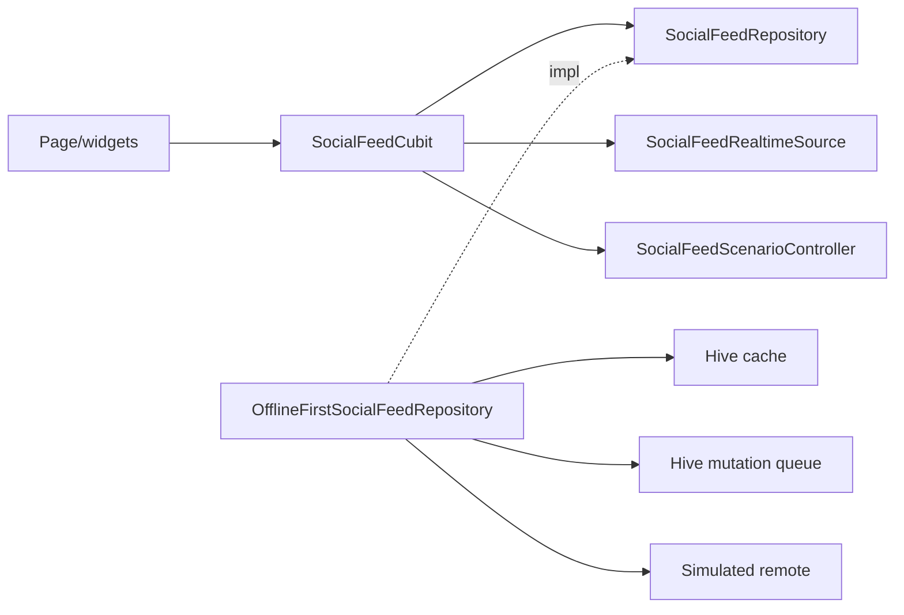

# Social Feed Demo — deep feature guide

Canonical design/change guide for `social_feed_demo`. Plan source:
[`docs/plans/2026-08-20_social_feed_senior_signal_demo.md`](../plans/2026-08-20_social_feed_senior_signal_demo.md).

## Purpose

Credential-free `/social-feed-demo` proving senior Flutter feed judgment with
observable behavior and executable proof. Simulator only — no live backend,
auth, secrets, or network images.

Cold start: co-located
[`apps/mobile/lib/features/social_feed_demo/README.md`](../../apps/mobile/lib/features/social_feed_demo/README.md)
→ this guide → tests under `apps/mobile/test/features/social_feed_demo/`.

## Runtime components

Entry: Example hub `example-social-feed-demo-button` → route
`AppRoutes.socialFeedDemo` (`/social-feed-demo`) → DI
`registerSocialFeedDemoServices`.

## Decision register (`SF-*`)

| ID | Locked choice | Reason | Consequence | Proof | Rejected / revisit |
| --- | --- | --- | --- | --- | --- |
| `SF-ARCH-01` | Feature-first CA; one Cubit | Matches repo seams | No widget-owned queue/rules | folder contract + import gates | Rejected multi-Cubit; revisit if feed splits products |
| `SF-SCALE-01` | Cursor paging + cache invalidation | Stable pages under top inserts | Opaque cursor = last id | remote cursor test | Rejected offset paging; revisit for server cursors |
| `SF-TEST-01` | Inject time/storage/remote/realtime; pure merge | Deterministic CI | Integration is one smoke journey | domain/data/cubit tests | Rejected live network in unit tests |
| `SF-SEC-01` | No secrets; comment text never logged | Demo is fictional | Production auth deferred | denial + log policy | Rejected client-only auth claims |
| `SF-DEP-01` | No new dependency | Stack already sufficient | Package add needs plan change | pubspec unchanged | Revisit only with plan amendment |
| `SF-BG-01` | Visible/resumed route only | OS background limits | No terminated-app delivery claim | lifecycle test | Rejected WorkManager claims |
| `SF-PERF-01` | Lazy list, stable keys, selectors | Avoid sibling rebuilds | Profile before micro-opts | widget keys + selectors | Perf profile blocked on disk this lane |

### Step 1–5 (locked product answers)

1. **Clarify:** two demo viewers, simulator online/offline, like + comment submit
   in; history/replies/auth/backend out.
2. **Model:** `isLikedByMe` + bounded counts; no liker arrays; opaque cursor.
3. **Offline:** Hive first-page cache + ordered mutation queue; pending local
   like/comment overlay wins until ack/reject.
4. **Realtime:** separate lease/source; buffer behind “N new posts”; no jump.
5. **Failure ownership:** typed failures; cache kept on refresh/page error;
   permanent rejection rolls back optimistic UI.

## Ownership

- Domain: models, ports, merge/comment policy, failures
- Data: DTOs, simulators, Hive cache/queue, repository impl
- Presentation: Cubit/state, page, adaptive widgets
- App: DI, route, Example, l10n

## Limits

**Shipped:** like + comment submit, offline queue, realtime banner, two viewers,
responsive phone/tablet/wide, six locales.

**Deferred:** comment history/replies/edit/delete, real backend/auth, push,
terminated-app work, network images, gold registration until architecture gates
+ full checklist/platform builds pass.

**Performance proof:** blocked — host disk ~5–6 Gi free; four-platform builds /
profile-mode capture / full checklist not run this lane. No smoothness or
isolate claim. Re-run Wave 6 perf commands when disk ≥ ~15 Gi and a compatible
simulator/device is available.

## Change recipes

1. **New mutation:** domain result type → queue DTO → repository dispatch →
   Cubit optimistic path → tests; never put rules in widgets.
2. **Real API/WebSocket:** new data adapters implementing existing ports only;
   domain/presentation contracts stay.
3. **Cache schema:** bump feature schemaVersion; invalidate feature/viewer keys
   only; never wipe shared Hive.
4. **Auth/private content:** server authorization + secure tokens + ownership
   denial tests + logout deletion; stop if client-only trust.
5. **New package:** pinned-source verification + `SF-DEP-01` criteria; update
   plan first.
6. **Background work:** platform-aware plan stating OS limits; short idempotent
   jobs only.
7. **Hot-path optimize:** attach profile scenario + before/after; no premature
   micro-opts.

## Test map

| Area | Path |
| --- | --- |
| Merge/comment policy | `test/.../domain/*_policy_test.dart` |
| Mapper/remote/Hive/repo | `test/.../data/*_test.dart` |
| Cubit/state | `test/.../presentation/cubit/*_test.dart` |
| Page/widgets/responsive | `test/.../presentation/**` |
| DI/route/Example | `test/app/**`, `test/features/example/**` |
| J6 smoke | `integration_test/social_feed_demo_flow_test.dart` |

## Proof links

- Focused: `cd apps/mobile && flutter test test/features/social_feed_demo`
- Architecture: `bash tool/check_clean_architecture_imports.sh`,
  `bash tool/check_feature_folder_contract.sh --strict`
- Router: `./bin/router_feature_validate` (when available)
- Integration: `./bin/integration_tests integration_test/social_feed_demo_flow_test.dart`
- Brief: [`docs/changes/2026-08-20_social_feed_demo_feature_brief.md`](../changes/2026-08-20_social_feed_demo_feature_brief.md)
