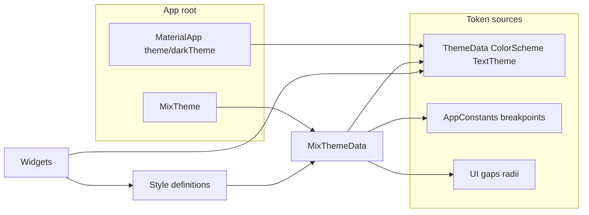

# Mix Design System — Implementation Plan

This document is the implementation plan for integrating the [mix](https://pub.dev/packages/mix) package as a utility-first design system layer: single source of truth for styles and variants, consistent tokens, and incremental migration. It sits alongside the existing Theme / AppTypography / UI stack and aligns with project standards (no hardcoded tokens, theme-aware, responsive).

## Implementation status

- **Pilot:** Done. Mix dependency, `mix_app_theme.dart`, `MixTheme` in `AppConfig`, `app_styles.dart` (card, profileOutlinedButton, listTile), `CommonCard` and profile button styles using mix tokens, tests updated, and design docs updated.
- **Test helper:** `test/helpers/pump_with_mix_theme.dart` — `pumpWithMixTheme(tester, child: ...)` for widget tests that need Mix theme; `common_card_test.dart` uses it.
- **Next steps done:** `AppStyles.inputField`, `AppStyles.appBar`, `AppStyles.chip`, `AppStyles.dialogContent`; dark-mode variant on card (`$on.dark`); breakpoint variant on listTile (`$on.medium` for horizontal padding). **GraphqlDataSourceBadge** migrated to `AppStyles.chip`.
- **Further migration:** Settings sections use mix/CommonCard: **SyncDiagnosticsSection** (CommonCard + `AppStyles.chip`), **GraphqlCacheControlsSection**, **ProfileCacheControlsSection**, **RemoteConfigDiagnosticsSection** (CommonCard); **RemoteConfig** status badge (`_RemoteConfigStatusBadge`) uses CommonCard. **SettingsCard** uses CommonCard. **CalculatorSummaryCard**, **WordCard** (playlearn), **GraphqlCountryCard** use CommonCard; **GraphqlCountryCard** `_DetailChip` uses `AppStyles.chip`. **PlatformAdaptiveSheets.showPickerModal** Material sheet content wrapped with `Box(style: AppStyles.dialogContent)`. **AccountSection**, **SkeletonCard** use CommonCard. **CountdownBarContent** uses CommonCard. **AppMessage** uses CommonCard with default (token) padding. **SkeletonListTile** uses `Box(style: AppStyles.listTile)` for padding. **TopicCard** (playlearn) uses CommonCard with primaryContainer. **WalletAddressDisplay** uses CommonCard with outline border. **WebsocketConnectionBanner** (error and status bars) uses CommonCard with token padding. **WalletConnectAuthPage**: error/success message blocks and **_WalletProfileSection** use CommonCard. **TodoPriorityBadge**, **FlavorBadge** use CommonCard with border (badge/chip). **ChartLoadingList** skeleton placeholders use CommonCard. **buildTodoSwipeBackground** (todo list swipe action) uses CommonCard. **MarkdownEditorField**, **MarkdownPreview** use CommonCard for surface panels. **CalculatorSummaryCard** error block uses CommonCard. **MessageBubble** uses CommonCard inside ConstrainedBox (margin, padding, shape preserved). **GoogleMapsLocationList** selected-location chip uses CommonCard. **register_country_picker** Material sheet content wrapped with `Box(style: AppStyles.dialogContent)`. List row shells: **SkeletonListTile** is the only custom row using `Box(style: AppStyles.listTile)`; other lists use ListTile or config-driven layout. **Priority B:** Added `AppStyles.banner`, `AppStyles.emptyState`, `AppStyles.filledButton`, `AppStyles.outlinedButton`; extended `AppStyles.inputField` with color and border tokens. **SearchAppBar** uses `Box(style: AppStyles.appBar)`; **TodoSearchField** uses `Box(style: AppStyles.inputField)`; **CommonStatusView** uses `Box(style: AppStyles.emptyState)` when padding is null. **Priority C:** App text tokens (AppTextStyleTokens) and textStyles in theme; AppStyles headingStyle, subheadingStyle, bodyStyle, bodyLargeStyle, captionStyle, captionSmallStyle; banner and chip use `$on.medium` for horizontal padding; AppTypography doc notes preference for Mix text/AppStyles in new code. Sync diagnostics and GraphqlCountryCard tests wrap with `MixTheme`; skeleton list tile tests use `pumpWithMixTheme`.
- **Skipped:** On-device manual checks (deferred; run when validating release).
- **Remaining:** mix_lint now runs via local package `custom_lints/mix_lint` (analyzer 8 + custom_lint 0.8 compatible). Use `./tool/run_mix_lint.sh` (or `dart run custom_lint`) to lint Mix usage. Incremental migration continues when touching other screens.

**Uncompleted checklist items:** The only unchecked boxes in this plan are **On-device checks (manual)** above — deferred until release validation. All code-related action items are done. Ongoing work is the **Ongoing and next steps** checklist: when touching a screen or adding UI, apply 1–2 of those bullets (e.g. prefer AppStyles text styles, use banner/emptyState/dialogContent where it fits) and run mix_lint and affected tests.

---

## Action list

Use this as a checklist for implementation, verification, and follow-up.

### Implementation (pilot)

- [x] Add `mix: ^1.7.0` (and `mix_annotations` if required) to `pubspec.yaml`.
- [x] Create mix theme module: `lib/core/theme/mix_app_theme.dart` with tokens and `buildAppMixThemeData(context)`.
- [x] Wrap app with `MixTheme` in `AppConfig.createMaterialApp` builder.
- [x] Create `lib/shared/design_system/app_styles.dart` with card and profile-outlined-button styles (tokens only).
- [x] Refactor `CommonCard` to use mix tokens (padding, radius, color fallbacks from `MixTheme` / `UI`); keep same API.
- [x] Refactor profile button styles to use mix tokens / `AppStyles.profileOutlinedButton`.
- [x] Update tests that need `MixTheme` (e.g. profile button styles tests, CommonCard test).
- [x] Update [design_system.md](design_system.md) with Mix usage.

### Verification

- [x] Run `./bin/checklist` (format, analyze, tests).
- [x] `./bin/checklist` now also runs `mix_lint` automatically via `tool/run_mix_lint.sh`.
- [x] Run `flutter test` for affected tests (e.g. profile button styles, CommonCard).

### On-device checks (manual) — skipped for now

- [ ] Toggle light/dark theme; confirm cards and profile buttons follow theme.
- [ ] Open screens that use `CommonCard`; confirm padding, radius, and overrides.
- [ ] Open Profile; confirm action buttons (pill radius, bold text, theme colors).
- [ ] Resize to tablet/desktop (or different window size); confirm no layout breakage.
- [ ] (Optional) Test text scaling and orientation.

### Next steps (when ready)

- [x] Add more shared styles: `AppStyles.listTile`, `AppStyles.inputField`, `AppStyles.appBar`, `AppStyles.chip` (tokens only).
- [x] Add more shared styles (dialogs, etc.) if needed — `AppStyles.dialogContent` added for dialog/sheet content padding.
- [x] Use dark-mode context variant: card uses `$on.dark($box.decoration.elevation(0))`.
- [x] Use breakpoint context variants: listTile uses `$on.medium($box.padding.horizontal.ref(gapL))` for larger horizontal padding on tablet/desktop.
- [x] Migrate other screens to mix when touching them — **GraphqlDataSourceBadge**, **GraphqlCountryCard** `_DetailChip`, **SyncDiagnosticsSection** chips use `AppStyles.chip`; **SyncDiagnosticsSection**, **GraphqlCacheControlsSection**, **ProfileCacheControlsSection**, **RemoteConfigDiagnosticsSection** (and **RemoteConfig** status badge), **SettingsCard**, **CalculatorSummaryCard**, **WordCard**, **GraphqlCountryCard** use CommonCard; **PlatformAdaptiveSheets.showPickerModal** (Material) uses `AppStyles.dialogContent`; **AccountSection**, **SkeletonCard** use CommonCard; **CountdownBarContent** uses CommonCard; **AppMessage** uses CommonCard default padding; **SkeletonListTile** uses `AppStyles.listTile`; **TopicCard**, **WalletAddressDisplay** use CommonCard; **WebsocketConnectionBanner** uses CommonCard.
- [x] Add test helper: `test/helpers/pump_with_mix_theme.dart` — use `pumpWithMixTheme(tester, child: ...)` in widget tests that need Mix theme.
- [x] Evaluate mix_lint: enabled via local `custom_lints/mix_lint` fork (updated for analyzer 8 / custom_lint 0.8). Run with `./tool/run_mix_lint.sh`. Rules (for reference): attribute ordering, avoid tokens/variants inside Style, max attributes per style.

### Future possible steps (use more Mix in codebase)

**How to use this section:** When you touch a screen or add new UI, prefer Mix styles and tokens over ad-hoc `Container`/`TextStyle`/padding. Pick one or two items below that fit the change; ship in small batches. Full detail of what’s already migrated is in **Implementation status** above.

**Principle:** Incremental, low-risk migration — visual-only refactors when possible; no big-bang rewrites.

---

#### Completed priorities (A–C)

- **Priority A (low-risk replacements):** Card shells → CommonCard / `AppStyles.card`; badge/chip → `AppStyles.chip` or CommonCard with border; list row shells → `Box(style: AppStyles.listTile)` where full `ListTile` isn’t needed; dialog/sheet bodies → `Box(style: AppStyles.dialogContent)`. Done for the widgets listed in Implementation status; continue the same pattern when touching other screens.
- **Priority B (shared style coverage):** `AppStyles.inputField`, `appBar`, `banner`, `emptyState`, `filledButton`, `outlinedButton` added and adopted in SearchAppBar, TodoSearchField, CommonStatusView; extend to other form/app bar/banner/empty-state/button UIs when touching them.
- **Priority C (tokens and variants):** App text tokens and `AppStyles` text styles (headingStyle, bodyStyle, captionStyle, etc.); `$on.medium` on banner and chip; AppTypography doc updated to prefer Mix text/AppStyles for new code.

---

#### Ongoing and next steps (when touching code)

- **Scope rule per PR:** Keep migration incremental. In a normal feature/bug PR, migrate only the touched widget(s) and at most 1-2 style patterns.
- **Text first:** For new or edited text in Mix-enabled widgets, prefer `AppStyles.headingStyle` / `subheadingStyle` / `bodyStyle` / `bodyLargeStyle` / `captionStyle` / `captionSmallStyle` (or `$text.style.ref(AppTextStyleTokens.*)`) instead of introducing new `AppTypography` helpers.
- **Surface wrappers:** For new/edited panels and cards, prefer `CommonCard` or `Box(style: AppStyles.card)` over ad-hoc `Container` + `BoxDecoration`.
- **Chips and badges:** Use `Box(style: AppStyles.chip)` for chip-like labels; if a distinct chip pattern appears in 3+ places, add a named `AppStyles` variant.
- **Custom row shells:** For non-`ListTile` rows, use `Box(style: AppStyles.listTile)`; add `listTileDense` / `listTileCompact` only when there is a real second use case.
- **Dialogs and sheets:** Wrap Material dialog/sheet body content with `Box(style: AppStyles.dialogContent)` where layout allows.
- **Status and empty states:** Use `Box(style: AppStyles.banner)` for full-width status bars and `Box(style: AppStyles.emptyState)` for empty-state containers.
- **Buttons:** Prefer `AppStyles.filledButton` / `outlinedButton` with Mix `Button`/`Pressable`; if using `ButtonStyle`, align values with these tokens.
- **Do not churn stable code:** If a file is untouched by product work, do not migrate it only for stylistic consistency.
- **After each migration slice:** Run `./tool/run_mix_lint.sh` and affected tests before finishing the PR.

---

#### Validation for each migration batch

- Run `./tool/run_mix_lint.sh` after style or token changes.
- Run affected tests; wrap Mix-dependent widgets with `pumpWithMixTheme(tester, child: ...)` when tests rely on Mix theme.
- Run `./bin/checklist` before merge.
- Update [design_system.md](design_system.md) (and [ui_ux_responsive_review.md](ui_ux_responsive_review.md) if relevant) when adding new shared styles or migrating a feature.

---

## Current state (summary)

- **Theme:** [lib/core/theme/app_theme.dart](lib/core/theme/app_theme.dart) — `ThemeData`, `ColorScheme`, `TextTheme` (Google Fonts Roboto/Comfortaa), `ThemeExtension` (ConfettiTheme). Wired in [lib/core/app_config.dart](lib/core/app_config.dart) as `theme` / `darkTheme`.
- **Typography:** [lib/shared/ui/typography.dart](lib/shared/ui/typography.dart) — `AppTypography` static helpers (`buttonText`, `bodyText`, `titleText`, etc.) that take `BuildContext` and optional overrides; all derive from `Theme.of(context).textTheme`.
- **Spacing/sizing:** [lib/shared/ui/ui_constants.dart](lib/shared/ui/ui_constants.dart) — `UI` class with ScreenUtil-based scaling (`gapXS/S/M/L`, `radiusM`, `cardPadH/V`, etc.).
- **Responsive:** [lib/shared/responsive/responsive_config.dart](lib/shared/responsive/responsive_config.dart) — breakpoints (mobile <800, tablet 800–1199, desktop 1200+); [lib/shared/extensions/responsive/responsive_layout.dart](lib/shared/extensions/responsive/responsive_layout.dart) — context extensions (`pagePadding`, `responsiveCardPadding`, `gridColumns`, `isMobile`/`isTablet`/`isDesktop`).
- **Design system doc:** [docs/design_system.md](design_system.md) — points to theme, constants, typography, UI constants, components.

Roughly **100+ files** reference `TextStyle`/`BoxDecoration`/`EdgeInsets`/`BorderRadius`; many use `Theme.of(context)` and `AppTypography`; [docs/ui_ux_responsive_review.md](ui_ux_responsive_review.md) still flags hardcoded colors and fixed typography in several areas. This app requires: theme colors (no `Colors.black`/white), typography from theme, centralize styling, use `ThemeExtension` for custom tokens, responsive extensions.

---

## Why mix fits this codebase

- **Single source of truth:** Styles live in `Style` definitions and tokens instead of hundreds of ad-hoc `TextStyle`/`BoxDecoration`/padding values.
- **Consistency:** Same spacing/radius/typography tokens everywhere reduces design drift (e.g. “padding slightly different per screen”).
- **Variants:** Named variants (e.g. `outlined`, `primary`) and **context variants** (e.g. `$on.dark`, breakpoint-based) give responsive and theme-aware styling without deep nesting.
- **Composability:** Styles can be merged and reused (`Style(...).applyVariant(...)`), supporting a DRY design system.
- **Coexistence with Theme:** mix’s `MixTheme`/`MixThemeData` supply **design tokens**; Flutter’s `Theme`/`ThemeData` remain for Material widgets and `Theme.of(context)`. The two can run in parallel: Material uses `Theme`, new/refactored UI can use mix tokens and `Style`.

---

## Architecture: where mix sits

- **MaterialApp** keeps using `AppTheme.lightTheme()` / `AppTheme.darkTheme()` so all existing `Theme.of(context)` and Material components keep working.
- **MixTheme** wraps the app (e.g. inside `AppConfig`’s `builder` or in [lib/app/app_scope.dart](../lib/app/app_scope.dart)) and provides `MixThemeData` built from the same sources: `ColorScheme`, `TextTheme`, `UI`, and `AppConstants` breakpoints.
- **Style definitions** use mix utilities (`$box`, `$text`, etc.) and tokens; they can use context variants so they react to brightness and breakpoints without each widget duplicating logic.

---

## Implementation plan

### 1. Add dependency and minimal MixTheme wiring

- Add `mix: ^1.7.0` (and `mix_annotations` if required by mix’s API) to [pubspec.yaml](../pubspec.yaml).
- Create a **mix theme module** (e.g. under `lib/core/theme/` or `lib/shared/design_system/`) that:
  - Builds `MixThemeData` from:
    - **Colors:** Map from `ThemeData.colorScheme` (primary, surface, onSurface, error, etc.) into mix color tokens so light/dark are consistent with Material.
    - **Text styles:** Map `ThemeData.textTheme` (e.g. `labelLarge`, `bodyMedium`, `headlineMedium`) to mix `textStyle` tokens so mix styles stay aligned with `AppTypography` and existing theme.
    - **Spaces:** Map `UI` (e.g. `gapS`, `gapM`, `cardPadH`) and, if needed, responsive values from [lib/shared/extensions/responsive/responsive_layout.dart](../lib/shared/extensions/responsive/responsive_layout.dart) into mix `space` tokens.
    - **Radii:** Map `UI.radiusM`, `UI.radiusPill`, etc. to mix `radius` tokens.
    - **Breakpoints:** Map `AppConstants.mobileBreakpoint` / `tabletBreakpoint` to mix breakpoint tokens so context variants match existing `ResponsiveConfig` behavior (or document a single source of truth and possibly feed ResponsiveConfig from mix later).
  - Exposes a function that takes `BuildContext` (or `ThemeData` + optional layout info) and returns `MixThemeData`, so it can be used where theme/layout are available (e.g. inside the app builder where `Theme.of(context)` is valid).
- Wrap the app with `MixTheme`: in `AppConfig.createMaterialApp`’s `builder`, after `appChild` is built, wrap with `MixTheme(data: mixThemeDataFromContext(context), child: result)`. Ensure `MixTheme` is inside the `MaterialApp` subtree so `Theme.of(context)` and `MediaQuery` are available when building `MixThemeData` if you build it from context.

**Important:** The `UI` class uses **runtime** ScreenUtil scaling. Mix tokens are usually fixed at theme build time. Two options: (a) build `MixThemeData` in a place where you have context and call `UI.scaleWidth`/etc. when building token values (so tokens are “already scaled” for that device), or (b) define tokens as base numbers and use mix only for semantic names, and keep using `UI` for actual values in Style where mix allows passing resolved values. Prefer (a) for consistency with current behavior so tokens stay responsive without touching every Style.

---

### 2. Define a small set of shared Style definitions and variants

- Add a **central style module** (e.g. `lib/shared/design_system/app_styles.dart` or under `lib/core/theme/mix/`) that defines:
  - **Semantic styles** using mix utilities and tokens only (no hardcoded numbers):
    - Card: padding from space tokens, radius from radius tokens, background from color token (e.g. surface), optional border.
    - Buttons: primary, secondary, outlined — using color and radius tokens; use **variants** (e.g. `variantOutlined`) so one base style can be applied with `applyVariant` for outlined.
  - **Context variants** where useful:
    - Use mix’s `$on.dark` (or equivalent) so the same Style definition adapts to light/dark without duplicating.
    - If mix supports breakpoint-based context variants, mirror `isMobile`/`isTablet`/`isDesktop` (e.g. different padding or font size) so responsive behavior stays consistent with [lib/shared/extensions/responsive/responsive_layout.dart](../lib/shared/extensions/responsive/responsive_layout.dart).
- Keep definitions **small and reusable**; prefer composing a few base styles over one giant style per screen.

This gives you a single source of truth for “card style”, “primary button style”, etc., and ensures new code can use the same tokens and variants project-wide.

---

### 3. Pilot: use mix in one shared component and one feature

- **Shared component:** Refactor [lib/shared/widgets/common_card.dart](../lib/shared/widgets/common_card.dart) to use a mix `Style` (e.g. `AppStyles.card`) for padding, shape, and color (from tokens). Keep the same API (`CommonCard(child: ..., padding: ...)`) so call sites don’t change; internally replace `Card` + `Padding` + manual `context.responsiveCardPaddingInsets` with a mix-driven layout (e.g. `Box` or equivalent with the card style). If mix does not provide a drop-in for `Card`, keep `Card` but pass it decoration/padding from the resolved Style so the *values* still come from mix.
- **Feature-level style:** Replace the ad-hoc `profileOutlinedButtonStyle` / `profileButtonTextStyle` in [lib/features/profile/presentation/widgets/profile_button_styles.dart](../lib/features/profile/presentation/widgets/profile_button_styles.dart) with a mix-based style (e.g. `AppStyles.profileOutlinedButton`) that uses tokens and a named variant, so padding, radius, and text style are consistent with the design system and theme-aware.

Validate: run the app, toggle dark mode, resize to tablet/desktop, and run `./bin/checklist` and relevant widget tests. Fix any regressions (e.g. tests that assume specific padding/colors).

---

### 4. Document and enforce patterns

- Update [docs/design_system.md](design_system.md):
  - Add a “Mix” section: where `MixThemeData` and shared `Style` definitions live, how to use tokens and variants in new widgets, and how this relates to `Theme`, `AppTypography`, and `UI`.
  - State that **new** styling should prefer mix Style + tokens where possible; legacy `AppTypography`/`UI` remain valid during migration.
- Optionally add a short “Styling with Mix” note in internal coding docs: use mix tokens and Style for new UI; no hardcoded colors/spacing in widgets; use context variants for dark and responsive.

No need to change existing “no hardcoded values” or “theme colors” rules — mix tokens satisfy those when used consistently.

---

### 5. Incremental migration strategy (no big-bang)

- **Do not** refactor all 100+ files at once. After the pilot:
  - New features and new shared components should use mix Style + tokens.
  - When touching a file for other reasons (e.g. bug or feature), consider switching that screen’s styling to mix if it’s low-risk.
  - Leave existing `Theme.of(context)`, `AppTypography`, and `UI` in place everywhere else until you’re ready to migrate file-by-file.
- Over time, you can introduce more shared styles (e.g. list tile, input decoration, app bar) and gradually replace direct `TextStyle`/`BoxDecoration`/padding with mix-based styles. Optionally, once most of the app uses mix, you can deprecate or thin out `AppTypography` in favor of mix textStyle tokens and Style.

---

## Risks and mitigations

| Risk | Mitigation |
| ------ | ------------- |
| Mix theme build needs context but is built at root | Build `MixThemeData` inside the `builder` of `MaterialApp` where `context` is valid; use `Theme.of(context)` and, if needed, `MediaQuery`/layout to build tokens. |
| ScreenUtil not initialized when MixThemeData is built | Build MixTheme below `ScreenUtilInit` (or wherever `UI.markScreenUtilReady()` is called), or build tokens lazily on first use with a fallback when ScreenUtil isn’t ready (similar to [lib/shared/ui/ui_constants.dart](../lib/shared/ui/ui_constants.dart)). |
| Tests assume Theme but not MixTheme | In test helpers or `pumpApp`-style setup, wrap the widget under test with `MixTheme(data: testMixThemeData, child: ...)` (and optionally minimal `Theme`/`MaterialApp` if needed). Provide a minimal `MixThemeData` for tests so mix-resolved styles don’t throw. |
| mix API or docs change | Pin mix to a stable minor (e.g. `^1.7.0`); check changelog when upgrading. Prefer confining mix usage to a small layer (theme + style modules) so API changes touch few files. |

---

## Out of scope (for this plan)

- Migrating every existing screen to mix (only pilot + incremental path are in scope).
- Replacing `Theme`/`ThemeData` with mix entirely (Material and many packages rely on `Theme.of(context)`; keep both).
- Adding mix-specific lint rules (e.g. mix_lint) unless you decide to adopt them later; document preference for mix in design_system.md first.

---

## Manual testing on device

Run these checks on a physical device or simulator to validate Mix-driven UI and catch regressions.

### Theme and appearance

- **Light / dark mode:** Toggle app theme (e.g. from Settings). Confirm:
  - Cards and surfaces use theme-appropriate colors (no hardcoded light/dark).
  - Profile outlined buttons and labels remain readable (primary border and onSurface text).
  - No flash or wrong colors on switch.
- **CommonCard:** Open screens that use `CommonCard` (e.g. counter, todo list, calculator, settings). Confirm:
  - Card background matches `Theme.of(context).colorScheme.surface`.
  - Padding and corner radius look consistent with pre-Mix behavior (or design).
  - Optional overrides (custom padding, color, elevation, margin) still apply when passed.

### Profile (pilot feature)

- **Profile action buttons:** Open Profile. Confirm:
  - “FOLLOW JANE” and “MESSAGE” use the mix-based outlined style (pill radius, thick border, bold label).
  - Button background and border colors follow theme (primary border, surface fill).
  - Text is bold (w900) and readable; padding looks even.
- **Layout:** Buttons span width as before; vertical spacing and safe areas are correct.

### Responsive and layout

- **Phone:** Default phone size — cards and profile buttons layout correctly; no overflow or clipped content.
- **Tablet / desktop (or resized window):** Resize to tablet/desktop breakpoints. Confirm:
  - Cards and profile UI still use token-driven spacing/radius (no broken layout).
  - Grids/lists that use `CommonCard` or responsive padding still behave as expected.

### Regression

- **Screens using CommonCard:** Spot-check a few (e.g. counter, todo item, settings card). Confirm content and taps work; no missing padding or wrong elevation.
- **Profile flow:** Sign in (if required), open Profile, tap buttons if they have actions; confirm no crashes and styling matches the above.

### Optional

- **Text scaling:** Increase system font size (e.g. 1.3x). Confirm card and profile button text scale and do not overflow.
- **Orientation:** Rotate device; confirm cards and profile section reflow and stay usable.

---

## Success criteria

- mix is a dependency and the app wraps with `MixTheme` fed by a single `MixThemeData` built from `ThemeData`, `UI`, and `AppConstants`.
- At least one shared component (CommonCard) and one feature style (profile button) use mix Style and tokens; behavior and visuals match or improve on current (including dark mode and responsive).
- Design system doc describes where and how to use mix; migration is incremental with no mandatory full-codebase refactor.
- `./bin/checklist`, existing tests, and manual smoke (light/dark, phone/tablet/desktop) pass.

---

## Possible next steps

Follow the single roadmap in [Future possible steps (use more Mix in codebase)](#future-possible-steps-use-more-mix-in-codebase) under **Action list** to avoid drift between duplicate checklists.

---

## Related docs

- [Design system](design_system.md) — theme, Mix, constants, typography, components.
- [Architecture details](architecture_details.md#design-system).
- [UI/UX Responsive review](ui_ux_responsive_review.md).
