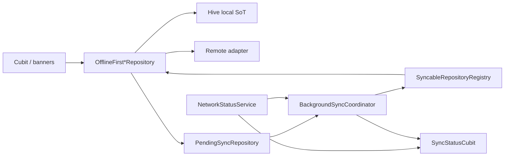

# Offline-first — reviewer guide

**Audience:** Reviewers and senior engineers assessing the offline
spine.  
**Scope:** What this repo actually ships. Adoption how-to stays in
[`adoption_guide.md`](adoption_guide.md); named invariants in
[`invariants.md`](invariants.md); ADR in [`../adr/0002-offline-first-data.md`](../adr/0002-offline-first-data.md).

## Architecture (code truth)

| Concern | Owner (class / path) |
| --- | --- |
| Primary local store | Hive via `HiveService`, `HiveRepositoryBase` — `packages/storage/lib/src/hive/` |
| Secondary prefs / migration | `shared_preferences` — e.g. `SharedPreferencesMigrationService`, legacy counter/analytics prefs |
| Sync queue | `PendingSyncRepository` — `packages/storage/lib/src/sync/pending_sync_repository.dart` (Hive box `pending_sync_operations`) |
| Replay / backoff | `BackgroundSyncCoordinator` — `packages/networking/lib/src/sync/background_sync_coordinator.dart` (`_maxRetryCount = 10`, `_maxOperationAge = 30 days`) |
| Feature registration | `SyncableRepository` + `SyncableRepositoryRegistry` — `packages/storage/lib/src/sync/` |
| Connectivity | `NetworkStatus` / `ConnectivityNetworkStatusService` — `packages/networking/lib/src/services/network_status_service.dart` (`connectivity_plus`) |
| App-visible sync UI | `SyncStatusCubit` / `SyncStatusState` — `apps/mobile/lib/app/sync/presentation/` |

**Not used for offline SoT:** Drift, Isar, SQLite/sqflite (no matching deps in
`apps/mobile/pubspec.yaml` or `packages/storage/pubspec.yaml`).

### Repository pattern

Presentation → domain ← data. Data owns local + remote + queue
([ADR 0002](../adr/0002-offline-first-data.md)).

Write-heavy path (Counter / Todo / Chat, etc.):

1. Persist to Hive first; mark `synchronized: false`; generate `changeId` /
   `idempotencyKey`.
2. Enqueue `SyncOperation` via `PendingSyncRepository.enqueue` (dedupe by
   entity + idempotency key + best-effort user scope).
3. `BackgroundSyncCoordinator` flushes when online; calls
   `SyncableRepository.processOperation` / `pullRemote`.

Reference leaf: `OfflineFirstCounterRepository`
(`apps/mobile/lib/features/counter/data/offline_first_counter_repository.dart`)
with merge helpers
`OfflineFirstCounterRepositoryHelpers.shouldApplyRemote` /
`shouldPushPendingToRemote`. Domain policies also exist
(`TodoMergePolicy`, `SocialFeedMergePolicy`).

**Local-only exception:** `HiveNotesRepository` — no remote, not
`SyncableRepository` ([`notes_demo.md`](notes_demo.md)).

### Sync retry vs `ilkersevim_retry`

| Layer | Mechanism | Evidence |
| --- | --- | --- |
| Pending-sync queue | Coordinator metadata (`markFailed`, prune, exponential backoff in tests) | `BackgroundSyncCoordinator`; **not** `RetryPolicy` |
| HTTP / selected use cases | `package:ilkersevim_retry` (`RetryPolicy`, `CancelToken`) | `RetryInterceptor` in `packages/networking`; `AppInfoCubit`; case-study use cases |

Do not claim the sync queue is implemented with `ilkersevim_retry` — it is not.

### Conflict and staleness

Canonical list: [`invariants.md`](invariants.md). Implementation anchors:

- Stale remote ≠ overwrite newer local —
  `shouldApplyRemote` / `TodoMergePolicy.shouldApplyRemote`
- Stale pending ≠ push over newer remote — `shouldPushPendingToRemote`
- TOCTOU re-read before save/delete — repository helpers + tests
- Failed remote read ≠ empty snapshot —
  `tool/check_remote_fetch_failure_fallback.sh`

### BLoC / Cubit surfaces (offline, stale, error)

There is **no** single Freezed union named `Offline` / `Stale` across all
features. Status is composed:

| Surface | Fields / signals |
| --- | --- |
| `SyncStatusState` | `networkStatus` (`unknown` \| `online` \| `offline`), `syncStatus` (`idle` \| `syncing` \| `degraded`), history |
| Counter / Todo | `pendingSyncCount`, sync timestamps / `lastError` |
| Chat | `ChatSyncStatusCubit` pending count; offline enqueue treated as pending success |
| Social feed | `SocialFeedReadyData`: `isShowingCachedData`, `cacheAge`, `connectionStatus`, `pendingMutationCount`, … |
| Errors | `NetworkErrorKind.offline` in `packages/utilities` |

UI: `CounterSyncBanner`, `ChatSyncBanner`, `SearchSyncBanner`,
`NetworkSyncBanner`, Settings → Sync diagnostics (dev/qa).

## Decisions and trade-offs

| Chosen | Alternatives considered | Why (repo evidence) |
| --- | --- | --- |
| Hive + shared sync stack | Online-only repos; UI-owned retry queues; per-feature sync engines | ADR 0002 — preserve user data, keep I/O in data layer, one inspectable queue |
| Hive over Drift/Isar/SQLite | Relational ORM | Stack is Hive-encrypted boxes + manifest migrations ([`hive_schema_migrations.md`](hive_schema_migrations.md)); no Drift/Isar deps |
| Coordinator backoff for queue; `ilkersevim_retry` for HTTP | One retry library for everything | Queue needs durable Hive metadata + auth dead-letter rules; HTTP uses interceptor/`RetryPolicy` |
| Feature-specific status fields + global `SyncStatusCubit` | Universal Offline/Stale state machine | Spine features need pending counts; cache-first demos need cache age; forces less abstraction than a one-size Freezed union |
| Notes local-only | Force every feature onto sync | Explicit product exception for private notes |

## How it's tested

### Unit / repository

| File | Representative tests |
| --- | --- |
| `apps/mobile/test/features/counter/data/offline_first_counter_repository_test.dart` | `pullRemote does not overwrite newer synchronized local count`; `processOperation does not push stale pending over newer remote`; `pullRemote does not overwrite local when remote load fails` |
| `apps/mobile/test/features/todo_list/data/offline_first_todo_repository_test.dart` | Stale-pending / TOCTOU / fetch-failure retention |
| `apps/mobile/test/features/chat/data/offline_first_chat_repository_test.dart` | `sendMessage enqueues operation when remote fails`; pullRemote failure retention |
| `packages/networking/test/sync/background_sync_coordinator_test.dart` | `ignores offline events and only syncs when online`; `retries failed operations with exponential backoff` |
| `packages/storage/test/sync/pending_sync_repository_test.dart` | Enqueue / dedupe / persistence |

Also: IoT, social feed, search, profile, remote config, chart, graphql, staff
demo `offline_first_*_repository_test.dart` under `apps/mobile/test/features/`.

### Cubit / widget

| File | Representative tests |
| --- | --- |
| `apps/mobile/test/counter_cubit_test.dart` | `offline repository queues operations when remote unavailable` |
| `apps/mobile/test/chat_cubit_test.dart` | `queues message without error when offline enqueue occurs`; group `offline-first integration` |
| `apps/mobile/test/features/counter/presentation/widgets/counter_sync_banner_test.dart` | `shows offline banner with message` |
| `apps/mobile/test/features/search/presentation/widgets/search_sync_banner_test.dart` | `shows offline banner when network is offline` |

### Integration / golden

| Kind | Evidence |
| --- | --- |
| Integration | `apps/mobile/integration_test/rtdb_remote_wiring_flow_test.dart` — wires `OfflineFirst*` remotes with real auth (not a pure offline-queue suite) |
| Golden | **Gap:** no golden tests found that assert offline/sync banners |

### CI

No workflow named “offline”. Gates ride `.github/workflows/ci.yml` job
`build` → `./bin/checklist` → `tool/delivery_checklist.sh`, which runs:

- `tool/check_offline_first_remote_merge.sh` (counter/todo/iot/social_feed/chat/profile offline-first tests)
- `tool/check_remote_fetch_failure_fallback.sh`
- `tool/check_regression_guards.sh`

Integration host path is opt-in (`run_integration` on macOS), not default PR.

## Gaps (honest)

1. No Drift/Isar/SQLite offline SoT — Hive (+ SharedPreferences) only.
2. `ilkersevim_retry` is **not** the pending-sync engine.
3. No uniform Offline/Stale Cubit state across features.
4. No offline-banner golden coverage found.
5. Default PR CI does not run device/simulator offline E2E; rely on unit + static gates.

## Related

- Adoption: [`adoption_guide.md`](adoption_guide.md)
- Don’t overwrite: [`dont_overwrite_guide.md`](dont_overwrite_guide.md)
- Interview walk: [`../interview_showcase.md`](../interview_showcase.md)
- Cancellation / cache (HTTP vs Hive vs images): [`../engineering/cancellation_and_cache.md`](../engineering/cancellation_and_cache.md)
