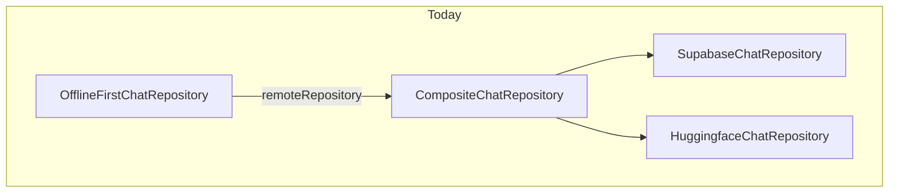
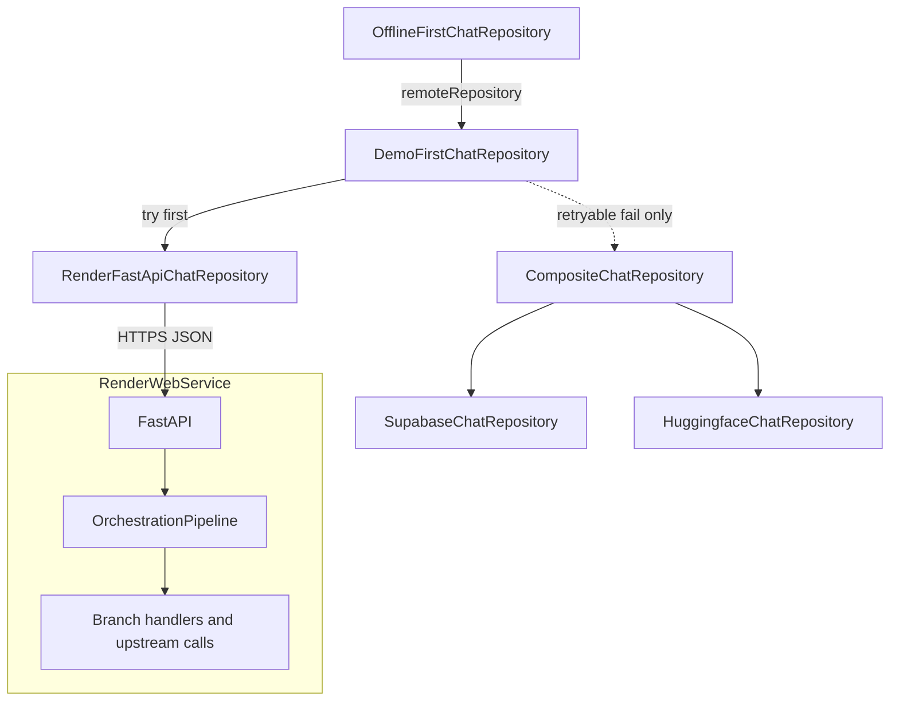

# FastAPI + Render + Flutter chat demo (revised)

**Canonical copy:** This file is the in-repo source of truth under `docs/plans/`. A Cursor-plan copy may exist under `~/.cursor/plans/`; prefer this path for git-tracked work and Codex review: `./tool/run_codex_plan_review.sh docs/plans/render_fastapi_chat_demo_plan.md`.

## For all AI hosts (Cursor, Codex, Gemini CLI, Claude Code, Copilot)

- **Repo canon:** [`AGENTS.md`](../../AGENTS.md) at the repository root is authoritative for delivery, validation routing, and review gates—read it before implementation.
- **Workspace root:** Repository checkout (Flutter / Dart versions per [`AGENTS.md`](../../AGENTS.md) **Repo Snapshot**).
- **Plan review:** From a checkout, run `./tool/run_codex_plan_review.sh docs/plans/render_fastapi_chat_demo_plan.md` for a Codex delegate pass; diff-based review remains `./tool/request_codex_feedback.sh`.
- **Implementation:** Prefer existing chat seams under `lib/features/chat/` and DI in [`register_chat_services.dart`](../../lib/core/di/register_chat_services.dart); do not fork a second chat screen.

## Primary purpose (why FastAPI exists here)

The **point of adding FastAPI** to the current AI chat flow is **not** merely to host a thin HTTP passthrough or a static echo. It is to **demo FastAPI as an AI orchestration layer**: the service owns **workflow** over the request—structured steps such as routing, validation, optional tool-style side paths, calling one or more model backends, merging or post-processing results, and emitting a **single** outward `chat/completions`-shaped response that the Flutter client already knows how to parse.

- **Flutter + Render** are the **delivery shell**: same chat page, same [`HuggingFacePayloadBuilder`](../../lib/features/chat/data/huggingface_payload_builder.dart) / [`HuggingFaceResponseParser`](../../lib/features/chat/data/huggingface_response_parser.dart) contract, optional first-hop to your deployed API.
- **FastAPI** is the **star of the demo**: dependency injection, explicit modules for orchestration logic, async I/O to upstreams, clear extension points for richer patterns (tools, multi-step agents, streaming later).

## Secondary goals

- End-to-end **Flutter app → HTTPS on Render → FastAPI orchestration** without a second chat screen.
- Preserve the **OpenAI-style chat-completions JSON** wire contract so [`HuggingFaceResponseParser.buildChatCompletionsResult`](../../lib/features/chat/data/huggingface_response_parser.dart) stays the single parse path on the client.

## External review (Codex)

Latest structured review: `./tool/run_codex_plan_review.sh` (balanced) on this file—feedback merged into **Security and auth**, **Failure mapping**, **Idempotency**, **Dedicated Dio checklist**, **Transport state contract**, **FastAPI/Render hardening**, **Testing split**, and **l10n proof** below.

## Current architecture (baseline)

- [`OfflineFirstChatRepository`](../../lib/features/chat/data/offline_first_chat_repository.dart) wraps whatever is registered as **`ChatRepository` remote** and maps failures to the offline queue using [`ChatRemoteFailureException`](../../lib/features/chat/domain/chat_repository.dart) (`retryable` flag).
- Today that remote is [`CompositeChatRepository`](../../lib/features/chat/data/composite_chat_repository.dart): **Supabase** `chat-complete` when Supabase is initialized and the session has a JWT, else **direct Hugging Face** when a client HF key exists ([`register_chat_services.dart`](../../lib/core/di/register_chat_services.dart)).
- Payloads: [`HuggingFacePayloadBuilder.buildChatCompletionsPayload`](../../lib/features/chat/data/huggingface_payload_builder.dart). Transport chip: [`ChatInferenceTransport`](../../lib/features/chat/domain/chat_repository.dart) (`supabase` | `direct`) in [`ChatTransportBadge`](../../lib/features/chat/presentation/widgets/chat_transport_badge.dart).

## Target architecture (correct layering)

Replace the **remote** registered on `OfflineFirstChatRepository` with a **router** that tries the Render FastAPI orchestration endpoint first, then the existing `CompositeChatRepository`.

Solid path: each send tries `R` then Render orchestration. Dashed path: **one** fallthrough to `C` when policy allows (see Fallthrough matrix).

This preserves offline-first and sync semantics without editing [`OfflineFirstChatRepository`](../../lib/features/chat/data/offline_first_chat_repository.dart) internals.

## FastAPI orchestration scope (what to build)

### Minimum viable orchestration (v1)

Must be observable as “more than one logical step” in code and, where useful, in structured logs (redacted):

1. **Ingress:** Validate body (`messages`, `model`, limits); attach **`request_id`** (server-generated or echo client idempotency key); reject attempts to override upstream base URL, headers, or model outside **allowlist** (client input must not control outbound HF/OpenAI routing beyond allowed model ids and safe params).
2. **Route:** Simple **branch** on deterministic rules (e.g. last user message prefix, keyword, or hash bucket) to select a **handler strategy**.
3. **Execute:** At least one branch calls a **real async step**—e.g. `httpx` call to Hugging Face chat-completions **or** a pure-Python “tool” step; enforce **per-step timeout** so total wall time fits Flutter Dio budget + cold-start margin.
4. **Egress:** Assemble **one** OpenAI-compatible `choices[0].message.content` response for the Flutter parser.

### Idempotency / request correlation

- Flutter generates a per-send **idempotency key** (reuse existing `clientMessageId` when present, or align with chat sync ids) and sends it as a header (e.g. `Idempotency-Key` or `X-Client-Message-Id`) plus optional `X-Request-Id` for tracing.
- FastAPI logs and upstream calls attach **`request_id`** + idempotency key; document that v1 orchestration steps should be **side-effect free** except upstream LLM usage—if later steps are not idempotent, server must dedupe on key or document duplicate tolerance.
- Plan explicitly: a **Render timeout** may still complete work server-side; duplicate user-visible replies are mitigated by idempotent **composite** path only running after classified **retryable** client failure, not after success—client shows one assistant bubble per successful `ChatResult`.

### Deeper orchestration (phase B+)

Follow-ups: multi-model, tool loops, streaming (requires Flutter contract change).

### Code layout (illustrative)

`orchestration/router.py`, `orchestration/pipeline.py`, `orchestration/handlers/*.py`, `orchestration/upstream_hf.py`; routes thin; `Depends()` injection.

## Routing decision (locked)

- **Default fallthrough:** On `ChatRemoteFailureException` from the Render path with **`retryable: true`**, call `CompositeChatRepository.sendMessage` once. On **`retryable: false`**, **rethrow**.
- **Strict demo-only (optional):** `--dart-define=CHAT_RENDER_DEMO_STRICT=true` — never fall through.
- **Kill-switch:** `--dart-define=CHAT_RENDER_DEMO_ENABLED=false` disables Render attempt.
- **Precedence:** When enabled and URL configured, Render orchestration is attempted first.

## Fallthrough policy (explicit matrix)

| Outcome from Render path | Action |
| --- | --- |
| Success | Return result; `transportUsed` = new transport enum (orchestration / render demo) |
| `ChatRemoteFailureException` with `retryable: true` | If not strict → fall through to composite once. If strict → rethrow. |
| `ChatRemoteFailureException` with `retryable: false` | **Rethrow** |
| `ChatException` / unexpected | Map per [`mapDirectChatException`](../../lib/features/chat/data/chat_direct_failure_mapper.dart) or shared helper |

## Failure mapping and offline semantics (Dio / HTTP → client)

Map into [`ChatRemoteFailureException`](../../lib/features/chat/domain/chat_repository.dart) (`code`, `retryable`, `isEdge: false` for this path). Align codes with existing chat queue expectations ([`mapDirectChatException`](../../lib/features/chat/data/chat_direct_failure_mapper.dart) families).

| Condition | Suggested `code` | `retryable` | Fallthrough (default non-strict) | Offline enqueue when thrown out of `DemoFirstChatRepository` |
| --- | --- | --- | --- | --- |
| Connect / send timeout | `upstream_timeout` | true | Yes | Yes |
| Receive / read timeout | `upstream_timeout` | true | Yes | Yes |
| DNS / TLS / “no route” | `upstream_unavailable` | true | Yes | Yes |
| TCP reset / connection error mid-flight | `upstream_unavailable` | true | Yes | Yes |
| **401** shared secret mismatch | `auth_required` | false | No | No |
| **403** | `forbidden` | false | No | No |
| **413** / **422** validation | `invalid_request` | false | No | No |
| **429** | `rate_limited` | false | No | No |
| **5xx** from Render | `upstream_unavailable` | true | Yes | Yes |
| **2xx** but JSON parse failure / missing `choices` | `invalid_request` or `upstream_unavailable` | false or true* | *Prefer false if body contract broken; true if treated as transient garble | Per chosen `retryable` |
| Parser / schema drift in Flutter after 200 | Treat as implementation bug; add contract tests to prevent | — | — | — |

\*Pick one policy in implementation and test it; default recommendation **false** for “unparseable 200” to avoid infinite retry loops.

## Transport state contract (Flutter)

- **`ChatResult.transportUsed`:** Single source of truth for **which backend produced the assistant text** for this completion. After successful fallthrough, value is **`supabase` or `direct`**, not the Render orchestration enum.
- **`chatRemoteTransportHint`:** May still reflect **“orchestration path configured and tried first”** (e.g. `renderOrchestration`) when demo URL is enabled—used for badge **pre-send** “likely path” only if product chooses that UX; document in ARB/tooltip.
- **`ChatState.lastCompletionTransport`:** Set from `result.transportUsed` on success ([`chat_cubit_message_actions`](../../lib/features/chat/presentation/chat_cubit_message_actions.dart)); drives **post-send** chip for “what actually answered.”
- **Tests:** Assert badge/state after (a) orchestration success, (b) retryable orchestration failure + composite success, (c) non-retryable orchestration failure (no fallback).

## Security and auth contract

- **No long-lived shared secrets in Flutter web release builds.** If `DEMO_SHARED_SECRET` exists, restrict to **non-web** flavors, CI-injected defines, or **short-lived** dev-only flows; browser bundles must not embed durable demo secrets.
- **Header contract (when secret enabled):** e.g. `Authorization: Bearer <secret>` **or** `X-Demo-Key: <secret>`—pick one in implementation, document in `docs/integrations/`, and match [`SecretConfig`](../../lib/core/config/secret_config.dart).
- **Render:** Secret only in Render env; rotation = update Render + redistribute allowed clients (defines / secure storage), never commit secret to git.
- **CORS:** Explicit **allowlist** of origins; do **not** use `*` with credentialed requests.
- **Upstream:** Server-side allowlist for **model id** and generation params; client must not supply arbitrary URLs, Host headers, or proxy targets.

## Offline-first contract

- One logical `sendMessage` from `OfflineFirstChatRepository`; fallthrough happens **inside** `DemoFirstChatRepository`.
- **`retryable`** on thrown exceptions must match the **Failure mapping** table so enqueue behavior stays correct.
- Duplicate-send risk: combine **idempotency key** + table above; document server-side best-effort dedupe if orchestration gains side effects later.

## 1) FastAPI service (`demos/render_chat_api/`)

### Layout

`demos/render_chat_api/` with **orchestration-first** package layout. **Strict Pydantic** models for request and success response; separate **stable error JSON** schema (`code`, `message`, optional `request_id`). Pin **Python + deps** in Dockerfile / `requirements.txt` (and `render.yaml` env).

### Endpoints

- `POST /v1/chat/completions` — validated body; pipeline only; **max messages**, **max chars/tokens estimate**, max body bytes; **trusted-proxy** behavior documented if using forwarded headers on Render.
- `GET /health` — Render health check path.

### Success response contract (frozen minimum)

- `Content-Type: application/json; charset=utf-8`
- JSON suitable for [`HuggingFaceResponseParser`](../../lib/features/chat/data/huggingface_response_parser.dart).

### Hardening checklist

- Rate limits (per IP + global); structured logs **step + request_id + duration**; **no** full prompts at info.
- **Startup:** fail fast if required env missing in “strict demo” profile (optional flag).
- **Tests:** 401/413/422/429/5xx, **OPTIONS** preflight for allowed/denied origins, auth-disabled mode, response schema validation.

### Upstream HF

`HF_TOKEN` on Render only; allowlist models; per-step timeouts.

## 2) Render deployment (concrete ops checklist)

- **`render.yaml` (recommended):** Service name, **rootDir** `demos/render_chat_api`, Docker build or native `runtime` + **buildCommand** / **startCommand** (`uvicorn … --host 0.0.0.0 --port $PORT`), **healthCheckPath** `/health`, **plan** (instance size) noting cold-start behavior.
- **Env vars:** `CORS_ORIGINS`, optional `DEMO_SHARED_SECRET`, optional `HF_TOKEN`, Python version if native build.
- **Timeouts:** Document Render idle + Flutter Dio read timeout relationship (Dio > worst cold start + orchestration budget or accept fallthrough).
- **Secrets rotation:** Dashboard edit + redeploy + client secret refresh for non-git channels.
- **Flavor gating:** Production / store builds ship with demo **disabled** unless explicitly approved (`CHAT_RENDER_DEMO_ENABLED` default false for release in implementation plan).
- **Logs:** Expectation of redacted fields; no full user content in production log drains.

## 3) Flutter implementation notes

### SecretConfig

Demo base URL + optional secret per repo patterns; **release** requires `https`; flavor rules per **Security and auth**.

### Dedicated Dio configuration (checklist)

- **New Dio instance** (or factory) registered only for Render demo base URL—**do not** attach shared [`RetryInterceptor`](../../lib/shared/http/interceptors/retry_interceptor.dart) / [`AuthTokenInterceptor`](../../lib/shared/http/interceptors/auth_token_interceptor.dart) if they would retry **POST** chat, replay **401**s, or inject **Supabase/app tokens** to the Render host.
- **BaseUrl:** Normalized demo origin; **timeouts:** connect + receive explicitly set; **maxRedirects:** 0 or document follow limit; **validateStatus:** map to `ChatRemoteFailureException` per table.
- **Headers:** `Content-Type: application/json`, idempotency + optional demo auth header; **CancelToken** tied to cubit/request lifecycle where applicable.
- **Logging:** Dio logs redacted or disabled for bodies on this client.

### Repositories

`RenderFastApiChatRepository`, `DemoFirstChatRepository`, [`register_chat_services.dart`](../../lib/core/di/register_chat_services.dart) registration order unchanged in intent (composite → render repo → demo-first wrapping composite → offline-first).

### Transport / l10n

Enum + ARB label reflecting orchestration; see **Transport state contract**.

## 4) Testing and validation (split)

### Flutter (unit / widget / cubit as appropriate)

- Kill-switch skips Render; strict disables fallthrough; retryable triggers **one** composite call; non-retryable does not.
- **Offline:** enqueue only when `retryable: true` per existing [`OfflineFirstChatRepository`](../../lib/features/chat/data/offline_first_chat_repository.dart) behavior after failed remote.
- **State:** `lastCompletionTransport` and badge after orchestration success vs after fallback success.
- Fixtures: success JSON, each error shape from FastAPI.

### FastAPI (`pytest`)

- Router/pipeline branches; auth on/off; CORS allowed vs denied origin; error contract for each HTTP class; schema validation of responses.

### Manual / web / Render

- One Flutter **web** run: CORS allowlist; cold-start behavior; health check from Render dashboard.

### Codegen / l10n proof

- After ARB edits: run `flutter gen-l10n` (or repo’s documented codegen entrypoint); confirm generated files updated; `dart analyze` on touched lib.

### Review gate

[`docs/ai_code_review_protocol.md`](../ai_code_review_protocol.md) self-pass.

### Validation routing

[`docs/engineering/validation_routing_fast_vs_full.md`](../engineering/validation_routing_fast_vs_full.md).

## 5) Documentation

[`docs/integrations/render_fastapi_chat_demo.md`](../integrations/render_fastapi_chat_demo.md): orchestration diagram; branch triggers; **auth header + web rule**; **failure code table** summary; **idempotency** header; `render.yaml` snippet; env vars; **Dio checklist** pointer; ops rotation; link to [`AGENTS.md`](../../AGENTS.md) for host-neutral delivery rules.

## Risks and mitigations (expanded)

| Risk | Mitigation |
| --- | --- |
| Demo URL in release builds | Kill-switch; flavor docs |
| **Secret in web bundle** | Security section; no long-lived secret in web release |
| CORS / cold start | Allowlist; Dio timeout vs fallthrough |
| **Orchestration latency stacks** | Per-step timeouts; documented max depth |
| **Double send / duplicate work** | Idempotency key + side-effect-free v1; dedupe story in docs |
| **Interceptor leakage** | Dedicated Dio checklist |
| **Ambiguous retryable** | Failure mapping table + tests |
| Parser drift | Contract fixtures |
| Badge vs actual path | Transport state contract + tests |

## Resolved gaps vs earlier draft

- **Diagram and DI:** Demo router wraps composite as **remote of offline-first**.
- **Fallthrough:** Locked defaults + strict + kill-switch.
- **Codex passes:** Prior merge + this pass—auth/CORS/web rules, failure matrix, idempotency, Dio checklist, transport SSOT, Render ops concretes, test split, l10n proof, **all-host** preamble.
