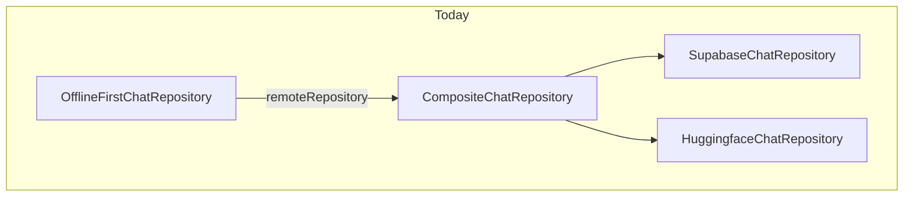
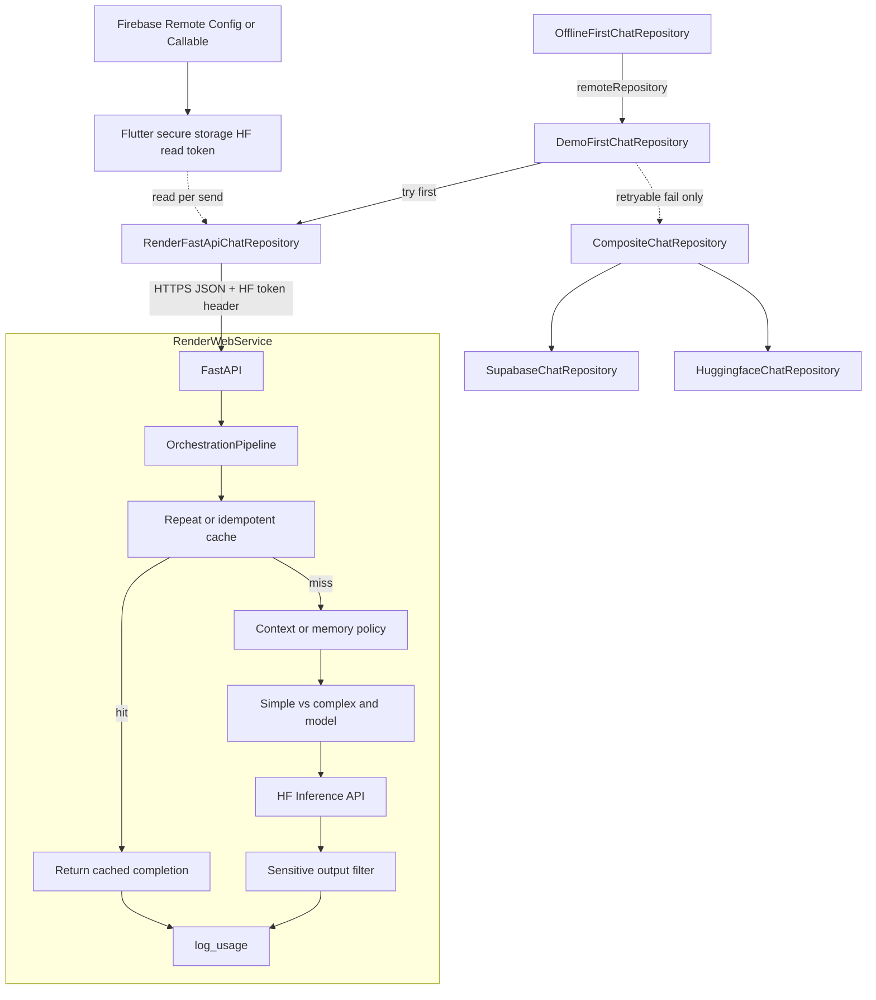

# FastAPI + Render + Flutter chat demo (revised)

**Canonical copy:** This file is the in-repo source of truth under `docs/plans/`. A Cursor-plan copy may exist under `~/.cursor/plans/`; prefer this path for git-tracked work and Codex review: `./tool/run_codex_plan_review.sh docs/plans/render_fastapi_chat_demo_plan.md`.

**Plan revision:** **Build-ready for Cursor AI agents** — Codex finalization pass merged (overload vs `429`, single worker, fixture root, JWT rules, idempotency lifecycle, session switch, `get_it` hygiene). Requirements below are complete; **product-owned** items remain in **STOP** and must be **frozen in writing** in `docs/integrations/render_fastapi_chat_demo.md` before treating ambiguous rows as done.

## STOP — Do not start building until these are explicit

**Agents: if any row below is still “TBD” for your branch, stop and get a human decision (or adopt the stated default and record it in `docs/integrations/render_fastapi_chat_demo.md`). Do not guess in code.**

| # | Topic | Why it blocks agents | Resolve by |
| --- | --- | --- | --- |
| 1 | **Who may call Render** | “Verify caller auth when enabled” is ambiguous—**HF token does not authenticate** the client to your service. | Pick **one**: (A) **Firebase ID token** verified on FastAPI every request (+ optional App Check), (B) **Callable-issued** short-lived JWT for Render only, or (C) **Public lab demo** with documented abuse acceptance (rate limits only). **Default recommendation for v1 dev:** (A) or (C) with banner “demo”—never ship (C) to prod. |
| 2 | **HF read token delivery** | **Remote Config is not a production secrets channel**; the plan allows both RC and Callable. | Per **flavor**: e.g. **dev** = RC demo-scoped HF key + rotation; **staging/prod** = Callable or other **short-lived** path unless product explicitly accepts RC risk. Write the table in integrations doc. |
| 3 | **Response cache without caller identity** | Cache keys **must** include trusted `sub`/uid when auth is on; when auth is **off** (lab), “disable cache vs anonymous bucket” is a policy choice. | Human picks: **disable server cache** for unauthenticated requests **or** define **single shared demo cache** (document leakage risk). **Default:** disable cache when no verified caller. |
| 4 | **Frozen HTTP header names** | Codex called out collisions: Firebase `Authorization` vs HF `Authorization`. | Freeze names in integrations doc **before** first PR: e.g. HF in **`X-HF-Authorization`**, demo in **`X-Render-Demo-Secret`**, Firebase **`Authorization: Bearer <id_token>`** (if using A). Same strings in FastAPI CORS `Access-Control-Allow-Headers` and Flutter Dio. |
| 5 | **`model` sentinel for Auto** | Payload must use one literal agreed with FastAPI. | **Default:** JSON `model` field exactly **`"auto"`** (lowercase) on Render path only; FastAPI treats only this value as orchestration routing for mini/full. Document if you need a different sentinel. |
| 6 | **Overload vs rate limit (no ambiguous 429)** | Generic **HTTP 429** was mapped `rate_limited` / non-retryable while semaphore saturation could also be **429**—Flutter cannot distinguish **retryable overload** from **non-retryable rate limit** without a stable rule. | **Default (Codex build-ready):** **Semaphore / instance saturation → HTTP `503`** with JSON `code: upstream_unavailable` (or frozen synonym) and **`retryable: true`**. Reserve **HTTP `429`** + `code: rate_limited` for **upstream HF / platform** rate limits only (`retryable: false`). If product ever uses **429** for saturation, error JSON **must** use a **distinct `code`** (e.g. `server_overloaded`) and Flutter maps that code’s `retryable` explicitly—document in integrations doc. |
| 7 | **Complexity scorer thresholds** | “Simple vs complex” has no numbers in this plan. | Human (or first integration PR) fills numeric thresholds + examples in `docs/integrations/render_fastapi_chat_demo.md`; FastAPI unit tests **must** lock those numbers in code comments pointing to the doc. |
| 8 | **Offline replay on permanent `auth_required`** | [Replay and token lifecycle](#replay-and-token-lifecycle) lists options (a)(b)(c) without a single default. | **Default:** Render `401` for missing/invalid caller or HF token → **`retryable: false`** after first attempt from queue; surface UX to re-auth / refresh; **do not** infinite-loop dequeue. Dead-letter vs drop: human picks one sentence in integrations doc. |
| 9 | **Unparseable 200 body** | Failure table leaves `retryable` as implementer choice. | **Default:** **`invalid_request`**, `retryable: false` (avoid retry storms). |
| 10 | **New `ChatInferenceTransport` enum value name** | Badge and grep-exhaustive switches need the exact identifier. | **Default:** `renderOrchestration` (or align with existing enum style in [`chat_repository.dart`](../../lib/features/chat/domain/chat_repository.dart))—freeze in ARB + enum in same PR. |
| 11 | **Uvicorn / worker count for v1** | In-memory cache + per-process semaphore are **invalid** across multiple workers or Gunicorn forks—behavior changes instantly. | **Default:** **`uvicorn` with a single worker** (or equivalent: **one process**, no `--workers` > 1) for any deploy that uses in-process cache/semaphore without Redis. Document in `render.yaml` / Dockerfile. **Before** claiming multi-instance correctness, add Redis (or disable cache). |
| 12 | **Canonical contract fixtures directory** | “Shared fixtures” without one path invites duplicate JSON drift. | **Frozen owner:** repo-relative **`test/fixtures/render_chat_contract/`** — JSON files for success + each error `code`. Dart tests and **`demos/render_chat_api/` pytest** both load from this directory (pathlib / `File` from repo root); **no** second copy under `demos/` unless symlinked or generated from the same source—state rule in integrations doc. |

After STOP items are resolved or defaulted, record them in **`docs/integrations/render_fastapi_chat_demo.md`** (even stub) so the next agent does not re-derive policy from this plan alone.

## For all AI hosts (Cursor, Codex, Gemini CLI, Claude Code, Copilot)

- **Repo canon:** [`AGENTS.md`](../../AGENTS.md) at the repository root is authoritative for delivery, validation routing, and review gates—read it before implementation.
- **Workspace root:** Repository checkout (Flutter / Dart versions per [`AGENTS.md`](../../AGENTS.md) **Repo Snapshot**).
- **Plan review:** From a checkout, run `./tool/run_codex_plan_review.sh docs/plans/render_fastapi_chat_demo_plan.md` for a Codex delegate pass; diff-based review remains `./tool/request_codex_feedback.sh`.
- **Implementation:** Prefer existing chat seams under `lib/features/chat/` and DI in [`register_chat_services.dart`](../../lib/core/di/register_chat_services.dart); do not fork a second chat screen.

### Agent reading order (cross-host)

Implementers should resolve **security and cache semantics** before wiring Render or Flutter details:

0. [STOP — unresolved product freezes](#stop--do-not-start-building-until-these-are-explicit) (read first; do not skip)
1. [Security decision (caller auth and HF token delivery)](#security-decision-caller-auth-and-hf-token-delivery)
2. [Security and auth contract](#security-and-auth-contract)
3. [Cache scope and deployment mode](#cache-scope-and-deployment-mode)
4. [FastAPI orchestration scope](#fastapi-orchestration-scope-what-to-build) (pipeline + v1 checklist)
5. [Offline-first contract](#offline-first-contract) — [Idempotency key lifecycle](#idempotency-key-lifecycle-one-logical-message), [Replay and token lifecycle](#replay-and-token-lifecycle), [Session and user-switch hygiene](#session-and-user-switch-hygiene-flutter)
6. [Flutter implementation notes](#3-flutter-implementation-notes) and [Render deployment](#2-render-deployment-concrete-ops-checklist)

## Primary purpose (why FastAPI exists here)

The **point of adding FastAPI** to the current AI chat flow is **not** merely to host a thin HTTP passthrough or a static echo. It is to **demo FastAPI as an AI orchestration layer**: the service owns **workflow** over the request—validation, **complexity-aware model routing**, upstream Hugging Face Inference calls, and emitting a **single** outward `chat/completions`-shaped response that the Flutter client already knows how to parse.

- **AI orchestration (product definition):** On the AI Chat screen the user can pick **`Auto`**. FastAPI then runs the **orchestration pipeline** in [FastAPI orchestration scope](#fastapi-orchestration-scope-what-to-build): **simple → mini model** (`openai/gpt-oss-20b`), **complex → full model** (`openai/gpt-oss-120b`); optional gates for **needs_context → memory** (how much conversation is sent / summarized), **sensitive → filter output** (post-generation safety pass), **repeated → cache** (reuse prior completion for same idempotency key + payload hash); **`log_usage()`** after each handled request; **`stream_response()`** when the client contract supports streaming (otherwise non-streaming JSON only). Fixed model picks in the UI send explicit Hub ids; only **`Auto`** delegates model choice to the server.
- **Hugging Face token path:** Upstream calls use a **Hugging Face read token** (`HF_TOKEN` / `hf_*`) delivered per [Security decision](#security-decision-caller-auth-and-hf-token-delivery)—**not** treated as authenticating the caller to Render by itself. The app persists it in **`SecretStorage`** and sends it **per request**; FastAPI uses it only for HF outbound calls (no server persistence, no logs). See **Remote Config vs Callable** rules in that section.
- **Flutter + Render** are the **delivery shell**: same chat page ([`ChatModelSelector`](../../lib/features/chat/presentation/widgets/chat_model_selector.dart)), same [`HuggingFacePayloadBuilder`](../../lib/features/chat/data/huggingface_payload_builder.dart) / [`HuggingFaceResponseParser`](../../lib/features/chat/data/huggingface_response_parser.dart) contract, first-hop to your deployed API when the demo is enabled.
- **FastAPI** is the **star of the demo**: dependency injection, explicit **orchestration** pipeline (model routing, memory policy, cache, output filter, `log_usage`, future `stream_response`), async `httpx` to `api-inference.huggingface.co`, clear extension points (tools, richer moderation).

## Secondary goals

- End-to-end **Flutter app → HTTPS on Render → FastAPI orchestration** without a second chat screen.
- Preserve the **OpenAI-style chat-completions JSON** wire contract so [`HuggingFaceResponseParser.buildChatCompletionsResult`](../../lib/features/chat/data/huggingface_response_parser.dart) stays the single parse path on the client.
- Ship **`Auto`** in the chat model picker with **Firebase-backed HF token** storage and **documented** orchestration: **simple → mini / complex → full**, **needs_context → memory**, **sensitive → filter**, **repeated → cache**, **`log_usage()`**; **`stream_response()`** when streaming is in scope.

## Security decision (caller auth and HF token delivery)

*Merged from Codex plan review — applies to all AI hosts implementing this feature.*

### Who may call `POST /v1/chat/completions`

- **Client-supplied HF token authorizes Hugging Face only**, not your Render service. **CORS does not protect** non-browser callers (`curl`, scripts, other apps): anyone who discovers the URL can attempt abuse unless the **caller** is authenticated or gated.
- **Freeze one mandatory strategy** before production traffic (pick and document in `docs/integrations/`):
  - **Preferred:** Verify **Firebase Auth ID token** (Bearer) on FastAPI on every request, optionally plus **App Check**; or
  - **Alternative:** Short-lived **server-issued** app token (e.g. Callable returns a JWT used only for Render) with rotation and audience claim tied to the Render service.
- **Demo-only exception:** If the endpoint remains public for a lab demo, document **abuse model** (rate limits, IP allowlist, single region, no production data) and accept that **HF cost and CPU are exposed** to the internet.

### How the HF read token reaches the app

- **Remote Config is not a secrets channel** for high-value production tokens: payloads can be wider exposed than intended; treat Remote Config–delivered HF material as **demo-scoped, low-privilege, quota-limited**, and rotate often **or** forbid it for real secrets.
- **Production / sensitive HF token:** Prefer **Callable / backend-issued short-lived token** (or exchange Firebase Auth for a brief HF proxy credential) rather than long-lived keys in Remote Config.
- **Web:** Reinforce [Security and auth contract](#security-and-auth-contract) (web bullet there): short TTL, session-only memory, or disable orchestration on web production until approved.

## Human checklist (step-by-step)

These steps need a **person** (dashboard access, billing, secrets, browser verification). Coding agents can implement the repo; they cannot complete Render signup, paste production secrets, or approve org policy for you.

### A — Decide and prepare (before first deploy)

1. **Scope:** Confirm v1 orchestration stages (**cache**, **memory** window, **simple/complex** → 20B/120B, **output filter**, **`log_usage()`**); confirm **`stream_response()`** is out of scope for first ship unless Flutter streaming is approved; confirm [caller auth](#security-decision-caller-auth-and-hf-token-delivery) and HF token delivery path (Remote Config demo vs Callable/production).
2. **Web rule:** If using a shared **demo** secret for Render, confirm it will **not** ship in **web release** builds (non-web flavors or CI-only defines per [Security and auth](#security-and-auth-contract)). **Separately:** web has weaker secret persistence than mobile—confirm product policy for **HF token on web** (memory-only session, shorter TTL from Firebase, or disable orchestration on web release until approved).
3. **Accounts:** **Render**; **Firebase** (project with Remote Config / Functions as chosen); **Hugging Face** hub token with Inference permissions for the two allowlisted models.
4. **CORS list:** Write down every origin that must call the API (e.g. `http://localhost:7357` for Flutter web dev, staging app URL if any). No `*` if credentials or custom headers are used.

### B — Render (after `demos/render_chat_api/` exists in the connected branch)

1. **Create service:** In Render Dashboard, **New → Web Service**, connect the git repo, pick the **branch** that contains `demos/render_chat_api/`.
2. **Root / build:** Set **root directory** to `demos/render_chat_api` (or equivalent Docker **context**). Use the repo’s Dockerfile or Render’s Python runtime + documented `pip install` + start command (`uvicorn main:app --host 0.0.0.0 --port $PORT`). For v1 in-process cache, **do not** pass multi-worker flags unless Redis is enabled ([STOP #11](#stop--do-not-start-building-until-these-are-explicit)).
3. **Health check:** Set health check path to **`/health`** (or match whatever the FastAPI app exposes).
4. **Environment:** In Render **Environment**, set at least `CORS_ORIGINS` (comma-separated). Optionally set `DEMO_SHARED_SECRET` for service-level auth. **`HF_TOKEN` on Render is optional** (CI/operator smoke tests only); the **primary** HF credential is **client-supplied** from Firebase → secure storage per [Security and auth](#security-and-auth-contract).
5. **Deploy:** Trigger first deploy; wait until status is **Live** (expect cold start on free/low tiers).
6. **Copy URL:** Record the service **HTTPS base URL** (no trailing slash)—this value will go into Flutter config / `dart-define` / secure storage per team practice.

### C — Verify the API (human or scripted; you own the credentials)

1. **Health:** In a browser or `curl`, `GET https://<service>/health` and confirm **200**.
2. **Chat contract:** `POST https://<service>/v1/chat/completions` with a minimal JSON body matching the Flutter payload shape; confirm **200** and a `choices[0].message.content` string (or the documented error JSON on intentional bad input).
3. **Auth (if enabled):** Repeat **(2)** **without** then **with** the demo secret header (if used); confirm **401** vs **200** as designed. For **Auto** path, repeat with/without **HF token** header and expect **401**/`auth_required` when missing.
4. **CORS (web):** From a Flutter **web** dev session on an allowed origin, send a real chat message; if blocked, adjust `CORS_ORIGINS` on Render and **redeploy**. Confirm **`Access-Control-Allow-Headers`** includes frozen client headers (`Idempotency-Key`, HF token header, optional demo secret, `Authorization` if verifying Firebase ID tokens).

### D — Flutter on a developer machine

1. **Inject demo URL:** Set the demo base URL via the mechanism your team uses (`--dart-define`, local secrets JSON, env file—**never** commit secrets). Align with [Flutter implementation notes](#3-flutter-implementation-notes) and [Security and auth](#security-and-auth-contract).
2. **Kill-switch / strict:** For first smoke test, use defines documented in [Routing decision (locked)](#routing-decision-locked) so you can turn Render on/off without code edits.
3. **Run app:** `flutter run` (or repo entrypoint) for **dev** / **staging** with defines applied; open the **existing chat** screen.
4. **Manual chat test:** Send a message; confirm orchestration reply or intentional **fallthrough** to Supabase/HF when Render returns a retryable failure (if testing that path).
5. **Web-only pass:** If you ship web, repeat on **Chrome** (or target browser) with CORS allowlist confirmed in **section C, step 4** above.

### E — Handoff, ops, and release hygiene

1. **Write `docs/integrations/render_fastapi_chat_demo.md`** (or update it) with the real service URL pattern, env var names, CORS origins you chose, and who to ping for Render access—still **no secrets** in git.
2. **Rotation:** If `DEMO_SHARED_SECRET` or optional Render `HF_TOKEN` rotates, update Render env and redeploy. When the **Firebase-delivered** HF read token rotates, update Firebase payload/parameters, bump version if using Remote Config semantics, and ensure apps **refetch** into secure storage (document trigger: app resume, version change, or forced refresh).
3. **Production / store builds:** Confirm with release owner that `CHAT_RENDER_DEMO_ENABLED` (or equivalent) defaults **off** and that no demo secret is baked into **web** release artifacts.

## External review (Codex)

Run: `./tool/run_codex_plan_review.sh docs/plans/render_fastapi_chat_demo_plan.md` (optional `--profile fast`).

**Latest passes:** (1) balanced review merged earlier; (2) **build-ready for Cursor agents** — Codex pass merged **STOP #6** overload vs `429` split, **STOP #11** single-worker, **STOP #12** fixture path, **Firebase JWT verification** bullets, **Idempotency key lifecycle**, **Session/user-switch hygiene**, **get_it** reset + token cache, **503** saturation tests, **Render** worker note, reading-order links.

## Current architecture (baseline)

- [`OfflineFirstChatRepository`](../../lib/features/chat/data/offline_first_chat_repository.dart) wraps whatever is registered as **`ChatRepository` remote** and maps failures to the offline queue using [`ChatRemoteFailureException`](../../lib/features/chat/domain/chat_repository.dart) (`retryable` flag).
- Today that remote is [`CompositeChatRepository`](../../lib/features/chat/data/composite_chat_repository.dart): **Supabase** `chat-complete` when Supabase is initialized and the session has a JWT, else **direct Hugging Face** when a client HF key exists ([`register_chat_services.dart`](../../lib/core/di/register_chat_services.dart)).
- Payloads: [`HuggingFacePayloadBuilder.buildChatCompletionsPayload`](../../lib/features/chat/data/huggingface_payload_builder.dart). Model UI: [`ChatModelSelector`](../../lib/features/chat/presentation/widgets/chat_model_selector.dart) (today fixed Hub ids such as `openai/gpt-oss-20b` / `openai/gpt-oss-120b`). Transport chip: [`ChatInferenceTransport`](../../lib/features/chat/domain/chat_repository.dart) (`supabase` | `direct`) in [`ChatTransportBadge`](../../lib/features/chat/presentation/widgets/chat_transport_badge.dart).



## Target architecture (correct layering)

Replace the **remote** registered on `OfflineFirstChatRepository` with a **router** that tries the Render FastAPI orchestration endpoint first, then the existing `CompositeChatRepository`.



Solid path: each send tries `R` then Render orchestration. Dashed path: **one** fallthrough to `C` when policy allows (see Fallthrough matrix).

This preserves offline-first and sync semantics without editing [`OfflineFirstChatRepository`](../../lib/features/chat/data/offline_first_chat_repository.dart) internals.

## FastAPI orchestration scope (what to build)

### Orchestration pipeline (target logic)

Implement the pipeline as **explicit stages** (even when a stage is a no-op) so the design reads like the control flow below. Names map to product language: **mini model** = `openai/gpt-oss-20b`, **full model** = `openai/gpt-oss-120b` when `model == "auto"`; fixed Hub ids from the client skip the simple/complex branch.

```text
# Ordering: cache short-circuits upstream; then widen context; then pick model; then HF; then safety; then telemetry.

if repeated(idempotency_key, normalized_payload_hash, caller_scope):
    return cached_completion()   # no second HF bill; still run log_usage(); caller_scope see STOP #3

if needs_context(messages, policy):
    messages_for_upstream = apply_memory(messages)   # e.g. trim/summarize window, cap tokens, or attach system primer

if simple(complexity_score):
    resolved_model = MINI_MODEL   # gpt-oss-20b
elif complex(complexity_score):
    resolved_model = FULL_MODEL   # gpt-oss-120b
else:
    resolved_model = explicit_model_from_client_or_default

upstream_text = call_hf_chat_completions(resolved_model, messages_for_upstream)

if sensitive(policy, upstream_text, user_message):
    upstream_text = filter_output(upstream_text)   # blocklist / regex / optional moderation API; document false-positive handling

# v1: non-streaming JSON response assembled here.
# stream_response(): phase B+ — SSE/chunked body + Flutter parser work (see below).
assemble_openai_json(upstream_text)
log_usage(request_id, resolved_model, latency_ms, cache_hit, approx_tokens_in_out)
```

- **`if repeated: use cache`:** Key = **`Idempotency-Key`** (or agreed header) **plus** stable hash of the normalized request body (messages + model + generation params that affect output) **plus a caller scope** (see [Cache scope and deployment mode](#cache-scope-and-deployment-mode)). Store **only** the serialized OpenAI-shaped completion JSON (or assistant text + metadata), **TTL** bounded (e.g. minutes–hours, env-driven), **no** HF token in cache entries. On hit, skip HF and still call **`log_usage()`** with `cache_hit=true`.
- **`if needs_context: add memory`:** v1 = **deterministic windowing** (last *N* messages, max chars/tokens estimate) and optional **system primer** string from env; document caps. Phase B+ = summarization service or server-side thread store (Redis) if product requires long threads.
- **`if sensitive: filter output`:** v1 = **server-side post-filter** on assistant text (PII patterns, profanity list, empty-after-filter → safe fallback string + non-retryable or retryable policy—freeze in tests). Optional hook for external moderation; **never** log raw filtered material at info level.
- **`stream_response()`:** **Not** required for v1 Flutter ([`HuggingFaceResponseParser`](../../lib/features/chat/data/huggingface_response_parser.dart) expects a **complete** JSON body). Add **`stream_response()`** as a separate route or `Accept` / query flag once Flutter defines SSE/chunk consumption and parser updates; keep **`log_usage()`** on stream end or abort.
- **`log_usage()`:** After every exit path (success, cache hit, validation error after ingress, upstream failure), emit **structured** log/metric fields: `request_id`, idempotency key **hash** (not raw key if sensitive), `resolved_model`, `cache_hit`, wall time, upstream HTTP status, **approximate** token counts if derivable—**no** user message text, **no** HF token, **no** full assistant content at info (sample/truncate at debug only behind a flag).

### Minimum viable orchestration (v1 checklist)

Must be observable as “more than one logical step” in code and in **structured** logs (redacted):

1. **Ingress:** Validate body (`messages`, `model`, limits); attach **`request_id`**; **verify caller auth** per [Security decision](#security-decision-caller-auth-and-hf-token-delivery) and [STOP #1](#stop--do-not-start-building-until-these-are-explicit) (no “when enabled” ambiguity—lab mode must be an explicit env flag); require **HF read token** header when calling HF; allowlist models (`openai/gpt-oss-20b`, `openai/gpt-oss-120b`, `auto`).
2. **Repeated → cache:** Lookup before HF; on miss continue; on hit return cached JSON and **`log_usage()`**.
3. **Needs context → memory:** Apply v1 window/primer policy to build `messages_for_upstream`.
4. **Simple / complex → model:** If JSON `model` is exactly **`"auto"`** ([STOP #5](#stop--do-not-start-building-until-these-are-explicit)), run the **complexity scorer** (thresholds: [STOP #7](#stop--do-not-start-building-until-these-are-explicit)) and set **mini** vs **full**; else use client model id if allowlisted.
5. **Execute:** `httpx` to HF with **resolved** model, **per-step timeout**.
6. **Sensitive → filter:** Run **filter_output** on assistant text before assembly.
7. **Egress:** One OpenAI-compatible JSON body for the Flutter parser (non-streaming).
8. **`log_usage()`** on all paths above (including cache hit and early validation failure where useful).

### Idempotency / request correlation

- Flutter sends **`Idempotency-Key`** (or agreed header); FastAPI uses it for **cache** keys and tracing together with **`request_id`**.
- **Repeated → cache** is distinct from Flutter offline enqueue: server cache avoids duplicate **HF** cost for **identical** orchestration requests; client fallthrough still follows the [Fallthrough policy](#fallthrough-policy-explicit-matrix).
- Document duplicate tolerance if a cache entry expires between retries; default: **miss** → new upstream call.
- A **Render timeout** may still complete work server-side; duplicate user-visible replies remain mitigated by the client’s **single** fallthrough to composite only after classified **retryable** failure, not after success—client shows one assistant bubble per successful `ChatResult`.

### Cache scope and deployment mode

- **User / tenant scope:** Cache keys **must** include a **trusted caller identity** when available (e.g. hashed Firebase `sub` / uid from verified ID token, or session id from signed server token). **Never** return a cached completion for user A to user B who reused the same idempotency key and prompt hash. If caller identity cannot be established, either **disable response cache** for that request or use a **narrow** demo-only policy documented in `docs/integrations/`.
- **Idempotency key validation:** Reject malformed or oversized keys; cap header length; reject cache lookup when key missing if cache is enabled for authenticated routes only.
- **Single instance vs Redis:** **In-memory** cache is **best-effort** only (restart clears entries; multi-instance Render **does not** share memory). **v1 default:** document **single-instance** semantics and accept occasional duplicate HF cost after deploy/scale. **Upgrade path:** move to **Redis** (or Render key-value) before claiming **durable** cross-instance dedupe or strict billing guarantees.
- **Degraded mode:** If Redis is required later, document rollback (disable cache flag, drain TTL).

### Deeper orchestration (phase B+)

ML-based complexity scoring; **summarized memory** or Redis thread state; **true `stream_response()`** with Flutter contract + parser changes; external moderation providers; tool loops.

### Code layout (illustrative)

`orchestration/pipeline.py` (stage runner), `orchestration/complexity.py` (simple vs complex), `orchestration/memory.py` (needs_context), `orchestration/response_cache.py` (repeated), `orchestration/output_filter.py` (sensitive), `orchestration/upstream_hf.py`, `orchestration/streaming.py` (stub until stream shipped), `orchestration/usage_log.py` (`log_usage`); `orchestration/router.py`; routes thin; `Depends()` injection.

## Routing decision (locked)

- **Default fallthrough:** On `ChatRemoteFailureException` from the Render path with **`retryable: true`**, call `CompositeChatRepository.sendMessage` once. On **`retryable: false`**, **rethrow**.
- **Strict demo-only (optional):** `--dart-define=CHAT_RENDER_DEMO_STRICT=true` — never fall through.
- **Kill-switch:** `--dart-define=CHAT_RENDER_DEMO_ENABLED=false` disables Render attempt.
- **Precedence:** When enabled and URL configured, Render orchestration is attempted first.

## Fallthrough policy (explicit matrix)

| Outcome from Render path | Action |
| --- | --- |
| Success | Return result; `transportUsed` = new transport enum (orchestration / render demo) |
| `ChatRemoteFailureException` with `retryable: true` | If not strict → fall through to composite once. If strict → rethrow. |
| `ChatRemoteFailureException` with `retryable: false` | **Rethrow** |
| `ChatException` / unexpected | Map per [`mapDirectChatException`](../../lib/features/chat/data/chat_direct_failure_mapper.dart) or shared helper |

## Failure mapping and offline semantics (Dio / HTTP → client)

Map into [`ChatRemoteFailureException`](../../lib/features/chat/domain/chat_repository.dart) (`code`, `retryable`, `isEdge: false` for this path). Align codes with existing chat queue expectations ([`mapDirectChatException`](../../lib/features/chat/data/chat_direct_failure_mapper.dart) families).

| Condition | Suggested `code` | `retryable` | Fallthrough (default non-strict) | Offline enqueue when thrown out of `DemoFirstChatRepository` |
| --- | --- | --- | --- | --- |
| Connect / send timeout | `upstream_timeout` | true | Yes | Yes |
| Receive / read timeout | `upstream_timeout` | true | Yes | Yes |
| DNS / TLS / “no route” | `upstream_unavailable` | true | Yes | Yes |
| TCP reset / connection error mid-flight | `upstream_unavailable` | true | Yes | Yes |
| **401** demo shared secret mismatch | `auth_required` | false | No | No |
| **401** missing / invalid HF read token header | `auth_required` | false | No | No |
| **401** missing / invalid **caller** auth (Firebase / app token) | `auth_required` | false | No | No |
| **403** | `forbidden` | false | No | No |
| **413** / **422** validation | `invalid_request` | false | No | No |
| **429** (upstream HF / platform rate limit only) | `rate_limited` | false | No | No |
| **503** (semaphore / instance saturation per [STOP #6](#stop--do-not-start-building-until-these-are-explicit)) | `upstream_unavailable` | true | Yes | Yes |
| **5xx** from Render (other, not saturation) | `upstream_unavailable` | true | Yes | Yes |
| **2xx** but JSON parse failure / missing `choices` | `invalid_request` or `upstream_unavailable` | false or true* | *Prefer false if body contract broken; true if treated as transient garble | Per chosen `retryable` |
| Parser / schema drift in Flutter after 200 | Treat as implementation bug; add contract tests to prevent | — | — | — |

\*Pick one policy in implementation and test it; **default:** [STOP #9](#stop--do-not-start-building-until-these-are-explicit) — `invalid_request`, `retryable: false`.

## Transport state contract (Flutter)

- **`ChatResult.transportUsed`:** Single source of truth for **which backend produced the assistant text** for this completion. After successful fallthrough, value is **`supabase` or `direct`**, not the Render orchestration enum.
- **`chatRemoteTransportHint`:** May still reflect **“orchestration path configured and tried first”** (e.g. `renderOrchestration`) when demo URL is enabled—used for badge **pre-send** “likely path” only if product chooses that UX; document in ARB/tooltip.
- **`ChatState.lastCompletionTransport`:** Set from `result.transportUsed` on success ([`chat_cubit_message_actions`](../../lib/features/chat/presentation/chat_cubit_message_actions.dart)); drives **post-send** chip for “what actually answered.”
- **Tests:** Assert badge/state after (a) orchestration success, (b) retryable orchestration failure + composite success, (c) non-retryable orchestration failure (no fallback).

## Security and auth contract

- **Caller → Render:** See [Security decision](#security-decision-caller-auth-and-hf-token-delivery). The HF token header alone is **not** sufficient to prevent arbitrary internet clients from consuming Render resources.
- **No long-lived shared secrets in Flutter web release builds.** If `DEMO_SHARED_SECRET` exists, restrict to **non-web** flavors, CI-injected defines, or **short-lived** dev-only flows; browser bundles must not embed durable demo secrets.
- **Hugging Face read token (primary path):** Issued or distributed via **Firebase** per [Security decision](#security-decision-caller-auth-and-hf-token-delivery) (Remote Config **demo-only** vs Callable / short-lived for production). After fetch, persist in **`SecretStorage`** ([`SupabaseConfigProvider`](../../lib/core/config/supabase_config_provider.dart) / [`SecretConfig`](../../lib/core/config/secret_config.dart) patterns). **Each** Render orchestration request sends the token in a **single dedicated header** (e.g. `X-HF-Authorization: Bearer <hf_read_token>`—exact name frozen in implementation) so it does not collide with optional demo gate or Firebase `Authorization`. FastAPI uses it only to call `api-inference.huggingface.co`, **must not** log token material, **must not** write it to disk or cache beyond the request handler, and **must** strip it from any outbound error payloads. **Do not** forward arbitrary client `Authorization` values to HF—only the dedicated HF header contents.
- **Web:** `flutter_secure_storage` on web uses a weaker backing store; treat **HF token on web** as higher risk—prefer **short TTL** from Firebase, **session-only memory** fallback, or **disable** orchestration on web production until explicitly approved.
- **Optional Render `HF_TOKEN`:** Allowed only for **non-app** smoke tests (CI, `curl`); not the primary credential for end-user traffic when Firebase→client is in use.
- **Header contract (optional demo gate):** If `DEMO_SHARED_SECRET` is used, use a header **distinct** from the HF token header (e.g. `X-Render-Demo-Secret`); document in `docs/integrations/` and align with [`SecretConfig`](../../lib/core/config/secret_config.dart).
- **Render:** Demo secret only in Render env if used; rotation = update Firebase/Render + client refetch as documented, never commit secrets to git.
- **CORS:** Explicit **allowlist** of origins; do **not** use `*` with credentialed requests. **`Access-Control-Allow-Headers`** must explicitly list: `Content-Type`, `Idempotency-Key` (or frozen name), HF token header name, optional demo-secret header, plus `Authorization` if Firebase ID tokens are sent—plus **max header size** validation on the server.
- **Upstream:** Server-side allowlist for **resolved** model ids (`openai/gpt-oss-20b`, `openai/gpt-oss-120b` only for HF outbound in v1); client must not supply arbitrary URLs, Host headers, or proxy targets.

### Firebase ID token verification (when STOP #1 = Firebase Auth)

When FastAPI verifies **`Authorization: Bearer <Firebase ID token>`**, implement (and document in integrations):

- Validate **issuer** (`iss`) and **audience** (`aud`) against the Firebase project; reject **wrong project** tokens.
- Reject **expired** and **not-yet-valid** (`iat` / `nbf` with **clock skew** window, e.g. ±5 minutes—freeze exact skew in code + doc).
- **Revocation:** treat invalid signature / unknown kid as **401** `auth_required`; document whether **short TTL only** is accepted vs live revocation checks (default for v1: **JWT validity only** unless product adds revocation polling).
- **JWK cache:** cache Google x509/JWKS with **TTL** and refresh on `kid` miss; never log token strings.

## Offline-first contract

- One logical `sendMessage` from `OfflineFirstChatRepository`; fallthrough happens **inside** `DemoFirstChatRepository`.
- **`retryable`** on thrown exceptions must match the **Failure mapping** table so enqueue behavior stays correct.
- Duplicate-send risk: combine **idempotency key** + table above; document server-side best-effort dedupe if orchestration gains side effects later.

### Idempotency key lifecycle (one logical message)

*Codex build-ready — Cursor agents must not regenerate keys ad hoc.*

- **Single key per logical user send:** One **`Idempotency-Key`** (or frozen header) is created when the user submits a message and is **stable** across: initial Render attempt, **client retry** of the same send, **offline dequeue replay**, and **one** composite fallthrough for that same logical message (same `clientMessageId` / sync id if that is your SSOT—freeze binding in code).
- **Forbidden unless product explicitly approves:** generating a **new** idempotency key during offline dequeue (that would double-bill HF and break server cache dedupe story).
- **Where created:** freeze in [`RenderFastApiChatRepository`](../../lib/features/chat/data/) or cubit layer—document; server and Flutter tests assert the same key on replay path.

### Replay and token lifecycle

*Merged from Codex plan review.*

- **At send time:** `RenderFastApiChatRepository` reads the **current** HF token from secure storage / provider; document behavior when token is **empty** (fail fast with clear UX, **non-retryable** if auth cannot be refreshed).
- **Queued / offline replay:** When a message is replayed after **logout**, **token expiry**, **Firebase fetch failure**, or **rotation**, define: (a) whether to **skip** Render path and surface “sign in again” / “refresh token”; (b) whether **`auth_required`** from Render is **retryable** for offline queue (default: **non-retryable** after N attempts or permanent auth failure to avoid infinite loops); (c) **refetch** triggers on app resume / `SecretConfig` reload before dequeue send.
- **Permanent failure:** After classified permanent auth failure, **drop or dead-letter** queued orchestration attempts per product policy; document in cubit/UI copy.

### Session and user-switch hygiene (Flutter)

*Codex build-ready — same device, different users.*

- **Logout:** Clear orchestration-specific secrets from **`SecretStorage`** (HF read token for Render path, any cached Callable token); **cancel** in-flight Render `CancelToken`s; document whether **queued** messages for Render are **dropped**, **paused until re-login**, or **migrated** (human one-liner in integrations doc).
- **Account switch (A → B):** Invalidate in-memory token provider cache; **refetch** HF / auth material for user B before any send; ensure **cache keys** on server (when testing E2E) never mix A and B—client tests: simulate switch and assert **no** stale header from A.
- **l10n:** Add copy for “session ended”, “switch account”, “token refresh required” when implementing this subsection (see **Transport / l10n** under [Flutter implementation notes](#3-flutter-implementation-notes)).

## 1) FastAPI service (`demos/render_chat_api/`)

### Layout

`demos/render_chat_api/` with **orchestration-first** package layout. **Strict Pydantic** models for request and success response; separate **stable error JSON** schema (`code`, `message`, optional `request_id`). Pin **Python + deps** in Dockerfile / `requirements.txt` (and `render.yaml` env).

### Endpoints

- `POST /v1/chat/completions` — validated body; pipeline only; **max messages**, **max chars/tokens estimate**, max body bytes; **trusted-proxy** behavior documented if using forwarded headers on Render.
- `GET /health` — Render health check path.

### Success response contract (frozen minimum)

- `Content-Type: application/json; charset=utf-8`
- JSON suitable for [`HuggingFaceResponseParser`](../../lib/features/chat/data/huggingface_response_parser.dart).

### Hardening checklist

- Rate limits (per IP + global); **`log_usage()`** fields redacted; **no** full prompts or full assistant text at info.
- **Concurrency:** Per-process **semaphore** (or limit) on concurrent **120B** upstream calls; saturation → **HTTP `503`** + stable JSON per [STOP #6](#stop--do-not-start-building-until-these-are-explicit); **per-stage upstream timeouts** (connect/read) with budgets tied to Flutter fallthrough policy.
- **Response cache:** bounded TTL and max entries (memory or Redis); **no** HF token in values; key includes idempotency + payload hash + **caller scope** ([Cache scope and deployment mode](#cache-scope-and-deployment-mode)).
- **Output filter:** fail-safe behavior documented; optional **disable** flag for local dev only (never default on in prod).
- **Headers:** Reject oversized headers; CORS **`Access-Control-Allow-Headers`** frozen list (see [Security and auth contract](#security-and-auth-contract)); **OPTIONS** preflight tests for denied headers.
- **Upstream surface:** Reject arbitrary upstream hosts; models **allowlist only**; no client-controlled base URL.
- **Startup:** fail fast if required env missing in “strict demo” profile (optional flag).
- **Tests:** 401/413/422/429/5xx, **OPTIONS** preflight, cache hit/miss **with user scope**, filter on/off, auth-disabled mode, response schema validation, **saturation** path when semaphore exhausted.

### Upstream HF

- **Primary:** Per-request **HF read token** from the Flutter client (sourced from Firebase → secure storage); FastAPI forwards to Hugging Face Inference with **allowlisted** resolved models only (`openai/gpt-oss-20b`, `openai/gpt-oss-120b`); **per-step timeouts**.
- **Optional:** `HF_TOKEN` in Render env for operator/CI tests only—not the main user credential when Firebase delivery is enabled.

## 2) Render deployment (concrete ops checklist)

- **`render.yaml` (recommended):** Service name, **rootDir** `demos/render_chat_api`, Docker build or native `runtime` + **buildCommand** / **startCommand** (`uvicorn … --host 0.0.0.0 --port $PORT`), **healthCheckPath** `/health`, **plan** (instance size) noting cold-start behavior.
- **Env vars:** `CORS_ORIGINS`, optional `DEMO_SHARED_SECRET`, optional `HF_TOKEN` (CI/smoke only when using Firebase→client tokens in app), optional **Redis URL** when graduating from in-process cache, Python version if native build.
- **Instance model:** Default **single instance** for v1 if relying on in-memory cache; document **scale-out** implications ([Cache scope and deployment mode](#cache-scope-and-deployment-mode)). Rollback: disable cache via env, redeploy.
- **Process model ([STOP #11](#stop--do-not-start-building-until-these-are-explicit)):** For in-process cache + semaphore, run **one worker process** (`uvicorn` without `--workers > 1`, or Gunicorn **`workers = 1`**). Multi-worker requires Redis-backed cache + revised limits before claiming correctness.
- **Timeouts:** Document Render idle + Flutter Dio read timeout relationship (Dio > worst cold start + orchestration budget or accept fallthrough).
- **Secrets rotation:** Dashboard edit + redeploy + client secret refresh for non-git channels.
- **Flavor gating:** Production / store builds ship with demo **disabled** unless explicitly approved (`CHAT_RENDER_DEMO_ENABLED` default false for release in implementation plan).
- **Logs:** Expectation of redacted fields; no full user content in production log drains.

## 3) Flutter implementation notes

### SecretConfig and Firebase HF token

- **Demo base URL** + optional demo gate secret per repo patterns; **release** requires `https`; flavor rules per **Security and auth**.
- **Firebase → secure storage:** Add an auth-gated fetch path (reuse patterns from [`SupabaseConfigProvider`](../../lib/core/config/supabase_config_provider.dart): signed-in user, `RemoteConfigService`, version/payload semantics, single-flight) to retrieve the **HF read token** payload from Firebase and persist via **`SecretStorage`**. Expose a small API for `RenderFastApiChatRepository` to read the current token **at send time**; handle missing token with a clear **non-retryable** client error before calling Render when orchestration is enabled.
- **Refresh:** Document when to refetch (app start, Remote Config version bump, token expiry signal from Firebase, periodic refresh policy).

### Dedicated Dio configuration (checklist)

- **New Dio instance** (or factory) registered only for Render demo base URL—**do not** attach shared [`RetryInterceptor`](../../lib/shared/http/interceptors/retry_interceptor.dart) / [`AuthTokenInterceptor`](../../lib/shared/http/interceptors/auth_token_interceptor.dart) if they would retry **POST** chat, replay **401**s, or inject **Supabase/app tokens** to the Render host.
- **`get_it` ownership:** Register the Render Dio + token provider with explicit **lifecycle** (dispose on environment reset if applicable); document **test overrides** (e.g. `registerSingleton` / `unregister` in `tearDown`) so widget/cubit tests do not leak real HTTP. **`get_it` reset** between tests must also clear **token provider in-memory cache** / `_inFlight` futures so suites do not cross-contaminate (Codex).
- **Token provider:** Firebase fetch path must be **single-flight** (same pattern as [`SupabaseConfigProvider`](../../lib/core/config/supabase_config_provider.dart) `_inFlight`); document race between resume and send.
- **BaseUrl:** Normalized demo origin; **timeouts:** connect + receive explicitly set; **maxRedirects:** 0 or document follow limit; **validateStatus:** map to `ChatRemoteFailureException` per table.
- **Headers:** `Content-Type: application/json`, idempotency, **HF read token header** (value from secure storage), optional **demo** gate header, **Firebase ID token** (or chosen caller-auth header) when required—**never** blindly forward arbitrary client auth headers to HF; **never** attach shared Supabase interceptors to this Dio.
- **CancelToken** tied to cubit/request lifecycle where applicable.
- **Logging / crash sinks:** Dio and crash reporting must **redact** headers and bodies for this client.

### Model `Auto` in the AI Chat UI

- Add **`Auto`** to the chat model list ([`ChatCubit`](../../lib/features/chat/presentation/chat_cubit.dart) `models` + [`ChatModelSelector`](../../lib/features/chat/presentation/widgets/chat_model_selector.dart) label via new ARB key, e.g. `chatModelAuto`).
- When **Auto** is selected, [`HuggingFacePayloadBuilder`](../../lib/features/chat/data/huggingface_payload_builder.dart) must send `model: "auto"` (or the frozen sentinel agreed with FastAPI) on the **Render** path so the server runs **AI orchestration** (complexity → 20B vs 120B). Fixed Hub selections keep sending their explicit ids.

### Repositories

`RenderFastApiChatRepository`, `DemoFirstChatRepository`, [`register_chat_services.dart`](../../lib/core/di/register_chat_services.dart) registration order unchanged in intent (composite → render repo → demo-first wrapping composite → offline-first).

### Transport / l10n

Enum + ARB labels reflecting orchestration; see **Transport state contract**. Plan explicit ARB keys (examples—freeze names in implementation): `chatModelAuto`, transport/badge string for render orchestration, **strict-mode** / **auth refresh** / **token missing** user messages, optional orchestration tooltip. After edits: run **`flutter gen-l10n`** then **`dart analyze`** on touched `lib/` (or the repo’s scoped analyze entrypoint from [`docs/engineering/validation_routing_fast_vs_full.md`](../engineering/validation_routing_fast_vs_full.md)).

## 4) Testing and validation (split)

### Flutter (unit / widget / cubit as appropriate)

- **Auto:** payload uses `model: "auto"` on Render path only; fixed models unchanged.
- **Firebase HF token:** missing or empty token when orchestration enabled → user-visible error path without calling Render (or mapped `auth_required` if implementation sends probe—document choice).
- **Replay / token lifecycle:** dequeue after simulated **logout** or **expired token**—assert no infinite **`auth_required`** loop; align with [Replay and token lifecycle](#replay-and-token-lifecycle).
- **User switch:** after logout + login as different user, assert **no** stale HF header and correct **idempotency** scope per [Session and user-switch hygiene](#session-and-user-switch-hygiene-flutter).
- **Idempotency:** assert same key across fallthrough path per [Idempotency key lifecycle](#idempotency-key-lifecycle-one-logical-message).
- Kill-switch skips Render; strict disables fallthrough; retryable triggers **one** composite call; non-retryable does not.
- **Offline:** enqueue only when `retryable: true` per existing [`OfflineFirstChatRepository`](../../lib/features/chat/data/offline_first_chat_repository.dart) behavior after failed remote.
- **State:** `lastCompletionTransport` and badge after orchestration success vs after fallback success.
- **Shared contract fixtures:** Use canonical directory [STOP #12](#stop--do-not-start-building-until-these-are-explicit) — `test/fixtures/render_chat_contract/`; Dart and pytest load **only** these files (repo-root-relative paths).

### FastAPI (`pytest`)

- **Auto** scorer boundaries (mini vs full); explicit model passthrough; **cache hit** returns identical JSON without calling HF mock; **cache miss** then HF mock called once; **cache user scope** (same key, different mocked uid → different cache entry); **memory** stage caps applied; **filter_output** redacts/fixtures; missing/invalid HF token → **401**; missing **caller** auth → **401** when enforcement on; **`log_usage`** invoked (assert via mock/spy) on hit and miss paths; **semaphore saturation** → **503** + `upstream_unavailable` / `retryable: true` per [STOP #6](#stop--do-not-start-building-until-these-are-explicit), distinct from **429** `rate_limited`; CORS preflight with **allowed headers list**; schema validation.

### Manual / web / Render

- One Flutter **web** run: CORS allowlist; cold-start behavior; health check from Render dashboard.

### Codegen / l10n proof

- After ARB edits: `flutter gen-l10n`, confirm generated `lib/l10n/` outputs updated, then **`dart analyze`** on touched `lib/` (planned ARB keys are listed under **Transport / l10n** in [Flutter implementation notes](#3-flutter-implementation-notes)).

### Review gate

[`docs/ai_code_review_protocol.md`](../ai_code_review_protocol.md) self-pass.

### Validation routing

[`docs/engineering/validation_routing_fast_vs_full.md`](../engineering/validation_routing_fast_vs_full.md).

## 5) Documentation

[`docs/integrations/render_fastapi_chat_demo.md`](../integrations/render_fastapi_chat_demo.md): [STOP](#stop--do-not-start-building-until-these-are-explicit) resolutions; [Security decision](#security-decision-caller-auth-and-hf-token-delivery); **JWT verification** rules; orchestration diagram; pipeline stages; **caller auth**; **Remote Config vs Callable**; **cache scope** + Redis; **idempotency key lifecycle**; **replay / token / user-switch**; **503 vs 429** mapping; **single worker**; CORS **Allow-Headers**; **concurrency**; **Auto** thresholds; **Firebase → secure storage → HF header**; **failure codes**; **`test/fixtures/render_chat_contract/`**; `render.yaml`; **Dio / get_it**; link to [`AGENTS.md`](../../AGENTS.md).

## Risks and mitigations (expanded)

| Risk | Mitigation |
| --- | --- |
| Demo URL in release builds | Kill-switch; flavor docs |
| **Secret in web bundle** | Security section; no long-lived secret in web release |
| CORS / cold start | Allowlist; Dio timeout vs fallthrough |
| **Orchestration latency stacks** | Per-step timeouts; documented max depth |
| **Double send / duplicate work** | Idempotency key + side-effect-free v1; dedupe story in docs |
| **Interceptor leakage** | Dedicated Dio checklist |
| **Ambiguous retryable** | Failure mapping table + tests |
| Parser drift | Contract fixtures |
| Badge vs actual path | Transport state contract + tests |
| **HF token exfiltration** (logs, errors, analytics) | Never log token; strip from errors; redact middleware |
| **Web secure storage** for HF token | Short TTL, session memory, or disable orchestration on web prod |
| **Cache** stale or wrong hit | Strict key hash + TTL + tests; never cache without idempotency key |
| **Output filter** false positives | Tests + safe fallback copy + optional user-visible flag in metadata later |
| **Public Render URL abuse** | Mandatory caller auth + rate limits + concurrency caps; document demo exception |
| **Cross-user cache leak** | Caller scope in cache key + tests |
| **Offline `auth_required` loops** | [Replay and token lifecycle](#replay-and-token-lifecycle); non-retryable policy |
| **Multi-worker / multi-process** breaks cache + semaphore | [STOP #11](#stop--do-not-start-building-until-these-are-explicit); enforce in `render.yaml` / Dockerfile |
| **Stale token after user switch** | [Session and user-switch hygiene](#session-and-user-switch-hygiene-flutter); tests |

## Resolved gaps vs earlier draft

- **Diagram and DI:** Demo router wraps composite as **remote of offline-first**.
- **Fallthrough:** Locked defaults + strict + kill-switch.
- **Codex passes:** Prior merge + this pass—auth/CORS/web rules, failure matrix, idempotency, Dio checklist, transport SSOT, Render ops concretes, test split, l10n proof, **all-host** preamble.
- **AI orchestration:** **`Auto`** in chat UI; FastAPI **complexity →** `openai/gpt-oss-20b` **or** `openai/gpt-oss-120b` on Hugging Face.
- **HF credentials:** **Firebase**-sourced read token → **secure storage** in app → **per-request header** to FastAPI (Render `HF_TOKEN` optional for tests only).
- **Pipeline:** **repeated/cache**, **needs_context/memory**, **simple|complex → models**, **sensitive/filter**, **`log_usage()`**; **`stream_response()`** deferred until streaming contract exists.
- **Codex (cross-agent):** Caller auth to Render; Remote Config ≠ production secret channel; **cache user scope** + single-instance vs Redis; **replay/token** semantics; shared **Dart/Python fixtures**; **concurrency** + CORS **Allow-Headers**; **get_it** / Dio disposal and test overrides; expanded **l10n** proof commands.
- **Final (agent gate):** [STOP](#stop--do-not-start-building-until-these-are-explicit) table + `plan_status: final`; pseudocode `caller_scope` for cache; ingress “when enabled” removed; failure rows for saturation / unparseable 200 tied to STOP defaults.
- **Codex (Cursor build-ready):** STOP **#6** overload=`503` vs `429` rate limit; **#11** single worker; **#12** `test/fixtures/render_chat_contract/`; Firebase **JWT** checks; **idempotency** lifecycle; **logout/account-switch**; **get_it** clears token cache; tests for **503** saturation vs **429**.
