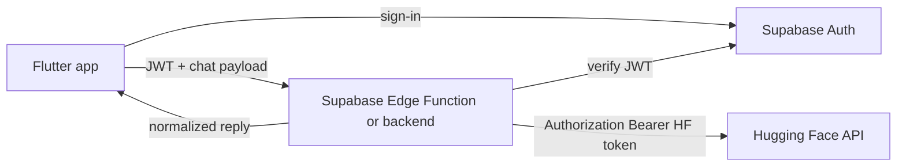

# Plan: Supabase-proxied Hugging Face chat

## Purpose

Move AI chat remote inference behind Supabase so that:

1. **The Flutter app never holds or sends a Hugging Face API key** for production chat.
2. **Every remote chat request is gated on Supabase authentication** (valid session / JWT).
3. **Hugging Face is invoked only from Supabase-controlled server-side code**, which stores the HF token as a Supabase secret.

This document is planning-only; implementation is out of scope until this plan is approved.

## Current state (baseline)

- Chat uses `HuggingfaceChatRepository` and `HuggingFaceApiClient`, calling Hugging Face directly (`api-inference.huggingface.co` and/or `router.huggingface.co/v1/chat/completions`).
- The HF token and model are loaded via `SecretConfig` (dart-define, optional assets, secure storage). See `docs/ai_integration.md` and `docs/security_and_secrets.md`.
- DI wires chat in `lib/core/di/register_chat_services.dart`.

## Goals

| Goal | Success criterion |
|------|-------------------|
| No client HF secret | Production builds do not require `HUGGINGFACE_API_KEY` for chat; HF credential exists only in Supabase (e.g. Edge Function secrets / vault). |
| Auth-gated chat | Remote inference runs only when the request includes a verifiable Supabase user JWT (or equivalent server-validated session). |
| Single trust boundary | Hugging Face sees only server-side calls from Supabase; the app talks only to Supabase (or your existing API) for chat completion. |
| Architecture alignment | Preserve **Presentation → Domain ← Data**: domain `ChatRepository` abstraction stays; data layer swaps or adds a Supabase-backed implementation. |

## Non-goals (initial phase)

- Changing offline-first local persistence or message UX unless required for the new transport.
- Moving non-chat Hugging Face usage (if any) unless explicitly scoped later.
- Product-level metering/billing beyond basic abuse controls (can be a follow-up).

## Recommended architecture

### High level

### Server implementation options

| Option | Pros | Cons |
|--------|------|------|
| **A. Supabase Edge Function** (preferred default) | Native to Supabase; secrets in dashboard; JWT verification patterns are well documented | Cold starts, runtime limits, debugging across providers |
| **B. Supabase + external worker** | Heavier workloads, long streaming | More infra; still need auth bridge |

**Recommendation:** Start with **Edge Function** `chat-complete` (name TBD) that:

1. Reads `Authorization: Bearer <supabase_access_token>` (or uses Supabase helper to validate user).
2. Validates body (message list, optional model override policy).
3. Reads `HUGGINGFACE_API_KEY` (and optional `HUGGINGFACE_MODEL` / feature flags) from **Supabase secrets**.
4. Calls Hugging Face (same endpoints/semantics as current `HuggingfaceChatRepository` where practical).
5. Returns a JSON shape the app can map to existing `ChatResult` / domain types.

If the product later needs **streaming**, plan a second phase (SSE/WebSocket from Edge or a dedicated streaming endpoint).

### Authentication rules

- **Anonymous / signed-out users:** no remote completion; app shows a clear “Sign in to use AI chat” (or purely local/demo mode if product requires it).
- **Signed-in users:** attach the current Supabase session `access_token` on each chat request to the Edge Function.
- **Server:** reject requests with missing/invalid JWT before any Hugging Face call (401/403 with safe error body).

### Secret management

- Store `HUGGINGFACE_API_KEY` in **Supabase project secrets** for the Edge Function environment.
- Optionally store defaults: `HUGGINGFACE_MODEL`, `HUGGINGFACE_USE_CHAT_COMPLETIONS` (string/boolean) to mirror current `SecretConfig` behavior server-side.
- **Do not** expose these to the client or to Row Level Security policies; only the Edge runtime reads them.

### Client configuration changes (future implementation)

- Remove production dependency on `SecretConfig.huggingfaceApiKey` for the chat remote path.
- Add base URL / function name for the Supabase Edge invocation (could be derived from `Supabase` URL + function path).
- Reuse existing Dio/HTTP stack if appropriate, with **Supabase auth header** instead of HF header on the app side.

## API contract (sketch)

Define a minimal, versioned contract between app and Edge Function:

- **Request (example):** `{ "messages": [ { "role": "user", "content": "..." } ], "conversationId": "optional-uuid" }`
- **Response (example):** `{ "reply": "...", "model": "...", "usage": { ... optional } }`

Map server errors to existing `ChatException` patterns where possible. Align with how `HuggingFaceResponseParser` normalizes text today to reduce UI churn.

## Offline-first and sync notes

- Local draft/pending-send flows can remain; only the **remote send target** changes from HF URLs to Supabase Edge.
- Retries must not leak HF tokens (they should not exist on device).
- Idempotency: if the app retries the same user message, server should tolerate duplicate sends or the client should send an idempotency key (future enhancement).

## Security and abuse

- **Rate limiting:** consider per-user limits in Edge (KV/Postgres counter) or platform-level limits.
- **Input limits:** max messages, max tokens, max body size; reject oversized payloads.
- **Logging:** log user id and request id; avoid logging raw prompt/recording in production unless compliant with policy.
- **CORS:** lock Edge Function to app origins if invoked from web builds.

## Testing strategy (when implementing)

- **Edge Function:** unit tests with mocked HF HTTP; integration test with test token and stubbed HF.
- **Flutter:** repository tests with mocked Supabase client / HTTP; golden or widget tests unchanged unless copy changes for sign-in gating.
- **Regression:** existing `HuggingfaceChatRepository` tests remain valuable for **parser/payload** logic if reused server-side or for a thin adapter; otherwise redirect tests to the new repository.

## Documentation and config updates (when implementing)

- `docs/ai_integration.md` — describe Supabase proxy path and auth requirement.
- `docs/security_and_secrets.md` — HF key only on Supabase for chat; client vars deprecated for that flow.
- `README.md` / `docs/envrc.example` — remove or demote client `HUGGINGFACE_API_KEY` for production chat.

## Rollout phases

1. **Phase 0 — Plan approval** (this document).
2. **Phase 1 — Edge Function + secrets** — deploy function; store HF secret; manual curl test with real JWT.
3. **Phase 2 — Flutter data layer** — new `ChatRepository` implementation calling Edge; feature flag or flavor to switch from direct HF.
4. **Phase 3 — Deprecate client HF key** — remove from production pipelines; keep dev-only override if needed for local experiments.
5. **Phase 4 — Cleanup** — delete unused client paths if fully migrated; update DI and tests.

## Risks and mitigations

| Risk | Mitigation |
|------|------------|
| Edge latency vs direct HF | Measure; consider region; cache warm-up or keep-alive strategy if needed |
| HF rate limits | Server-side backoff; user-visible retry messaging |
| Streaming gap | Phase 2 non-streaming first; design response shape extensible for SSE |
| Dev experience without Supabase | Local emulator or dev Edge deployment; documented test tokens |

## Open decisions

- **Model selection:** server-only default vs allowlisted client-provided models.
- **Who owns parsing:** duplicate minimal parsing in TypeScript vs shared OpenAPI spec.
- **Web vs mobile:** same Edge endpoint for both; confirm CORS and cookie/session behavior for web.

## Verification checklist (post-implementation)

- [ ] Signed-out user cannot trigger remote inference (only local/error path).
- [ ] Signed-in user completes a chat turn via Supabase only (no HF host in app traffic).
- [ ] Rotating HF secret in Supabase updates behavior without app release.
- [ ] Repo validation scripts and targeted chat tests pass per `docs/validation_scripts.md`.

---

*Status: draft plan — no code changes yet.*
