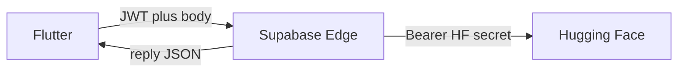

# Plan: Supabase-proxied Hugging Face chat

**Documentation only** — intent and execution order. This file does not change app or server code by itself.

*Operability pass:* **Authoritative decision matrix**, **Implementation defaults**, **Implementation slices**, **Edge API contract**, **Queue / error classification**, **Validation gates**, and **Cold-agent checklist** support multi-agent handoffs (see archival [`supabase_proxy_huggingface_chat_plan_codex_review.md`](supabase_proxy_huggingface_chat_plan_codex_review.md), **gpt-5.4**). **Normative precedence:** the **decision matrix**, **Implementation defaults**, and **Queue / error classification** override illustrative prose and edge-case bullets if they conflict.

**Re-review:** This revision was reconciled against that Codex review (executive gaps, recommended edits, risks, full 12-step checklist).

**Agents implementing this plan:** Follow **[Build order — step-by-step](#build-order--step-by-step-agents-follow-in-order)** from top to bottom. The **[Cold-agent checklist](#cold-agent-checklist)** expands preparation and handoff detail for each phase.

**At a glance:** Prefer **Supabase Edge** (JWT, HF secret server-side) for chat completions when configured; **fall back** to today’s **direct Hugging Face** path when Supabase is absent or when an Edge call fails and client credentials exist — and the device has **network reachability** so a second remote attempt makes sense. **No internet:** behavior stays **offline-first** (local persistence, pending queue, sync when back online); transport switching does not replace that. The chat screen shows an **offline badge** (chip) when there is no connectivity, using the **same chip pattern** as other feature pages (e.g. [`ChartDataSourceBadge`](../../lib/features/chart/presentation/widgets/chart_data_source_badge.dart), [`GraphqlDataSourceBadge`](../../lib/features/graphql_demo/presentation/widgets/graphql_data_source_badge.dart), [`CaseStudyDataModeBadge`](../../lib/features/case_study_demo/presentation/widgets/case_study_data_mode_badge.dart)) with [`AppStyles.chip`](../../lib/shared/design_system/app_styles.dart) and **l10n**. When **online**, it shows the **transport badge** (Supabase vs Direct). The default chrome layout for first implementation is: page title, then a row containing `ChatModelSelector`, `Offline` chip when offline, otherwise the transport chip.

## Cursor Agent Kickoff

Cursor agents should start from this protocol without adding a parallel planning layer:

1. Update [`tasks/cursor/todo.md`](../../tasks/cursor/todo.md) with the chosen slice, exact file write set, open questions, and validation commands.
2. Use the slice order in **[Recommended implementation order](#recommended-implementation-order)** unless the user explicitly changes it.
3. Treat `supabase/functions/chat-complete/`, [`register_chat_services.dart`](../../lib/core/di/register_chat_services.dart), [`offline_first_chat_repository.dart`](../../lib/features/chat/data/offline_first_chat_repository.dart), and [`chat_page.dart`](../../lib/features/chat/presentation/pages/chat_page.dart) as single-owner files during any one implementation pass.
4. Do not implement items under **[Deferred product decisions](#deferred-product-decisions)** unless the user explicitly asks for them; ship the binding defaults first.

## Terminology

| Label (UI / docs) | Meaning |
| --- | --- |
| **Offline** (badge) | Device has **no usable network** per [`SyncStatusCubit`](../../lib/shared/sync/presentation/sync_status_cubit.dart) / `NetworkStatus.offline` (same signal as [`ChatSyncBanner`](../../lib/features/chat/presentation/widgets/chat_sync_banner.dart) and other `*SyncBanner` widgets). Shown as a **chip** consistent with other pages—not a one-off style. |
| **Supabase** (badge) | Inference HTTP goes **App → Supabase Edge → Hugging Face**; HF token stays in Edge secrets. Shown when **online** and proxy transport is active. |
| **Direct** (badge) | Inference goes **App → Hugging Face** (`HuggingfaceChatRepository` + `SecretConfig` / flavor keys). Shown when **online** and direct transport is active. |
| **Remote** | Any non-local inference (either Supabase or Direct). The transport badge distinguishes **which** remote path is active **when online**. |

## Build order — step-by-step (agents: follow in order)

Execute **one step at a time** in the numbered sequence below. At any step marked **STOP**, do not write production Edge or Flutter code until the unblock condition is met (record status in [`tasks/cursor/todo.md`](../../tasks/cursor/todo.md) or [`tasks/codex/todo.md`](../../tasks/codex/todo.md) per [`AGENTS.md`](../../AGENTS.md)).

| Step | Action | Done when |
| --- | --- | --- |
| **1** | **Read repo policy and chat contract** — [`AGENTS.md`](../../AGENTS.md), [`docs/agents_quick_reference.md`](../agents_quick_reference.md), [`docs/offline_first/chat.md`](../offline_first/chat.md), this plan; skim [`supabase/README.md`](../../supabase/README.md) if you will touch Edge. | You can name the chat stack entrypoints (`ChatRepository`, `OfflineFirstChatRepository`, DI file, `SyncStatusCubit`). |
| **2** | **Open your task tracker** — Create or update [`tasks/cursor/todo.md`](../../tasks/cursor/todo.md) or [`tasks/codex/todo.md`](../../tasks/codex/todo.md) with goals, **slice owner**, open questions, and which **Validation gates** you will run. | Tracker lists scope and validation targets for this branch. |
| **3** | **STOP unless Phase 0 defaults are mirrored in [`ai_integration.md`](../ai_integration.md)** — Confirm rows **1–4** in [Do this first (Phase 0 — binding defaults)](#do-this-first-phase-0--binding-defaults) are present there, with a backlink to this plan. | [`ai_integration.md`](../ai_integration.md) contains the four policy rows + backlink; no guessing auth/fallback/badge. |
| **4** | **STOP if your shipped scenario is missing from the normative tables** — Reconcile your slice against **[Authoritative decision matrix](#authoritative-decision-matrix)** and **[Queue / error classification](#queue--error-classification-normative)**. If you need a new scenario, add it to the docs before code. | Matrix + queue table + implementation defaults cover every scenario in your slice. |
| **5** | **Freeze Edge API contract** — With **Edge slice owner**: request/response/errors, auth header, idempotency, timeouts, model rules. Record in **[Edge API contract](#edge-api-contract-freeze-before-flutter-integration)** + [`supabase/README.md`](../../supabase/README.md). | Flutter integrators have a single frozen spec; contract section/README updated. |
| **6** | **Phase 1 — Edge function** — Implement `supabase/functions/chat-complete/`, secrets, local invoke; **`curl`** with real JWT + negative JWT per **[Validation gates by phase](#validation-gates-by-phase)**. | Phase 1 gate satisfied; secrets and README documented. |
| **7** | **STOP before broad Flutter** — Confirm Phase 1 gate and frozen contract; assign **Flutter remote** slice owner ([Implementation slices](#implementation-slices-and-ownership)). | No parallel drift: contract owner ack’d. |
| **8** | **Phase 2a — Flutter remote** — Composite `ChatRepository` (Edge first, direct fallback per policy **when online** only), typed errors/`code` mapping, DI in [`register_chat_services.dart`](../../lib/core/di/register_chat_services.dart); **do not** break `OfflineFirstChatRepository` contract. | Composite matches matrix + queue table; offline path still single fail → enqueue. |
| **9** | **Phase 2b — Errors & sync** — Terminal vs retryable for `sendMessage` and replay (`processOperation`); align with [`chat.md`](../offline_first/chat.md) and `PendingSyncRepository` (no infinite 401 loops). | Error classification matches **Queue / error classification**; owner signed off if shared sync files change. |
| **10** | **Phase 2c — UI & l10n** — Offline chip + transport chip on chat page ([**UI**](#ui-connectivity-and-transport-badges)); ARB keys; run `flutter gen-l10n` if ARB touched. | Chips match the binding badge semantics in **Phase 0**; strings localized. |
| **11** | **Phase 2d — Tests** — Add tests from **[Testing](#testing-in-addition-to-verify-checklist)** (composite, queue, **401/403 replay**, restart/stickiness if in scope, widget/goldens as needed). | New tests pass locally; regressions covered per plan. |
| **12** | **Phase 2 validation** — Run scope-matched commands: e.g. `./bin/router_feature_validate` if DI/routes touched, focused `dart test`, `flutter analyze` as required by [`docs/validation_scripts.md`](../validation_scripts.md). | All planned gates green; failures fixed or documented. |
| **13** | **Phase 3 — Docs & product** — Update [`docs/security_and_secrets.md`](../security_and_secrets.md), [`README.md`](../../README.md) when implementation changes user/dev setup; add proxy-only / flavor notes per **[Work sequence](#work-sequence)** Phase 3. | Docs match shipped behavior and secrets story. |
| **14** | **Verify & handoff** — Work through **[Verify (when shipping)](#verify-when-shipping)**; update **File map** and links in this plan + [`ai_integration.md`](../ai_integration.md) if filenames or API changed. | Checklist complete; plan paths accurate for next agent. |

**Parallelism:** Different **slices** may proceed only when they do not **multi-write** the same files; note handoffs in the task tracker. **Edge** and **Flutter remote** stay sequential at the **contract boundary** (step 7).

## Authoritative decision matrix

Agents must not invent behavior for combinations that are not explicitly covered: **stop and record a product/policy decision** in this plan (or [`ai_integration.md`](../ai_integration.md)) first.

**Cross-product coverage**: treat **`build flavor × Supabase configured × session valid × connectivity × Edge result × direct key × policy allows direct`** as mandatory inputs when coding. The rows below are the baseline shipping defaults for this repo. If product wants different behavior, update this table and [`docs/ai_integration.md`](../ai_integration.md) first.

| Connectivity | Supabase configured | Session valid | Edge / path | Direct key | Direct allowed by policy | Transport attempted (online) | Direct fallback allowed? | Queue vs surface | Offline chip | Transport chip (online) |
| --- | --- | --- | --- | --- | --- | --- | --- | --- | --- | --- |
| Offline | Any | Any | n/a | Any | Any | None (single fail → enqueue) | No | Enqueue per [`chat.md`](../offline_first/chat.md) | Show | Hide |
| Online | Yes | Yes | Healthy | Any | Any | Edge only | No | Success path | Hide | Supabase |
| Online | Yes | Yes | Timeout / transport failure / 5xx | Yes | Yes | Edge, then direct | Yes | Success if direct succeeds; otherwise enqueue as retryable transport failure | Hide | Direct on successful fallback; otherwise Supabase |
| Online | Yes | Yes | Timeout / transport failure / 5xx | No | Any | Edge only | No | Enqueue as retryable transport failure | Hide | Supabase |
| Online | Yes | Yes | Timeout / transport failure / 5xx | Yes | No | Edge only | No | Enqueue as retryable transport failure | Hide | Supabase |
| Online | Yes | Yes | 401 / 403 | Any | Any | Edge only | No | Immediate auth-required surface; do not enqueue | Hide | Supabase |
| Online | Yes | Yes | 429 | Any | Any | Edge only | No | Immediate busy / rate-limit surface; do not enqueue | Hide | Supabase |
| Online | Yes | No | n/a | Yes | Yes | Direct only | No | Success/fail per direct-path classification | Hide | Direct |
| Online | Yes | No | n/a | No | Any | None | No | Immediate auth-required surface; do not enqueue | Hide | Hide |
| Online | Yes | No | n/a | Yes | No | None | No | Immediate auth-required surface; do not enqueue | Hide | Hide |
| Online | No | n/a | n/a | Yes | Yes | Direct only | No | Success/fail per direct-path classification | Hide | Direct |
| Online | No | n/a | n/a | No | Any | None | No | Immediate missing-config surface; do not enqueue | Hide | Hide |

## Purpose

### When Supabase is configured and usable (preferred path)

- **Supabase calls Hugging Face** — Remote AI chat inference is triggered from **Supabase** (e.g. Edge Function), not by the Flutter app calling Hugging Face’s APIs directly for that mode.
- **Supabase authentication required** — Only users with a valid **Supabase-authenticated** session (JWT the Edge function can verify) may use remote chat on this path.
- **App calls Supabase, not HF** — The app sends chat completion requests to **Supabase**; Hugging Face is invoked **from** Supabase after auth checks.
- **Hugging Face API key in Supabase** — For this path, the HF token lives in **Supabase secrets** (Edge environment), not on the client.

### When Supabase is not configured or cannot be used (fallback)

- **Keep today’s direct Hugging Face behavior** — If the project has **no usable Supabase setup** (not configured, init failed, or product flavor without Supabase), remote chat **continues to work** by calling Hugging Face **directly from the app**, the same as now (`HuggingfaceChatRepository` registered in [`register_chat_services.dart`](../../lib/core/di/register_chat_services.dart) and composed inside `OfflineFirstChatRepository`). No regression for local/dev/offline-first demos that rely on HF without Supabase.

### When there is no internet connectivity (offline-first invariant)

- **Unchanged contract** — Follow [`docs/offline_first/chat.md`](../offline_first/chat.md): persist the user message locally first, treat remote inference failure as **queue + sync later**, `ChatOfflineEnqueuedException` / pending indicators / `SyncStatusCubit` banner where applicable. Users keep composing; nothing in this plan replaces that with “must be online to use chat.”
- **Terminal vs retryable (do not infer from this section alone)** — Which failures enqueue vs surface immediately is **normative** in [Queue / error classification](#queue--error-classification-normative). The shipped Flutter + Edge stack implements that table via `ChatRemoteFailureException` (`retryable`, `code`) in `OfflineFirstChatRepository`, `SupabaseChatRepository`, and `CompositeChatRepository`, with Edge JSON errors documented in [`supabase/README.md`](../../supabase/README.md).
- **No remote completion** — Without a working network path, neither Edge nor direct HF can return a reply; the app must **not** pretend a transport badge means a live round-trip succeeded.
- **Offline badge required** — When offline, the chat page shows a visible **Offline** chip (see **UI: connectivity and transport badges**). This matches user expectations set by other demos that expose data-source / mode chips in the header or body chrome.
- **Edge → direct fallback is for online failures** — Supabase-then-direct retry applies when **connectivity is available** but Edge (or the path to it) is unhealthy. When the device is **offline** (or the app’s connectivity signal says no route), the composite should **not** chain two doomed HTTP attempts for one send: prefer **one** failed remote try → enqueue, matching today’s responsiveness and battery use. Use the same connectivity source as **`SyncStatusCubit`** / `NetworkStatus` for fallback gating and badge visibility.

### UI: connectivity and transport badges

#### Offline (connectivity) chip

- When `NetworkStatus.offline` (same source as `ChatSyncBanner` / shared sync banners), show an **Offline** chip on the chat page so status is obvious at a glance, **parallel to** chart/graphql/case-study pages that surface a compact badge above the main content.
- Implementation cues: reuse **`AppStyles.chip`** and the same `Mix` `Box` + `Text` pattern as [`GraphqlDataSourceBadge`](../../lib/features/graphql_demo/presentation/widgets/graphql_data_source_badge.dart) (or extract a tiny shared “status chip” helper if multiple badges sit in one row).
- **l10n** — dedicated ARB keys for the offline label and **Semantics** / tooltip (e.g. “Offline — messages will sync when connected”) consistent with shared sync banner copy ([`sync_banner_helpers.dart`](../../lib/shared/sync/sync_banner_helpers.dart)).
- **Visibility** — Hide the offline chip when online. Optionally use a **warning-tinted** chip variant when offline if design system already distinguishes error/offline (match `SyncBannerContent(isError: isOffline)` semantics without duplicating the full banner).
- **Placement** — Render a **row** under the page title / next to [`ChatModelSelector`](../../lib/features/chat/presentation/pages/chat_page.dart) so both **offline** and **transport** chips read as page chrome. First implementation order: `ChatModelSelector`, `Offline` chip when offline, else transport chip.

#### Transport chip (when online)

- When **online**, show a chip for the active **remote transport**:
  - **Supabase** — completions use the Edge proxy (preferred when configured and healthy).
  - **Direct** — completions use **Hugging Face directly** from the app (no Supabase in use, or after a failed Supabase attempt per below).
- While **offline**, **do not** show the transport chip as if inference were live — show **Offline** only.
- Transport badge must reflect **post-fallback** reality when online: if Edge fails and direct HF succeeds, show **Direct** for that outcome. Default stickiness is **request-scoped**: keep **Direct** until the next remote attempt begins or app state is rebuilt, then recompute from current config/session.
- If **no runnable remote transport** exists (for example Supabase is configured but session is missing and direct is disallowed), hide the transport chip and rely on the auth/configuration surface copy instead.
- **ChatSyncBanner** — Keep (or add) below the message list / in scroll content for **copy**, pending count, and **Sync now**; **badges** in chrome summarize state like other pages. Both can coexist.

- Copy and accessibility labels: **l10n** (ARB + codegen). Reuse design-system tokens.
- Do **not** add tap affordances or secondary info popovers in the first implementation pass.

### Fallback policy (authoritative)

Applies **only when online** (see *When there is no internet connectivity*).

- **Direct fallback allowlist:** **timeout**, **network transport failure** to Edge, and **HTTP 5xx** from Edge. Treat this as the baseline shipping rule unless product updates both this plan and [`docs/ai_integration.md`](../ai_integration.md).
- If Supabase **was** the chosen path for a send but the Edge call fails in an **allowlisted** way, the app **may** fall back to **direct Hugging Face** when a client credential exists and **policy** permits — goal: user gets a reply when possible instead of an avoidable hard block.
- Direct fallback is **not** allowed for **HTTP 401/403**. **HTTP 429** also does **not** fall back; prefer user-visible busy / retry-later UX.
- After allowed fallback, the **transport chip** shows **Direct** so it is clear inference is no longer via Supabase.
- **Stickiness**: request-scoped only. A successful direct fallback sets the chip to **Direct** for that completed request and any immediately visible state derived from it, but the next send or app restart re-evaluates transport from current config/session instead of persisting “Direct mode.”
- If neither path can run (e.g. proxy requires session but user is signed out **and** no direct key), use existing error UX; do not silently drop messages.

### Non-goals (this plan)

- Replacing the offline-first queue, Hive boxes, or `SyncableRepository` contract — see [`docs/offline_first/chat.md`](../offline_first/chat.md).
- Requiring network for **composing** or **reading** locally stored chat (remote inference remains optional until online).
- Removing direct HF for flavors/builds that intentionally ship without Supabase.
- Storing the HF **server** secret in the client on the proxy path.

**Related:** Offline-first chat stays as documented unless transport wiring requires small header/session changes — [`docs/offline_first/chat.md`](../offline_first/chat.md). Repo policy: [`AGENTS.md`](../../AGENTS.md). Align “Supabase configured” detection with existing bootstrap/gating patterns when implementing.

## Do this first (Phase 0 — binding defaults)

The following defaults are the binding baseline for implementation in this repo. Mirror them in **[`docs/ai_integration.md`](../ai_integration.md)** and update both docs together if product policy changes:

| # | Deliverable |
| --- | --- |
| 1 | **Auth path** — Supabase proxy mode uses the current **Supabase Auth user JWT** only. No service-role token, no custom bridge, no client HF secret. If Supabase is configured but there is no valid session, the app may use **direct HF only when** a client HF key exists **and** build policy allows direct transport; otherwise surface auth-required UX and do not enqueue. |
| 2 | **Model policy** — Edge owns the effective model. The request may carry a client `model` only when it is in a server-side allowlist; otherwise Edge pins `HUGGINGFACE_MODEL` and ignores/rejects unsupported values with a stable validation error. |
| 3 | **Failure / fallback policy** — Only **timeout**, **transport/network failure to Edge**, and **Edge 5xx** may fall back to direct, and only when online with a client HF key plus policy approval. **401/403**, **429**, invalid payload, and missing config are surfaced immediately and do **not** enqueue. Retryable transport failures enqueue only after the allowed transport attempts for that request are exhausted. |
| 4 | **Badge semantics (authoritative)** — Offline: show **Offline** chip only. Online with active Edge path: show **Supabase**. Online after successful direct fallback or in direct-only mode: show **Direct**. Pending sends keep the currently intended transport badge; a successful fallback flips to **Direct** for that request. Transport stickiness is **not persisted** across restart. |

Keep **[`ai_integration.md`](../ai_integration.md)** linked back to this plan whenever rows **1–4** (or derived policies) are updated so agents do not implement from stale summary text.

Use **[Implementation defaults](#implementation-defaults-change-only-with-explicit-product-overrides)** and **[Queue / error classification](#queue--error-classification-normative)** as the normative behavior tables.

## Outcomes

**If Supabase is available for chat:**

- HF secret for **that** path lives in Supabase Edge secrets; client uses Supabase JWT only (no HF key on device for proxy-only builds if product chooses that).
- Edge rejects unauthenticated requests before calling Hugging Face (`verify_jwt: true`; do not copy `sync-graphql-countries`’s `--no-verify-jwt` pattern).
- App **tries** Supabase Edge first for completions when proxy mode is selected (when **online** per above); on failure, **falls back** to direct HF when credentials exist (see **Fallback policy (authoritative)**).
- **Offline:** queue and local UX unchanged; no new requirement to unblock the queue with direct HF when there is no network.
- **Offline chip** visible on chat when `NetworkStatus.offline`, styled like other feature **data-source / mode** chips.
- **Transport chip** when **online** shows **Supabase** or **Direct** according to the **active** transport.

**If Supabase is not available:**

- Behavior matches **current** direct Hugging Face integration; chat remains usable; **transport chip** shows **Direct** when online.

## Code touchpoints

| Area | Path / notes |
| --- | --- |
| Remote | New Edge-backed `ChatRepository` (or client) + **keep** [`HuggingfaceChatRepository`](../../lib/features/chat/data/huggingface_chat_repository.dart); **composite** tries Edge then direct on configurable failures |
| Composition | [`OfflineFirstChatRepository`](../../lib/features/chat/data/offline_first_chat_repository.dart) should continue to depend on **`ChatRepository`** only; inject the composite as the inner remote implementation |
| DI | [`lib/core/di/register_chat_services.dart`](../../lib/core/di/register_chat_services.dart) — register composite; expose **active transport** (stream/value) for UI if cubit does not derive it from repository callbacks |
| UI | `lib/features/chat/presentation/` — **offline connectivity chip** (`TypeSafeBlocSelector` on `SyncStatusCubit` / `NetworkStatus`); **transport chip** when online; placement aligned with chart/graphql/case-study badge patterns |
| l10n | `lib/l10n/app_*.arb` — offline label + transport labels + a11y |
| Edge | `supabase/functions/chat-complete/`; document in [`supabase/README.md`](../../supabase/README.md) |
| Secrets / docs | [`security_and_secrets.md`](../security_and_secrets.md), [`README.md`](../../README.md) after cutover |

### File map (expected; update plan if names diverge)

- Flutter: `lib/features/chat/data/` (composite + Edge client), `lib/features/chat/domain/chat_repository.dart` (types if extended), [`register_chat_services.dart`](../../lib/core/di/register_chat_services.dart), [`offline_first_chat_repository.dart`](../../lib/features/chat/data/offline_first_chat_repository.dart), `lib/features/chat/presentation/pages/chat_page.dart`, `lib/features/chat/presentation/widgets/` (chips, banner wiring), `lib/l10n/app_*.arb`.
- Supabase: `supabase/functions/chat-complete/index.ts`, optional `supabase/functions/chat-complete/_shared/*`, [`supabase/config.toml`](../../supabase/config.toml), [`supabase/README.md`](../../supabase/README.md).
- If implementation chooses **different filenames or function names**, update **this plan** and **File map** in the same change set so handoffs stay deterministic.
- Only **one agent** should own edits to a given file at a time; note handoffs in [`tasks/cursor/todo.md`](../../tasks/cursor/todo.md) or [`tasks/codex/todo.md`](../../tasks/codex/todo.md) per **[`AGENTS.md`](../../AGENTS.md)**.

## Approach (short)

**Supabase path:**

- Client (proxy mode): **only** user `access_token` in `Authorization`; never service role or HF token.
- Server: validate JWT; read HF from env secrets; map errors to stable HTTP + JSON `code` / `retryable` for `ChatException` (align with repo error taxonomy if present).
- Pin request/response shape (`schemaVersion`, messages) before Flutter integration.

**Fallback path:** App → Hugging Face APIs directly (current stack) when Supabase is not in use for chat, **or** when a Supabase call fails and direct HF is available **while online**.

### Edge API contract (freeze before Flutter integration)

Edge and Flutter share one **error-code vocabulary**. **Do not invent UI-only error strings in the repository layer**—map Edge/HF outcomes to stable `code` / `retryable` (or typed exceptions) that UI/localization consumes.

Freeze all of the following in **one** place ([`supabase/README.md`](../../supabase/README.md) and/or this section) before broad Flutter integration:

- **Request fields** — messages array, `schemaVersion`, optional `model`, idempotency (`clientMessageId` or equivalent), max body size.
- **Response fields** — assistant message text/shape, metadata, echo’d `schemaVersion`.
- **Error body** — JSON shape, `code`, `retryable`, optional `details` (no raw secrets).
- **Auth** — `Authorization: Bearer <user_jwt>` on proxy path only.
- **Idempotency** — How Edge/HF retries interact with `clientMessageId` / queued replay.
- **Timeouts** — Edge budget vs Flutter client timeout (reduces false direct fallback).
- **Model policy** — How `HUGGINGFACE_MODEL` secret and optional client `model` interact (Phase 0).

| Topic | Record here / in [`supabase/README.md`](../../supabase/README.md) before Phase 2 |
| --- | --- |
| Request | Required fields (messages, `schemaVersion`, `model?`, `clientMessageId` / idempotency), max body size |
| Response | Assistant text / message shape, metadata, `schemaVersion` |
| Errors | HTTP status ↔ JSON `code`, `retryable` (or equivalent), stable machine-readable values |
| Auth | Header shape (Bearer user JWT only on proxy path) |
| Timeouts | Edge total budget vs client timeout (avoid false fallback) |
| Model | Enforcement of Phase 0 model policy |

## Implementation slices and ownership

Parallel work should **not** multi-write the same files without a handoff note.

| Slice | Owns | Notes |
| --- | --- | --- |
| Edge / API | Function code, secrets wiring, [`supabase/README.md`](../../supabase/README.md) | Contract table above is the handoff artifact |
| Flutter remote | Composite `ChatRepository`, Edge HTTP client, DI registration | Touches `register_chat_services.dart`, `data/` |
| Offline-first / errors | `OfflineFirstChatRepository` interaction, terminal vs enqueue, sync | Coordinate with `lib/shared/sync/` |
| UI / l10n | Chips, banner placement, ARB | Touches `chat_page`, widgets, `app_*.arb` |
| Docs / security | [`ai_integration.md`](../ai_integration.md), [`security_and_secrets.md`](../security_and_secrets.md) | Phase 0 + policy |
| Validation | Tests, `router_feature_validate`, checklist scope | Per **Validation gates** |

## Concrete implementation task list by file / slice

This section turns the plan into a file-scoped execution checklist. The file
names below are the **expected** targets on this branch; if implementation
chooses different filenames, update **[File map](#file-map-expected-update-plan-if-names-diverge)**
and this section in the same change set.

### Slice A — Edge / API

**Owner:** Edge / API slice
**Starts after:** Step 5 contract freeze
**Blocks:** Flutter remote slice from broad integration

| File | Task |
| --- | --- |
| `supabase/functions/chat-complete/index.ts` | Create the Edge entrypoint. Verify JWT, parse request, enforce `schemaVersion`, enforce model policy, call Hugging Face, and map all failures to stable `code` / `retryable` JSON. |
| `supabase/functions/chat-complete/_shared/*` | Shared helpers for auth/header parsing, HF client, request validation, and response/error mapping if the function becomes easier to read with them. Keep helpers local to the function unless another Edge function will reuse them. |
| [`supabase/config.toml`](../../supabase/config.toml) | Register the function and confirm deploy/local invoke settings if the current config requires an explicit function entry. |
| [`supabase/README.md`](../../supabase/README.md) | Keep the frozen contract aligned with implementation details: function name, secrets, request/response shapes, error vocabulary, timeout expectations, and deploy command. |

#### Edge acceptance tasks

- [ ] Local invoke succeeds with a valid JWT and happy-path payload.
- [ ] Missing/invalid JWT returns stable auth error without calling HF.
- [ ] Timeout / 5xx / 429 / invalid payload map to the documented error vocabulary.
- [ ] `clientMessageId` is carried through as the idempotency/correlation field.

### Slice B — Flutter remote transport

**Owner:** Flutter remote slice
**Starts after:** Slice A contract is frozen
**Primary write set:** `lib/features/chat/data/`, [`register_chat_services.dart`](../../lib/core/di/register_chat_services.dart)

| File | Task |
| --- | --- |
| `lib/features/chat/data/supabase_chat_repository.dart` | Add the Edge-backed `ChatRepository` implementation. Build the proxy request body, attach the Supabase user JWT only, parse the Edge contract, and surface typed `ChatException` variants or machine-readable failure metadata. |
| `lib/features/chat/data/composite_chat_repository.dart` | Add the composite remote repository. Choose Edge vs direct using the decision matrix, apply online-only fallback rules, and expose the final transport used for the request. |
| `lib/features/chat/data/huggingface_chat_repository.dart` | Keep current direct HF behavior; limit changes to integrating with the composite contract or transport metadata. Do not regress the direct-only path. |
| `lib/features/chat/data/huggingface_api_client.dart` | Touch only if the direct path needs richer status/error metadata for the composite decision logic. |
| [`lib/features/chat/domain/chat_repository.dart`](../../lib/features/chat/domain/chat_repository.dart) | Extend the domain contract only when required for typed errors or transport metadata. Keep the interface minimal. |
| [`lib/core/di/register_chat_services.dart`](../../lib/core/di/register_chat_services.dart) | Register the new Supabase and composite repositories; keep `OfflineFirstChatRepository` depending on a single `ChatRepository`. |

#### Flutter remote acceptance tasks

- [ ] Edge path succeeds when Supabase is configured, session is valid, and network is online.
- [ ] Direct path still succeeds when Supabase is absent.
- [ ] Eligible Edge failures fall back to direct only when the matrix allows it.
- [ ] Terminal auth/config/rate-limit failures do not fall through incorrectly.

### Slice C — Offline-first / sync / error classification

**Owner:** Offline-first / errors slice
**Starts after:** Slice B has concrete exception/error mapping
**Primary write set:** [`offline_first_chat_repository.dart`](../../lib/features/chat/data/offline_first_chat_repository.dart), sync helpers only if required

| File | Task |
| --- | --- |
| [`lib/features/chat/data/offline_first_chat_repository.dart`](../../lib/features/chat/data/offline_first_chat_repository.dart) | Stop enqueueing every exception blindly. Match `sendMessage` and `processOperation` behavior to **[Queue / error classification](#queue--error-classification-normative)** so auth/config/rate-limit failures surface immediately while transport failures enqueue. |
| [`lib/features/chat/data/chat_sync_operation_factory.dart`](../../lib/features/chat/data/chat_sync_operation_factory.dart) | Ensure `clientMessageId`, `model`, and any transport-relevant fields survive queued replay consistently. |
| [`lib/features/chat/data/chat_sync_payload.dart`](../../lib/features/chat/data/chat_sync_payload.dart) | Extend payload shape only if required for proxy/direct parity or idempotency/versioning. |
| `lib/shared/sync/*` | Touch only if the current sync abstractions cannot represent terminal vs retryable chat failures cleanly. Keep changes narrow and compatible with other features. |

#### Offline-first acceptance tasks

- [ ] Offline send still persists locally and enqueues once.
- [ ] `401/403` during immediate send do not masquerade as offline.
- [ ] `401/403` during `processOperation` replay do not spin forever in the queue.
- [ ] Retryable transport failures still converge through the existing sync flow.

### Slice D — UI / l10n

**Owner:** UI / l10n slice
**Starts after:** Slice B can report active transport and Slice C has final enqueue rules
**Primary write set:** chat page/widgets and ARB files

| File | Task |
| --- | --- |
| [`lib/features/chat/presentation/pages/chat_page.dart`](../../lib/features/chat/presentation/pages/chat_page.dart) | Add the chip row near the existing `ChatModelSelector`; wire offline state from `SyncStatusCubit` / `NetworkStatus` and online transport state from the chat layer. |
| `lib/features/chat/presentation/widgets/chat_transport_badge.dart` | Add a dedicated badge widget for **Supabase** / **Direct**. Reuse `AppStyles.chip` and the same visual language as the existing data-source badges. |
| `lib/features/chat/presentation/widgets/chat_offline_badge.dart` | Add a dedicated offline chip widget unless the team decides to fold it into a shared reusable badge widget in the same pass. |
| [`lib/features/chat/presentation/widgets/chat_sync_banner.dart`](../../lib/features/chat/presentation/widgets/chat_sync_banner.dart) | Keep banner copy aligned with the new queue classification; do not duplicate chip semantics incorrectly. |
| `lib/features/chat/presentation/chat_cubit.dart` and helpers | Surface auth/config/busy errors distinctly enough for the page/banner to render the right UX. |
| `lib/l10n/app_en.arb` and peer ARB files | Add offline/transport chip labels, semantics/tooltip text, and any new auth/config/rate-limit copy. Run `flutter gen-l10n` afterward. |

#### UI acceptance tasks

- [ ] Offline chip shows only when offline and hides the transport chip.
- [ ] Online transport chip shows **Supabase** or **Direct** based on the actual path used.
- [ ] Signed-out Supabase state surfaces auth-required UX without a misleading transport chip.
- [ ] Banner, chips, and pending-message UI do not contradict each other during fallback or replay.

### Slice E — Tests / validation

**Owner:** Validation slice
**Starts after:** Each slice lands its code changes
**Primary write set:** targeted unit/widget tests

| File | Task |
| --- | --- |
| `test/features/chat/data/supabase_chat_repository_test.dart` | Add proxy request/response/auth/error mapping coverage. |
| `test/features/chat/data/composite_chat_repository_test.dart` | Cover transport selection, direct fallback, no-direct cases, and terminal failure paths. |
| `test/features/chat/data/offline_first_chat_repository_test.dart` | Add regression coverage for enqueue-vs-surface classification, especially `401/403` during send and replay. |
| `test/core/di/register_chat_services_test.dart` | Verify DI now registers the composite/supabase path correctly without regressing direct-only setups. |
| `test/features/chat/presentation/pages/chat_page_test.dart` | Cover chip visibility and top-level page behavior. |
| `test/features/chat/presentation/widgets/chat_sync_banner_test.dart` | Adjust banner expectations if copy or conditions change. |
| `test/features/chat/presentation/widgets/chat_transport_badge_test.dart` | If a dedicated badge widget is introduced, cover localized labels and hidden states. |

#### Validation commands

- [ ] Focused `dart test` / `flutter test` for the new chat repository and widget tests.
- [ ] `flutter gen-l10n` if ARB files changed.
- [ ] `./bin/router_feature_validate` if DI/routes or auth gating paths changed.
- [ ] Full `./bin/checklist` only when the user wants the broad sweep.

### Slice F — Docs / rollout follow-through

**Owner:** Docs / security slice
**Starts after:** Implementation behavior is proven
**Primary write set:** docs only

| File | Task |
| --- | --- |
| [`docs/security_and_secrets.md`](../security_and_secrets.md) | Document where HF secrets live in proxy mode, when a client HF key is still required, and proxy-only flavor constraints. |
| [`README.md`](../../README.md) | Update the high-level AI integration summary if the shipped behavior materially changes user/dev setup. |
| [`docs/offline_first/chat.md`](../offline_first/chat.md) | Keep the offline-first contract aligned if chat replay/auth behavior changes materially. |
| This plan | Update file names, class names, and validation notes if implementation diverges from the expected file map above. |

### Recommended implementation order

1. Slice A — Edge / API
2. Slice B — Flutter remote transport
3. Slice C — Offline-first / sync / error classification
4. Slice D — UI / l10n
5. Slice E — Tests / validation
6. Slice F — Docs / rollout follow-through

### Offline vs online (summary)

| State | Behavior |
| --- | --- |
| **Offline / no route** | Offline-first only: local write, enqueue, sync replay when connectivity returns. No mandatory Edge→direct chain for one send. |
| **Online** | Composite may try Edge then direct on eligible failures; badge reflects transport used for successful remote completion when applicable. |

*This summary is secondary. The **Authoritative decision matrix** and **Queue / error classification** are normative.*

## Edge cases and failure modes

Implementation should verify behavior against the matrix, implementation defaults, and queue table below.

### Transport selection and stickiness

- **Offline send** — User sends while offline: remote `sendMessage` fails → `OfflineFirstChatRepository` enqueues; **transport chip** must not imply Edge or direct succeeded. On later **online** flush, composite applies (Edge then direct as configured).
- **App restart / process death** — In-memory “we fell back to Direct” state is lost unless persisted. Badge may show **Supabase** again until the next send attempts Edge; document expected UX.
- **Queued replay (`processOperation`)** — Background flush replays `SyncOperation`s via `_remoteRepository.sendMessage` ([`OfflineFirstChatRepository`](../../lib/features/chat/data/offline_first_chat_repository.dart)). Composite must **re-evaluate** JWT + config on each replay (refreshed session). If stickiness is “stay on Direct until restart,” define whether **queued** items honor that or always **try Edge first** (can strand messages if proxy-only build and Edge still broken).
- **Session appears mid-session** — User signs in after chat started on Direct; next send may switch to Supabase. Avoid jarring copy; badge should update without requiring navigation.

### Auth and errors

- **JWT expires between queue and flush** — Edge returns **401**; direct fallback may be wrong if product treats 401 as “no inference.” Define: refresh token before Edge call, terminal error, or fallback only when allowed.
- **`sendMessage` vs sync today** — `OfflineFirstChatRepository.sendMessage` catches **`Exception`** and enqueues on **any** remote failure. Adding a composite does not change that: **auth/configuration errors** may still enqueue and retry with backoff until `maxRetryCount`. Consider **typed terminal errors** (or a dedicated non-enqueueing path) so 401/403 do not look like “offline” forever — coordinate with sync helpers in `lib/shared/sync/`.
- **401 from Edge vs 401 from HF (direct)** — Different root causes (session vs API key). Product copy and fallback rules should differ; do not map both to the same generic string.

### Timeouts, capacity, and limits

- **Edge cold start vs client timeout** — If the Flutter/client timeout is shorter than Edge cold-start + HF latency, the client may fall back to direct **even when Edge would have succeeded** on a slightly longer wait. For first implementation, use separate timeout budgets only; do not add a second Edge retry unless the user asks for it.
- **429 / rate limits** — Falling through to direct may **amplify** load on the same HF quota/account. Prefer backoff + user-visible “busy” before automatic direct fallback when limit is systemic.
- **413 / oversized payload** — Edge or HF may reject large histories. Fallback to direct does not fix size; return a clear error. Do not add automatic context trimming in the first pass.

### Data shape and consistency

- **Model in `SyncOperation` payload** — Client may send `model`; Edge may pin or allowlist. Replayed ops must not send a model Edge rejects after policy changes; version contract in Phase 0.
- **Idempotency / duplicates** — Edge timeout after HF started: risk of **duplicate assistant** messages if the client retries blindly. Edge should return stable error bodies; client uses existing `clientMessageId` / sync dedupe (see [`chat.md`](../offline_first/chat.md)) and avoids double-insert on ambiguous outcomes where possible.

### UI and observability

- **Badge while message is pending sync** — Transport chip reflects **last successful remote path** or **intended path for in-flight send**? Pick one rule so the offline chip, transport chip, banner, and pending dots do not contradict (e.g. “last completion” vs “next attempt”).
- **Offline** — **Offline chip** is the primary chrome indicator (see **UI: connectivity and transport badges**). `ChatSyncBanner` below supplies detail + actions. Do not show **Supabase/Direct** while offline.
- **Logging / compliance** — Proxy centralizes prompts on Edge; direct path logs only what today’s client allows. Document retention and PII for both paths in security docs.

### Security and builds

- **Proxy-only flavor (no client HF key)** — Fallback is **impossible**; Edge outage = user-visible failure only. Distinct copy from “fallback to Direct.”
- **Direct key present but policy forbids direct** — Enterprise builds might ship a key for dev but want proxy-only in prod; enforce with build flags, not only UI.

## Offline-first integration note

[`OfflineFirstChatRepository`](../../lib/features/chat/data/offline_first_chat_repository.dart) delegates remote work to a single [`ChatRepository`](../../lib/features/chat/domain/chat_repository.dart). The **composite** should implement that interface so offline-first behavior stays unchanged **except** where error classification is tightened (see **Auth and errors** above). When **offline**, the composite should avoid redundant back-to-back remote attempts (Edge then direct) before the outer layer enqueues. Any new `ChatException` subtypes or `retryable` flags should map cleanly to **enqueue vs surface immediately** so the pending queue does not mask “sign in required.”

### Queue / error classification (normative)

Implementations must match this table. If Edge `code` values or product policy change, update this table and [`docs/ai_integration.md`](../ai_integration.md) together. Map **`sendMessage`**, **`processOperation` (replay)**, and **banner/chip** behavior from one place.

| Condition | Enqueue? | Retryable? | Direct fallback (online)? | Surface / copy owner |
| --- | --- | --- | --- | --- |
| Offline / no route | Yes (today) | Yes (backoff) | No | Offline chip + `ChatSyncBanner`; align with [`sync_banner_helpers.dart`](../../lib/shared/sync/sync_banner_helpers.dart) |
| Timeout / network to Edge | Yes, if direct is unavailable or direct fallback also fails | Yes | Yes, when direct key exists and policy allows | Pending/sync copy from cubit + `ChatSyncBanner`; no auth error copy |
| Edge 5xx | Yes, if direct is unavailable or direct fallback also fails | Yes | Yes, when direct key exists and policy allows | Pending/sync copy from cubit + `ChatSyncBanner`; no auth error copy |
| Edge 401 / 403 | No | No | No | Auth-required copy owned by chat cubit/UI; distinguish Supabase session failure from direct-key failure |
| Edge 429 | No | No | No | Busy / rate-limit copy owned by chat cubit/UI |
| Direct timeout / network / 5xx | Yes | Yes | No further fallback | Pending/sync copy from cubit + `ChatSyncBanner` |
| Direct 401 / 403 | No | No | No | Credentials/configuration copy owned by chat cubit/UI |
| Direct 429 | No | No | No | Busy / rate-limit copy owned by chat cubit/UI |
| Invalid payload / 413 / schema mismatch | No | No | No | User-visible validation/error copy owned by chat cubit/UI |
| Missing HF key in direct-capable path | No | No | No | Configuration copy owned by chat cubit/UI |
| Supabase configured but no valid session and direct disallowed/unavailable | No | No | No | Auth-required copy owned by chat cubit/UI |

## Risks and mitigations

| Risk | Mitigation |
| --- | --- |
| Accidental HF secret in client for “proxy” builds | CI/review check; document flavors in [`security_and_secrets.md`](../security_and_secrets.md). |
| **401** during background flush loops retrying Edge forever | Typed errors; terminal vs retryable; align with `PendingSyncRepository` max retry and UX per [`chat.md`](../offline_first/chat.md). |
| Double cost / latency (Edge fails then direct succeeds) | Accept for resilience; optional metrics/logging on fallback count; consider single Edge retry before direct. |
| User confusion (“why Direct?”) | Badge + short copy; optional settings explanation. |
| False fallback from short client timeout | Use separate timeout budgets first; add bounded Edge retry only if the user explicitly asks for it. |
| Rate-limit amplification via direct fallback | Prefer backoff / user messaging before auto-direct on 429. |
| Chained Edge+direct attempts while **offline** | Gate fallback on connectivity; one failure → enqueue per *When there is no internet connectivity*. |
| Multi-agent file collision | Declare slice owner; avoid concurrent edits to `register_chat_services.dart`, `offline_first_chat_repository.dart`, `chat_page.dart` without handoff. |
| Edge ↔ Flutter spec drift | Freeze **Edge API contract** before broad Flutter work; single owner reviews request/response changes. |
| Stale plan links | If referenced widgets move, update this plan’s paths in the same PR as the move. |
| Policy drift between docs | Keep this plan, [`ai_integration.md`](../ai_integration.md), and [`supabase/README.md`](../../supabase/README.md) updated in the same change set whenever transport rules change. |
| Queue semantics split-brain | One owner reconciles **Queue / error classification** with `OfflineFirstChatRepository` + sync runner. |
| Regression gaps (Codex) | Explicit tests: **401/403 during replay**, **restart after sticky-direct**, **badge state after queued flush**. |
| l10n / codegen / security doc drift | **Validation slice** owner runs `flutter gen-l10n`, updates [`security_and_secrets.md`](../security_and_secrets.md) when secrets or flavors change. |
| [`ai_integration.md`](../ai_integration.md) without backlink | Policy updates must link back to this plan so agents do not implement from a stale doc. |

## Work sequence

*For numbered execution with STOP gates and ownership, use **[Build order — step-by-step](#build-order--step-by-step-agents-follow-in-order)** first; this section is the short phase summary.*

1. **Phase 1** — Edge function + secrets + `curl` with real JWT + negative JWT checks.
2. **Phase 2** — Flutter: composite `ChatRepository` (Supabase first, direct HF on **online** eligible failure when key exists); **offline** path unchanged (single fail → enqueue); **offline chip** + **transport chip** + `ChatSyncBanner` wiring; l10n; wire session on proxy path; **401/403** on sync flush per [`chat.md`](../offline_first/chat.md).
3. **Phase 3** — Docs and product gates: proxy-only builds may omit client HF; **do not** remove direct HF for configurations that intentionally run without Supabase.

## Testing (in addition to Verify checklist)

- **Unit:** composite — Edge success; Edge failure + direct success; Edge failure + no direct key → error path; **401/403** → assert **no** unintended direct call when policy forbids; request-scoped stickiness only.
- **Unit:** interaction with offline-first — failure that **must not** enqueue (if introduced): assert operation not added to `PendingSyncRepository` mock.
- **Widget/golden:** **Offline** chip when `NetworkStatus.offline` (mock `SyncStatusCubit`); transport chip shows Supabase vs Direct when online; **pending** + offline combinations per the binding badge semantics.
- **Regression (Codex):** `401`/`403` during **processOperation** replay; app **restart** after direct stickiness; **badge** after queued flush completes.
- **Integration (lightweight):** Edge mock 503 → direct invoked when allowed **and** online; Edge slow cold start vs timeout → documents chosen behavior; proxy-only mock → no direct client call; **offline** → assert no double remote chain (or one attempt then enqueue).

## Implementation defaults (change only with explicit product overrides)

Use these defaults unless a product decision explicitly replaces them in this plan and [`docs/ai_integration.md`](../ai_integration.md):

- **Auth path** — Supabase proxy mode accepts only the current user’s Supabase JWT.
- **Supabase usable for chat** — `Supabase configured && session valid`; if false, direct HF may run only when a client key exists and build policy allows it.
- **Connectivity source of truth** — Use the same signal as `SyncStatusCubit` / `NetworkStatus` for fallback gating and badge visibility.
- **Fallback policy** — Edge timeout / transport failure / 5xx may fall back to direct; 401/403/429 and validation/configuration failures do not.
- **Terminal vs retryable** — Auth, rate-limit, validation, and missing-config failures are terminal for both `sendMessage` and `processOperation`; transport failures are retryable and enqueue only after the request exhausts its allowed transport attempts.
- **Badge semantics** — Offline hides transport and shows **Offline** only. Online shows **Supabase** or **Direct** for the active runnable transport. No persisted direct-mode stickiness across restart.

## Deferred product decisions

Do **not** implement these in the first Cursor pass unless the user explicitly asks for them.

- **Fallback stickiness** — Per-send vs until restart vs until Edge healthy; how **queued replay** interacts (see Edge cases).
- **Client vs Edge timeouts** — Separate budgets; optional one retry to Edge before direct.
- **Chip row layout beyond the default order** — advanced spacing, optional muted “last transport” when offline.
- Chip **tap** affordance or explainer UI.

## Validation gates by phase

| Phase | Gate |
| --- | --- |
| **1 — Edge** | `curl` with real JWT; negative JWT; secrets documented; **Edge API contract** filled |
| **2 — Flutter** | Unit/widget tests for composite, queue behavior, chips; `flutter gen-l10n` if ARB touched; `./bin/router_feature_validate` if DI/routes change |
| **3 — Docs / product** | [`security_and_secrets.md`](../security_and_secrets.md), `README` if needed; proxy-only / flavor notes; final **Verify** checklist |

## Cold-agent checklist

**Use [Build order — step-by-step](#build-order--step-by-step-agents-follow-in-order) for the canonical task sequence.** This checklist is a **preparation and review** deep-pass; map its items to the build-order steps (especially 1–2, 4–5, 9, 11–14).

1. Read **[`AGENTS.md`](../../AGENTS.md)**, [`docs/agents_quick_reference.md`](../agents_quick_reference.md), [`docs/ai_code_review_protocol.md`](../ai_code_review_protocol.md), [`docs/offline_first/chat.md`](../offline_first/chat.md), this plan, and (for context) [`supabase/README.md`](../../supabase/README.md).
2. Confirm **[`ai_integration.md`](../ai_integration.md)** has Phase **0** rows (auth, model, failure, badge policy as applicable); if missing, **stop**.
3. Confirm the **implementation defaults** in this plan are still the intended product policy—**do not** infer fallback or queue policy from prose alone.
4. Create/update **[`tasks/cursor/todo.md`](../../tasks/cursor/todo.md)** or **[`tasks/codex/todo.md`](../../tasks/codex/todo.md)** (per host) with scope, plan, open questions, and **Validation gates** targets.
5. Inspect the chat stack: `ChatRepository`, `HuggingfaceChatRepository`, `OfflineFirstChatRepository`, DI, `SyncStatusCubit`, `ChatSyncBanner`.
6. Produce a **one-page transport matrix** for scenarios you will ship; any ambiguous row must be resolved with matrix/Phase 0 updates before coding.
7. **Freeze** the Edge API contract (request/response/errors/auth/idempotency/timeouts) with the Edge slice owner **before** Flutter repository integration.
8. Declare **slice ownership**; avoid multi-writer edits on `register_chat_services.dart`, `offline_first_chat_repository.dart`, or `chat_page.dart` without a handoff note.
9. Write the **targeted test list** first (composite, queue classification, **401/403 replay**, sticky-direct + restart, badge after flush).
10. Note commands you will run: `flutter gen-l10n`, `./bin/router_feature_validate`, focused `dart test`, etc., per touched surfaces.
11. Implement **one vertical slice** at a time; prove each slice against the **Authoritative decision matrix** and **Queue / error classification**, not against intuition.
12. Before “done”: run scope-matched tests and repo scripts; update **this plan** and **[`ai_integration.md`](../ai_integration.md) links** if filenames, function names, or contract change.

## Verify (when shipping)

- [ ] **Offline chip:** appears when `NetworkStatus.offline`, uses **`AppStyles.chip`** / same visual language as chart/graphql/case-study badges; l10n + a11y; hidden when online.
- [ ] **Transport chip (online):** **Supabase** when proxy path is active; **Direct** when using HF from the app (including after fallback); **offline/pending** combinations match the binding badge semantics.
- [ ] **With Supabase:** signed-out / no JWT: no Edge call; explicit UX; badge consistent.
- [ ] **With Supabase:** signed-in: completions use Supabase when healthy; simulate Edge failure → **direct HF** when key available; badge updates with request-scoped stickiness.
- [ ] **Proxy-only build** (no client HF): Edge failure surfaces clear error; **no** silent skip; no direct calls.
- [ ] **Queued flush:** replay after sign-in uses valid JWT; session expired mid-queue does not spin forever — terminal or sign-in prompt per error policy.
- [ ] **Offline:** send queues locally; no regression vs current offline-first flow; no spurious Edge+direct double-wait; **offline chip** + sync banner (if shown) consistent with the binding badge semantics.
- [ ] **Without Supabase:** chat works via direct HF when online; badge **Direct**.
- [ ] `./bin/router_feature_validate` + targeted tests if routes/DI change ([`docs/validation_scripts.md`](../validation_scripts.md)).

---

*Phase 1 (Edge function) is ready once [`ai_integration.md`](../ai_integration.md) and [`supabase/README.md`](../../supabase/README.md) still match this plan on the active branch. This revision records that baseline. The direct-HF fallback path requires no Edge deployment.*
