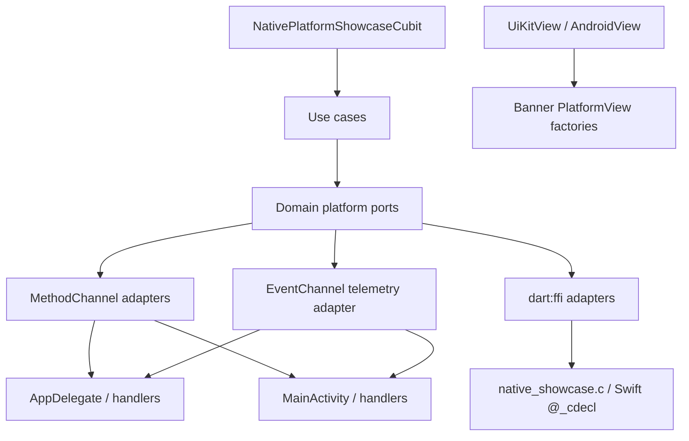

# Native integration — reviewer guide

**Audience:** Hiring reviewers and senior engineers assessing Flutter ↔ host
interop.  
**Teaching pack (matrices):** [`README.md`](README.md).  
**Contracts / layering:** [`native_interop.md`](native_interop.md).  
**Gold feature:**
[`../../apps/mobile/lib/features/native_platform_showcase/README.md`](../../apps/mobile/lib/features/native_platform_showcase/README.md).

## What exists (code truth)

First-party interop lives in the **app host** (`apps/mobile` Runner /
`MainActivity`), not as a published Flutter plugin. Separate Rust FFI demo:
`packages/secure_core_bridge` ([`../architecture/rust_ffi_secure_core_bridge.md`](../architecture/rust_ffi_secure_core_bridge.md)).

### Platform channels

| Channel | Kind | Dart | Host |
| --- | --- | --- | --- |
| `com.example.flutter_bloc_app/native` | `MethodChannel` | `NativePlatformService` — `apps/mobile/lib/app/platform/native_platform_service.dart` | iOS `AppDelegate`; Android `MainActivity` — `getPlatformInfo`, `hasGoogleMapsApiKey` |
| `com.example.flutter_bloc_app/native_showcase` | `MethodChannel` | `MethodChannelNativeShowcaseHostLanguageService` | Swift / Kotlin — `invokeSwift` / `invokeKotlin`, `triggerHaptic`, `shareText` (macOS: `invokeSwift` only) |
| `com.example.flutter_bloc_app/native_showcase/telemetry` | `EventChannel` | `EventChannelNativeShowcaseTelemetryService` | `NativeShowcaseTelemetryStreamHandler` (iOS/Android/macOS) |
| `com.example.flutter_bloc_app/native_security_showcase` | `MethodChannel` | `MethodChannelNativeSecurityShowcaseService` | `NativeSecurityShowcaseHandler` + reply/biometric policies |
| viewType `…/native_showcase_banner` | PlatformView | `UiKitView` / `AndroidView` section widget | `NativeShowcaseBannerPlatformView(Factory)` |

**Not first-party here:** `BasicMessageChannel`, Pigeon host APIs (vendor
Firebase Remote Config Pigeon only under `third_party/`). DI wiring:
`apps/mobile/lib/app/composition/features/register_native_platform_showcase_services.dart`.

### iOS / Android host files

| Platform | Entry | Notable types |
| --- | --- | --- |
| iOS | `apps/mobile/ios/Runner/AppDelegate.swift` | `NativeShowcaseBridge`, `NativeShowcaseTelemetryStreamHandler`, `NativeShowcaseBannerPlatformViewFactory`, `NativeSecurityShowcaseHandler` (+ `ReplyPolicy`, `BiometricErrorPolicy`) |
| Android | `…/com/ilkersevim/blocflutter/MainActivity.kt` | Same surface names in Kotlin; FFI via `android/app/src/main/cpp/CMakeLists.txt` → `native_showcase.c` |
| macOS | `apps/mobile/macos/Runner/MainFlutterWindow.swift` | Channel + telemetry subset; **no** `makeBackgroundTaskQueue` (documented SIGABRT avoidance) |

XCTest: `apps/mobile/ios/RunnerTests/`. JUnit:
`apps/mobile/android/app/src/test/kotlin/...`.

### Plugins (native capabilities)

Showcase channels above are **app-host code**. Capability plugins used elsewhere
include (from `apps/mobile/pubspec.yaml` / registrants): maps (`google_maps_flutter`,
`apple_maps_flutter`), `local_auth`, `flutter_secure_storage`,
`flutter_reactive_ble`, `image_picker`, `connectivity_plus`, Firebase suite,
etc. Review plugin demos on their feature docs — not as MethodChannel teaching
code.

### Threading

| Surface | Behavior (evidence) |
| --- | --- |
| Telemetry EventChannel | iOS: worker `DispatchQueue` + main `eventSink`; Android: `HandlerThread("NativeShowcaseTelemetry")` + main looper; EventChannel created with `makeBackgroundTaskQueue()` on mobile |
| macOS telemetry | Main-queue EventChannel — avoids background task queue crash (see change notes / `MainFlutterWindow.swift`) |
| Haptic / share | Forced onto main on iOS |
| Showcase FFI | Sync `dart:ffi` calls to C / Swift `@_cdecl` |
| Rust bridge | Sync FFI; heavier work may use helper isolate (package doc) |

### Add-to-app / `super_demo_ios`

**Not present in this repository.** No `super_demo_ios` tree, no docs hit, no
git history match, and `demos/` holds Python APIs only (`ai_decision_api`,
`render_chat_api`). The mobile app is a normal Flutter `Runner` /
`FlutterFragmentActivity` host — no first-party `FlutterEngineGroup` /
add-to-app module found.

## Decisions and trade-offs

| Chosen | Alternatives | Why (evidence) |
| --- | --- | --- |
| MethodChannel + EventChannel + dart:ffi in app host | Pigeon; published plugin; add-to-app module | Teaching pack needs typed `NativeInteropStatus` / web stubs without codegen ceremony; gold feature README + `native_interop.md` |
| Typed Freezed results (`success` \| `unavailable` \| `failed`) | Raw `PlatformException` to UI | Web/desktop must report `unavailable` honestly; UI never dumps raw platform errors |
| Background EventChannel task queue on iOS/Android; main queue on macOS | Same background queue everywhere | macOS `makeBackgroundTaskQueue` historically SIGABRT — documented host trade-off |
| PlatformView banner for fidelity demo | Screenshot / catalog-only | Live `UiKitView` / `AndroidView` on mobile; catalog elsewhere (capability matrix) |
| No `super_demo_ios` / add-to-app in-repo | Separate native host demo app | Out of Archive scope unless promoted ([ADR-0005](../adr/0005-interview-showcase-scope.md)); not invented here |

## How it's tested

### Dart (mocked channels)

Under `apps/mobile/test/features/native_platform_showcase/` (channel mocks via
`registerNativeShowcaseChannelMock()` in `test/flutter_test_config.dart` /
`test/helpers/native_showcase_channel_mocks.dart`):

| File | Focus |
| --- | --- |
| `method_channel_native_showcase_host_language_service_test.dart` | Host language MethodChannel |
| `event_channel_native_showcase_telemetry_service_test.dart` | Telemetry EventChannel |
| `method_channel_native_security_showcase_service_test.dart` | Security MethodChannel |
| Cubit / page / widget tests in same folder | Lifecycle, UI |
| `apps/mobile/test/native_platform_service_test.dart` | Generic `native` channel |

### Host unit tests

| Platform | Location | Examples |
| --- | --- | --- |
| iOS XCTest | `apps/mobile/ios/RunnerTests/` | `NativeShowcaseTelemetryAccumulatorTests`, `NativeSecurityShowcaseReplyPolicyTests`, `NativeSecurityShowcaseBiometricErrorPolicyTests` |
| Android JUnit | `android/app/src/test/kotlin/...` | Matching accumulator / reply / biometric policy tests |

### Integration

`apps/mobile/integration_test/native_platform_showcase_flow_test.dart` —
selective map key `native_platform_showcase` in
`tool/integration_selective_map.json`. Runs on macOS CI only when
`run_integration=true` (workflow_dispatch), after
`integration-preflight`.

### CI

| Job / path | What runs |
| --- | --- |
| `.github/workflows/ci.yml` → `build` | `./bin/checklist` includes Dart unit tests (channel mocks) |
| `integration-preflight` | Ubuntu Chrome + unit guards — **no** live native host |
| `integration` | Simulator E2E — **opt-in**, not default PR |
| Host XCTest / `testDebugUnitTest` | **Gap:** not wired as a required GitHub Actions job under `.github/workflows/` |

Telemetry contract detail:
[`../performance/native_event_channel_telemetry.md`](../performance/native_event_channel_telemetry.md).

## Gaps (honest)

1. **`super_demo_ios` / add-to-app interplay:** absent from this repo — do not
   invent host interplay.
2. **No first-party Pigeon / BasicMessageChannel.**
3. **Host unit tests are local/manual in CI** — Dart mocks cover PR path;
   XCTest/JUnit are not a required Actions job found in workflows.
4. Physical-device biometric / latency proof called out as follow-up in feature
   README / telemetry docs — not closed portfolio evidence.

## Related

- Capability + fidelity matrices: [`README.md`](README.md)
- iOS / Android host notes: [`ios.md`](ios.md), [`android.md`](android.md)
- Interview showcase (native as Depth, not §3 spine): [`../interview_showcase.md`](../interview_showcase.md)
